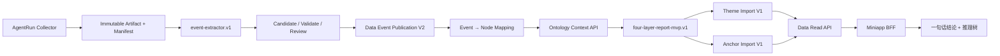

# 首份真实投研报告纵向 MVP Spec v1

状态：Discussion Draft，尚未授权进入实施<br>
日期：2026-07-26<br>
产品目标：观潮家小程序展示一条真实投研结论，并可进入有事实、证据和产业链路径支撑的推理树详情<br>
试点范围：AI 算力—高速光互连 / 光模块 / CPO<br>
所属上下文：Data、AgentRun、Miniapp<br>

## 1. 决策摘要

首份真实投研报告不建设新的 Report 实体或 Report API，也不重做小程序页面。

本 MVP 复用现有产品投影：

- `Research Theme` 提供首页一句话结论；
- `Research Anchor` 提供以 Chain Node 为中心的推理树；
- 现有 Miniapp BFF 和前端负责读取与展示。

必须补齐的纵向链路是：

```text
真实 Collector Artifact
→ Event Candidate
→ 确定性校验与独立审核
→ Data 正式 Event / Evidence
→ Event 到直接影响节点的受控映射
→ 有界 Ontology Context
→ 四层推理快照
→ Theme / Anchor 产品投影
→ Miniapp 一句话结论 / 推理树
```

第一阻塞包固定为 AgentRun `event-extractor.v1`。原因不是架构偏好，而是
2026-07-26 的本地只读实测显示：AgentRun 已采集 492 份 accepted Artifact，
Data 中却没有 Event、Raw Document 或 Event Source。没有正式 Event，就不存在
四层模型的第一层输入。

第二阻塞包是 Data 的最窄 Pilot Graph 与 Ontology Context API。它们允许
AgentRun 在不直连 Data PostgreSQL 的前提下取得经过审核的对象、关系、证据和
可达路径。

首报不等待以下能力：

- 全量产业链图谱；
- Neo4j；
- 向量数据库；
- 通用本体管理平台；
- 长期 Research Thesis 全套表；
- 多 Agent 研究组织；
- 自动股票交易或自动投资建议。

## 2. 当前事实基线

### 2.1 已落地且可复用

| 能力 | 当前状态 | MVP 决策 |
|---|---|---|
| AgentRun Collector | 已运行，累计 492 份 accepted Artifact | 直接复用 |
| AgentRun Execution、Agent Definition/Version | 已落地 | 扩展，不重建 |
| Eino 模型适配 | 已落地，Provider 可替换 | 复用 `model.BaseChatModel` 边界 |
| Data Event Publication V2 | 已实现并 Accepted | 直接复用 |
| Data Theme Import V1 | 已实现 | 直接复用 |
| Data Anchor Import V1 | 已实现 | 直接复用 |
| Data 推理树 Read API | 已实现 | 直接复用 |
| Miniapp BFF 与前端页面 | 已实现并通过现有测试 | 不重做 |
| Entity 主数据 | 1,936 个实体 | 复用 |
| Approved active Chain Node | 588 个 | 从中选 Pilot |

### 2.2 当前断点

| 对象 | 当前数量/状态 | 影响 |
|---|---:|---|
| Event / Evidence | 0 / 0 | 四层第一层没有正式输入 |
| `chain_node_relations` | 0 | 没有旧版正式节点关系 |
| Industry Chain Definition / Membership / Graph Edge | 0 / 0 / 0 | 没有正式链 Scope 和可遍历拓扑 |
| Event → Entity/Node Link | 0 | Event 无法进入产业链 |
| Theme / Anchor | 1 / 3 demo | 回执声称的 Event 关联与实际数据不一致，不可作为真实验收 |

当前 241 条通用 `entity_edges` 只覆盖 economy、market、index、benchmark 等
基础关系，不是产业链传导边，不能冒充 Pilot Graph。

## 3. “真实报告”的定义

只有同时满足以下条件，报告才可以标记为 `real`：

1. 所有展示的 Event 都通过 Data Event Publication V2 正式发布；
2. 每个 Event 至少有一条可定位到 Collector Artifact 的主 Evidence；
3. Evidence Excerpt 是原始 Artifact 正文中的连续逐字片段；
4. Event 的时间、模态和事实状态没有被模型升级或改写；
5. 所有展示的 Chain Node 都引用 Data 中 active、approved 的稳定 UUID；
6. 展示为正式传导路径的相邻节点关系来自同一个 approved Pilot Graph；
7. 每项推断都区分 `fact`、`inference` 和 `gap`；
8. 结论同时保留支持证据、反证或明确的证据缺口；
9. 整次运行记录 `as_of`、输入指纹、Agent/Prompt/Model 版本和输出哈希；
10. Theme 与 Anchor 通过正式 API 发布，且能由正式 Read API 读回；
11. 小程序使用 API 模式，不使用 mock 或 demo fallback；
12. 任一事实、关系或身份不满足门禁时，系统降级为“证据不足”，不得补写。

以下内容不算真实报告：

- 合成 Fixture、模拟 Event 或演示批次；
- 只有 URL、标题或 LLM 摘要，无法定位证据原文；
- 把分析师推断路径当成正式产业链关系；
- AgentRun 直接写 Data 数据库；
- 为了形成公司结论而猜测公司产品暴露或价值捕获。

## 4. 本体论在本 MVP 中的工程含义

本 MVP 不把“本体”定义为某个数据库或 RDF/OWL 文件。本体合同是系统对对象、
关系、约束和行为的共同约定。

### 4.1 Object Types

- `CollectorArtifact`
- `Evidence`
- `Event`
- `Entity`
- `IndustryChain`
- `ChainNode`
- `GraphEdge`
- `EventNodeImpact`
- `ChainNodeStateSnapshot`
- `ResearchThesisSnapshot`
- `CompanyAssessmentSnapshot`
- `ResearchTheme`
- `ResearchAnchor`

### 4.2 Link Types

- `Artifact SUPPORTS Event`
- `Event DIRECTLY_IMPACTS ChainNode`
- `ChainNode MEMBER_OF IndustryChain`
- `ChainNode INPUT_TO ChainNode`
- `ChainNode IS_COMPONENT_OF ChainNode`
- `ChainNode DEPENDS_ON ChainNode`
- `NodeState DERIVED_FROM Event/GraphEdge/Evidence`
- `Thesis DERIVED_FROM NodeState`
- `CompanyAssessment DERIVED_FROM Thesis/ExposureEvidence`
- `Theme/Anchor PROJECTS ResearchRun`

### 4.3 关键不变量

- 对象身份由稳定 ID 决定，不由名称或模型文本决定；
- Candidate、Reviewed、Approved 不可混用；
- 正式事实和主数据由 Data 拥有；
- AgentRun 拥有模型调用、候选、执行状态和运行 Artifact；
- 推断不能反写成正式关系；
- 所有查询都有 `as_of` 和 Graph Scope；
- 每层输入和输出均有版本及哈希；
- 失败重试不得重新调用模型后生成不同载荷；
- Theme/Anchor 是产品投影，不是新的事实源。

## 5. nano-ontoprompt 参考映射

nano-ontoprompt 只作为固定版本的工程参考，不作为首报生产运行时。

| nano-ontoprompt 实践 | 观潮家 MVP 对应能力 | 采用方式 |
|---|---|---|
| Source / Dataset | Collector Artifact | Adapt |
| Mapping | Artifact → Event Candidate；Event → Node Candidate | Adapt |
| Candidate | AgentRun typed candidate Artifact | Adapt |
| Review | 确定性校验 + 独立语义审核 + 发布门禁 | Adapt |
| Object / Link | Data Entity、Chain、Node、Edge、Event Link | Adapt |
| Graph | Data Pilot Graph + bounded recursive query | Replace |
| Search | Ontology Context API | Replace |
| Logic / Action | Eino typed Workflow + deterministic validator | Replace |
| Audit | Execution、manifest、payload hash、Data receipt | Adapt |
| Neo4j / ChromaDB | 可重建投影候选 | Defer |

参考实践带来的核心要求是：模型不能直接面对一堆无类型文本自由生成最终答案；
模型只能在已声明的对象、关系、候选、审核和函数边界内工作。

## 6. 四层最小闭环

首报必须实际执行四层，但不提前建设所有长期持久化模型。

### 6.1 第一层：Event Fact and Semantic

输入：

- 1 个明确的 Collector Execution；
- 2–10 份通过完整性校验的 accepted Artifact。

输出：

- 3–5 条正式 Event，至少包含 driver、supporting 和 contradicting/context；
- 每条 Event 的 Evidence、时间、来源等级、Tag 和 Review；
- Event 到 1 个或多个直接影响 Chain Node 的 reviewed mapping。

正式 Event/Evidence 和 reviewed mapping 由 Data 持久化。

### 6.2 第二层：Chain Node State

输入：

- 正式 Event；
- Event 直接影响节点；
- Pilot Graph；
- Ontology Context Package。

输出：

- 每个相关节点的方向、变化、影响、传导机制和置信边界；
- 直接影响与传播影响分离；
- 重要路径、支持 Evidence、反证和 gap；
- `as_of`、Graph Scope、最大深度、截断状态。

MVP 输出先作为不可变 AgentRun run Artifact 保存，不建立长期 Node State 身份。

### 6.3 第三层：Research Thesis

输入：

- Node State Snapshot；
- 支持与反证；
- 约束机制和下一检查点。

输出：

- 一个候选瓶颈 Thesis Snapshot；
- 当前阶段与趋势；
- 为什么可能形成持续约束；
- 可证伪条件；
- 下一检查点。

MVP 输出是 run-scoped Snapshot，不冒充跨批次长期 Thesis。跨批次跟踪启动前，
再实施 Roadmap 中的正式 Thesis Identity 和 Snapshot 模型。

### 6.4 第四层：Company Opportunity Assessment

输入：

- Thesis Snapshot；
- Data 中可验证的公司和产品/收入/客户/产能暴露证据。

输出：

- `supported`：存在足够暴露和价值捕获证据；
- `insufficient_evidence`：缺少关键公司证据；
- `rejected`：证据与候选机会相矛盾。

`insufficient_evidence` 是合法且完整的第四层结果。它证明门禁实际运行，并防止
模型为了完成报告而制造公司机会。首报的 Miniapp 核心验收不要求展示公司排名。

## 7. 产品投影

四层运行完成后，AgentRun 生成并发布现有合同：

1. `Theme Import V1`
   - 一句话结论；
   - 影响等级；
   - 主题传导路径；
   - 交易/研究方向；
   - 下一检查点；
   - Event 与中心 Chain Node 关联。
2. `Research Anchor Import V1`
   - 每个 Theme 中心 Chain Node 对应一棵推理树；
   - Event 事实汇总；
   - 支持与反证；
   - 有序 Path Node；
   - 每跳传导机制；
   - 下一检查点。

MVP 只要求发布 1 个 Theme。Theme 可以只关联 1 个中心 Chain Node，但该 Anchor
Path 至少包含 2 个不同节点；Pilot 目标为 2–3 个中心节点，以覆盖小程序多树切换。

产品文本可以归纳推断，但不得引入四层 Snapshot 中不存在的新事实或新关系。

## 8. 最小系统边界



边界规则：

- AgentRun 不读取 Data PostgreSQL；
- Data 不读取 AgentRun 文件系统；
- Data 不保存完整原文、Prompt 或模型响应；
- Miniapp 不读取 AgentRun；
- 模型不拥有发布 Tool 的自由调用权；
- Data 写入只由确定性 application code 在门禁通过后调用。

## 9. 工作包与依赖顺序

### FR-00：首报 Golden Scenario 与验收包

Owner：Data + AgentRun + Research<br>
状态：本 Spec 已冻结产品目标；具体 Evidence 与 Graph Edge 待实际审核

- Pilot 固定为 AI 算力—高速光互连 / 光模块 / CPO；
- 固定 `as_of` 和 1 个干净 Collector Execution；
- 明确 3–5 个 Event 的事实验收目标；
- 从现有 approved Chain Node 选择 5–8 个节点；
- 明确支持、反证、gap 和预期四层输出；
- Fixture 仅用于自动化测试；真实验收使用真实 Artifact。

### FR-01：`event-extractor.v1`

Owner：AgentRun<br>
依赖：FR-00 的输入边界

- typed `ArtifactReader`；
- manifest 与 accepted 文件 SHA-256 校验；
- Markdown frontmatter 与正文解析；
- typed Event Candidate Schema；
- structured extraction；
- 逐字 Evidence、时间、模态、Tag、去重和完整性校验；
- 冻结并实现 AgentRun-owned 的确定性 `source_ref`；
- 独立审核结果；
- Event Publication V2 client；
- durable publication journal 和相同字节重试；
- Agent Definition/Version、trigger、execution query。

第一可合并切片只实现 `ArtifactReader` Port、文件 Adapter 和测试，不修改
Collector 专用 Execution 状态机。

### FR-02：Pilot Industry Chain

Owner：Data + Research<br>
依赖：FR-00

- 1 个稳定 Industry Chain Identity；
- 5–8 个 existing approved Chain Node；
- Membership；
- 4–7 条 `input_to | is_component_of | depends_on` approved Graph Edge；
- 每条边的机制、Evidence、审核和有效时间；
- 受控 importer；
- 写入前针对当前 588 个 active 节点重新预检。

不得直接导入仍处于 review 候选状态、且基线为旧 842 节点的关系文件。

### FR-03：Event → Direct Node Mapping V1

Owner：Data + AgentRun<br>
依赖：FR-01、FR-02

- Candidate 与 reviewed/approved 状态分离；
- Event、Chain Node、impact direction、mechanism、Evidence 和 reviewer；
- 原子、幂等 publication contract；
- 只允许映射直接影响，传播影响由查询和分析生成；
- 未知 Mention 不自动创建实体或节点。

### FR-04：Ontology Context / Reachability API V1

Owner：Data<br>
依赖：FR-02、FR-03

输入至少包含：

- Event IDs；
- Industry Chain ID；
- `as_of`；
- direction；
- `max_depth`。

输出至少包含：

- Event 与轻量 Evidence；
- 直接影响节点；
- approved/active 节点和边；
- 有序路径；
- Graph Scope/version/hash；
- 实际深度、最大深度和截断标记；
- 缺口和拒绝原因。

V1 使用 PostgreSQL bounded recursive CTE。Neo4j 不属于退出条件。

### FR-05：`four-layer-report-mvp.v1`

Owner：AgentRun<br>
依赖：FR-01、FR-04

- typed Eino Workflow；
- L1 → L2 → L3 → L4 显式阶段依赖；
- 每层 JSON Schema、validator、input/output hash；
- 支持/反证/gap pass；
- 公司证据不足门禁；
- per-stage immutable Artifact；
- 模型失败可重试，但已完成阶段不重新解释；
- Provider-neutral contract。

MVP 使用一个 Workflow 和有限模型调用，不建立四个常驻 Agent。

### FR-06：Theme / Anchor Publisher

Owner：AgentRun<br>
依赖：FR-05

- 复用 Theme Import V1 和 Anchor Import V1；
- 先 Theme、后 Anchor；
- 发布前校验 Event、Chain Node 与 Path；
- durable payload/hash/receipt journal；
- 超时后重放同一请求；
- 从正式 Reasoning Tree Read API 读回验证。

### FR-07：首报纵向验收

Owner：Data + AgentRun + Miniapp<br>
依赖：FR-01—FR-06

- 使用真实 Artifact；
- Data 中形成 3–5 条真实 Event；
- 形成 1 个 approved Pilot Graph；
- 四层输出和运行血缘完整；
- 发布 1 个真实 Theme 和对应 Anchor；
- Miniapp API 模式首页显示一句话结论；
- 点击后显示 Event、支持/反证、完整 Path 和下一检查点；
- Receipt 与实际关联数量一致；
- 无 mock/demo fallback；
- 断链、反证、超深截断、发布超时和不变量漂移均有测试。

### FR-08：产品硬化

Owner：Miniapp + Data<br>
依赖：FR-07

- 补齐 BFF OpenAPI `change_direction` enum；
- 收紧前端 wire parser；
- 配置真实 Miniapp AppID、HTTPS 和业务域名；
- 清理或隔离损坏 demo 数据；
- 增加发布数据的环境标识和观测。

FR-08 不阻塞模型层首个纵向集成测试，但阻塞真实设备上的最终交付验收。

## 10. 首个实现切片：ArtifactReader

### 10.1 输入

```json
{
  "collector_execution_ids": ["uuid"]
}
```

不接受：

- 任意本机路径；
- 目录扫描；
- 未指定的历史 Execution；
- 尚未完成 manifest 发布的运行。

### 10.2 读取规则

1. 通过 AgentRun Execution Repository 解析 Collector Execution；
2. 只接受终态成功或合同允许的部分成功；
3. manifest 是完成与输入集合的权威，不遍历 `documents/` 猜测；
4. manifest execution ID 必须与请求一致；
5. manifest 必须位于该 execution 的 `runs/<execution_id>/` 目录；
6. accepted Markdown 必须位于配置 Artifact Root 的 `documents/` 子树，并由该
   manifest 显式枚举；共享文档不要求位于 execution run 目录；
7. 对每个 accepted Markdown 校验完整文件 SHA-256；
8. 解析 `connector_result_md.v1` frontmatter；
9. 校验 `document_id`、正文 `content_sha256`、source、时间和正文；
10. 返回 typed Artifact，不泄露文件路径给下游 Data 合同。

注意：

- manifest `accepted[].sha256` 是整个 Markdown 文件哈希；
- frontmatter `content_sha256` 是规范正文哈希；
- 两者含义不同，不得互换。

### 10.3 第一批测试

- 读取一份真实形态 manifest 和 2–3 个 accepted Markdown；
- manifest 未完成则拒绝；
- execution ID 不匹配则拒绝；
- manifest 越出 `runs/<execution_id>/` 或 accepted 文件越出 `documents/` 子树则拒绝；
- Markdown 文件 SHA-256 漂移则拒绝；
- 正文 hash 漂移则拒绝；
- 重复 document ID 冲突则拒绝；
- 合法输入返回稳定顺序和 typed Artifact；
- Adapter 错误不包含原文或敏感路径。

### 10.4 `source_ref` 冻结规则

`connector_result_md.v1` 当前没有 Data Event Publication V2 必填的
`source_ref`。FR-01 不得把本机路径、单篇文章 ID 或 Connector 名称当作 Source
身份。

MVP 采用 AgentRun-owned 的确定性来源身份：

```text
source_ref =
  "source:v1:" +
  lowercase_hex(
    sha256(
      lowercase(trim(source_type))
      + NUL
      + canonical_url_origin(source_url)
    )
  )
```

其中 `canonical_url_origin` 只保留小写 scheme、hostname 和非默认 port，不包含
path、query、fragment；`source_name` 只用于显示，不参与身份，避免名称修订导致
漂移。`source_type` 或可解析的 HTTP(S) `source_url` 缺失时，Artifact 可以被
Reader 读取，但不能进入 Event Publication payload，必须形成明确 gap。

该规则可能把同一机构的不同域名保留为多个 Source，属于安全的不合并；在建立正式
Source Catalog 或 alias review 之前，不做高风险自动合并。

## 11. 端到端验收

最高可观察自动化测试：

```text
真实形态 Collector manifest + Markdown Artifact
→ 真实编译的 event-extractor.v1 Workflow
→ Fake BaseChatModel
→ 真实 AgentRun HTTP + 隔离 AgentRun PostgreSQL
→ 真实 Data HTTP + 隔离 Data PostgreSQL
→ Event Publication V2
→ Event/Node Mapping
→ Ontology Context Query
→ four-layer-report-mvp.v1
→ Theme Import + Anchor Import
→ Theme/Reasoning Tree GET
→ Miniapp contract assertion
```

恢复测试：

```text
Data 已提交，但客户端在收到响应前断开
→ AgentRun 重启
→ publication journal 重发完全相同 payload
→ 模型调用次数不增加
→ Data 自然身份收敛
→ Execution 最终成功
```

## 12. 完成定义

首份真实报告完成，不等于代码合并或页面出现一段文本。必须同时满足：

1. 至少 1 个真实 Theme；
2. 至少 1 棵可读 Anchor 推理树；
3. 3–5 条正式 Event 和逐字 Evidence；
4. 1 个 approved Pilot Graph；
5. Event 到直接节点映射可审计；
6. 全链上下文查询可复现且有截断语义；
7. 四层均产生 typed Snapshot；
8. 第四层没有证据时明确返回 `insufficient_evidence`；
9. Theme/Anchor 只投影已有四层内容；
10. 小程序 API 模式展示结论和推理树；
11. 任一展示事实可回溯到 Artifact；
12. 任一展示传导边可回溯到 approved Graph Edge；
13. 运行、模型、Prompt、输入、输出和发布回执可追溯；
14. 自动化纵向测试和一次人工真实数据验收通过。

## 13. 延后项与复审触发器

| 延后项 | 当前不做原因 | 复审触发器 |
|---|---|---|
| Neo4j | Pilot bounded traversal 可由 PostgreSQL 完成 | PostgreSQL 不能满足明确深度、延迟或并发 SLO |
| LanceDB / ChromaDB / pgvector | 首报不依赖语义召回 | 实体解析或 Artifact 召回 Fixture 证明关键词/规则不足 |
| 长期 Node State / Thesis 表 | 首报只需 run-scoped Snapshot | 第二次增量更新同一 Thesis 前 |
| 多 Agent 角色 | 一个 typed Workflow 更易验证 | 独立角色在 Golden Fixture 上显著提高质量 |
| 全量产业链 | 首报只需一个 Graph Scope | Pilot 通过后按研究优先级扩展 |
| 通用 Ontology UI | 不是首报闭环必要条件 | 候选和审核量超过文件/管理 API 的操作能力 |
| nano-ontoprompt Fork/Sidecar | 当前只需参考其能力拆分 | 某一有界组件 PoC 证明集成价值高于自建与运维成本 |

## 14. 与总 Roadmap 的映射

| 首报工作包 | 总 Roadmap |
|---|---|
| FR-00 | OR-00—OR-05 的首报子集 |
| FR-01 | OR-22 + Event Publication V2 适配 |
| FR-02 | OR-02、OR-11、OR-12 的 Pilot 子集 |
| FR-03 | OR-20、OR-21、OR-23 的最小直接映射子集 |
| FR-04 | OR-14、OR-15 |
| FR-05 | OR-31—OR-44、OR-50—OR-54 的 run-scoped 薄切片 |
| FR-06 | OR-60—OR-62 |
| FR-07 | OR-63、OR-64 的首报 Golden Scenario |

本 Spec 不替代总 Roadmap。它只固定“先交付首份真实报告”所需的最短纵向路径，
并允许在不锁死长期存储和部署拓扑的前提下开始实现。
> **Research publication note:** 本文件的历史 AgentRun MVP 背景保留；其中 Theme/Anchor
> 发布合同已由 `../research-theme-reasoning-tree-spec.md` 原地替换。
