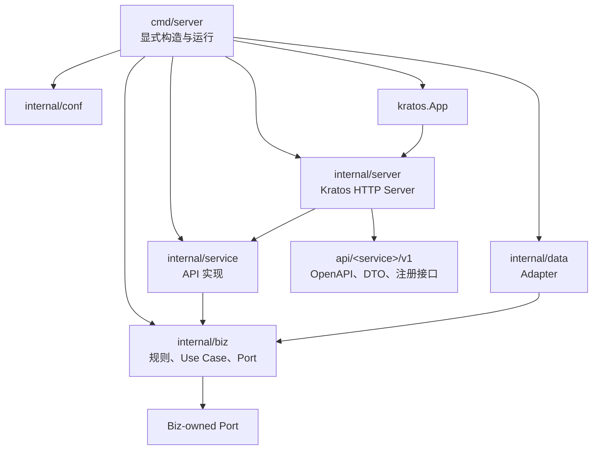

# Tidewise AI Kratos Backend Service 开发规范 V1

## 状态

已确认，按 Service 分批实施。Miniapp 已完成迁移；Data 与 Admin Portal
仍待各自独立任务实施。

## 目的

本规范落实 ADR-0006，统一 Tidewise AI Backend Service 的 Kratos Application
目录、分层职责、依赖方向、HTTP 实现、进程生命周期、配置、错误处理和测试门禁。

Kratos 在本项目中既是统一 Service 运行时，也是 Backend 工程结构的共同语言；
它不是一揽子微服务基础设施。采用本规范的 Service 必须能够作为普通二进制或
容器独立启动，不以 Kubernetes、服务注册中心、配置中心、Service Mesh 或分布式
事务组件为运行前提。

## 规范性术语

- **必须**：不满足即不符合本规范。
- **不得**：明确禁止。
- **应当**：原则上必须遵守；偏离时需在对应设计文档中说明理由。
- **可以**：按真实业务需要选择。
- **Backend Service**：可独立构建、启动和部署的进程。
- **Kratos Application**：一个 Backend Service 的工程根与运行单元。
- **Kratos App**：Kratos 的进程生命周期对象。
- **Kratos Service Layer**：`internal/service` 中实现 API 的进程内部应用层，
  不是可部署 Backend Service。
- **Kratos Data Layer**：`internal/data` 中实现 Biz Port 的 Adapter 层，
  不是 Data Domain Service。

没有限定词时，不得单独使用“Service Layer”或“Data Layer”指代可部署进程。

## 文档优先级

出现冲突时按以下顺序处理：

1. 已接受的 ADR 与所属 Context 的依赖边界；
2. 所属 Service 的 OpenAPI；
3. 已冻结的业务合同与共享 fixture；
4. 本规范；
5. Kratos 默认行为和示例工程。

框架默认值、官方示例或目录重组不得覆盖已经发布的 Tidewise HTTP 合同。

## 核心决策

### 统一框架基线

- Backend Service 统一采用 **Kratos v3**。
- 首次引入固定使用 `github.com/go-kratos/kratos/v3 v3.0.0`。
- Kratos v3.0.0 要求 Go 1.25，因此实施前必须统一升级根 `go.mod`、Docker
  builder、CI 和开发环境的 Go 基线。
- 依赖版本升级必须独立评审，不得静默跟随 `latest`。
- Kratos 官网仍可能存在 v2 示例；实现时以 v3.0.0 tag 源码和 v2→v3 迁移指南
  为准，不得复制带 `/v2` import 的旧示例。

### 官方 Application Layout

每个 `<application>/backend` 都是一个独立 Backend Service 根。迁移后的 Kratos
Application 必须采用：

```text
<application>/backend/
├── api/<service>/v1/
├── cmd/server/
├── configs/
└── internal/
    ├── conf/
    ├── biz/
    ├── data/
    ├── service/
    └── server/
```

目录按职责创建，但上述五个 `internal` 层是迁移完成后的稳定共同语言。不得继续以
`usecase/`、`transport/`、`dataclient/`、`repositories/`、`adapters/` 作为
Kratos Service 的顶层业务结构，也不得通过同义目录建立长期兼容层。

### HTTP-only、OpenAPI-first

当前服务间协议继续使用版本化 REST API：

- 使用 Kratos HTTP Server、HTTP Router 和 HTTP Client；
- 不引入 gRPC；
- 不使用 Protobuf 定义现有 HTTP API 或配置；
- 不要求 `protoc`、HTTP 代码生成器或 Kratos CLI 参与正常构建；
- 每个 Service 的 OpenAPI 3.0.4 是唯一 HTTP 线协议事实来源；
- HTTP DTO、服务接口与注册代码可以手写，并由合同测试防止与 OpenAPI 漂移。

Kratos core 间接带入的 gRPC/Protobuf Go module 不构成违反；不得把依赖图中完全
不存在这些间接 module 设为验收条件。

### 显式构造，不使用 Wire

官方 Layout 中的 Wire 已归档为 Tidewise AI 不采用的装配方式：

- 使用普通 Go `New...` 构造函数显式装配依赖；
- `cmd/server` 只能进行构造、启动和清理，不写业务规则；
- 不创建或维护 `wire.go`、`wire_gen.go`；
- 不把 Service Locator 或全局可变容器作为 Wire 的替代品。

以后如需恢复 Wire，必须通过新的系统级 ADR 决定。

### 无平台控制面依赖

以下组件都不是 Kratos Service 的默认依赖：

- Kubernetes；
- Nacos、Consul、etcd 等服务注册与发现中心；
- Apollo 或远程配置中心；
- Service Mesh；
- Redis；
- 消息队列；
- 分布式事务协调器；
- 集中式日志、Metrics 或 Trace 后端。

只有出现明确业务需求并形成独立设计后才可引入。Kratos 提供扩展接口不等于项目
必须部署对应基础设施。

### 可独立运行

“可独立运行”定义为：

> Service 能够仅依赖本地配置文件、环境变量和显式依赖地址，以普通二进制或
> 容器启动、响应健康检查并完成优雅停机，不需要任何平台控制面。

这不表示 Application Backend Service 在 Domain Service 不可达时仍能完成业务
查询。依赖不可用时必须按所属 Service 的公开合同安全失败。

## 服务边界

ADR-0002 的可部署 Service 类型保持不变：

- Miniapp 与 Admin Portal 是 Application Backend Service；
- Data 是 Domain Service。

依赖规则保持不变：

- Frontend 只能调用自己的 Application Backend Service；
- Service 间只能通过版本化 REST API 交互；
- Application Backend Service 不得直接访问 Domain Service 数据库，也不得
  import 其 `internal/biz`、`internal/data`、`internal/service` 或
  `internal/server`；
- Domain Service 不得 import Application Backend Service 实现；
- Service 不得通过共享 Go DTO、共享运行时 helper 或方法调用绕过远程 API；
- 仓库根不得提供被多个 Application import 的运行时 Go package。配置、HTTP
  envelope、API 文档、健康检查和 Server 构造由各自 Application 独立拥有。

Kratos Layout 统一源码组织，但不改变业务边界和数据 ownership。

## 标准分层



依赖方向必须是：

```text
api ◄── internal/service ──► internal/biz ◄── internal/data
 ▲             ▲
 └── internal/server
```

`internal/biz` 不得反向依赖 `internal/data`、`internal/service` 或
`internal/server`。

## 目录与职责

### `api/<service>/v1`

该目录拥有 Service 对外 HTTP 接口：

- OpenAPI 文档；
- HTTP wire DTO；
- Service 接口；
- 使用 Kratos Router 的 HTTP 注册与绑定逻辑；
- OpenAPI、注册路由和 DTO 的合同测试。

当前不从 Protobuf 生成代码。手写注册逻辑必须保持足够薄，只做 path/query/body
绑定、operation 设置、middleware 执行和响应编码，不承载业务规则。

其他 Backend Service 不得 import 此 Go package 作为进程内 client。调用方必须
拥有自己的 Biz Port 和 Data Adapter，并通过 REST 交互。

### `cmd/server`

`cmd/server/main.go` 是服务进程唯一入口：

- 确定配置来源；
- 创建 logger；
- 调用 `internal/conf`、`internal/data`、`internal/biz`、
  `internal/service`、`internal/server` 的显式构造函数；
- 建立清理函数；
- 运行 `kratos.App`。

不得在 `main.go` 中直接调用 `http.ListenAndServe`，不得解析业务 DTO、访问数据库
或实现错误映射。

### `configs` 与 `internal/conf`

- `configs` 保存 local/UAT 所需、不含 Secret 的 YAML 样例。
- `internal/conf` 保存手写 Go 配置结构、默认值、加载、环境变量覆盖和校验。
- 现有 YAML/环境变量语义可以保留，不强制使用 Protobuf 配置。
- 可以使用 Kratos config/file 作为本地配置源，但不得因此引入远程配置中心。
- token、密码、密钥只从环境变量或以后明确选择的 Secret Provider 注入。
- 业务代码不得在运行中散落读取 `os.Getenv`。

### `internal/biz`

Biz Layer 是业务规则和 Use Case 的唯一 owner：

- 保存领域对象、业务不变量、Use Case 和 consumer-owned Port；
- 用业务语言定义 Port，不暴露 URL、HTTP status、数据库 row 或 SDK 类型；
- 通过构造函数接收 Port；
- 返回稳定业务结果和错误分类；
- 不 import Kratos HTTP Context、Router、数据库 driver、具体 client 或
  `internal/data`；
- 不依赖全局 logger。

远端 Service 与数据库都通过 Biz Port 接入。测试通过 fake Port 验证 Biz 对外可见
行为。

### `internal/data`

Data Layer 实现 Biz Port：

- PostgreSQL、Neo4j repository；
- 远端 Service HTTP client；
- cache、message producer/consumer 等基础设施 Adapter；
- wire/PO 到 Biz 对象的转换；
- 连接、超时、重试、响应上限、错误清洗和资源关闭。

Data Layer 可以 import `internal/biz` 以实现其接口，但 Biz 不得 import Data。
Application Backend Service 的 Data Layer 只允许调用远端 Domain Service，不得
因为目录名为 `data` 而直接访问 Domain Service 数据库。

### `internal/service`

Service Layer 实现 `api` 定义的服务接口：

- 将 API DTO 转换为 Biz 输入；
- 执行 transport 层输入校验；
- 调用一个或多个 Biz Use Case；
- 将 Biz 结果转换为 API DTO；
- 将 Biz 错误分类交给统一 HTTP 错误编码。

复杂决策、上游结果的业务不变量和跨步骤研究逻辑属于 Biz，不得写入 Service Layer。
Service Layer 不得访问数据库或具体远端 client。

### `internal/server`

Server Layer 负责：

- 创建和配置 Kratos HTTP Server；
- 组合 Filter、Middleware 和 encoder；
- 调用 `api` 的注册函数并注入 `internal/service` 实现；
- 注册 `/healthz`、`/readyz`、OpenAPI 和 Swagger UI；
- 向 `cmd/server` 返回 HTTP Server；各 Data Adapter 的 cleanup 由 composition
  root 独立持有和执行。

Server Layer 不得实现 Theme、Event、Payment 等业务规则。

### Application-owned runtime mechanisms

每个 Service 必须拥有自己的配置、HTTP envelope、API 文档、健康检查、Server 构造和
`internal/server`。这些机制即使相似，也不得提取到仓库根供多个 Application import。
重复通过应用内 Module 收敛，并用 OpenAPI、冻结 fixture、provider-consumer 合同和
仓库门禁保持线协议一致；不得用实现复用代替合同协作。

## Kratos App 与生命周期

每个 Service 必须由 `cmd/server` 显式创建的 `kratos.App` 管理生命周期：

- 明确设置 `kratos.Name`、`kratos.Version`、`kratos.Logger`、
  `kratos.Server` 和有限 `kratos.StopTimeout`；
- HTTP Server 必须通过 Kratos `Start`/`Stop` 参与统一启停；
- 收到 `SIGTERM`、`SIGQUIT` 或 `SIGINT` 后停止接收新请求并完成有限优雅停机；
- 长连接 client、数据库连接池、producer 等资源必须由显式 cleanup 关闭；
- `StopTimeout` 只约束 Server Stop，其他资源清理必须拥有自己的有限超时；
- 配置或必需依赖初始化失败时，必须在监听端口前退出。

## Kratos HTTP Server

### 路由与注册

- 业务路由使用 Kratos 原生 `Server.Route`、`Router.Group` 和 HTTP method 注册。
- Service 代码不得 import Gin、Echo、Fiber 或底层 Gorilla Mux。
- 路径、方法、状态码和 Schema 必须与 OpenAPI 一致。
- 不得长期并存 Gin 与 Kratos 两套路由。
- 旧路径兼容只能由业务合同决定，不能由重定向或 `StrictSlash` 隐式产生。

Kratos v3 手写 Router handler 不会自动执行 `Server.Middleware`。手写 API 注册
函数必须：

1. 设置稳定、可测试的 operation；
2. 绑定并校验 path/query/body；
3. 显式调用 `ctx.Middleware(handler)`；
4. 调用 `internal/service`；
5. 使用统一 encoder 写入成功或错误响应。

不得在每个 Handler 中复制近似 wrapper。复用首先收敛在本 Service 的
`api`/`internal/server`；只有至少两个 Service 证明通用性后才能提取平台模块。

### 超时

Kratos v3 HTTP Server 默认请求 timeout 为 1 秒。所有 Service 必须显式覆盖：

- 保持现有接口与下游调用的总超时预算；
- HTTP read/write timeout 与 Biz/下游调用 timeout 分别配置；
- timeout 贯穿 `context.Context`；
- 不得在请求链中创建脱离请求的 `context.Background()`；
- 只读重试必须包含在同一个总 timeout 内。

## Filter 与 Middleware

职责固定为：

- **HTTP Filter**：操作原始 request/response，适合 Request ID、完整请求链
  recovery、CORS 等 HTTP 机制。
- **Kratos Middleware**：包围 Service→Biz 调用，适合结构化访问日志、Trace
  context、认证与授权。
- **API 输入校验**：属于 `api`/`internal/service`。
- **业务校验**：属于 `internal/biz`。
- 数据库、Redis 和消息队列是 Data Adapter，不是 Middleware。

最小默认执行顺序：

1. 建立或规范化 Request ID；
2. 覆盖完整 HTTP 链的 panic recovery；
3. 执行 Service 明确需要的 Filter；
4. API 绑定与输入校验；
5. Kratos recovery、logging 及明确启用的其他 Middleware；
6. Service Layer；
7. Biz Layer；
8. 统一响应编码与安全日志。

默认只启用 Request ID、Recovery 和结构化访问日志。认证、CORS、限流、metrics、
Trace 按 Service 合同显式启用；Exporter 不得成为启动前提。

## HTTP 响应与错误

已发布业务成功响应继续使用：

```json
{
  "request_id": "req-...",
  "result": {}
}
```

业务错误继续使用：

```json
{
  "error": {
    "code": "INVALID_REQUEST",
    "message": "request parameter is invalid",
    "details": {}
  },
  "request_id": "req-..."
}
```

规则：

- `X-Request-ID` 必须与响应体 `request_id` 一致；
- 上游 Service envelope 和 request ID 不得原样透传给 Frontend；
- 内部 URL、token、SQL、数据库错误、网络错误和 panic 文本不得泄漏；
- `/healthz` 与 `/readyz` 返回直接运维对象，不套业务信封；
- 不得使用 Kratos 默认 Error JSON 取代已发布 Tidewise envelope；
- Biz 提供稳定错误分类，Service/API 层负责映射 HTTP status 和 wire error。

入口 Request ID 和出站 Request ID 是两个独立规则面，必须分别测试。出站值不满足
下游安全规则时生成新的安全 ID，并只在本地日志保留关联。

## OpenAPI 与 Swagger UI

- OpenAPI 3.0.4 位于 `api/<service>/v1/`，是唯一 HTTP 线协议事实来源。
- 不从 Go Handler 注释生成 OpenAPI。
- 接口修改必须同时修改 OpenAPI、API 注册、DTO 和合同测试。
- local/UAT 注册 `/openapi.yaml`、`/docs`、`/docs/`。
- prod 不注册文档路由。
- Swagger UI 不保存 token，不依赖 CDN，不启动单独文档端口。

移动 OpenAPI 文件路径属于工程整理，不得同时修改其 paths、Schema 或状态码。

## 日志与可观测性

- 使用 Kratos v3 的 `log/slog` 基线。
- 日志写 stdout/stderr。
- 请求日志至少包含 service、environment、operation、request_id、HTTP status、
  duration。
- 不记录 token、完整认证头或敏感请求正文。
- Biz 不依赖全局 logger；需要业务审计时注入最小日志接口。
- Metrics、Trace 和集中日志后端都是可选 Adapter，不是启动条件。

## 远端 Service Client

调用方在 `internal/biz` 中定义 consumer-owned Port：

```go
type ResearchRepo interface {
    ListThemes(context.Context, ListThemesInput) (ThemePage, error)
}
```

`internal/data` 使用 Kratos HTTP Client 实现：

- 固定 URL 模式不初始化 discovery；
- 使用 `Invoke` 执行需要 client middleware 的调用；
- 显式处理 base URL、timeout、token、最大响应体、错误清洗和重试；
- 只重试幂等请求和已批准错误；
- 多次物理尝试共享一个总 timeout；
- 在信任边界校验上游 Schema 和业务不变量；
- 随 App 生命周期关闭 client 和连接。

Biz 测试使用 fake Port，Data Adapter 使用 fake server 或注入 RoundTripper 测试。

## 数据库和其他基础设施

Kratos 不规定数据库、缓存或消息系统实现：

- repository Port 定义在 `internal/biz`；
- PostgreSQL、Neo4j 等实现位于 `internal/data`；
- 连接池在 composition root 创建并在停止时关闭；
- Application Backend Service 不得因拥有 `internal/data` 而获得 Domain 数据库
  凭据；
- 基础设施不可用时的启动失败、降级或 readiness 语义由 Service 设计明确。

## 健康与就绪

- `/healthz` 表示进程存活与 HTTP transport 可响应。
- `/readyz` 表示该 Service 自己定义的接流量条件。
- 是否探测下游依赖必须由 Service 显式决策，框架迁移不得自动改变语义。
- 响应不得泄漏 Secret、内部 URL 或故障堆栈。
- 即使不使用 Kubernetes，也必须提供两个接口供 Docker Compose、UAT 和人工诊断。

## 测试与架构门禁

测试采用按风险边界选择的策略，详细执行规则与 Issue 模板见
[`docs/agents/testing.md`](../agents/testing.md)。TDD 不要求每个 Kratos 层级或源码文件
都有测试。

每个业务变更默认确认两个测试 seam：

1. **Biz 行为 seam**：通过 fake Port 验证业务不变量、状态变化、边界和稳定错误分类；
2. **API/HTTP 合同 seam**：验证输入、DTO 转换、状态码、错误 envelope、Request ID 和
   必要的 OpenAPI/runtime 一致性。

API 测试不得重复 Biz 的完整业务规则矩阵。Data、Migration、Conf、Lifecycle、
Architecture、Provider/Consumer、Binary/Container 和真实 HTTP smoke 仅在本次修改触及
对应风险时启用：

- 修改 SQL、事务、Repository 或远端 Client，增加 Data 集成或 Adapter 契约测试；
- 修改 Schema、约束、索引或 migration，增加 Migration/Schema 测试；
- 修改配置校验或环境覆盖，增加 Conf 测试；
- 修改启动、信号、停机或资源释放，增加 Lifecycle 测试；
- 修改 Service 边界、依赖方向或目录所有权，运行集中式 Architecture 测试；
- 修改跨 Service API，运行 Provider/Consumer 合同测试和必要 HTTP smoke；
- 修改镜像或部署入口，构建受影响 Binary/Container 并运行必要 smoke。

简单构造函数、机械 DTO/PO 映射、无校验配置读取、`cmd/server` 装配和框架注册胶水
默认不单独编写单元测试。开发循环只运行目标测试；任务完成时运行受影响 Service
套件及本次触发的门禁，不在每个 Red/Green 循环执行全仓回归。

当 Architecture seam 被触及时，集中式架构测试验证：

- 每个已迁移 Service 存在官方 Layout；
- `biz` 不依赖 `data/service/server`；
- Service 间没有实现 import；
- 根目录不存在被多个 Service import 的共享运行时 Go package；
- 已迁移 Service 的旧顶层目录已经删除；
- `cmd/server` 不包含 Wire 文件或业务规则；
- 每个手写 endpoint 实际执行 Kratos Middleware。

分批迁移期间，门禁按 Service 状态启用，不得要求尚未迁移的 Data/Admin Portal
提前改目录。

## 禁止模式

- 在一个 Service 内长期保留 Gin 与 Kratos 双栈；
- 为采用官方 Layout 而引入 gRPC、Protobuf 或 Wire；
- 在 Biz 中 import Kratos HTTP Context、数据库 driver 或 Data Adapter；
- 让 Service Layer 直接访问数据库或远端 SDK；
- 让 Server Layer承载业务规则；
- 在 API handler 中复制 middleware 与 envelope 编码；
- 使用 Kratos 默认 1 秒 server timeout；
- 将 registry、config center 或 Kubernetes 作为本地启动条件；
- 在仓库根建立跨 Application 共享的配置、HTTP、文档或 Server helper；
- 自动重试非幂等写入；
- 直接返回 Kratos 默认错误格式或下游错误正文；
- 通过同时注册旧框架路由完成回滚；
- 迁移后保留空的旧层目录或 pass-through compatibility package。

## 例外机制

偏离本规范时，变更必须同时提交：

- 偏离原因和适用 Service；
- 对 HTTP 合同、故障语义和部署的影响；
- 替代测试与回滚方案；
- 更新后的 ADR 或所属 Context。

## 参考

本地权威：

- [ADR-0002：Backend Service 两层架构](../adr/0002-backend-service-architecture.md)
- [ADR-0006：Kratos 官方 Service Layout](../adr/0006-kratos-official-service-layout.md)
- [OpenAPI 与 Swagger UI V1](openapi-swagger-ui-v1.md)
- [Miniapp Context](../contexts/miniapp/CONTEXT.md)
- [Backend Source Audit](backend-source-audit-2026-07-18.md)

Kratos 基线：

- [Kratos 官方 Layout](https://go-kratos.dev/docs/intro/layout/)
- [Kratos v3.0.0 Release](https://github.com/go-kratos/kratos/releases/tag/v3.0.0)
- [Kratos v3 HTTP Server](https://github.com/go-kratos/kratos/blob/v3.0.0/transport/http/server.go)
- [Kratos v3 HTTP Context](https://github.com/go-kratos/kratos/blob/v3.0.0/transport/http/context.go)
- [Kratos v3 App Lifecycle](https://github.com/go-kratos/kratos/blob/v3.0.0/app.go)
