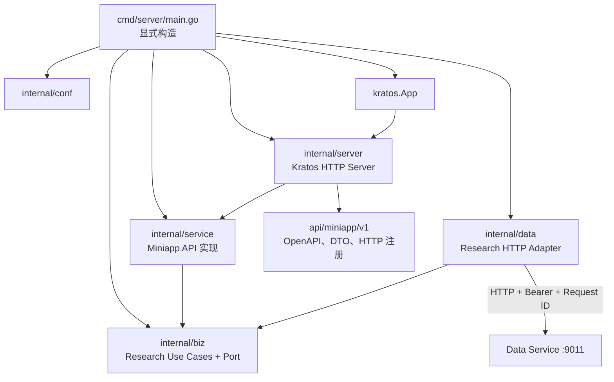

# Miniapp Service Kratos 官方 Layout 试点设计 V1

## 状态

已实施。

## 目标

以 Miniapp Application Backend Service 作为 Tidewise AI 第一个完整 Kratos
Application 试点：

- 采用 ADR-0006 规定的官方
  `api/cmd/server/configs/internal/{conf,biz,data,service,server}` Layout；
- 将进程生命周期、HTTP Server、Router、Middleware 和 HTTP Client 接入
  Kratos v3；
- 彻底移除 Miniapp Service 内的 Gin 和旧自定义顶层分层；
- 保持现有全部业务功能、HTTP 合同、错误语义和部署方式可运行；
- 继续通过固定 URL 调用 Data Service；
- 不接入 Kubernetes、注册中心、配置中心、Service Mesh 或其他微服务中间件；
- 使用显式 Go 构造函数装配，不使用 Wire；
- 形成 Data、Admin Portal 后续迁移可复用的工程方法。

本设计同时作为已实施结构的验收合同。

## 完成定义

试点完成后：

- Miniapp 目录是一个完整 Kratos Application；
- 进程由 `kratos.App` 启动、监听信号并优雅停机；
- HTTP transport 使用 Kratos HTTP Server 和原生 Router；
- `internal/service` 实现 Miniapp API；
- 研究业务规则与 Use Case 位于 `internal/biz`；
- Data Service Port 位于 `internal/biz`，Kratos HTTP Adapter 位于
  `internal/data`；
- HTTP Server、路由、Filter、Middleware 和文档注册位于
  `internal/server`；
- 配置样例位于 `configs`，类型、加载和校验位于 `internal/conf`；
- 现有六个运行时接口及 local/UAT 文档入口全部可用；
- Miniapp 源码和 binary 依赖闭包不包含 Gin；
- 旧 `config/`、`dataclient/`、`transport/`、`usecase/` 和根 `service.go`
  已删除；
- 不存在 `wire.go`、`wire_gen.go`、Service Locator 或双框架回退开关；
- 二进制和容器仅依赖本地 YAML、环境变量与 Data Service 固定 URL 即可启动。

三个 Service 共享一个 Go module。本试点实施时 Admin Portal 仍使用 Gin，因此当时
不能从根 `go.mod` 删除 Gin；Admin Portal 后续迁移完成后执行模块级清理。

## 迁移前实现基线

当前 Miniapp 是 HTTP BFF：

```text
Miniapp Frontend
      │
      ▼
Miniapp Service
  transport → usecase → DataServiceClient port → HTTP adapter
                                              │
                                              ▼
                                         Data Service
```

现状：

- `cmd/main.go` 使用 `net/http.ListenAndServe`；
- `transport` 使用 Gin Router；
- `usecase` 不依赖 Gin；
- `dataclient` 是 Miniapp 自己拥有的 typed client；
- 不访问 PostgreSQL、Neo4j 或 Data repository；
- `api/openapi.yaml` 是 Miniapp HTTP 合同唯一权威；
- local/UAT 使用 Docker Compose 和固定地址 `http://data:9011`；
- `/readyz` 只检查本地配置，不探测 Data Service；
- 当前没有 signal-driven graceful shutdown。

## 旧结构到官方 Layout 的映射

| 当前内容                              | 目标位置                               | 迁移规则                                  |
| ------------------------------------- | -------------------------------------- | ----------------------------------------- |
| `api/openapi.yaml`、`api/document.go` | `api/miniapp/v1/`                      | 只移动工程位置，不改变 HTTP wire contract |
| `cmd/main.go`                         | `cmd/server/main.go`                   | 只显式构造和运行 Kratos App               |
| `config/*.yaml`                       | `configs/`                             | 保留 local/UAT 非敏感配置                 |
| `config/config.go`                    | `internal/conf/`                       | 保留 YAML/env 语义与校验                  |
| `usecase/`                            | `internal/biz/`                        | 业务规则、Use Case、上游业务不变量        |
| `dataclient/port.go`                  | `internal/biz/`                        | 改为 Biz-owned Research Port              |
| `dataclient/http.go`                  | `internal/data/`                       | Kratos HTTP Client Adapter                |
| `dataclient` fake/test support        | `internal/data/` 或 Biz `_test.go`     | 实现 Biz Port，不暴露网络细节             |
| `transport/research.go`               | `internal/service/`                    | API DTO 转换、输入校验、错误映射          |
| `transport/router.go`                 | `api/miniapp/v1/` + `internal/server/` | API 注册与 Server 创建分离                |
| 根 `service.go`                       | 删除                                   | 装配归 `cmd/server` 与 `internal/server`  |

目录移动不得改变 Theme、Reasoning Tree 的业务规则和返回结果。

## 权威合同

迁移必须服从：

- [ADR-0002：Backend Service 两层架构](../adr/0002-backend-service-architecture.md)
- [ADR-0006：Kratos 官方 Service Layout](../adr/0006-kratos-official-service-layout.md)
- [Miniapp Context](../contexts/miniapp/CONTEXT.md)
- [OpenAPI 与 Swagger UI V1](openapi-swagger-ui-v1.md)
- 当前 `miniapp/backend/api/openapi.yaml`；
- 目标 `miniapp/backend/api/miniapp/v1/openapi.yaml`；
- `testdata/reasoning-tree-v1/`；
- [Kratos Backend Service 开发规范 V1](kratos-backend-development-standard-v1.md)。

旧设计文档如与当前 OpenAPI 成功/错误 envelope 冲突，以当前 OpenAPI 为准。

## 实施范围

### 包含

- Go 1.25 工具链前置升级；
- 引入固定版本 Kratos v3.0.0；
- 建立 Miniapp 官方 Application Layout；
- 按职责迁移 API、Conf、Biz、Data、Service、Server；
- Kratos App、HTTP Server、Router、Filter、Middleware；
- Kratos HTTP Client Data Adapter；
- health、readiness、OpenAPI、Swagger UI 路由；
- Gin 和旧目录清理；
- 合同测试、架构门禁、binary、Docker、Compose、UAT smoke 验证。

### 不包含

- 修改 Theme 或 Reasoning Tree 业务合同；
- 修改 Miniapp Frontend；
- 新增登录、JWT、CORS、限流或缓存；
- 修改 Data Service 或 Admin Portal 运行框架；
- 引入 gRPC、Protobuf、`protoc` 或 HTTP 代码生成；
- 引入 Wire；
- 引入 Kubernetes、Nacos、Apollo、Consul、etcd、Redis、MQ；
- 改变数据库或数据 ownership；
- 改变 `/readyz` 下游探测语义；
- 为回滚保留 Gin/Kratos 双栈。

## 必须保持的运行时功能

### 公开接口

| 方法 | 路径                                                                     | 功能                    |
| ---- | ------------------------------------------------------------------------ | ----------------------- |
| GET  | `/healthz`                                                               | 进程健康                |
| GET  | `/readyz`                                                                | `config=ok` 的就绪状态  |
| GET  | `/api/miniapp/v1/research/themes`                                        | Theme 列表              |
| GET  | `/api/miniapp/v1/research/themes/{theme_id}`                             | Theme 详情              |
| GET  | `/api/miniapp/v1/research/themes/{theme_id}/reasoning-trees`             | Theme 的推理树 Tab 摘要 |
| GET  | `/api/miniapp/v1/research/themes/{theme_id}/reasoning-trees/{anchor_id}` | 单棵完整推理树          |

不得恢复：

- `/api/v1/miniapp/...`；
- 独立 `/research/anchors` 路由；
- Gin 兼容入口。

### 文档接口

local/UAT 继续提供：

- `GET /openapi.yaml`；
- `GET /docs`，以 307 跳转 `/docs/`；
- `GET /docs/` 和嵌入式 Swagger UI 资源。

prod 不注册上述接口。

### Theme 查询

Theme 列表保持：

- `window_hours` 默认 24，允许 1–168；
- `limit` 默认 20，允许 1–50；
- `cursor` 原样传递；
- 非整数和越界值在调用 Data Service 前拒绝；
- 未声明 query 继续按现有行为忽略。

Theme 详情保持：

- `window_hours` 与列表相同；
- `theme_id` 接受标准 UUID，十六进制大小写均可；
- 非法 ID 在调用 Data Service 前拒绝。

### 推理树查询

两个推理树接口保持：

- 不接受任何 query；
- `theme_id`、`anchor_id` 必须是标准小写 UUID；
- 非法参数在 Data Service 调用前拒绝；
- 一次 Biz Use Case 只调用一次 Research Port 方法；
- Data Adapter 内部可以按既有规则产生第二次物理 GET 尝试。

上游结果继续经过完整信任边界校验：

- Theme/Anchor ID 与请求匹配；
- tree 集合非空，Anchor 唯一；
- 核心总结非空；
- Event 非空、唯一、数量一致且至少一个 driver；
- 反证与 `counter_summary` 一致；
- path 至少两个不同节点，中心节点恰好出现一次；
- 首节点传导机制为 `null`，后续节点传导机制非空；
- enum 合法；
- 数组顺序不重排。

任一不可信结果安全映射为 `502 RESEARCH_DATA_UNAVAILABLE`。

## 目标架构



## 目标源码结构

```text
miniapp/backend/
    ├── Dockerfile
    ├── api/
    │   └── miniapp/v1/
    │       ├── openapi.yaml
    │       ├── document.go
    │       ├── contract.go            # wire DTO 与 Service interface
    │       └── http.go                # Kratos HTTP 注册/绑定
    ├── cmd/
    │   └── server/
    │       ├── main.go                # 配置加载、运行和退出
    │       └── app.go                 # 显式构造 kratos.App；不使用 Wire
    ├── configs/
    │   ├── config.local.yaml
    │   └── config.uat.yaml
    └── internal/
        ├── conf/
        │   ├── config.go              # Miniapp 独立拥有运行时配置
        │   └── config_test.go
        ├── biz/
        │   ├── biz.go
        │   ├── research.go
        │   ├── reasoning_tree.go
        │   └── research_repo.go
        ├── data/
        │   ├── data.go
        │   ├── research_http.go
        │   └── research_http_test.go
        ├── service/
        │   ├── service.go
        │   ├── research.go
        │   └── reasoning_tree.go
        └── server/
            ├── http.go
            ├── middleware.go          # Miniapp 独立拥有 envelope / request ID
            └── docs.go                # Miniapp 独立拥有嵌入式文档交付
```

文件名是实施建议；目录、职责、依赖方向和禁止旧层回流是强制要求。

## 各层设计

### API

`api/miniapp/v1`：

- 保存原 OpenAPI，移动后内容不发生业务变化；
- 定义 Miniapp wire DTO 和由 `internal/service` 实现的接口；
- 提供手写 `RegisterMiniappHTTPServer`；
- 设置稳定 operation；
- 绑定 path/query 并显式执行 Kratos Middleware；
- 交由统一 encoder 输出 Tidewise envelope。

API 注册不得直接调用 Data Adapter。

### Conf

`internal/conf` 承接当前配置加载规则：

- `APP_ENV` 只允许 `local|uat|prod`，空值默认 local；
- 从 `configs/config.<env>.yaml` 读取非敏感设置；
- `TIDEWISE_CONFIG_DIR` 可以指定外部配置目录；
- service name 固定 `miniapp`；
- `DATA_SERVICE_BASE_URL` 与 `DATA_SERVICE_MINIAPP_TOKEN` 必填；
- token 只从环境变量读取；
- 启动前完成默认值和校验。

本次不使用 Protobuf config，不接入远程配置中心。是否使用 Kratos config/file
封装读取属于实现细节，但必须保持现有配置语义。

### Biz

`internal/biz` 承接现有 Research Use Case 和业务不变量：

- 定义 `ResearchRepo` 或等价 consumer-owned Port；
- 输入输出使用 Miniapp 需要的业务语义，不暴露 HTTP URL/status；
- 执行 Theme/Reasoning Tree 上游结果的业务信任边界校验；
- 保持 Event/path/enum/ID/count/order 规则；
- 返回稳定业务错误分类。

现有 `DataServiceClient` 可以在迁移中重命名为 `ResearchRepo`；这是内部共同语言
改进，不改变远端 Data API。

### Data

`internal/data` 使用 Kratos HTTP Client 实现 Biz Port：

- 固定 endpoint `DATA_SERVICE_BASE_URL=http://data:9011`；
- 不使用 discovery scheme，不建立 registry client；
- 使用 `Invoke` 执行 client middleware；
- Bearer token、Request ID、重试、timeout、1 MiB 上限和错误清洗保持不变；
- 解码 wire DTO 并转换为 Biz 对象；
- 随 App 生命周期关闭 client 和空闲连接。

### Service

`internal/service`：

- 实现 API Service interface；
- 将 API 输入转为 Biz 输入；
- 调用 Research Use Case；
- 将 Biz 结果转为 API DTO；
- 保持 Miniapp 自己的错误码和状态映射；
- 不做远端 HTTP 调用，不访问数据库。

### Server

`internal/server`：

- 创建 Kratos HTTP Server；
- 注入 `internal/service` 并调用 API 注册函数；
- 注册 Request ID、Recovery、logging；
- 注册 health、ready 和按环境启用的文档路由；
- 设置 Server timeout 与 graceful shutdown；
- 向 `cmd/server` 返回 HTTP Server；Data client cleanup 由 composition root
  独立持有。

不新增共享 `apphost` 或 `transporthttp`。如果以后第二个 Service 迁移时出现完全
相同且有价值的机制，再从各自 `internal/server` 提取最小平台模块。

## 显式构造顺序

`cmd/server/main.go` 按以下顺序调用普通 Go 构造函数：

1. `conf.Load` 解析 YAML/env 并校验；
2. 创建 `log/slog` logger；
3. `data.NewData` 创建 Kratos HTTP Client、transport 与 cleanup；
4. `data.NewResearchRepo` 实现 Biz Port；
5. `biz.NewResearchUsecase`；
6. `service.NewMiniappService`；
7. `server.NewHTTPServer` 注册 API 和运维路由；
8. `cmd/server/app.go` 通过普通构造函数创建 `kratos.App`；
9. 运行 App；
10. Server 停止后执行有界 cleanup。

不得创建 Wire ProviderSet、`wire.go`、`wire_gen.go` 或反射式 DI 容器。

不传：

- `kratos.Registrar`；
- HTTP client `WithDiscovery`；
- gRPC Server；
- 远程配置 source。

配置、token 或 client 初始化失败时，进程必须在监听端口前退出。

## HTTP Server

Miniapp 保持监听 `0.0.0.0:9012`。

Kratos v3 默认 request timeout 为 1 秒，必须显式覆盖：

- request context timeout 不得小于 Data client 总预算；
- 试点设置为 `0`，由 Biz/Data client 管理请求预算；
- `ReadTimeout` 保持 5 秒；
- `WriteTimeout` 保持 10 秒；
- 新增 `IdleTimeout` 或 `ReadHeaderTimeout` 时必须验证不破坏现有接口；
- App `StopTimeout` 固定 10 秒。

Kratos HTTP Server 内嵌 `net/http.Server`，read/write timeout 在启动前显式赋值，
不能用 Kratos request timeout 代替。

`StrictSlash` 显式为 `false`。`/docs` 到 `/docs/` 的跳转由文档 handler 实现。

每个 endpoint 提供稳定 operation：

```text
miniapp.health
miniapp.ready
miniapp.research.listThemes
miniapp.research.getTheme
miniapp.research.listReasoningTrees
miniapp.research.getReasoningTree
```

手写 API 注册必须调用 `ctx.Middleware`。集成测试必须证明每个业务 endpoint 实际
执行 Middleware。

未知路由和错误方法必须分别返回安全 404/405，不得使用 Kratos 默认 handler 泄漏
实现信息。

## Filter、Middleware 与响应

全局 HTTP Filter 覆盖：

- Request ID 建立与响应头；
- 参数绑定前的 panic recovery；
- access log 的 status/duration 捕获。

业务 endpoint 执行 Kratos recovery 和脱敏 logging Middleware。Miniapp 当前匿名
公开，不新增认证 Middleware。

不得使用 Kratos 默认 Error JSON。成功继续返回：

```json
{
  "request_id": "req-...",
  "result": {}
}
```

失败继续返回：

```json
{
  "error": {
    "code": "RESEARCH_DATA_UNAVAILABLE",
    "message": "research data service failure",
    "details": {}
  },
  "request_id": "req-..."
}
```

必须保持：

- Theme 的 400/404/500 映射；
- Reasoning Tree 的 400、三类 404、502 映射；
- panic 的 `500 INTERNAL_ERROR`；
- `X-Request-ID` 与响应体一致；
- 不暴露 Data request ID、URL、token、数据库或网络错误；
- JSON 集合为 `[]` 而不是 `null`；
- nullable 字段的存在/缺省语义；
- UTC RFC3339 时间；
- Event 和 path node 顺序。

## Data HTTP Adapter

Data Adapter 保留：

- Base URL 必须是绝对 HTTP(S)，不得含 credentials、path、query、fragment；
- identity token 必填；
- `Accept: application/json`；
- `Authorization: Bearer <token>`；
- 安全转发或生成 `X-Request-ID`；
- 单一 5 秒总 timeout 覆盖全部尝试；
- GET 默认最多两次、配置上限三次；
- 只重试连接错误和 5xx；
- 最大响应正文 1 MiB；
- 成功必须为 2xx、合法 JSON、非空安全 request ID、非 null result；
- 上游错误只保留清洗后的 status/code/request ID；
- 非 2xx 正文必须受限并关闭；
- 多次尝试共用父 context deadline。

一次 Biz 调用对应一次 Port 方法；Adapter 内部安全 GET 重试不算 BFF 扇出，不得
误写为严格一次 HTTP round trip。

## OpenAPI 与 Swagger

现有 `api/openapi.yaml` 移动到 `api/miniapp/v1/openapi.yaml` 后仍是事实来源。
Miniapp-owned `internal/server` 显式注册：

- `/openapi.yaml` 使用 Kratos Server handler；
- `/docs` 使用明确 307；
- `/docs/` 及资源使用前缀 handler；
- local/UAT 注册，prod 不注册；
- 继续使用嵌入式 Swagger UI，不引入 CDN。

已识别的独立合同漂移：

- Miniapp OpenAPI 当前把 `ReasoningTree.path_nodes` 声明为 `minItems: 1`；
- runtime、Data OpenAPI 与共享 fixture 实际要求至少 2；
- 必须在 Kratos P0 前以独立合同纠错改为 2；
- 不得在目录迁移中静默修改。

除该独立纠错外，试点不得修改 paths、DTO 或业务状态码。

## Health 与 Readiness

保持：

- `/healthz`：HTTP 进程存活；
- `/readyz`：本地配置有效，`checks.config=ok`；
- 不主动探测 Data Service；
- Data Service 不可达时业务接口安全失败，Miniapp 进程仍可存活并保持 ready。

框架迁移不得改变 Docker Compose 启动顺序和故障隔离。

## 工具链前置升级

由于三个 Service 共享 `go.mod`，试点前必须：

1. 根 `go.mod` 升级到 Go 1.25；
2. 三个 Service Docker builder 同步升级；
3. CI 使用 Go 1.25；
4. 执行全仓 `go test -race ./...`；
5. 构建三个 binary 和 Docker image；
6. 证明 Data/Admin 行为未变化。

只有基线通过后才引入 Kratos v3.0.0。

## 分阶段实施

### C0：独立合同纠错

- 修正 `path_nodes minItems`；
- 同步合同测试和必要文档；
- 证明只是对齐既有 runtime/Data/fixture。

### P0：工具链与迁移基线

- 固定迁移前测试与路由结果；
- 升级 Go 1.25；
- 引入 Kratos v3.0.0；
- 全仓构建测试通过。

### P1：建立官方 Application Skeleton

- 创建 `api/miniapp/v1`、`cmd/server`、`configs`；
- 创建 `internal/conf/biz/data/service/server`；
- 先建立显式构造和架构门禁；
- 移动 OpenAPI 与配置样例但不切换运行入口。

验收：目标目录职责明确，没有 Wire，业务仍由旧入口运行。

### P2：迁移 Conf、Biz 与 Data

- 配置 loader 迁入 `internal/conf`；
- Use Case 和业务不变量迁入 `internal/biz`；
- Port 归 Biz；
- Kratos HTTP Adapter 迁入 `internal/data`；
- 保持全部 client 安全和重试语义。

验收：Biz fake tests、Data Adapter tests、Data OpenAPI drift gate 通过。

### P3：迁移 API、Service 与 Server

- `internal/service` 实现 API；
- `api/miniapp/v1` 注册六个接口；
- `internal/server` 创建 Kratos HTTP Server，`cmd/server` 创建 Kratos App；
- 迁移 Request ID、Recovery、logging、envelope；
- 注册 local/UAT 文档接口；
- 增加 graceful shutdown。

验收：新 Kratos 入口通过全部合同测试，但不保留运行时双栈开关。

### P4：一次性切换和旧层清理

- Docker/Compose 切换到 `cmd/server`；
- 删除 Gin Router、Context 和 Middleware；
- 删除旧 `config/dataclient/transport/usecase` 与根 `service.go`；
- 删除任何 compatibility Adapter；
- 验证 Miniapp binary 依赖闭包无 Gin；
- 验证没有 Wire 文件。

验收：

```bash
rg -n 'github\.com/gin-gonic/gin|\bgin\.' miniapp/backend
go list -deps ./miniapp/backend/cmd/server | rg 'github.com/gin-gonic/gin'
find miniapp/backend -name 'wire.go' -o -name 'wire_gen.go'
```

三条检查都不得产生匹配。Miniapp 试点阶段根 `go.mod` 曾因 Admin Portal 暂时保留
Gin；Admin Portal 迁移完成后不再保留该直接依赖。

### P5：容器与端到端

- 更新 Miniapp Dockerfile；
- 验证 local/UAT Compose；
- 验证 signal graceful shutdown；
- 运行真实 Miniapp→Data smoke；
- 验证 prod 不提供 Swagger。

验收：新镜像可替换旧镜像，不修改 Frontend 或 Data Service。

## 测试矩阵

| 范围           | 必须覆盖                                                      |
| -------------- | ------------------------------------------------------------- |
| Layout         | 官方目录存在、旧目录消失、无 Wire                             |
| Dependency     | Biz 不依赖 Data/Service/Server，跨 Service 无实现 import      |
| OpenAPI        | 3.0.4、精确 routes、operationId、DTO、状态码                  |
| API/Router     | 六个接口、无旧路径、精确 method、404/405、Middleware 实际执行 |
| Envelope       | 成功、业务错误、panic、Request ID header/body                 |
| Service        | DTO 转换、输入拒绝、错误映射                                  |
| Biz            | 默认值、业务不变量、fake Research Port、稳定错误分类          |
| Reasoning Tree | query 拒绝、小写 UUID、三类 404、502、共享 fixture            |
| Data           | token、request ID、timeout、retry、1 MiB、错误清洗            |
| Docs           | local/UAT 开放，prod 404，`/docs` 307                         |
| Lifecycle      | 启动失败、SIGTERM、Server stop、client cleanup                |
| Deployment     | binary、Docker、Compose、Miniapp→Data smoke                   |

旧测试按职责迁移：

- `api/*` → `api/miniapp/v1/*_test.go`；
- `config/*` → `internal/conf/*_test.go`；
- `usecase/*` → `internal/biz/*_test.go`；
- `dataclient/*` → `internal/data/*_test.go`；
- `transport` 的 DTO/错误测试 → `internal/service/*_test.go`；
- `transport` 的 Router/Middleware 测试 → `api/miniapp/v1` 与
  `internal/server/*_test.go`；
- 根 `service_test.go` → `cmd/server`/`internal/server` 生命周期测试。

测试接口和可观察业务行为保持，针对旧文件路径的测试不作为保留理由。

## 部署与回滚

Docker 保持：

- CGO disabled；
- 非 root 用户；
- 运行层包含 CA certificates；
- 暴露 9012；
- 复制 Miniapp `configs`；
- 通过 health/ready 做容器检查。

Local/UAT 保持：

- `DATA_SERVICE_BASE_URL=http://data:9011`；
- token 环境变量注入；
- Miniapp 不获得数据库凭据；
- Compose static DNS，不使用服务发现；
- 日志写 stdout/stderr。

不保留 Gin/Kratos 双栈。回滚使用上一版已知良好镜像和 Git revision；HTTP 与配置
合同不变，因此不要求 Data 或 Frontend 同时回滚。

## 风险与门禁

| 风险                                | 门禁                                                   |
| ----------------------------------- | ------------------------------------------------------ |
| 目录改名但职责仍混乱                | 架构依赖测试与旧目录删除                               |
| `service` 与可部署 Service 混淆     | 文档与 package 使用“Kratos Service Layer”              |
| `data` 被误解为 Data Domain Service | Biz Port + 远端 HTTP Adapter，禁止 DB 凭据             |
| 手写路由绕过 Middleware             | API 注册 helper + Middleware 执行测试                  |
| Kratos 默认 1 秒 timeout            | 显式 timeout + 慢请求 smoke                            |
| Kratos 默认错误破坏合同             | golden envelope 测试                                   |
| Request ID header/body 不一致       | Filter + golden 测试                                   |
| 迁移顺手修改业务合同                | OpenAPI/fixture drift gate                             |
| shared runtime implementation       | Miniapp 保持 internal/server ownership，不向仓库根提取 |
| Wire 重新进入工程                   | 文件、依赖与 CI architecture gate                      |
| Gin 通过间接入口残留                | 源码与 binary dependency 双门禁                        |

## 最终验收

全部满足后才算完成：

1. Miniapp 符合 ADR-0006 官方 Layout；
2. 旧自定义顶层业务目录和根 `service.go` 已删除；
3. Miniapp 无 Gin、Wire、Proto/gRPC 运行或生成流程；
4. 六个运行时接口与文档环境策略不变；
5. API、Service、Biz、Data、Server 职责与依赖方向通过架构测试；
6. 每个业务 endpoint 实际执行 Kratos Middleware；
7. Data Adapter 保留既有安全与重试语义；
8. 全部合同、共享 fixture、race、binary、Docker、Compose 测试通过；
9. 服务可用固定 URL 和本地 YAML/env 独立运行；
10. 没有引入 Kubernetes、registry、config center 或其他控制面。
