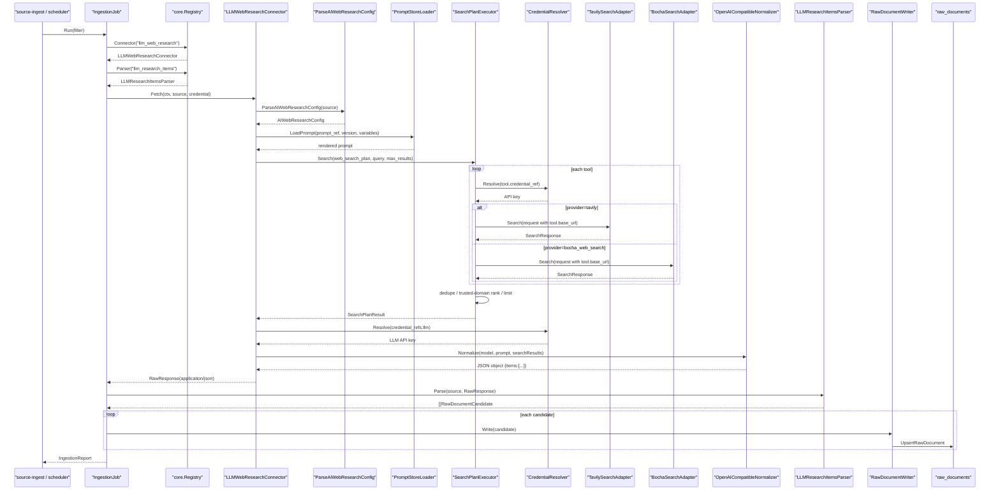
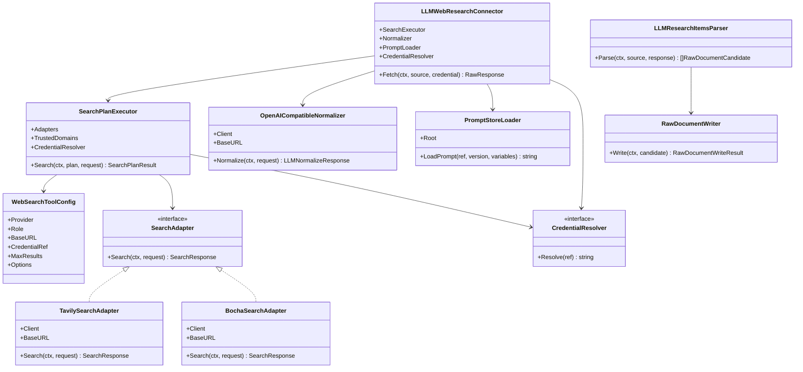

## Context

当前采集层已经通过 `source_catalogs`、connector、parser、runtime 和 repository 写入 `raw_documents`。`source_config` 已作为 `source_catalogs` 的 JSONB 扩展字段存在，可保存 connector 专属的非敏感运行参数；真实凭证通过 `credential_ref` 指向环境变量或部署 secret。

本 change 的设计目标是把 Web Search API provider 接入为开放互联网材料召回工具，并用大模型对召回结果做结构化整理。它不是事件图谱抽取能力，也不是外部 Agent 平台编排能力。它只负责按采集系统统一触发方式执行搜索、可选网页抓取、结构化整理和 raw document 候选对象写入。

前期验证结论是：`Tavily Search API + DeepSeek/OpenAI-compatible LLM normalizer` 可以返回中国财经和全球政经候选材料，但单一 Tavily provider 对中国本土财经来源覆盖不稳定。因此首期设计必须让同一个 AI Web Research connector 在 Web Search tool 层组合多个 API，并通过搜索计划、来源偏好和可信域名白名单提高中国财经来源召回质量。

## Goals / Non-Goals

**Goals:**

- 新增 `llm_web_research` connector 和 `llm_research_items` parser，使 Web Search API + LLM Web Research 成为 `source_catalogs` 驱动的采集通道。
- 通过 `source_config` 保存非敏感运行参数：Web Search tool plan、来源偏好、可信域名、LLM provider、API base URL、协议类型、模型名、提示词引用、提示词版本、提示词变量、结果条数、时间窗口、语言和输出 schema。
- 将较长的 prompt 正文保存为 repo 内版本化文件，`source_config` 只保存 `prompt_ref`、`prompt_version` 和少量运行变量。
- 通过 `credential_ref` 或 `source_config.credential_refs` 引用真实 API key，禁止把 Web Search provider key、LLM key 写入 `source_config`、seed 文件、配置文件或源码。
- 约束模型返回结构化 JSON 对象，核心字段为 `items` 数组，每个 item 可转为一条原始文档候选对象。
- 记录内容来源质量，区分网页原文、搜索摘录和模型总结，供后续事件抽取判断证据质量。
- 单元测试使用 fake 或 `httptest` 验证多 Web Search provider 搜索请求、LLM 结构化请求、响应解析、凭证缺失、非法 JSON、结构化校验和 raw document 转换。

**Non-Goals:**

- 不在本 change 中抽取事件、标签、实体关联或实体关系。
- 不在本 change 中生成投资建议、涨跌预测、利好利空、传导强度或事件评分。
- 不要求大模型天然具备联网搜索；首期搜索能力由明确的 Web Search API provider 提供，LLM 只负责结构化整理。DeepSeek tool-call loop 可作为后续增强，不作为首期必要路径。
- 不在本 change 中建设 prompt 管理后台或数据库 prompt 模板表；MVP 阶段提示词以 repo 文件方式版本化管理。
- 不引入独立图数据库、向量数据库、外部 Agent 工作流平台或前端展示。

## Decisions

### Decision: AI Web Research 归属 ingestion connector

AI Web Research 的产物是原始外部材料，应进入 `internal/apps/ingestion` 子系统，并复用现有 connector、parser、runtime、source catalog 和 repository 边界。后续事件理解、实体关联和图谱投影应由独立 change 从 `raw_documents` 继续处理。

备选方案是继续使用 `eventgraph` change 承载该能力。该方案会把“找材料”和“理解材料”混在一起，导致 change 范围过大，不利于验证和审计。

### Decision: `source_config` 保存非敏感 connector 参数和引用

AI connector 的搜索计划、搜索选项、LLM API base URL、协议类型、模型名、提示词引用、时间窗口、结果条数和输出 schema 与具体采集源强相关，应该随 `source_catalogs` 一起治理、seed、审计和查询。因此这些非敏感参数和引用放入 `source_config`。

真实 API key 仍通过 `credential_ref` 或 `source_config.credential_refs` 指向环境变量或部署 secret。代码不得从 `source_config` 读取真实密钥。

### Decision: 一个 AI connector 内组合多个 Web Search API

首期不依赖 Qwen、DeepSeek 或其他大模型自带联网能力。connector 先由 Go 后端确定性调用 Web Search API，获取标题、URL、摘要、来源、发布时间、原始搜索元数据和可选 raw content，再把搜索结果交给 LLM 做结构化整理。

备选方案是直接让模型通过 Chat Completions 自己搜索。前期验证显示 Qwen 和 DeepSeek Chat 直接调用容易出现旧新闻、错误时间、伪造 model、缺失 URL 或空数组，不能作为稳定采集源。Tavily 作为明确搜索工具更利于审计、重试、限流和测试。

首期仍然只有一个 `llm_web_research` connector。多 provider 不表示创建多个 AI connector，而是在 connector 内部新增 `web_search_plan` 编排层。该层按 source 配置选择 `parallel`、`fallback` 或 `sequential` 模式调用多个 Web Search adapter，把各 provider 结果归一化为统一 `SearchResultCandidate`，再进行 URL 规范化、标题/内容哈希去重、可信域名标记、排序和截断。

`source_config.web_search_plan` 采用以下概念结构：

```json
{
  "mode": "parallel",
  "tools": [
    {
      "provider": "tavily",
      "role": "global_general",
      "base_url": "https://api.tavily.com",
      "max_results": 10,
      "credential_ref": "env:TAVILY_API_KEY",
      "options": {}
    },
    {
      "provider": "bocha_web_search",
      "role": "china_finance_primary",
      "base_url": "https://api.bochaai.com",
      "max_results": 10,
      "credential_ref": "env:BOCHA_API_KEY",
      "options": {}
    }
  ]
}
```

首期 search tool adapter 纳入以下 provider：

- `tavily_global`: 默认已验证链路，适合全球政经、英文新闻、通用财经和跨区域搜索；支持 `topic`、`search_depth`、`time_range`、`include_domains`、`exclude_domains`、`include_raw_content` 等选项。
- `bocha_web_search`: 中文财经和中国本土来源优先搜索工具，适合召回中文网页、新闻、百科和生态内容；优先作为中国财经 source 的主工具。

程序侧不得把 provider 返回的排名、摘要或 answer box 直接当成事实结论，必须进入 parser 校验和 raw metadata。

百度 SERP、DuckDuckGo、Google Custom Search 或其他搜索 API 不进入本 change 的首期实现范围。它们可以作为后续扩展 provider，在验证搜索质量、价格、限流、合规和凭证接入方式后，通过独立 change 纳入 `web_search_plan`。

### Decision: 中国财经来源使用 profile 与白名单控制

中国财经搜索不能只通过提示词要求“优先中文来源”。首期应在 `source_config.source_preferences` 中表达来源偏好，并用 `trusted_domains` 或 `preferred_domains` 控制高优先级来源，例如新华社、财联社、证券时报、中国证券报、上海证券报、第一财经、21 世纪经济报道、中国人民银行、国家统计局、商务部、上海证券交易所、深圳证券交易所和香港交易所等官网或财经站点。

搜索 adapter 负责把 provider 支持的域名过滤参数透传给 provider；当 provider 不支持域名过滤时，connector 或 parser 必须在返回结果后按域名白名单加权、排序或降级。非白名单来源不是绝对拒绝，但必须保留 provider 名称、原始 URL、检索查询、来源等级和归因类型，供后续审计。

### Decision: 长提示词使用 repo prompt 文件管理

AI Web Research 的提示词会随着来源范围、字段契约、时间窗口、内容安全边界和输出 schema 逐渐变长，不适合长期作为 `source_config` 中的一个大 JSON 字符串保存。首期采用 repo 内 prompt 文件方式管理长提示词正文，例如：

```text
backend/data/prompts/ingestion/ai_web_research/
├── cn-finance-daily.v1.md
├── global-macro-daily.v1.md
└── normalization-schema.v1.md
```

`source_config` 只保存：

- `prompt_ref`: 指向 repo prompt 文件或 prompt registry key。
- `prompt_version`: 明确本 source 使用的提示词版本。
- `prompt_variables`: 保存时间窗口、结果条数、语言、地区、来源偏好等少量变量。
- `output_schema_ref` 或 `output_schema`: 保存结构化输出契约引用或小型 schema。

这样做的好处是提示词可以被 git diff、OpenSpec review、代码 review 和测试 fixture 明确审计；`source_config` 仍然负责“这个 source 用哪个 prompt 和哪些变量”，但不承担长文本模板的维护职责。后续如果需要运营后台在线编辑 prompt，再通过独立 change 引入 prompt template 表、发布流程和审批机制。

### Decision: LLM 结构化整理与搜索召回分离

connector 内部使用统一请求模型表达 web search plan、LLM provider、protocol、model、prompt ref、prompt variables、search options、max results 和 timeout。Web Search tools 负责搜索召回；connector 负责合并和去重；LLM 负责把搜索结果整理为 `items` JSON；parser 负责硬校验和 raw document candidate 转换。

DeepSeek Tool Calls 可以在后续版本中作为增强模式：模型先返回 `web_search` 或 `web_fetch` tool call，Go 后端执行 Tavily 或网页抓取，再回传工具结果。但首期优先实现确定性搜索/fetch + LLM normalizer，降低 agent 多轮不稳定性。

### Decision: 返回结构采用对象包裹 `items` 数组

模型响应必须解析为 JSON 对象，并包含 `items` 数组。每个 item 至少包含标题、来源归因、正文或摘要、内容来源类型和相关性说明。来源归因优先使用真实 URL；如果 provider 只返回来源名称、引用文本、搜索结果来源说明或模型可解释的来源描述，也可以入库，但必须标记为非 URL 来源归因。对象外层可以记录批次、查询时间、模型、提示词版本和统计信息。

备选方案是要求模型直接返回裸数组。裸数组难以扩展批次元数据，也不便于记录模型执行状态和错误。

### Decision: raw document 保留证据质量标记

如果 item 的正文来自真实网页抓取，应标记为 `fetched_source_text`；如果只来自搜索摘录，应标记为 `search_snippet`；如果是模型根据搜索结果总结，应标记为 `llm_generated_summary`。后续事件抽取不得把模型总结误认为原始新闻全文。

### Decision: 来源归因不强制要求 URL

AI Web Research 的入库门槛不是“必须有可点击链接”，而是“必须有可审计来源归因”。`source_url` 是最高优先级来源字段；当 provider 无法返回 URL 时，parser 可以接受 `source_name`、`source_reference`、`citation_text` 或 `provider_source_note` 等来源说明，并在 raw metadata 中记录 `source_attribution_type=url|named_source|citation_text|provider_note`。

如果 item 同时缺少 URL、来源名称、引用文本和 provider 来源说明，系统必须拒绝该条目。后续事件抽取应根据 `source_attribution_type`、`content_origin` 和 `retrieval_method` 判断证据强弱。

### Decision: Search tool base URL 必须支持配置化

Tavily、博查等 Web Search provider 的官方 base URL 可以作为代码默认值，但 source catalog 必须允许在 `web_search_plan.tools[].base_url` 中覆盖。这样 local、uat、prod 可以通过不同 source seed 或数据库配置接入官方地址、代理网关、企业网关或私有化搜索服务，而不需要修改代码。

真实 API key 仍然只能通过 `credential_ref` 引用环境变量或部署 secret。`base_url` 只允许保存非敏感地址，不得包含 token、query key 或用户隐私参数。

### Decision: Adapter 文件名和主要类型保持一致

Go 不要求一个文件只放一个类型，但本项目需要让 AI agent 和人类开发者能快速定位职责。AI Web Research adapter 文件应以主要 provider 类型命名，例如：

```text
ai_web_research_tavily_adapter.go
ai_web_research_bocha_adapter.go
```

公共搜索编排、公共 HTTP helper、LLM normalizer 和 source config 解析应拆在各自文件中，避免一个文件同时承担 provider 适配、请求构造、响应映射和注册职责。

### Decision: Adapter 抽象到 HTTP helper，不抽成万能 provider 框架

当前已有 `SearchAdapter`、`SearchRequest`、`SearchResponse` 和 `SearchResultCandidate` 作为稳定抽象。Tavily 和博查的 HTTP 请求存在重复逻辑，包括 JSON marshal、POST 请求、Bearer 鉴权、状态码处理、响应读取和 JSON decode，应抽出公共 helper。

但不同 provider 的请求字段、响应字段、分页、时间语义和错误语义差异较大，首期不引入“万能搜索 provider 框架”。每个 adapter 仍然保留 provider-specific request mapping 和 response mapping，公共层只处理确定重复且低歧义的 HTTP JSON 调用。

### Decision: Go 后端采用轻框架组合，不引入 Spring 式大框架

本项目后端已经使用 Gin 作为 HTTP API 框架、pgx 作为 PostgreSQL driver、goose 作为数据库迁移工具，并使用 Go 标准库完成 HTTP client、context 和 testing。Go 生态没有类似 Java Spring 的单一事实标准大框架，主流工程实践是轻框架、显式依赖、清晰 package 边界和 interface 驱动测试。

当前阶段不引入 DI 大框架、ORM 大框架或全家桶应用框架。理由是：

- 采集器、scheduler、connector 和后台任务更依赖清晰边界，而不是 Web 框架魔法。
- 显式构造和 interface 对 AI 编程更稳定，编译反馈直接，调试路径短。
- 现有模块化单体结构已经能支持 API、ingestion、scheduler 和后续后台 worker 的独立入口。

后续如出现明确需要，可以按场景引入专项成熟库，例如 scheduler 使用 `robfig/cron`，异步任务队列评估 `asynq`，但不把它们作为本 change 的前置依赖。

## Diagrams

### Sequence Diagram



### Class / Component Diagram



## Risks / Trade-offs

- [Risk] 不同 Web Search provider 的参数、计费、字段和时间语义差异导致搜索失败或结果不可比。→ Mitigation：为每个 provider adapter 定义请求/响应归一化测试，统一输出 search result candidate，并在 raw metadata 保留 provider 原始响应。
- [Risk] 中国财经来源被全球搜索工具稀释。→ Mitigation：新增中文搜索 tool、可信域名白名单、来源偏好和结果后处理排序；中国财经类 source 默认不只依赖 Tavily。
- [Risk] 多搜索工具并发调用导致成本和延迟不可控。→ Mitigation：`web_search_plan` 必须配置每个 tool 的 `max_results`、timeout、失败策略和总结果上限；report 必须记录每个 tool 的耗时、结果数和失败原因。
- [Risk] 不同模型 provider 的结构化能力差异大。→ Mitigation：通过 `api_protocol`、`llm_provider`、`output_schema` 和 provider-neutral 请求模型表达差异，首期用 fake/fixture 验证边界。
- [Risk] 模型返回非 JSON、字段缺失或编造来源。→ Mitigation：parser 必须严格校验 JSON schema、来源归因、标题、内容、内容来源类型和条数上限，失败时不写入伪造文档；没有 URL 但有来源说明的条目必须降级标记来源归因类型。
- [Risk] `source_config` 变成任意配置垃圾桶。→ Mitigation：为 `llm_web_research` 定义必填字段、禁止字段和类型校验，测试覆盖无效配置。
- [Risk] 提示词过长或频繁修改影响审计。→ Mitigation：提示词正文使用 repo prompt 文件管理，`source_config` 只保存 `prompt_ref`、`prompt_version` 和 `prompt_variables`；后续如提示词治理复杂，再独立 change 引入 prompt 模板表。
- [Risk] Web Search tool 和 LLM 结构化成本、限流不可控。→ Mitigation：复用 provider 级限流，要求 `max_results`、timeout、搜索深度、批次大小、tool 失败策略和 fallback 策略可配置，并在 report 中记录搜索成功、搜索失败、LLM 成功、LLM 失败和跳过数量。
- [Risk] 模型总结被误用为事实原文。→ Mitigation：强制记录 `content_origin` 和 `retrieval_method`，后续事件抽取可按证据质量降权或跳过。

## Migration Plan

1. 定义 AI Web Research source seed 示例、repo prompt 文件、`web_search_plan` 和 `source_config` 字段约束。
2. 编写 Tavily、博查 adapter、prompt loader、LLM normalizer、parser 的配置校验、fake provider、结构化响应解析和 raw document candidate 转换测试。
3. 实现 `llm_web_research` connector、web search plan 编排、provider-neutral search adapter 接口、Tavily search adapter、博查 search adapter、repo prompt loader、LLM normalizer、`llm_research_items` parser 和 registry 注册。
4. 将 AI source 纳入现有 runtime/scheduler 可触发路径，复用 source catalog、credential resolver、rate limit 和 report。
5. 使用 fake Web Search provider 和 fake LLM 端到端验证搜索结果可以转为结构化 items，并幂等写入 raw document 候选对象。
6. 通过 gated smoke 验证真实 Tavily、博查 source 的搜索返回字段、错误处理和成本统计；LLM 真实调用同样必须显式启用，不得进入普通单元测试。

回滚策略：如真实 provider 不稳定，可将 AI Web Research source 的 `status` 改为 `inactive` 或 `disabled`，保留 connector 代码和历史 raw document，不删除已有采集数据。

## Open Questions

- Tavily 作为已验证默认 Web Search tool 保留；中国财经 source 首期使用博查作为中文搜索通道，仍需确认博查的真实搜索质量、成本、限流和凭证开通方式。
- 首期 LLM normalizer 可以先支持 OpenAI-compatible provider，并通过 `source_config.llm_provider` 配置 Qwen、DeepSeek 或其他模型。
- DeepSeek Tool Calls 可作为后续增强模式，但不阻塞 Tavily deterministic search/fetch + LLM normalizer 的首期实现。
