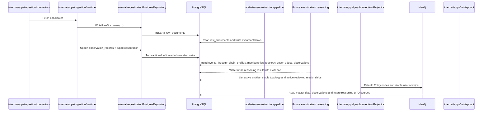
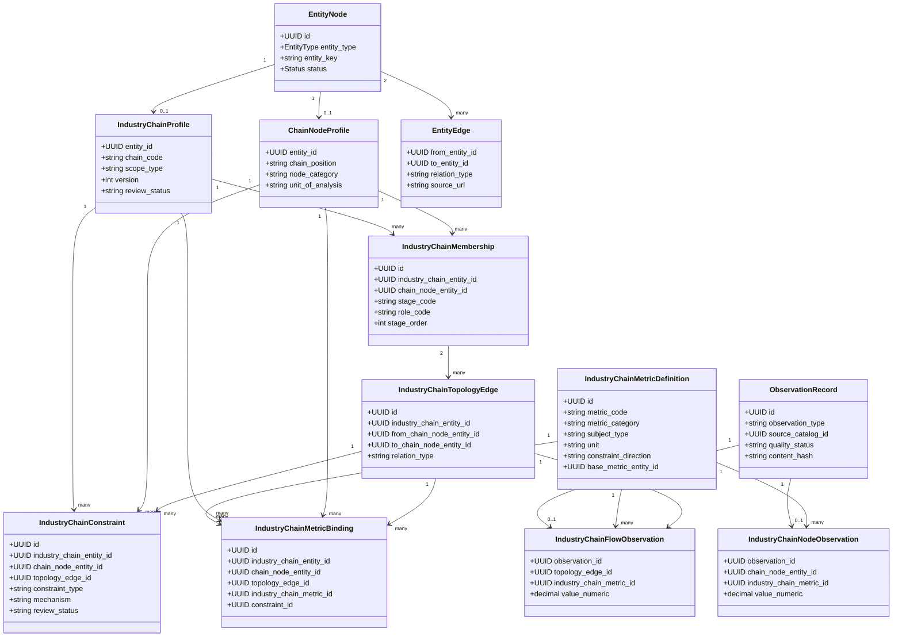

## Context

当前 `entity_nodes` 已支持 `chain_node`，`chain_node_profiles` 只有 `chain_position`；版本化 seed 中有 33 个节点，但不存在独立产业链、链内成员、链内拓扑和产业链 typed observation。`entity_edges` 已承载带来源的客观跨实体关系，`graphprojection` 只读取 active 实体与 active 端点关系，PostgreSQL 是事实源，Neo4j 是可重建投影。

本设计基于 `muxuuu/serenity-skill` 的公开仓库进行方法论适配，而不是复制其 Skill 实现。该项目把研究流程写成 `market story → system change → required parts → supply-chain layers → scarce constraints → public companies → evidence → market gap → falsification`，要求先排产业链层级再排公司，并通过低供应商数量、长认证周期、扩产困难、专用设备/纯度/know-how、客户预付款或产能预订等信号寻找稀缺层；证据按交易所/财报/公告/监管与技术文件、可信媒体与行业资料、社交线索分级，最后必须给出证伪条件和下一步核验动作。来源：[SKILL.md](https://github.com/muxuuu/serenity-skill/blob/main/SKILL.md)、[Deep Research Workflow](https://github.com/muxuuu/serenity-skill/blob/main/references/deep-research-workflow.md)、[Evidence Ladder](https://github.com/muxuuu/serenity-skill/blob/main/references/evidence-ladder.md)。

对观潮家而言，Serenity 的价值不是提供一套可直接落库的产业链事实，也不是产生自动交易信号，而是提供全球事件驱动分析的推理骨架和数据完备性检查：前四项约束稳定主数据和拓扑的粒度；稀缺约束要求 typed observation；证据要求 claim/provenance/quality；风险与证伪条件约束动态推理输出。公司优先级、估值差、催化剂时点和 scorecard 分数属于运行时判断，不得固化为产业链主数据。

## Goals / Non-Goals

**Goals:**

- 形成可直接转换为 PostgreSQL migration、Go domain 类型和 repository DTO 的逐表字段设计。
- 建立可版本化的 `industry_chain` 主数据，并复用现有 `chain_node` 身份。
- 区分节点全局属性和链内阶段/角色，表达可核验、可审阅的稳定拓扑。
- 用明确方向的客观关系连接产业链、节点与 economy、commodity、benchmark、sector、metric。
- 定义 observation governance envelope 与产业链 typed observation tables，支撑瓶颈分析输入。
- 保持 PostgreSQL 事实源、Neo4j active-only 可重建投影和分层数据写入门禁。
- 为后续事件抽取、推理、API 与小程序展示提供稳定读取契约。
- 让数据模型能够回答 Serenity 的核心问题：什么系统发生变化、哪些部件不可绕开、哪个层级难扩产、证据是什么、什么事实会推翻判断。

**Non-Goals:**

- 本轮不实现或执行 migration、seed、PG 写入、Neo4j 重建、connector、Agent 推理、API 或 UI。
- 不把三条首批试点或两条第二批候选直接写入正式 seed；不承诺未经 Review 的 10–20 节点清单。
- 不存储利好利空、影响强度、确定性瓶颈、事件评分、资产预测或投资建议。
- 不修改 `prototype/`、项目外 `doc/`、小程序 change 或 `add-ai-event-extraction-pipeline`。

## Decisions

### 1. 独立产业链实体与链内成员

新增 `EntityTypeIndustryChain = "industry_chain"`，以 `entity_nodes` 保存统一身份，以 `industry_chain_profiles` 保存：

- `entity_id`：引用 `entity_nodes(id)`；
- `chain_code`：稳定业务代码，全局唯一；
- `scope_type`：`global | economy | regional`；
- `primary_economy_entity_id`：仅 economy scope 必填；
- `definition`、`boundary_note`：客观定义和边界；
- `version`：正整数；
- `review_status`：`candidate | reviewed | approved`。

改进 `chain_node_profiles`：保留 `entity_id`、`chain_position` 兼容现有数据，新增 `node_category`、`definition`、`unit_of_analysis`。`chain_position` 仅作为全局默认提示；真正链内阶段与角色进入 `industry_chain_memberships`：

- `id`、`industry_chain_entity_id`、`chain_node_entity_id`；
- `stage_code`：`upstream | midstream | downstream | infrastructure | service`；
- `role_code`：`resource | material | equipment | component | process | product | service | infrastructure`；
- `stage_order`、`is_core`、`source_name`、`source_url`、`verified_at`、`status`；
- 唯一键 `(industry_chain_entity_id, chain_node_entity_id)`。

选择该方案而不是“把产业链名称放进 `chain_node_profiles`”，因为同一节点可以参与多条链且角色不同；也不为每条链复制节点，避免平行身份和跨链去重失败。

### 2. 稳定拓扑使用专用表，跨实体关系继续使用 `entity_edges`

新增 `industry_chain_topology_edges`：

- `id`、`industry_chain_entity_id`、`from_chain_node_entity_id`、`to_chain_node_entity_id`；
- `relation_type`：`upstream_of | input_to | output_to | depends_on | substitutes_for`；
- `evidence_note`、`source_name`、`source_url`、`verified_at`、`status`、时间戳；
- 禁止自环，并以 `(industry_chain_entity_id, from_chain_node_entity_id, relation_type, to_chain_node_entity_id)` 保证唯一；两端必须是该链 active membership。

结构性稀缺约束不作为 topology relation type，而进入独立 `industry_chain_constraints`；“当前瓶颈、严重度、受益承压、传导强度”只能由 observation + event-driven reasoning 动态产生。

跨实体关系仍使用 `entity_edges` 与现有 provenance：

| relation_type | 方向 | 客观语义 |
|---|---|---|
| `scoped_to_economy` | industry_chain → economy | 产业链定义范围 |
| `uses_commodity` | chain_node → commodity | 节点投入商品 |
| `produces_commodity` | chain_node → commodity | 节点产出商品 |
| `observed_by_benchmark` | chain_node/industry_chain → benchmark | 可观测 benchmark |
| `represented_by_sector` | chain_node/industry_chain → sector | 中国或指定市场板块的客观映射 |

全球 benchmark 的路径是 `benchmark ← observed_by — chain/node — represented_by → 中国 sector`。海外 `market` 只能 `covers_sector` 其自身客观覆盖范围，不得为了传导查询而 `COVERS_SECTOR` 中国板块。

选择专用拓扑表而非全部复用 `entity_edges`，因为拓扑必须带 chain scope、成员约束与链内唯一性；跨实体继续复用 `entity_edges`，避免新建平行关系治理体系。

### 3. Observation governance envelope + typed tables

新增通用 `observation_records` 作为治理 envelope，而不是万能数值表：

- `id`、`observation_type`、`source_catalog_id`、`source_external_id`；
- `observed_at`、`published_at`、`collected_at`；
- `source_name`、`source_url`、`quality_status` (`pending | validated | rejected | superseded`)；
- `revision`、`content_hash`、`raw_document_id`、时间戳；
- 幂等键 `(observation_type, source_catalog_id, source_external_id, observed_at, revision)`。

领域值只进入 typed tables：

- `industry_chain_node_observations`：引用产业链专用指标定义，用于产能、产量、库存、利用率、交期、价格等节点观测。
- `industry_chain_flow_observations`：引用产业链专用指标定义，用于贸易量、投入量、产出量或依赖流量。

不使用 `attribute_name/value_text` 万能 EAV。第一版 connector 范围只允许复用 ingestion 的 `source_catalogs → raw_documents → parser/validator → typed observation writer` 契约；实际 provider/connector 清单、授权和频率必须在后续采集 change 中逐项批准。无明确 metric、单位、时间窗口或来源的观察不得写入 validated 状态。

### 4. Schema field mapping（本 change 的主要设计交付）

以下 10 张表构成首版产业链数据模型。`entity_nodes` 继续保存统一实体身份，`entity_edges` 继续保存跨实体客观关系，现有 `metric_profiles` 保持市场/宏观/商品/benchmark 通用指标语义并仅作为可选桥接，`raw_documents` 保存外部证据原文；不创建平行实体表、关系总表或万能 EAV。

#### 4.1 `industry_chain_profiles`

| 字段 | 类型 | 约束 | 语义 |
|---|---|---|---|
| `entity_id` | UUID | PK, FK → `entity_nodes(id)` | 对应 `entity_type=industry_chain` |
| `chain_code` | VARCHAR(96) | NOT NULL, UNIQUE | 稳定业务代码，不随名称或热点变化 |
| `definition` | TEXT | NOT NULL | 客观产业链定义 |
| `boundary_note` | TEXT | NOT NULL DEFAULT '' | 纳入/排除边界 |
| `scope_type` | VARCHAR(32) | CHECK `global/economy/regional` | 地理范围类型 |
| `primary_economy_entity_id` | UUID | nullable FK → `entity_nodes(id)` | economy scope 必填且必须指向 economy |
| `version` | INTEGER | NOT NULL CHECK > 0 | 定义版本 |
| `review_status` | VARCHAR(32) | CHECK `candidate/reviewed/approved` | 人工 Review 状态 |
| `source_name` | TEXT | NOT NULL | 定义来源 |
| `source_url` | TEXT | NOT NULL | 权威来源 URL |
| `verified_at` | TIMESTAMPTZ | NOT NULL | 最近核验时间 |

`entity_nodes.status='active'` 与 `review_status='approved'` 同时满足时，产业链才可进入正式投影和推理输入。

#### 4.2 `chain_node_profiles` 增量字段

| 字段 | 类型 | 约束 | 语义 |
|---|---|---|---|
| `entity_id` | UUID | 既有 PK/FK | 对应 `entity_type=chain_node` |
| `chain_position` | VARCHAR(64) | 既有 NOT NULL | 兼容旧数据的全局默认位置提示 |
| `node_category` | VARCHAR(64) | NOT NULL DEFAULT '' | resource/material/equipment/component/process/product/service/infrastructure 等分类 |
| `definition` | TEXT | NOT NULL DEFAULT '' | 节点客观定义 |
| `unit_of_analysis` | VARCHAR(64) | NOT NULL DEFAULT '' | material/process/equipment/component/system/service 等分析单位 |
| `granularity_note` | TEXT | NOT NULL DEFAULT '' | 为什么该节点可独立观测且不应继续合并/拆分 |

链内阶段、角色和顺序不得写入该 profile，避免同一节点参与不同产业链时产生冲突。

#### 4.3 `industry_chain_memberships`

| 字段 | 类型 | 约束 | 语义 |
|---|---|---|---|
| `id` | UUID | PK | 稳定 membership 身份 |
| `industry_chain_entity_id` | UUID | FK → `entity_nodes(id)` | 必须为 industry_chain |
| `chain_node_entity_id` | UUID | FK → `entity_nodes(id)` | 必须为 chain_node |
| `stage_code` | VARCHAR(32) | CHECK `upstream/midstream/downstream/infrastructure/service` | 链内阶段 |
| `role_code` | VARCHAR(32) | CHECK `resource/material/equipment/component/process/product/service/infrastructure` | 链内角色 |
| `stage_order` | INTEGER | NOT NULL CHECK >= 0 | 仅用于同链稳定展示顺序，不表达重要性 |
| `is_core` | BOOLEAN | NOT NULL DEFAULT false | 是否为链定义不可缺少的核心节点 |
| `source_name` | TEXT | NOT NULL | 成员依据来源 |
| `source_url` | TEXT | NOT NULL | 来源 URL |
| `verified_at` | TIMESTAMPTZ | NOT NULL | 核验时间 |
| `status` | VARCHAR(32) | CHECK `active/inactive` | 生命周期状态 |

唯一键：`(industry_chain_entity_id, chain_node_entity_id)`；索引：`(industry_chain_entity_id, status, stage_order)`。

#### 4.4 `industry_chain_topology_edges`

| 字段 | 类型 | 约束 | 语义 |
|---|---|---|---|
| `id` | UUID | PK | 稳定链内边身份 |
| `industry_chain_entity_id` | UUID | FK | chain scope |
| `from_chain_node_entity_id` | UUID | FK | 起点，必须是同链 active membership |
| `to_chain_node_entity_id` | UUID | FK | 终点，必须是同链 active membership |
| `relation_type` | VARCHAR(48) | CHECK `upstream_of/input_to/output_to/depends_on/substitutes_for` | 稳定客观拓扑语义 |
| `evidence_note` | TEXT | NOT NULL DEFAULT '' | 关系说明，不得包含推理结论 |
| `source_name` | TEXT | NOT NULL | 来源 |
| `source_url` | TEXT | NOT NULL | 来源 URL |
| `verified_at` | TIMESTAMPTZ | NOT NULL | 核验时间 |
| `status` | VARCHAR(32) | CHECK `active/inactive` | 生命周期状态 |
| `created_at/updated_at` | TIMESTAMPTZ | NOT NULL | 审计时间 |

唯一键：`(industry_chain_entity_id, from_chain_node_entity_id, relation_type, to_chain_node_entity_id)`；禁止自环。`bottleneck_candidate_for` 不再作为 topology 枚举，避免把约束判断伪装为节点间客观流向。

#### 4.5 `industry_chain_constraints`

| 字段 | 类型 | 约束 | 语义 |
|---|---|---|---|
| `id` | UUID | PK | 结构性约束定义身份 |
| `industry_chain_entity_id` | UUID | NOT NULL FK | 所属产业链 |
| `chain_node_entity_id` | UUID | nullable FK | 节点级约束对象 |
| `topology_edge_id` | UUID | nullable FK | 流程/依赖边级约束对象 |
| `constraint_type` | VARCHAR(48) | CHECK `supplier_concentration/qualification_cycle/expansion_lead_time/capacity/purity/yield/specialized_equipment/know_how/regulation/infrastructure_connection/substitution` | Serenity 稀缺约束类型 |
| `mechanism` | TEXT | NOT NULL | 为什么该条件可能限制系统扩张的客观机制 |
| `substitution_path` | TEXT | NOT NULL DEFAULT '' | 已知替代路径；空值不得解释为不可替代 |
| `expansion_path` | TEXT | NOT NULL DEFAULT '' | 已知扩产/缓解方式 |
| `source_name` | TEXT | NOT NULL | 定义来源 |
| `source_url` | TEXT | NOT NULL | 来源 URL |
| `verified_at` | TIMESTAMPTZ | NOT NULL | 核验时间 |
| `review_status` | VARCHAR(32) | CHECK `candidate/reviewed/approved` | Review 状态 |
| `status` | VARCHAR(32) | CHECK `active/inactive` | 生命周期状态 |

`chain_node_entity_id` 与 `topology_edge_id` 必须恰好一个非空；对象必须属于同一产业链。该表只保存“存在何种结构性约束及其机制”，不保存 severity、score、benefit/pressure 或当前是否形成瓶颈。

#### 4.6 `industry_chain_metric_definitions`

| 字段 | 类型 | 约束 | 语义 |
|---|---|---|---|
| `id` | UUID | PK | 产业链指标定义身份，不进入 `entity_nodes` |
| `metric_code` | VARCHAR(96) | NOT NULL, UNIQUE | 稳定领域代码 |
| `name` | TEXT | NOT NULL | 中文指标名称 |
| `definition` | TEXT | NOT NULL | 指标口径与边界 |
| `metric_category` | VARCHAR(48) | CHECK `demand/supply/capacity/inventory/price/lead_time/qualification/yield/order/trade_flow/financial` | 产业链指标分类 |
| `subject_type` | VARCHAR(32) | CHECK `chain_node/topology_edge` | 允许的观测主体 |
| `value_type` | VARCHAR(32) | CHECK `numeric/integer/percentage/duration` | 值类型 |
| `unit` | VARCHAR(64) | NOT NULL | 标准单位 |
| `frequency` | VARCHAR(32) | CHECK `realtime/daily/weekly/monthly/quarterly/event` | 默认频率 |
| `aggregation_method` | VARCHAR(32) | CHECK `sum/average/latest/min/max/weighted_average` | 跨记录聚合口径 |
| `constraint_direction` | VARCHAR(32) | CHECK `higher_tighter/lower_tighter/contextual` | 数值变化与约束收紧方向 |
| `applicable_constraint_type` | VARCHAR(48) | nullable, 与 constraint enum 一致 | 可选的主要约束类型 |
| `base_metric_entity_id` | UUID | nullable FK → `entity_nodes(id)` | 可选桥接现有通用 metric，必须为 entity_type=metric |
| `source_name` | TEXT | NOT NULL | 指标口径来源 |
| `source_url` | TEXT | NOT NULL | 来源 URL |
| `review_status` | VARCHAR(32) | CHECK `candidate/reviewed/approved` | Review 状态 |
| `status` | VARCHAR(32) | CHECK `active/inactive` | 生命周期状态 |
| `created_at/updated_at` | TIMESTAMPTZ | NOT NULL | 审计时间 |

该表是产业链领域指标目录。即便桥接 `metric:capacity_utilization`，`industry_chain_metric:wafer_fab_utilization` 仍独立保存晶圆制造口径、主体、单位、频率和约束方向。

#### 4.7 `industry_chain_metric_bindings`

| 字段 | 类型 | 约束 | 语义 |
|---|---|---|---|
| `id` | UUID | PK | 指标适用关系身份 |
| `industry_chain_entity_id` | UUID | NOT NULL FK | chain scope |
| `chain_node_entity_id` | UUID | nullable FK | 节点主体 |
| `topology_edge_id` | UUID | nullable FK | 拓扑边主体 |
| `industry_chain_metric_id` | UUID | NOT NULL FK → `industry_chain_metric_definitions(id)` | 领域指标 |
| `constraint_id` | UUID | nullable FK → `industry_chain_constraints(id)` | 可选关联结构性约束 |
| `is_required` | BOOLEAN | NOT NULL DEFAULT false | 是否为该主体的核心观测指标 |
| `source_name` | TEXT | NOT NULL | 绑定依据来源 |
| `source_url` | TEXT | NOT NULL | 来源 URL |
| `verified_at` | TIMESTAMPTZ | NOT NULL | 核验时间 |
| `review_status` | VARCHAR(32) | CHECK `candidate/reviewed/approved` | Review 状态 |
| `status` | VARCHAR(32) | CHECK `active/inactive` | 生命周期状态 |

节点和拓扑边必须恰好一个非空且属于同一产业链；指标 `subject_type` 必须与绑定主体一致。唯一键分别为 `(industry_chain_entity_id, chain_node_entity_id, industry_chain_metric_id)` 或 `(industry_chain_entity_id, topology_edge_id, industry_chain_metric_id)`，通过 partial unique index 实现。

#### 4.8 `observation_records`

| 字段 | 类型 | 约束 | 语义 |
|---|---|---|---|
| `id` | UUID | PK | observation envelope 身份 |
| `observation_type` | VARCHAR(48) | CHECK `industry_chain_node_metric/industry_chain_flow_metric` | typed row 路由 |
| `source_catalog_id` | UUID | FK → `source_catalogs(id)` | 采集来源 |
| `raw_document_id` | UUID | nullable FK → `raw_documents(id)` | 原始证据 |
| `source_external_id` | TEXT | NOT NULL DEFAULT '' | 来源侧稳定标识 |
| `source_name/source_url` | TEXT | NOT NULL | 展示与审计来源 |
| `observed_at` | TIMESTAMPTZ | NOT NULL | 观察值对应时点 |
| `published_at` | TIMESTAMPTZ | nullable | 来源发布时间 |
| `collected_at` | TIMESTAMPTZ | NOT NULL | 采集时间 |
| `quality_status` | VARCHAR(32) | CHECK `pending/validated/rejected/superseded` | 质量状态 |
| `revision` | INTEGER | NOT NULL CHECK > 0 | 来源修订版本 |
| `content_hash` | VARCHAR(128) | NOT NULL | 内容幂等与审计 |
| `created_at/updated_at` | TIMESTAMPTZ | NOT NULL | 审计时间 |

唯一键：`(observation_type, source_catalog_id, source_external_id, observed_at, revision)`；索引：`(observation_type, observed_at DESC)`、`(source_catalog_id, collected_at DESC)`。`validated` 必须存在且只存在一个匹配 typed row；这一跨表不变量由同一 repository transaction、deferred constraint trigger 或等价数据库防御共同保证，不能只依赖调用方约定。

#### 4.9 `industry_chain_node_observations`

| 字段 | 类型 | 约束 | 语义 |
|---|---|---|---|
| `observation_id` | UUID | PK, FK → `observation_records(id)` | 必须对应 node metric 类型 |
| `industry_chain_entity_id` | UUID | NOT NULL FK | chain scope |
| `chain_node_entity_id` | UUID | NOT NULL FK | 必须为该链 membership |
| `constraint_id` | UUID | nullable FK → `industry_chain_constraints(id)` | 可选关联结构性约束 |
| `industry_chain_metric_id` | UUID | NOT NULL FK → `industry_chain_metric_definitions(id)` | 必须为 `subject_type=chain_node` 的 approved active 指标 |
| `value_numeric` | NUMERIC | NOT NULL | 数值 |
| `unit` | VARCHAR(64) | NOT NULL | 与 metric 定义兼容 |
| `period_start/period_end` | TIMESTAMPTZ | nullable | 观察期间；end 不早于 start |

索引：`(chain_node_entity_id, industry_chain_metric_id)`；与 `observation_records(observation_type, observed_at DESC)` join 支撑时序查询。对应 chain/node/metric 组合必须存在 approved active binding。禁止在此表存 arbitrary text value。

#### 4.10 `industry_chain_flow_observations`

| 字段 | 类型 | 约束 | 语义 |
|---|---|---|---|
| `observation_id` | UUID | PK, FK → `observation_records(id)` | 必须对应 flow metric 类型 |
| `topology_edge_id` | UUID | NOT NULL FK → `industry_chain_topology_edges(id)` | 被观测的稳定流向 |
| `constraint_id` | UUID | nullable FK → `industry_chain_constraints(id)` | 可选关联边级约束 |
| `industry_chain_metric_id` | UUID | NOT NULL FK → `industry_chain_metric_definitions(id)` | 必须为 `subject_type=topology_edge` 的 approved active 指标 |
| `value_numeric` | NUMERIC | NOT NULL | 数值 |
| `unit` | VARCHAR(64) | NOT NULL | 单位 |
| `period_start/period_end` | TIMESTAMPTZ | nullable | 观察期间 |

索引：`(topology_edge_id, industry_chain_metric_id)`；对应 topology edge/metric 组合必须存在 approved active binding。chain scope 从 topology edge 唯一确定，不重复存储 `industry_chain_entity_id`。

#### 4.11 复用 `entity_edges` 的跨实体关系字段

不新增跨实体关系表。继续复用 `entity_edges(id, from_entity_id, to_entity_id, relation_type, evidence_note, source_name, source_url, verified_at, status, created_at, updated_at)`，只扩展 relationship policy：

- `industry_chain → economy`: `scoped_to_economy`；
- `chain_node → commodity`: `uses_commodity` / `produces_commodity`；
- `industry_chain|chain_node → benchmark`: `observed_by_benchmark`；
- `industry_chain|chain_node → sector`: `represented_by_sector`；

公司与节点继续使用既有 `company → chain_node: participates_in`，但必须补充来源；“公司受益于瓶颈”不是客观关系，不进入 `entity_edges`。

### 5. Serenity 方法论的数据模型映射

Serenity 原仓库是 prompt/workflow、证据规范、示例和本地 scorecard 的组合，不是数据库 schema。观潮家按下面四层吸收其方法，避免把方法论输出误当客观事实：

| Serenity 研究对象 | 观潮家模型 | 持久化性质 |
|---|---|---|
| value-chain / required parts | `industry_chain_profiles`、`chain_node_profiles`、`industry_chain_memberships` | 稳定、经 Review 的主数据 |
| upstream/downstream/dependency/substitution | `industry_chain_topology_edges` | 有来源、经 Review 的稳定拓扑 |
| power/bandwidth/heat/yield/purity/lead-time/capacity 等约束信号 | `industry_chain_metric_definitions` + bindings + node/flow observations | 带领域口径、适用主体、时点、来源和质量的客观观察 |
| filing/order/certification/project/technical evidence | `raw_documents`、未来 event evidence/claim contract、`observation_records` provenance | 证据事实与证据等级 |
| scarce-layer ranking、company priority、market gap、catalyst、risk、kill switch | 未来 event-driven reasoning result contract | 动态、可重算、带证据和有效期的推理结果 |

未来推理输入/输出契约至少包含以下结构，但本 change 不新增其持久化表：

- `ResearchScope`：`market_scope`、`theme`、`as_of`、`time_horizon`、`industry_chain_ids`；
- `SystemChangeHypothesis`：需求波、系统压力、必需技术变化、关联事件与证据；
- `LayerAssessment`：chain membership/layer、不可绕开原因、supplier concentration、qualification/lead-time/expansion constraint signals；
- `EvidenceAssessment`：claim、source document、`strong | medium | weak | needs_checking`、支持/反驳方向、核验时间；
- `ScarcityAssessment`：按需求压力、架构耦合、瓶颈严重性、供应商集中、扩产难度和证据质量形成的可解释评估；
- `CandidateExposure`：company/sector/benchmark 与节点或稀缺层的客观位置，禁止把“受益”直接写成事实关系；
- `RiskCondition`：替代设计、扩产追上、需求不足、客户流失、治理/融资/地缘风险及可判定的 downgrade/kill-switch 条件。

Serenity scorecard 的 `valuation_disconnect`、`catalyst_timing` 以及融资、治理、流动性等 penalty 只能用于分析运行，不进入 `industry_chain_*` 主数据或 topology；其固定权重也不作为本系统默认规则，因为不同市场、时间窗和事件类型需要独立校准。

### 6. MVP 试点与节点粒度规则

首批试点 Review 候选固定为 AI 算力基础设施、半导体制造、机器人；新能源汽车/储能、创新药/生物制造保留为第二批扩展候选。选择前三条的原因：AI 算力基础设施和半导体制造可以验证 GPU、EDA、半导体设备、电力、数据中心等共享节点与跨链复用，机器人可以验证传感器、工业母机、稀土/材料、执行器等另一类制造链的泛化能力，同时三条链都符合 Serenity 原仓库重点示例领域和“物理扩产约束可验证”的条件。

试点规则：

1. 全球宏观/政策/科技事件频率高，存在可解释的跨经济体传导；
2. 至少有一类权威 commodity、benchmark 或 metric observation；
3. 能客观映射到中国 canonical sector，但不依赖错误 market coverage；
4. 节点可保持 10–20 个可辨识的“资源/材料/设备/部件/工艺/产品/服务”单元；
5. 每条试点链建议 10–20 个节点，三链去重后以约 30–50 个节点为 Review 目标，优先复用现有 33 个节点；新增节点必须有定义、粒度和来源；
6. 至少存在一个可由动态 observation 验证的稀缺约束候选；
7. 不以短期热点、单家公司、单个证券或推理结论作为稳定节点。

三条试点链的最终范围、每链节点、复用/新增清单、拓扑和跨实体关系都必须作为单独 Review 清单；第二批两条链不在本 change 的 seed 目标内。批准后仍按 `Review → Write → Rebuild → Query` 逐层执行。

### 7. 事件、推理与展示契约

- 事件抽取只产出事件事实、证据和实体链接候选，不修改产业链主数据或稳定拓扑。
- event-driven reasoning 读取 active chain/topology、validated observations、事件证据、benchmark/commodity/metric 与 sector 映射，产出带证据、时点和不确定性的动态分析结果。
- 瓶颈分析输入包含：链/节点/边身份、metric、值、单位、观察期、来源、质量状态；输出必须进入后续独立推理 schema，不回写 topology 的 `relation_type` 或主数据字段。
- 后续 API DTO 必须区分 `master_data`、`observation`、`reasoning_result`，小程序只通过服务端 API 展示；AI 内容必须明确为市场理解与决策辅助，不得表达为直接投资建议。

### 8. 真实模块与数据流

### 9. TDD 与验证

Apply 必须按 RED → GREEN → REFACTOR：先写 migration 静态测试、domain/profile validator table tests、seed fixture/relationship policy tests、memory/postgres repository tests、graph mapping/projector tests，再写生产实现。数据库测试使用 SQL/migration 静态验证和明确标记的本地 PostgreSQL integration；connector 契约使用 fixture/fake，不访问真实网络。最终运行目标包测试、`go test ./...`、`openspec validate add-industry-chain-node-foundation`、`git diff --check`。

## Risks / Trade-offs

- [链内专用拓扑与 `entity_edges` 两种关系存储增加理解成本] → 以“是否需要 chain scope/membership constraint”为唯一分界，并在 repository DTO 中分开命名。
- [33 个旧节点粒度不一致] → 保留稳定 key，先通过 candidate review 标记复用、改名、拆分或新增，不在 migration 隐式改写身份。
- [三条试点仍可能超过单 change 可审阅规模] → 每链限制 10–20 节点并优先复用；如去重后超过 50 个节点或来源不足，Apply 前缩减到 2 条链或拆出后续 seed change。
- [Serenity scorecard 被误用为自动选股规则] → 只复用其因素分类与证据/证伪纪律，不复制固定权重，不把评分写入主数据，不输出交易指令。
- [结构性约束被误读为当前瓶颈] → 独立 `industry_chain_constraints` 只保存机制、替代/扩产路径和来源，动态严重度与结论只能来自带时点的 reasoning result。
- [通用 envelope 过早抽象] → envelope 只保留 provenance/quality/idempotency，共有业务值全部留在 typed tables。
- [Neo4j 与 PostgreSQL 漂移] → 只允许从 PG rebuild，投影 active/approved 定义与 active reviewed relationships，不直接写 Neo4j。

## Migration Plan

1. 追加非破坏性 migration，创建 profile、membership、topology、observation tables 和约束；不执行 migration。
2. TDD 扩展 domain、loader、repository、relationship policy 与 graph projection source/mapping。
3. 生成候选 Review 清单，先确认链范围和节点粒度，再确认拓扑与跨实体关系。
4. 经单独 stateful 批准后依次执行 schema migration、master seed、topology/relationship write、Neo4j rebuild、query 验收；每层均按 `Review → Write → Rebuild → Query`。
5. 回滚优先停用新增 seed/关系并停止消费；DDL down migration 仅在确认 typed observation 和引用为空时删除新增表。已有 `entity_nodes`、`entity_edges`、旧 `chain_node` 与其他业务数据不得清空或重建。

## Open Questions

- 首批按 AI 算力基础设施、半导体制造、机器人三条试点推进，还是进一步缩减为其中两条？
- 节点粒度是否以可独立观测和可映射 sector 为硬门槛，还是允许少量纯工艺节点？
- `industry_chain_constraints.constraint_type` 的首版 11 个枚举是否足够，是否需要合并 `capacity` 与 `expansion_lead_time`？
- 首批允许哪些 `represented_by_sector`、`observed_by_benchmark` 与 commodity/metric 关系？
- typed observation 首批只实现 node metric，还是同时实现 topology flow？
- 首批正式 seed、migration apply、关系写入与 Neo4j rebuild 必须分别取得哪一批次的 stateful 明确批准？
