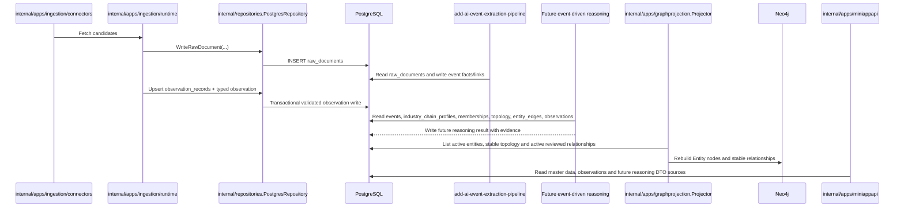
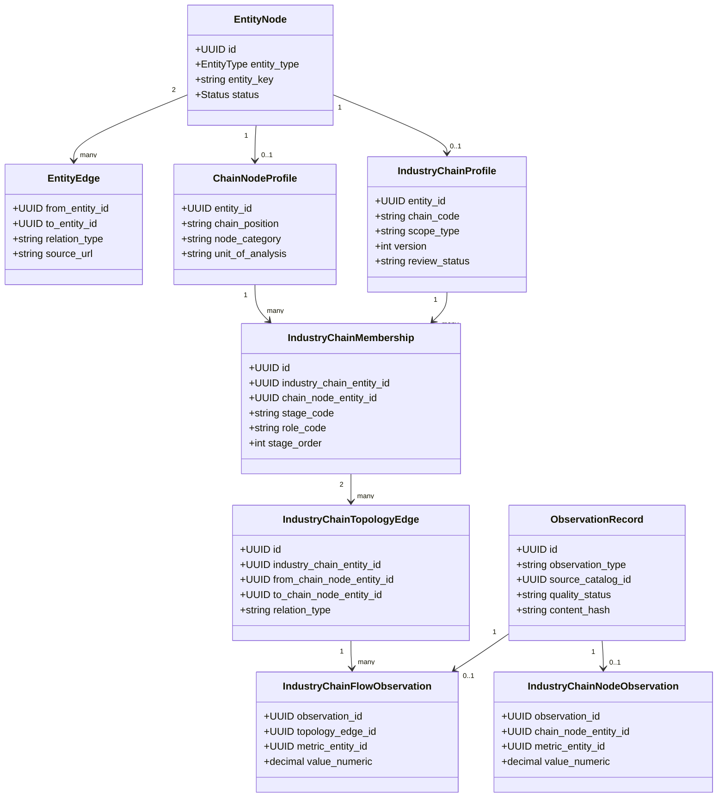

## Context

当前 `entity_nodes` 已支持 `chain_node`，`chain_node_profiles` 只有 `chain_position`；版本化 seed 中有 33 个节点，但不存在独立产业链、链内成员、链内拓扑和产业链 typed observation。`entity_edges` 已承载带来源的客观跨实体关系，`graphprojection` 只读取 active 实体与 active 端点关系，PostgreSQL 是事实源，Neo4j 是可重建投影。

本设计把 Serenity 方法论的“市场故事 → 系统变化 → 必需部件 → 产业链层级 → 稀缺约束 → 证据 → 风险”转换为数据边界：前四项落到稳定主数据和拓扑；稀缺约束由 typed observation 提供可验证输入；证据进入来源/观测治理；风险与传导结论由后续 event-driven reasoning 动态生成，不固化为主数据。

## Goals / Non-Goals

**Goals:**

- 建立可版本化的 `industry_chain` 主数据，并复用现有 `chain_node` 身份。
- 区分节点全局属性和链内阶段/角色，表达可核验、可审阅的稳定拓扑。
- 用明确方向的客观关系连接产业链、节点与 economy、commodity、benchmark、sector、metric。
- 定义 observation governance envelope 与产业链 typed observation tables，支撑瓶颈分析输入。
- 保持 PostgreSQL 事实源、Neo4j active-only 可重建投影和分层数据写入门禁。
- 为后续事件抽取、推理、API 与小程序展示提供稳定读取契约。

**Non-Goals:**

- 本轮不实现或执行 migration、seed、PG 写入、Neo4j 重建、connector、Agent 推理、API 或 UI。
- 不把五条 MVP 候选直接写入正式 seed；不承诺未经 Review 的 10–20 节点清单。
- 不存储利好利空、影响强度、确定性瓶颈、事件评分、资产预测或投资建议。
- 不修改 `prototype/`、项目外 `doc/`、小程序 change 或 `add-ai-event-extraction-pipeline`。

## Decisions

### 1. 独立产业链实体与链内成员

新增 `EntityTypeIndustryChain = "industry_chain"`，以 `entity_nodes` 保存统一身份，以 `industry_chain_profiles` 保存：

- `entity_id`：引用 `entity_nodes(id)`；
- `chain_code`：稳定业务代码，全局唯一；
- `scope_type`：`global | economy | regional`；
- `primary_economy_entity_id`：仅 economy scope 必填；
- `definition`、`boundary_note`：客观定义和边界；
- `version`：正整数；
- `review_status`：`candidate | reviewed | approved`。

改进 `chain_node_profiles`：保留 `entity_id`、`chain_position` 兼容现有数据，新增 `node_category`、`definition`、`unit_of_analysis`。`chain_position` 仅作为全局默认提示；真正链内阶段与角色进入 `industry_chain_memberships`：

- `id`、`industry_chain_entity_id`、`chain_node_entity_id`；
- `stage_code`：`upstream | midstream | downstream | infrastructure | service`；
- `role_code`：`resource | material | equipment | component | process | product | service | infrastructure`；
- `stage_order`、`is_core`、`source_name`、`source_url`、`verified_at`、`status`；
- 唯一键 `(industry_chain_entity_id, chain_node_entity_id)`。

选择该方案而不是“把产业链名称放进 `chain_node_profiles`”，因为同一节点可以参与多条链且角色不同；也不为每条链复制节点，避免平行身份和跨链去重失败。

### 2. 稳定拓扑使用专用表，跨实体关系继续使用 `entity_edges`

新增 `industry_chain_topology_edges`：

- `id`、`industry_chain_entity_id`、`from_chain_node_entity_id`、`to_chain_node_entity_id`；
- `relation_type`：`upstream_of | input_to | output_to | depends_on | substitutes_for | bottleneck_candidate_for`；
- `evidence_note`、`source_name`、`source_url`、`verified_at`、`status`、时间戳；
- 禁止自环，并以 `(industry_chain_entity_id, from_chain_node_entity_id, relation_type, to_chain_node_entity_id)` 保证唯一；两端必须是该链 active membership。

`bottleneck_candidate_for` 只表达经 Review 的结构性稀缺约束候选，不代表当前发生瓶颈；“当前瓶颈、严重度、受益承压、传导强度”只能由 observation + event-driven reasoning 动态产生。

跨实体关系仍使用 `entity_edges` 与现有 provenance：

| relation_type | 方向 | 客观语义 |
|---|---|---|
| `scoped_to_economy` | industry_chain → economy | 产业链定义范围 |
| `uses_commodity` | chain_node → commodity | 节点投入商品 |
| `produces_commodity` | chain_node → commodity | 节点产出商品 |
| `observed_by_benchmark` | chain_node/industry_chain → benchmark | 可观测 benchmark |
| `represented_by_sector` | chain_node/industry_chain → sector | 中国或指定市场板块的客观映射 |
| `measured_by` | chain_node/industry_chain/topology projection owner → metric | 适用指标定义 |

全球 benchmark 的路径是 `benchmark ← observed_by — chain/node — represented_by → 中国 sector`。海外 `market` 只能 `covers_sector` 其自身客观覆盖范围，不得为了传导查询而 `COVERS_SECTOR` 中国板块。

选择专用拓扑表而非全部复用 `entity_edges`，因为拓扑必须带 chain scope、成员约束与链内唯一性；跨实体继续复用 `entity_edges`，避免新建平行关系治理体系。

### 3. Observation governance envelope + typed tables

新增通用 `observation_records` 作为治理 envelope，而不是万能数值表：

- `id`、`observation_type`、`source_catalog_id`、`source_external_id`；
- `observed_at`、`published_at`、`collected_at`；
- `source_name`、`source_url`、`quality_status` (`pending | validated | rejected | superseded`)；
- `revision`、`content_hash`、`raw_document_id`、时间戳；
- 幂等键 `(observation_type, source_catalog_id, source_external_id, observed_at, revision)`。

领域值只进入 typed tables：

- `industry_chain_node_observations`：`observation_id`、`industry_chain_entity_id`、`chain_node_entity_id`、`metric_entity_id`、`value_numeric`、`unit`、`period_start`、`period_end`；用于产能、产量、库存、利用率、交期、价格等已建模 metric。
- `industry_chain_flow_observations`：`observation_id`、`topology_edge_id`、`metric_entity_id`、`value_numeric`、`unit`、`period_start`、`period_end`；用于贸易量、投入量、产出量或依赖流量。

不使用 `attribute_name/value_text` 万能 EAV。第一版 connector 范围只允许复用 ingestion 的 `source_catalogs → raw_documents → parser/validator → typed observation writer` 契约；实际 provider/connector 清单、授权和频率必须在后续采集 change 中逐项批准。无明确 metric、单位、时间窗口或来源的观察不得写入 validated 状态。

### 4. MVP 候选与节点粒度规则

Review 候选：AI 算力基础设施、半导体制造、机器人、新能源汽车/储能、创新药/生物制造。选择规则：

1. 全球宏观/政策/科技事件频率高，存在可解释的跨经济体传导；
2. 至少有一类权威 commodity、benchmark 或 metric observation；
3. 能客观映射到中国 canonical sector，但不依赖错误 market coverage；
4. 节点可保持 10–20 个可辨识的“资源/材料/设备/部件/工艺/产品/服务”单元；
5. 五链去重后目标约 60–90 个节点，复用现有 33 个节点，新增节点必须有定义、粒度和来源；
6. 至少存在一个可由动态 observation 验证的稀缺约束候选；
7. 不以短期热点、单家公司、单个证券或推理结论作为稳定节点。

五条链的最终范围、每链节点、复用/新增清单、拓扑和跨实体关系都必须作为单独 Review 清单；批准后仍按 `Review → Write → Rebuild → Query` 逐层执行。

### 5. 事件、推理与展示契约

- 事件抽取只产出事件事实、证据和实体链接候选，不修改产业链主数据或稳定拓扑。
- event-driven reasoning 读取 active chain/topology、validated observations、事件证据、benchmark/commodity/metric 与 sector 映射，产出带证据、时点和不确定性的动态分析结果。
- 瓶颈分析输入包含：链/节点/边身份、metric、值、单位、观察期、来源、质量状态；输出必须进入后续独立推理 schema，不回写 topology 的 `relation_type` 或主数据字段。
- 后续 API DTO 必须区分 `master_data`、`observation`、`reasoning_result`，小程序只通过服务端 API 展示；AI 内容必须明确为市场理解与决策辅助，不得表达为直接投资建议。

### 6. 真实模块与数据流

### 7. TDD 与验证

Apply 必须按 RED → GREEN → REFACTOR：先写 migration 静态测试、domain/profile validator table tests、seed fixture/relationship policy tests、memory/postgres repository tests、graph mapping/projector tests，再写生产实现。数据库测试使用 SQL/migration 静态验证和明确标记的本地 PostgreSQL integration；connector 契约使用 fixture/fake，不访问真实网络。最终运行目标包测试、`go test ./...`、`openspec validate add-industry-chain-node-foundation`、`git diff --check`。

## Risks / Trade-offs

- [链内专用拓扑与 `entity_edges` 两种关系存储增加理解成本] → 以“是否需要 chain scope/membership constraint”为唯一分界，并在 repository DTO 中分开命名。
- [33 个旧节点粒度不一致] → 保留稳定 key，先通过 candidate review 标记复用、改名、拆分或新增，不在 migration 隐式改写身份。
- [五条链可能超过单 change 可审阅规模] → 结构实现与 seed 写入分层；如候选超过 90 个去重节点或来源不足，Apply 前拆出后续 seed change。
- [结构性瓶颈候选被误读为当前结论] → 枚举命名为 `bottleneck_candidate_for`，动态结论只能来自带时点的 reasoning result。
- [通用 envelope 过早抽象] → envelope 只保留 provenance/quality/idempotency，共有业务值全部留在 typed tables。
- [Neo4j 与 PostgreSQL 漂移] → 只允许从 PG rebuild，投影 active/approved 定义与 active reviewed relationships，不直接写 Neo4j。

## Migration Plan

1. 追加非破坏性 migration，创建 profile、membership、topology、observation tables 和约束；不执行 migration。
2. TDD 扩展 domain、loader、repository、relationship policy 与 graph projection source/mapping。
3. 生成候选 Review 清单，先确认链范围和节点粒度，再确认拓扑与跨实体关系。
4. 经单独 stateful 批准后依次执行 schema migration、master seed、topology/relationship write、Neo4j rebuild、query 验收；每层均按 `Review → Write → Rebuild → Query`。
5. 回滚优先停用新增 seed/关系并停止消费；DDL down migration 仅在确认 typed observation 和引用为空时删除新增表。已有 `entity_nodes`、`entity_edges`、旧 `chain_node` 与其他业务数据不得清空或重建。

## Open Questions

- 五条候选是否全部进入首批，还是先批准其中 2–3 条以控制 Review 规模？
- 节点粒度是否以可独立观测和可映射 sector 为硬门槛，还是允许少量纯工艺节点？
- `bottleneck_candidate_for` 是否保留为稳定拓扑枚举，或只由 observation/reasoning 产生候选？
- 首批允许哪些 `represented_by_sector`、`observed_by_benchmark` 与 commodity/metric 关系？
- typed observation 首批只实现 node metric，还是同时实现 topology flow？
- 首批正式 seed、migration apply、关系写入与 Neo4j rebuild 必须分别取得哪一批次的 stateful 明确批准？
