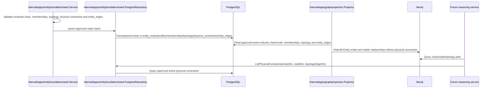
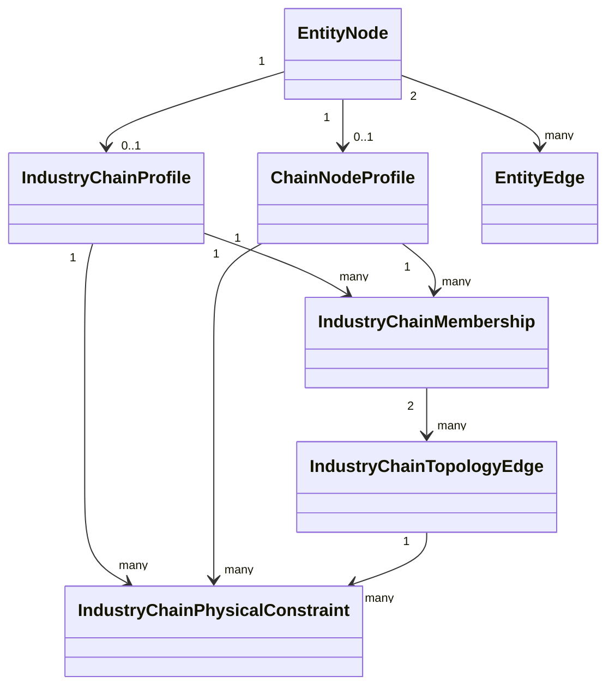
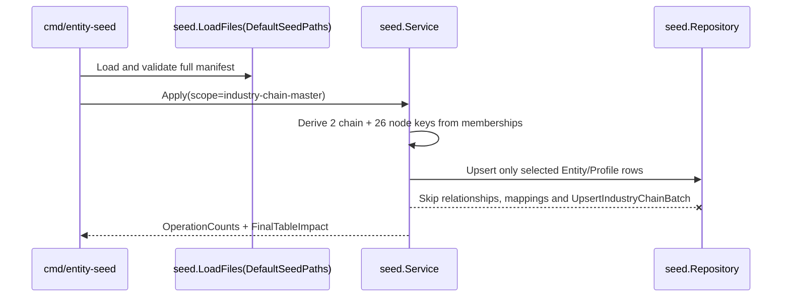

## Context

当前 `entity_nodes` 已支持 33 个扁平 `chain_node`，`chain_node_profiles` 只有 `chain_position`；不存在独立产业链、链内 membership、稳定拓扑和物理约束。`entity_edges` 已承载带来源的客观跨实体关系，graph projection 只读取 active PostgreSQL 事实并重建 Neo4j。

Serenity 的公开方法论提供“市场故事 → 系统变化 → 必需部件 → 产业链层级 → 稀缺约束 → 证据 → 风险”的识别启发，但不是数据库 schema。本 change 只吸收其中可预定义、相对稳定、可由技术证据核验的物理/工程机制；市场结构、认证、监管、融资、当前严重度、评分和投研结论不进入静态基础。

上一版把产业链 metric catalog、binding、通用 observation governance 和 typed observation writer 一并纳入，导致所有权与写状态过大。Review 决定将这些能力整体拆到后续 `add-industry-chain-observation-foundation`。

## Goals / Non-Goals

**Goals:**

- 建立 4 张新静态核心表并增量改进 `chain_node_profiles`。
- 复用统一实体身份、客观跨实体关系与 PostgreSQL 事实源。
- 以最小、方向明确的 topology 表达可复用产业链骨架。
- 只保存经权威技术证据和人工 Review 批准的物理约束机制。
- 用两条试点验证共享节点、多链 membership、拓扑复用、物理约束和全球 benchmark 到中国 sector 路径。

**Non-Goals:**

- 不设计或实现任何 observation、metric definition/binding、revision、quality、idempotency 或 ingestion observation writer。
- 不保存 supplier concentration、qualification、know-how、regulation、substitution difficulty、融资或其他非物理约束。
- 不保存当前瓶颈严重度、score、受益承压、利好利空、预测或投资建议。
- 不实现事件抽取、reasoning result、API 或 UI。Propose 阶段不执行数据库或 Neo4j 有状态操作；Apply 阶段只有逐层取得用户明确授权后，才执行 migration、seed/write、Neo4j rebuild 和 query。
- 机器人、新能源汽车/储能、创新药/生物制造不进入本 change seed。

## Decisions

### 1. 静态模型只包含 4 张新表 + 1 张 profile 扩展

#### 1.1 `industry_chain_profiles`

| 字段 | 类型 | 约束 | 语义 |
|---|---|---|---|
| `entity_id` | UUID | PK, FK → `entity_nodes(id)` | 必须为 `entity_type=industry_chain` |
| `chain_code` | VARCHAR(96) | NOT NULL, UNIQUE | 稳定代码 |
| `definition` | TEXT | NOT NULL | 客观定义 |
| `boundary_note` | TEXT | NOT NULL DEFAULT '' | 纳入/排除边界 |
| `scope_type` | VARCHAR(32) | CHECK `global/economy/regional` | 地理范围 |
| `primary_economy_entity_id` | UUID | nullable FK | economy scope 必填且必须为 economy |
| `version` | INTEGER | NOT NULL CHECK > 0 | 定义版本 |
| `review_status` | VARCHAR(32) | CHECK `candidate/reviewed/approved` | 人工 Review 状态 |
| `source_name` | TEXT | NOT NULL | 定义来源 |
| `source_url` | TEXT | NOT NULL | 来源 URL |
| `verified_at` | TIMESTAMPTZ | NOT NULL | 核验时间 |

只有 `entity_nodes.status=active` 且 `review_status=approved` 才可进入正式投影和推理输入。

#### 1.2 `chain_node_profiles` 增量

| 字段 | 类型 | 约束 | 语义 |
|---|---|---|---|
| `entity_id` | UUID | 既有 PK/FK | 既有 chain node 身份 |
| `chain_position` | VARCHAR(64) | 既有 NOT NULL | 兼容字段，仅作全局默认提示 |
| `node_category` | VARCHAR(64) | NOT NULL DEFAULT '' | resource/material/equipment/component/process/product/service/infrastructure |
| `definition` | TEXT | NOT NULL DEFAULT '' | 节点定义 |
| `unit_of_analysis` | VARCHAR(64) | NOT NULL DEFAULT '' | material/process/equipment/component/system/service |
| `granularity_note` | TEXT | NOT NULL DEFAULT '' | 粒度依据 |

链内阶段、角色和顺序不得放入 profile。

#### 1.3 `industry_chain_memberships`

| 字段 | 类型 | 约束 | 语义 |
|---|---|---|---|
| `id` | UUID | PK | membership 身份 |
| `industry_chain_entity_id` | UUID | FK | 必须为 industry_chain |
| `chain_node_entity_id` | UUID | FK | 必须为 chain_node |
| `stage_code` | VARCHAR(32) | CHECK `upstream/midstream/downstream/infrastructure/service` | 链内阶段 |
| `role_code` | VARCHAR(32) | CHECK `resource/material/equipment/component/process/product/service/infrastructure` | 链内角色 |
| `stage_order` | INTEGER | CHECK >= 0 | 稳定展示顺序，不表达重要性 |
| `is_core` | BOOLEAN | NOT NULL DEFAULT false | 是否为链定义核心节点 |
| `source_name/source_url` | TEXT | NOT NULL | membership 来源 |
| `verified_at` | TIMESTAMPTZ | NOT NULL | 核验时间 |
| `status` | VARCHAR(32) | CHECK `active/inactive` | 生命周期 |
| `created_at/updated_at` | TIMESTAMPTZ | NOT NULL | 审计时间 |

唯一键 `(industry_chain_entity_id, chain_node_entity_id)`；索引 `(industry_chain_entity_id, status, stage_order)`。

#### 1.4 `industry_chain_topology_edges`

| 字段 | 类型 | 约束 | 语义 |
|---|---|---|---|
| `id` | UUID | PK | 稳定链内边 |
| `industry_chain_entity_id` | UUID | FK | chain scope |
| `from_chain_node_entity_id` | UUID | FK | 起点，必须为同链 active membership |
| `to_chain_node_entity_id` | UUID | FK | 终点，必须为同链 active membership |
| `relation_type` | VARCHAR(32) | CHECK `supplies_to/depends_on/substitutes_for` | 最小拓扑语义 |
| `evidence_note` | TEXT | NOT NULL DEFAULT '' | 客观说明 |
| `source_name/source_url` | TEXT | NOT NULL | 来源 |
| `verified_at` | TIMESTAMPTZ | NOT NULL | 核验时间 |
| `status` | VARCHAR(32) | CHECK `active/inactive` | 生命周期 |
| `created_at/updated_at` | TIMESTAMPTZ | NOT NULL | 审计时间 |

方向与规则：

- `supplies_to`: `from` 向 `to` 提供部件、材料、设备能力或服务。例如“先进封装 → AI 加速器系统”。
- `depends_on`: `from` 的正常运行依赖 `to`，用于无法自然表达为直接供给的功能/基础设施依赖。例如“数据中心 → 电力基础设施”。
- `substitutes_for`: `from` 可替代 `to` 的相同功能位置；MVP 保存单向证据事实，不自动补反向边。
- 同一业务事实只保留一条 canonical edge：直接供应事实使用 supplier → receiver 的 `supplies_to`；功能或基础设施依赖且不能自然表达为直接供应时，使用 dependent → dependency 的 `depends_on`。不得用反向 `depends_on` 重复表达同一 `supplies_to`；只有独立证据证明两种不同机制时才允许两类边共存。
- `substitutes_for` 不得与同方向 `supplies_to` 或 `depends_on` 共存。
- 商品投入/产出不进入 topology，继续使用 `chain_node → commodity` 的 `uses_commodity` / `produces_commodity`。

唯一键 `(industry_chain_entity_id, from_chain_node_entity_id, relation_type, to_chain_node_entity_id)`；禁止自环。

#### 1.5 `industry_chain_physical_constraints`

| 字段 | 类型 | 约束 | 语义 |
|---|---|---|---|
| `id` | UUID | PK | 物理约束定义身份 |
| `industry_chain_entity_id` | UUID | NOT NULL FK | 所属链 |
| `chain_node_entity_id` | UUID | nullable FK | 节点对象 |
| `topology_edge_id` | UUID | nullable FK | 拓扑边对象 |
| `constraint_type` | VARCHAR(48) | 13 类 CHECK | Tidewise 物理约束枚举 |
| `mechanism` | TEXT | NOT NULL | 约束形成的物理/工程机制 |
| `physical_limit_note` | TEXT | NOT NULL DEFAULT '' | 可核验的物理极限或工程边界 |
| `mitigation_path` | TEXT | NOT NULL DEFAULT '' | 已知物理缓解/扩容路径 |
| `source_name/source_url` | TEXT | NOT NULL | 权威技术证据 provenance |
| `verified_at` | TIMESTAMPTZ | NOT NULL | 核验时间 |
| `review_status` | VARCHAR(32) | CHECK `candidate/reviewed/approved` | AI 只能生成 candidate，人工批准后才为事实 |
| `generated_by_ai` | BOOLEAN | NOT NULL DEFAULT false | 来源/provenance 标记；表示候选是否由 AI 生成，不是 Review 结果，人工批准后仍保持 true |
| `status` | VARCHAR(32) | CHECK `active/inactive` | 生命周期 |
| `created_at/updated_at` | TIMESTAMPTZ | NOT NULL | 审计时间 |

节点与 topology edge 必须恰好一个非空且属于同一产业链。首批枚举：

`power_capacity`、`thermal_dissipation`、`bandwidth`、`latency`、`production_capacity`、`process_yield`、`material_purity`、`reliability`、`process_cycle_time`、`packaging_density`、`equipment_capacity`、`infrastructure_access`、`physical_expansion_cycle`。

`physical_expansion_cycle` 只包含物理建设、安装、调试和产能爬坡时间，不含审批、融资或市场周期。上层可解释为能源与基础设施、传输与时延、制造与良率、材料与工艺、可靠性与密度、扩容与接入六类概念，但 MVP 不新增 category 表。

AI/Agent 只能生成 candidate；缺少权威技术来源或人工 Review 的 candidate 不得进入 approved、正式 seed 或推理事实输入。`ApprovedByHuman` / `IndustryChainApprovalGate` 只存在于 seed/write 执行上下文，用于证明本次 approved 写入已取得显式人工授权，不持久化为物理约束事实字段，也不替代 `review_status`。`review_status=approved` 仍由人工 Review 流程决定；人工批准 AI candidate 后必须保留 `generated_by_ai=true`，不得通过改写为 false 绕过门禁。物理约束以 PostgreSQL 为唯一事实源，本 change 不将其投影到 Neo4j。

### 2. 跨实体关系复用 `entity_edges`

MVP 只扩展确有用途的客观关系：

| relation_type | 方向 | 语义 |
|---|---|---|
| `scoped_to_economy` | industry_chain → economy | economy/regional chain 的客观范围 |
| `uses_commodity` | chain_node → commodity | 节点物理投入商品 |
| `produces_commodity` | chain_node → commodity | 节点物理产出商品 |
| `observed_by_benchmark` | industry_chain/chain_node → benchmark | benchmark 可观测该链/节点 |
| `mapped_to_sector` | industry_chain/chain_node → sector | 经来源审阅的分析映射，不表达身份、法定覆盖或影响方向 |

正式采用 `mapped_to_sector`。该关系必须保存来源并明确只用于分析映射，不表示身份、法定覆盖或影响方向。海外 `market` 不得通过 `covers_sector` 指向中国 sector。

### 3. Observation 与 reasoning 作为后续边界

后续 `add-industry-chain-observation-foundation` 独立决定：

- 通用 observation governance envelope 的所有权；
- 产业链 metric definitions/bindings；
- node/flow typed observation；
- revision、quality、idempotency、ingestion writer 与 repository query；
- 动态严重度和可重算分析 feature。

本 change 只保证静态表为后续 observation 提供稳定 chain/node/topology/physical constraint ID。未来 reasoning 在 Neo4j 完成 chain/node 路径查询后，再由 repository 按 chain/node/topology edge 从 PostgreSQL 补充读取 physical constraints；未来 reasoning result 组合事件、observation 与静态骨架，保存证据、时点、不确定性和证伪条件，不得回写主数据。

### 4. 两条试点

首批仅 AI 算力基础设施、半导体制造，每链约 10–15 节点，去重后约 20–30 节点。选择它们是为了验证：

- GPU、EDA、半导体设备、先进封装、电力/数据中心等共享节点的多链 membership；
- 两条链分别维护 stage/role/order，节点身份不复制；
- `supplies_to`、`depends_on`、`substitutes_for` 的跨链复用；
- 13 类物理约束中的带宽、功率、散热、良率、封装密度、设备产能和物理扩产周期；
- 全球 benchmark 经 chain/node 再到中国 canonical sector 的路径。

机器人、新能源汽车/储能、创新药/生物制造留到第二批，不进入本 change seed。

### 5. 真实模块与投影边界

### 6. TDD 与验证

Apply 必须按 RED → GREEN → REFACTOR：先写 migration 静态测试、domain validator tests、seed fixture/policy tests、Memory/Postgres repository tests、graph source/mapping/projector tests，再写生产实现。普通单元测试不得连接真实网络、生产 PostgreSQL 或真实 Neo4j。最终运行目标包测试、`go test ./...`、OpenSpec validate 和 `git diff --check`。

### 7. Stateful seed 使用显式数据族 scope

Layer 2 preflight 发现默认 `entity-seed` 会在 master 后继续写 membership/topology。为保持逐层授权，现有 command/service 增加显式 `-apply-scope industry-chain-master`：继续通过 `DefaultSeedPaths` 加载并验证统一 manifest，再由 membership endpoints 推导本批2个 chain与26个 node，只把对应 entity/profile 交给现有 repository。该 scope 必须跳过 `UpsertIndustryChainBatch`、relationships、sector mappings、physical constraints 和其他实体数据族；未指定 scope 时保持既有全量行为。

Report 同时保留逐次 repository operation counts，并新增按 table + stable key 去重的 final table impact。前者可包含同一复用 profile 的 inline 与 reviewed override 两次 update，后者才用于数据库最终行级对账。当前只实现 master scope；membership-only/topology-only 沿用同一 scope 枚举扩展点，但必须在对应层 Review 后另行实现和授权。

## Risks / Trade-offs

- [移出 observation 后暂时不能判断当前瓶颈严重度] → 本 change 明确只交付静态骨架，后续 observation change 再提供动态验证。
- [物理约束可能被 AI 误判为事实] → AI 仅生成 candidate，权威技术证据和人工 Review 是 approved 硬门禁。
- [图查询无法直接返回物理约束] → Neo4j 只负责 chain/node 路径；repository 根据路径中的 chain/node/topology edge ID 从 PostgreSQL 批量补充 physical constraints。
- [topology 枚举过少] → 先用三类验证真实查询；商品投入/产出由 entity_edges 补足，新增枚举必须后续 Review。
- [两条链仍可能粒度不一致] → 每链限制 10–15 节点并要求 granularity note，优先复用现有 33 个节点。

## Migration Plan

1. TDD 追加非破坏性 migration，创建 4 张新表并扩展 `chain_node_profiles`；不在未授权时 apply。
2. 扩展 domain、loader、repository、relationship policy 和 graph projection。
3. 逐项 Review 两条链的 master data、membership、topology、physical constraints 和跨实体关系。
4. 各层分别取得 stateful 授权，按 `Review → Write → Rebuild → Query` 执行和验收。
5. 回滚优先停用新增 seed/关系；DDL down 仅在确认新增表无被依赖数据时执行，不清空既有实体或业务表。

## Open Questions

- 两条试点最终节点清单和每链 10–15 节点粒度是否通过 Review？
- 13 类 physical constraint 是否完整且严格排除非物理语义？
- migration、各 seed 层和 Neo4j rebuild 的 stateful 授权批次如何划分？
