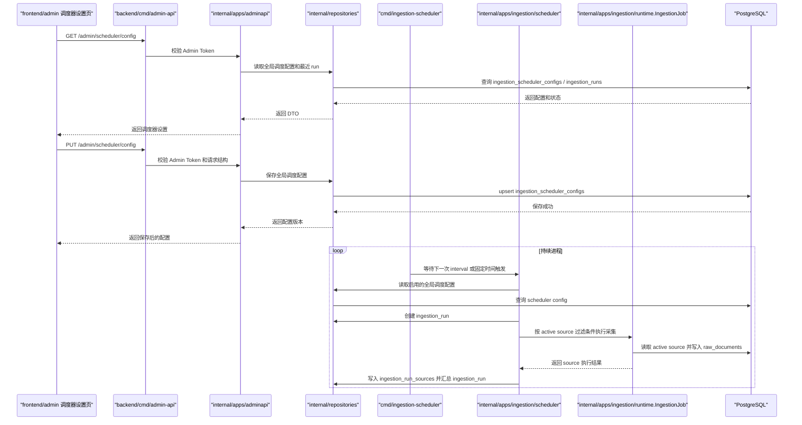
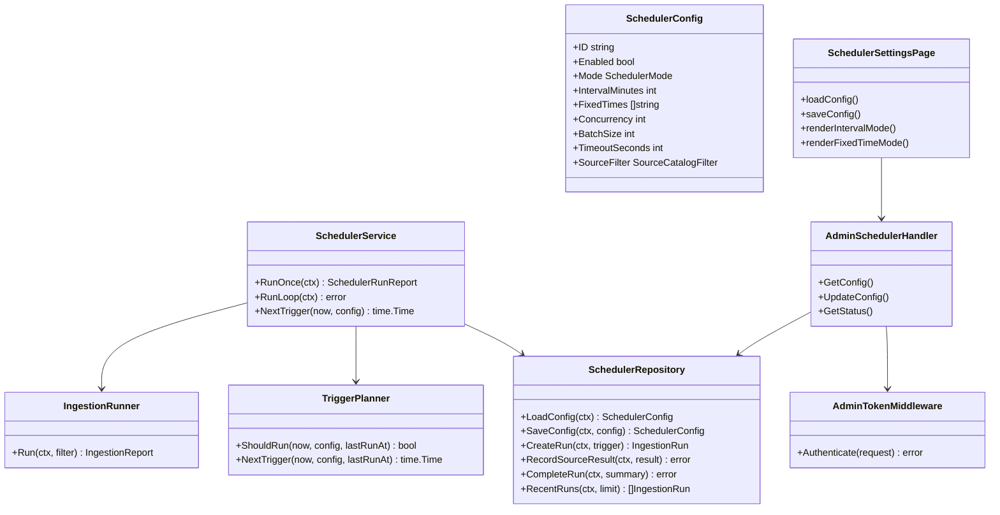

## Context

当前采集运行时已经位于 `backend/internal/apps/ingestion/runtime`，并通过 `IngestionJob` 从 `source_catalogs` 查询 active source，再按 `connector_key`、`parser_key`、凭证解析、provider 限流和并发 worker 执行采集。AI Web Research connector 也已经纳入同一采集运行时。因此，调度器不应再实现一套采集逻辑，而应作为运行时上层的控制面。

本 change 的新增能力分成三层：

- 后端 scheduler：根据全局调度配置决定何时触发采集。
- 后端 admin API：提供调度配置和运行状态的管理接口。
- Web admin：提供独立管理后台，当前只实现调度器设置菜单。

调度器本阶段只负责全局调度策略，不实现 per-source 独立 cron UI。执行时仍然读取 active source，可通过全局过滤条件限定 provider、channel、source type 或 source ID。后续如果需要为每个来源配置独立频率，应通过单独 change 扩展 source schedule state。

## Goals / Non-Goals

**Goals:**

- 新增单进程采集调度器，支持 interval 模式和每日固定时间模式。
- interval 模式支持分钟或小时粒度，持续循环执行。
- 固定时间模式支持至少 5 个每日触发时间，调度器进程驻留等待，到点触发，执行完成后等待下一次触发。
- 新增全局调度配置持久化，支持启停、调度模式、interval、固定时间列表、并发数、batch size、超时、active source 过滤条件和最近运行摘要。
- 新增采集运行记录，记录 run 级和 source 级结果，支持本地验证、后台展示和排障。
- 新增 admin API，通过 Admin Token 鉴权管理调度器配置和查询最近运行状态。
- 新增 `frontend/admin/`，采用 Vite + React + TypeScript + Ant Design，实现“调度器设置”页面。
- 按 TDD 方式先写调度配置、触发计划、run 记录、admin API 和核心 UI 行为测试，再实现生产代码。

**Non-Goals:**

- 不实现每个 source 独立调度频率、独立固定时间或独立启停 UI。
- 不实现分布式锁、多实例抢占、任务队列或外部工作流平台。
- 不实现采集源管理、原始数据列表、事件列表、事件抽取、AI tag、实体关联或图谱写入。
- 不实现 SDK 类 worker、Tushare、AKShare 或 Python sidecar。
- 不新增小程序页面，不修改 `frontend/miniapp/` 功能。
- 不把真实 API key、cookie、token 或私有 URL 密钥写入数据库、repo 或前端源码。

## Architecture

## Decisions

### Decision: 调度器只做全局调度控制

本阶段只实现一份全局调度配置，控制采集系统整体是否启用、何时触发、用什么并发和过滤条件执行。调度器执行时从 `source_catalogs` 读取 active source，并通过全局过滤条件限制范围。

保留 per-source 调度状态作为后续扩展方向，但不在本 change 实现 per-source UI 或 per-source cron。这样可以先验证“持续调度 + active source 并发采集 + run 记录”的闭环，避免把调度系统一次做得过重。

### Decision: 支持 interval 和固定时间两种触发模式

interval 模式用于持续采集场景，例如每 15 分钟或每 2 小时采集一次。固定时间模式用于运营明确的采集窗口，例如每天 09:00、12:00、15:00、18:00、21:00。固定时间不是跑完就退出，而是调度器进程常驻，执行完一次后等待下一次固定时间。

触发计划由 `TriggerPlanner` 纯函数封装，通过 fake clock 单元测试验证跨天、重复时间、未启用、刚启动和上次运行时间等边界。

### Decision: 调度器复用 ingestion runtime

调度器不直接调用 connector、parser 或 writer。单次采集执行统一通过 `internal/apps/ingestion/runtime.IngestionJob` 或等价 runner 接口完成，保持 active source 选择、凭证解析、限流、并发、解析和 raw document 写入语义一致。

如果 `IngestionJob` 当前 report 只包含总成功/失败而不包含 source 级写入统计，本 change 可以在 runtime 中增量扩展 source 级 report，但不得复制采集执行链路。

### Decision: 配置和运行记录保存在 PostgreSQL

新增 `ingestion_scheduler_configs` 保存全局调度配置。新增 `ingestion_runs` 和 `ingestion_run_sources` 保存每轮调度和每个 source 的执行结果。配置表只保存非敏感运行参数，真实 API key、Admin Token、模型 key、搜索 API key 仍通过环境变量或部署平台 secret 注入。

run 记录用于回答“调度器是否运行过、跑了哪些 source、成功失败多少、哪里失败、耗时多久”，不能只依赖进程日志。

### Decision: 管理后台采用独立 Web admin

新增 `frontend/admin/`，采用 Vite + React + TypeScript + Ant Design。它是独立 Web 后台，不属于小程序端，不进入 `frontend/miniapp/`。本阶段只有一个一级菜单“调度器设置”，后续可以扩展采集源管理、原始数据列表和事件列表。

Admin 前端不保存真实后端 secret。MVP 可让用户在页面输入 Admin Token 并保存到浏览器 localStorage；请求时放入 `Authorization: Bearer <token>`。后续正式账号体系通过独立 change 实现。

### Decision: admin API 使用 Admin Token 鉴权

后端通过环境变量 `ADMIN_API_TOKEN` 注入管理后台 token。`backend/cmd/admin-api` 或既有 admin API 入口必须在管理接口前校验 `Authorization: Bearer <token>`。缺失、错误或未配置 token 时必须拒绝访问，并且不得把 token 写入日志、数据库或响应体。

## API Contract Draft

本 change 的 admin API 只面向管理后台，MVP 契约如下：

- `GET /admin/scheduler/config`：查询全局调度配置、最近运行摘要和当前启用状态。
- `PUT /admin/scheduler/config`：保存全局调度配置。
- `GET /admin/scheduler/runs?limit=20`：查询最近调度运行记录。

核心请求字段：

- `enabled`：是否启用调度。
- `mode`：`interval` 或 `fixed_times`。
- `interval_minutes`：interval 模式的分钟数，支持分钟和小时折算。
- `fixed_times`：固定时间列表，格式为 `HH:mm`，至少支持 5 个。
- `concurrency`：采集并发数。
- `batch_size`：单轮最多处理 source 数。
- `timeout_seconds`：单轮采集超时。
- `source_filter`：可选过滤条件，包含 `provider_key`、`ingest_channel`、`source_type`、`source_id`。

## Testing Strategy

- `TriggerPlanner` 使用 table-driven tests 覆盖 interval、固定时间、跨天、禁用状态和非法配置。
- `SchedulerService` 使用 fake repository、fake runner 和 fake clock 覆盖无配置、未启用、成功执行、失败隔离、run 记录完成和下一次触发计算。
- repository 使用内存实现单元测试和 PostgreSQL gated 集成测试覆盖配置 upsert、run 记录、source 结果和非破坏性 migration。
- admin API 使用 `httptest` 覆盖 token 缺失、token 错误、查询配置、保存配置、非法固定时间和非法并发。
- admin 前端使用 Vitest 或项目可用的轻量测试方式覆盖表单状态转换、固定时间条目限制、保存请求和 token header 注入。
- change 完成前必须运行 `go test ./...`、admin 前端测试、`openspec validate add-ingestion-scheduler` 和必要本地 smoke。

## Risks / Trade-offs

- [Risk] 单进程调度器未来无法支持多实例高可用。→ Mitigation：本 change 明确 MVP 单进程边界，后续通过独立 change 设计数据库锁、Redis 锁或任务队列。
- [Risk] 自动采集放大外部访问压力。→ Mitigation：默认调度关闭；并发、batch size、timeout 和 source filter 可配置；继续复用 provider rate limiter。
- [Risk] 固定时间模式在进程重启时错过触发窗口。→ Mitigation：MVP 只保证进程运行期间按固定时间触发；补偿调度通过后续 change 设计。
- [Risk] Admin Token 不是完整账号体系。→ Mitigation：MVP 只用于本地和早期受控后台；正式用户、角色和审计通过独立 auth change 实现。
- [Risk] admin 前端引入独立依赖。→ Mitigation：放在 `frontend/admin/` 独立 package，不影响 `frontend/miniapp/`。

## Migration Plan

1. 新增非破坏性 migration，创建 `ingestion_scheduler_configs`、`ingestion_runs`、`ingestion_run_sources`。
2. 扩展 repository 接口和实现，支持调度配置、run 创建、source 结果写入和 run 汇总。
3. 在 `internal/apps/ingestion/scheduler` 新增 trigger planner 和 scheduler service。
4. 新增 `backend/cmd/ingestion-scheduler`，支持单轮运行和持续 loop。
5. 新增或扩展 `backend/cmd/admin-api` 和 `internal/apps/adminapi`，提供 scheduler admin API。
6. 新增 `frontend/admin/`，实现调度器设置页面。
7. 更新 `infra/local/README.md`，补充本地启动 admin API、admin 前端、scheduler 进程和验证 SQL。

回滚策略：如果调度器不可用，可以停止 `cmd/ingestion-scheduler` 进程，继续使用 `source-ingest` 手动采集；新增调度配置和 run 表可保留，不影响已有 `source_catalogs` 和 `raw_documents`。

## Open Questions

- 固定时间使用哪个时区？默认使用后端配置的应用时区，local 使用 `Asia/Shanghai`，并在 admin UI 中明确展示。
- 本 change 是否需要实际启动 admin 前端 dev server 做视觉检查？实现阶段应至少本地启动一次验证页面可访问；如果依赖安装受限，需要明确说明。
