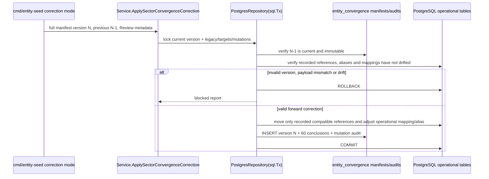
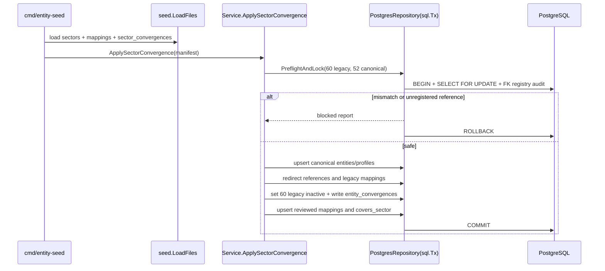
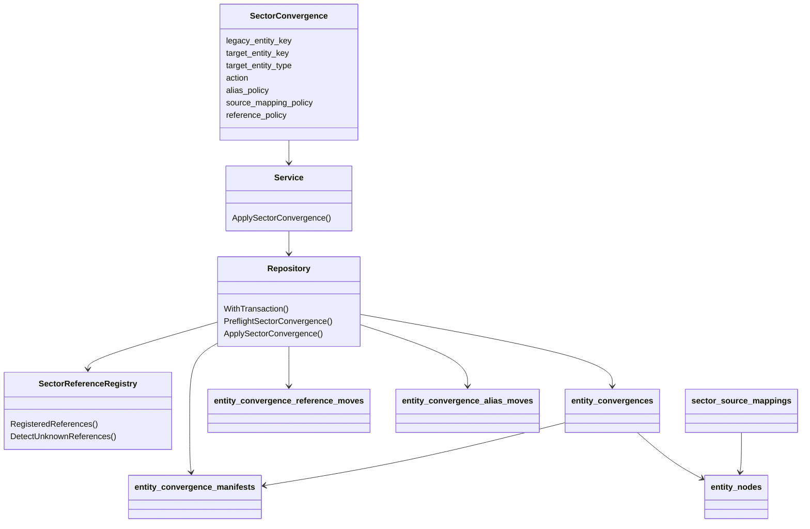
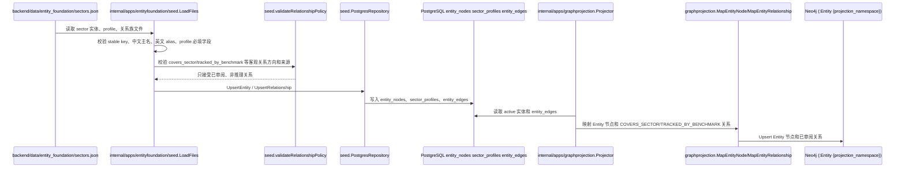
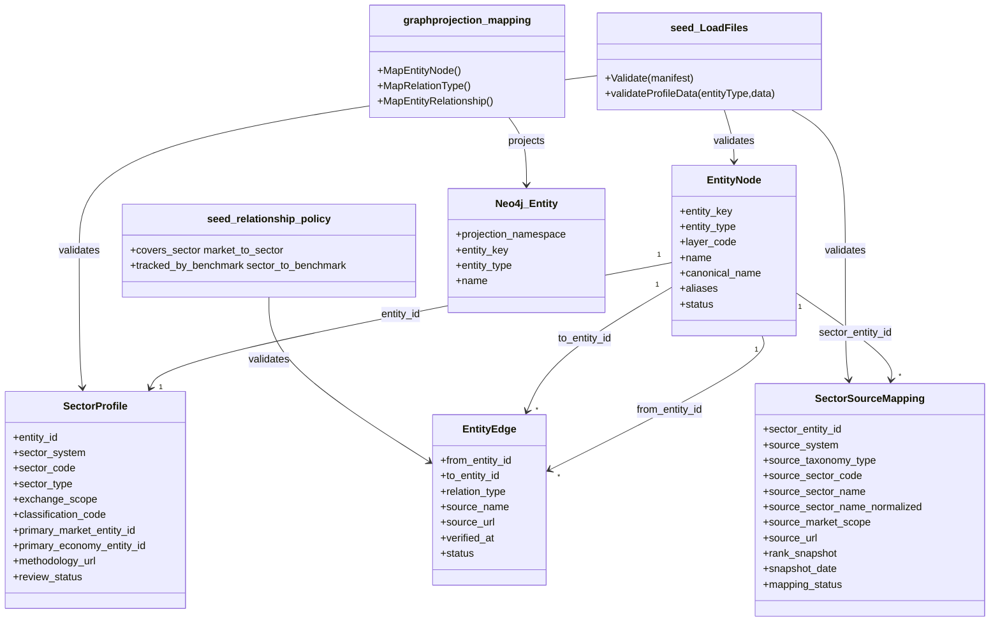

## Context

当前系统已经具备统一实体表 `entity_nodes`、类型 profile 表、实体关系表 `entity_edges`、实体基础库 seed 命令和 PostgreSQL 到 Neo4j 的实体图投影。`sector` 已存在于 `domain.EntityTypeSector`、`sector_profiles`、`backend/data/entity_foundation/sectors.json` 和 seed loader 中；当前 `sectors.json` 包含 60 个板块，按 `concept`、`industry`、`index` 各 20 个初始化，字段包括 `sector_system`、`sector_code`、`sector_type`、`exchange_scope`、`rank_snapshot` 和 `snapshot_date`。

现有状态适合初始化“行情源板块快照”，但还不足以作为事件驱动投研的长期板块基础层：

- `sector_type=index` 容易与正式 `index` 实体混淆；但用户已澄清同花顺“指数板块”示例是“半导体材料设备”“卫星产业”这类板块，不是上证指数、VIX 或国债收益率这类宏观 benchmark，因此它们仍应允许映射为 `sector`。
- `exchange_scope` 只能粗略表达市场范围，不能明确连接到 `market:a_share`、`market:hk_stock`、`market:us_stock` 等既有市场实体。
- 现有关系策略没有允许 `market -> sector`、`sector -> benchmark` 或 `sector -> chain_node` 的客观关系。
- 事件推理后续会需要“事件影响到哪些板块”，但本 change 不能把推理结论、涨跌预测或股票推荐写入基础 seed。

用户已确认以同花顺作为候选池来源，概念板块、行业板块、指数板块三个来源分类各取 Top 20，形成约 60 个原始候选，用于事件推理 MVP。三类都属于 `sector` 候选，Top 仅用于候选生成，不是永久主数据属性；同花顺的“概念板块/行业板块/指数板块”是 external/source taxonomy，观潮家的语义板块是 semantic sector，benchmark 是 market benchmark，三层必须拆开建模。

本设计在 Propose 阶段形成，并已按用户逐阶段批准完成对应源码、migration 文件和 seed 实现；PostgreSQL 仍是事实源，local 已应用 migration `000010`，但尚未执行正式 seed 写入或 Neo4j 投影。

## Goals / Non-Goals

**Goals:**

- 建立 `market-sector-foundation` 能力，定义市场板块实体的分类法、稳定标识、命名规则、关系边界和可验证完成标准。
- 复用既有 `entity_nodes`、`sector_profiles`、`entity_edges`、`backend/data/entity_foundation/sectors.json`、`backend/internal/apps/entityfoundation/seed`、`backend/internal/apps/graphprojection`。
- 明确第一版语义板块分类：`market_sector`、`theme_sector`、`industry_sector`、`style_sector`、`region_sector`。`index_sector` 只作为 external/source taxonomy，表示来源入口是指数板块；它不是观潮家的 semantic sector 类型。
- 明确三层概念：external/source taxonomy 保存来源系统分类，例如 `concept`、`industry`、`index_sector`；semantic sector 表达可被事件影响的产业/主题暴露；market benchmark 表达用于量化验证的可观测行情标尺。
- 定义候选准入策略：Top 排名只保存为来源快照，长期入选必须通过事件可映射性、传导差异、稳定性、市场覆盖、数据可获得性和重叠度筛选。
- 给出 MVP 候选策略：同花顺概念板块、行业板块、指数板块各 Top 20 均进入 Review 候选池，总量约 60 个；筛选重点是去重、交叉关系和职责判别，而不是预先削减 `index_sector` 配额。
- 采纳 MVP 候选评估策略：按事件可解释性 25、传导独立性 20、行情敏感度 15、数据完整性 15、长期稳定性 15、市场代表性 10 评分，原则上 70 分以上进入 MVP。
- 明确最终正式 sector 规模约 50-60 个，覆盖金融地产、能源电力、有色化工材料、工业基建、半导体电子、AI 软件通信、汽车新能源、医药生科、消费农业、交通公用、国防航天卫星、政策主题等传导簇。
- 明确运行分层：核心约 30、扩展约 20、观察约 10，用于推理调度优先级或 Review 工作流，不作为实体身份、稳定 key 或不可变主数据属性。
- 为后续实现定义关系草案：`market -> covers_sector -> sector`、`sector -> tracked_by_benchmark -> benchmark`、`sector -> maps_to_chain_node -> chain_node`。其中第一版推荐实现 `covers_sector` 和必要的 `tracked_by_benchmark` policy/mapping；`maps_to_chain_node` 进入后续人工 review。
- 明确 PG/Neo4j 边界：PostgreSQL 是板块实体、profile 和关系事实源；Neo4j 只投影已审阅 active 实体关系；板块行情时序、事件推理结果、传导强度和推荐内容不进入实体基础图。
- 定义 TDD 策略：实现阶段先补 seed loader/relationship policy/migration/projection tests，再修改生产代码，并以 `go test ./...` 作为最终验证。

**Non-Goals:**

- 不实现板块行情时序、涨跌幅、热度排名、资金流、成分股调仓历史或实时行情采集。
- 不实现具体股票推荐、买卖建议、目标价、仓位建议或投资组合生成。
- 不实现事件抽取、事件到板块的影响评分、传导强度、受益承压判断或 Agent 编排。
- 不建立新的图数据库事实源，不让采集 connector 或前端直接写 Neo4j。
- 不新增小程序页面、管理后台页面、API 契约或前端展示模型。
- 不修改 `prototype` 或上级 `doc`。

## Decisions

### Decision 1: 复用 `sector` 实体和 `sector_profiles`，不新增平行实体类型

推荐方案：继续使用 `entity_nodes.entity_type='sector'` 和 `sector_profiles`。后续 implementation 通过增量 migration 扩展 `sector_profiles`，补充可长期使用的字段：

- `classification_code`：内部标准化语义分类代码，例如 `theme_sector`、`industry_sector`、`market_sector`、`style_sector`、`region_sector`。不得使用 `index_sector` 作为 semantic classification。
- `primary_market_entity_id`：主要市场范围，引用 `entity_nodes` 中的 `market`。
- `primary_economy_entity_id`：主要经济体范围，引用 `entity_nodes` 中的 `economy`，允许全球类板块为空。
- `methodology_url`：分类方法或来源说明 URL。
- `review_status`：`candidate`、`approved`、`rejected`。
- `selection_score` 和评分分项不建议进入长期 `sector_profiles` 作为实体身份字段；如实现阶段确需保存，应放入候选 Review 文件、source snapshot 或单独评估记录，避免把动态评估固化为主数据本体。
- `runtime_tier` 不建议作为第一版主数据硬字段；核心、扩展、观察分层更适合作为推理调度配置或 Review 状态视图。

备选方案 A：新增 `market_sector_profiles` 表。优点是语义更窄，缺点是与已有 `sector_profiles`、loader、seed、repository、projection 形成平行结构。

备选方案 B：把板块全部建成 `index` 或 `chain_node`。优点是少建字段，缺点是概念错误：板块不是正式指数，也不是产业链环节。

取舍：选择复用现有 profile，避免平行设计，并通过字段和校验收紧语义。

### Decision 2: canonical 主数据 key 与 source mapping identity 分离

canonical sector 的 `entity_key` MUST 尽量来源无关，避免多来源合并或替换来源时迫使主实体改 key。推荐格式：

```text
sector:<semantic_classification>_<canonical_slug>
```

示例：

- `sector:theme_ai`
- `sector:industry_semiconductor_materials_equipment`
- `sector:theme_satellite_industry`
- `sector:theme_energy_transition`

source mapping identity 使用单独结构表达，推荐格式为：

```text
sector_source_mapping:<sector_key>:<source_system>:<source_taxonomy_type>:<source_sector_code_or_slug>
```

示例：

- `sector_source_mapping:sector:theme_ai:ths:concept:885728`
- `sector_source_mapping:sector:industry_semiconductor_materials_equipment:ths:index_sector:semiconductor_materials_equipment`

迁移旧数据时，不应批量删除现有 key；应通过审阅后的前向迁移或 seed 更新把 `sector:ths_concept_ai` 等旧 source-bound key 标记为兼容别名、source mapping 或 `merged` 旧实体，并把下游引用迁移到 canonical key。任何 key 更名都必须保留可审计映射，避免 Neo4j、事件链接和审计记录断裂。

### Decision 2.5: 多来源映射使用 `sector_source_mappings`

第一版固定使用新增 `sector_source_mappings` 作为 canonical sector 与外部来源分类/代码的结构化承载，不再把多个来源压进 `sector_profiles` 单值字段或 aliases。

建议字段：

- `id`：UUID 主键，由 mapping key 稳定生成。
- `sector_entity_id`：引用 canonical `entity_nodes.id`，必须为 `entity_type=sector`。
- `source_system`：来源系统，例如 `ths`、`citics`、`gics`。
- `source_taxonomy_type`：来源分类，例如 `concept`、`industry`、`index_sector`。
- `source_sector_code`：来源板块代码；没有正式代码时允许为空。
- `source_sector_name`：来源原始名称。
- `source_sector_name_normalized`：来源名称经过 Unicode/空白、全半角和约定标点归一化后的稳定匹配值；不得包含排名或快照日期。
- `source_market_scope`：无代码来源存在同名跨市场对象时使用的稳定市场或范围限定，例如 `cn_a_share`；字段为非空字符串，无歧义时固定写空串，避免 PostgreSQL `NULL` 绕过唯一约束。
- `source_url`：来源页面或方法说明 URL。
- `rank_snapshot` 和 `snapshot_date`：该 mapping 最近一次候选观察，只用于 Review，不作为主数据身份。
- `mapping_status`：`candidate`、`approved`、`rejected`、`merged`。
- `review_note`：合并、保留或排除理由。

唯一约束：`(source_system, source_taxonomy_type, source_sector_code)` 在 `source_sector_code` 非空时唯一；无代码时使用 `(source_system, source_taxonomy_type, source_sector_name_normalized, source_market_scope)` 作为稳定来源身份，唯一键不得包含 `snapshot_date`。名称归一化规则必须由 loader 的确定性函数统一执行，原始 `source_sector_name` 仍用于审计和展示。一个 canonical sector 可以有多条 source mapping；一条 approved source mapping 只能指向一个 canonical sector。

第一版不新增历史 snapshot 表。重复采集同一 source identity 时，对 mapping 行的 `rank_snapshot`、`snapshot_date` 和 `source_url` 执行幂等覆盖更新，表示最新一次来源观察；本轮生成的完整约 60 项候选清单固定保存到 `openspec/changes/add-market-sector-foundation/candidate-review.md`，由 Git 版本记录保留当次排名、评分证据和审阅结论。需要长期查询多期排名历史时，再由独立 change 设计 `sector_source_mapping_snapshots` 或采集事实表，不能通过重复创建 mapping 行模拟历史。

seed 形态：`backend/data/entity_foundation/sectors.json` 保留 canonical sector 实体和 profile；新增 `backend/data/entity_foundation/sector_source_mappings.json` 或同等专用 manifest 保存 source mappings。PostgreSQL 是 mapping 的事实源。Neo4j 第一版不投影 `sector_source_mappings`，只投影 canonical sector 节点和已审阅 `entity_edges`，避免把候选来源噪声带入实体图。

### Decision 3: 中文主名称 + 英文 aliases

市场板块面向中文投研体验，`name` 和 `canonical_name` 使用中文主名称；英文名称、来源系统英文名和常见别名进入 `aliases`。涉及中国香港、中国台湾的板块或市场名称继续遵守既有政治命名要求，正式中文主名包含“中国香港”或“中国台湾”，简称只作为 alias。

### Decision 4: 第一版关系只写客观覆盖关系，不写推理关系

推荐第一版关系：

| relation_type | 方向 | 含义 | 第一版状态 |
| --- | --- | --- | --- |
| `covers_sector` | `market -> sector` | 某市场覆盖或展示某板块分类 | 本 change 后续实现候选 |
| `tracked_by_benchmark` | `sector -> benchmark` | 某板块可用某个可核验 benchmark 跟踪或量化验证 | 本 change 后续实现候选 |
| `maps_to_chain_node` | `sector -> chain_node` | 某板块映射到产业链节点 | 先设计，后续产业链 change 再写 |

不采用 `sector -> economy` 直接归属作为第一关系，因为经济体范围可通过 `primary_economy_entity_id` 或 `market -> sector` 间接表达；多经济体板块也不适合强行单属地。

不重载现有 `observes_benchmark`。该 relation type 继续只表达 `market -> benchmark` 的正式语义；`sector -> benchmark` 必须使用 `tracked_by_benchmark`，保存来源名称、来源 URL、核验时间、状态和非推理 evidence note，不得表达利好利空、传导强度或投资建议。

不采用 `sector -> company/security` 作为基础关系，因为成分股会随时间变动，且容易被误用为推荐列表。后续如需要成分关系，应通过独立 change 定义时间版本、来源和状态。

### Decision 4.5: external/source taxonomy、semantic sector、market benchmark 三层分离

同花顺候选的概念板块、行业板块、指数板块都可以作为 `sector` 候选。`source_taxonomy_type` 只表示来源系统如何组织行情页面，不直接决定观潮家领域职责。观潮家采用三层概念：

| 层次 | 作用 | 示例 | 存储建议 |
| --- | --- | --- | --- |
| external/source taxonomy | 记录同花顺等来源系统的候选分类 | `concept`、`industry`、`index_sector` | `sector_source_mappings.source_taxonomy_type` 和候选 Review 清单 |
| semantic sector | 表达可被事件影响的产业/主题暴露 | 半导体材料设备、卫星产业、低空经济 | `entity_type=sector` + `sector_profiles.classification_code`，分类值不包含 `index_sector` |
| market benchmark | 表达用于量化验证的可观测行情标尺 | 某板块指数行情序列、正式指数代码、885/886 板块指数代码 | `benchmark` 或与 sector 的已审阅参考关系 |

转换规则如下：

| 候选源分类 | 推荐领域处理 | 入选原则 |
| --- | --- | --- |
| 同花顺行业 Top 20 | 优先进入 `industry_sector` 候选 | 作为稳定板块骨架，但需覆盖金融地产、资源能源、工业制造、科技成长、消费医药、交通公用、国防安全等主要传导簇 |
| 同花顺概念 Top 20 | 选择进入 `theme_sector` 候选 | 必须可解释、非短期炒作、有稳定定义，优先政策、技术、商品冲击可映射主题 |
| 同花顺指数板块 Top 20 | source taxonomy 为 `index_sector`，semantic classification 仍按事件暴露语义归入 `industry_sector`、`theme_sector` 等 | 只要其表达行业/主题板块暴露，就仍是 `sector` 候选；若同时有正式指数代码、成分样本和行情序列，则另建或关联 benchmark 作为量化验证标尺 |

建议筛选评分维度：

| 维度 | 含义 | 用途 |
| --- | --- | --- |
| 事件可映射性 | 宏观、政策、产业、商品或技术事件能否自然映射到该板块 | 排除纯交易热词 |
| 传导差异 | 与其他板块相比是否有不同影响路径 | 降低重复计权 |
| 稳定性 | 名称、定义、覆盖范围是否能跨周期存在 | 避免短期炒作概念 |
| 市场覆盖 | 是否覆盖目标市场与经济体 | 保证 MVP 主要市场可用 |
| 数据可获得性 | 是否有可持续行情、指数或来源说明 | 保证后续验证 |
| 重叠度 | 与已有行业、主题、benchmark 是否高度重复 | 决定合并、降级或淘汰 |

评分固定为六个维度分别使用 0-5 分，再按权重换算为 100 分制。各维度独立判断，不能用另一个维度的证据抬高本项；1、2、4 分仅用于对应 0、3、5 锚点之间的中间状态：

| 维度 | 0 分锚点 | 3 分锚点 | 5 分锚点 |
| --- | --- | --- | --- |
| 事件可解释性 | 无法列出明确事件类型，或只能以涨跌/热度解释 | 至少能列出一种宏观、政策、产业、商品或技术事件及可陈述的影响通道 | 能列出两类以上可区分事件、方向条件和完整证据链，且不依赖交易推荐语言 |
| 传导独立性 | 与已有候选完全同义且范围一致，没有独立保留理由 | 与相邻候选存在可说明的暴露、环节或受影响条件差异 | 具有清晰独立传导节点和边界，在代表性事件下可产生与相邻候选显著不同的响应路径 |
| 行情敏感度 | 无可用行情，或历史观察未显示事件窗口响应 | 有连续行情，并有至少一个有来源的事件窗口显示可辨识响应 | 有多个不同事件窗口或统计证据显示方向/幅度响应稳定且显著区别于宽基噪声 |
| 数据完整性 | 缺少稳定来源定义、代码/名称映射或可持续行情中的关键项 | 来源定义和稳定 mapping 可追溯，且至少具备可持续行情或正式 benchmark 关联之一 | 定义、代码/名称映射、成分/方法说明、连续行情和更新时间均完整可追溯 |
| 长期稳定性 | 短期炒作词或定义频繁变化，无法跨周期复用 | 名称和核心范围有稳定来源，预期可跨至少一个年度周期复用 | 有多年持续定义或正式分类方法，历史范围变化可追踪且不改变核心语义 |
| 市场代表性 | 仅覆盖极窄对象且无目标市场代表证据 | 覆盖一个主要目标市场/传导簇，并有来源规模、成分或市场采用证据 | 在主要目标市场或关键传导簇具有广泛覆盖，且有权威分类、成分规模或多来源采用证据 |

每项评分必须保存 evidence/source：至少包含证据说明、来源名称、来源 URL 或本地 seed/source mapping 引用、评估人或评估来源、评估时间。缺失数据默认该项为 0；如因为覆盖关键传导簇需要保留缺失项候选，必须记录人工 override reason、override approver 和替代证据。70 分原则线与传导簇覆盖冲突时，可以人工补位，但必须记录被补位候选、被替换候选或缺口说明。

建议 Review 策略：

- 概念板块、行业板块、指数板块各 Top 20 都进入 Review 候选池，总量约 60 个。
- 按已确认权重评估候选：事件可解释性 25、传导独立性 20、行情敏感度 15、数据完整性 15、长期稳定性 15、市场代表性 10；原则上 70 分以上进入 MVP。
- 最终正式 sector 约 50-60 个，必须覆盖金融地产、能源电力、有色化工材料、工业基建、半导体电子、AI 软件通信、汽车新能源、医药生科、消费农业、交通公用、国防航天卫星、政策主题等传导簇。
- 不预设削减 `index_sector` 配额；重点检查指数板块是否与行业/概念重复、是否表达稳定产业/主题暴露、是否需要关联 benchmark。
- 若某个指数板块由中证、国证等指数提供方编制，具备正式指数代码、成分样本和行情序列，则 sector 表达“可被事件影响的产业/主题暴露”，benchmark 表达“用于量化验证的可观测行情标尺”，两者可以一对一或多对一关联。
- 同花顺概念板块即使具备 885/886 等板块指数代码和行情，也不自动变成 benchmark-only；它首先仍可作为 semantic sector，行情代码作为 benchmark 或 source metadata 审阅。
- 若 Top 60 中存在高度重复或短期炒作对象，应在 Review 中合并、降级或替换，而不是按来源分类机械保留。
- 运行上分为核心约 30、扩展约 20、观察约 10；该分层服务推理调度频率、Review 优先级或候选池管理，不应成为 `entity_key`、`classification_code` 或不可变实体身份。

去重规则：

- 同名或近义行业/概念优先合并为一个领域 `sector`，来源别名进入 aliases 或 source metadata。
- 行业和概念重叠时，保留行业作为稳定骨架，概念仅在存在独立事件触发逻辑时保留。
- 同一产业/主题在概念板块、行业板块、指数板块中重复出现时，保留一个 canonical `sector`，将其他来源分类作为 aliases、source mappings 或 cross-reference，而不是创建多个语义重复 sector。
- 完全同义且范围一致的候选合并为一个 canonical `sector`，保留多个来源映射。
- 不同粒度或部分重叠的板块分别保留，并通过后续已审阅的上下位或交叉关系表达，不用合并抹平差异。
- 指数板块若同时有正式行情序列，不复制 sector 职责；sector 保留事件暴露职责，benchmark 保留量化行情标尺职责，通过后续已审阅关系连接。
- 商品、利率、收益率、波动率、汇率和加密资产参考价格不得作为 `sector`。

### Decision 5: Neo4j 只投影实体和已审阅关系

Graph projection 继续从 repository 读取 `GraphEntityNode` 和 `GraphEntityEdge`。实现阶段只需要把新 relation type 加入：

- `backend/internal/apps/entityfoundation/seed/relationship_policy.go`
- `backend/internal/apps/graphprojection/mapping.go`
- 对应 mapping/loader tests

Neo4j 节点仍使用单一 `Entity` 标签和 `projection_namespace='tidewise'`。板块节点可以通过 `entity_type='sector'`、`entity_key` 和 profile 投影属性被查询；不新增 `Sector` 标签，不投影历史行情点，不投影事件影响评分。

### Decision 6: 后续 Apply 必须测试先行

后端实现阶段按 TDD 执行：

- loader test 先验证新版 sector profile 必填字段、旧字段兼容、禁用推理字段、重复 key 和悬空关系。
- source mapping test 先验证 `sector_source_mappings` 有代码/无代码唯一键、名称规范化、同一 identity 的最新快照覆盖更新和多来源指向 canonical sector。
- migration test 先验证 `sector_profiles`、`sector_source_mappings` 增量结构、稳定唯一约束、非破坏性 SQL 和回滚说明。
- relationship policy test 先验证 `covers_sector` 方向为 `market -> sector`、`tracked_by_benchmark` 方向为 `sector -> benchmark`，并拒绝反向、复用 `observes_benchmark`、推理文案和未知端点。
- graph projection mapping test 先验证 `covers_sector` 映射为 `COVERS_SECTOR`、`tracked_by_benchmark` 映射为 `TRACKED_BY_BENCHMARK`，未知或不安全类型仍 fallback。
- seed fixture test 先验证首批 reviewed sector 清单数量、分类分布、中文主名/英文 alias 和来源字段。
- 最终运行 `go test ./...`。

### Decision 7: 使用显式 canonical convergence 保留旧实体并收敛 active 主数据

local PostgreSQL 已应用 `000010_add_market_sector_foundation.sql`。当前数据库仍有 60 个 `sector:ths_*` 旧 sector，全部 active；正式 52 个 canonical sector 尚未 seed。现有 `Service.Apply` 只按 key upsert，直接运行会得到 112 个 active sector，因此 change 重新打开。

推荐新增版本化 `backend/data/entity_foundation/sector_convergences.json`，不得从 `candidate-review.md` 运行时解析名单或把 60 项硬编码进 SQL。manifest 每项包含 `legacy_entity_key`、`legacy_name`、`legacy_taxonomy`、`action`、可空 `target_entity_key`、允许的 `target_entity_type`、`uuid_policy`、`alias_policy`、`source_mapping_policy`、`reference_policy`、`review_source_url`、`reviewed_at` 和客观 `equivalence_reason`。

新 canonical 实体继续使用 canonical key 派生的确定性 UUID。旧 UUID 不复用、不改主键、不删除，所有处置完成后旧实体改为 `inactive`。数据库新增结构化 `entity_convergences` 审计表，保存 `legacy_entity_id`、可空 `target_entity_id`、`target_entity_type`、action、manifest version、review source 和时间。`target_entity_id` 可以指向 reviewed canonical sector 或已存在且名称/范围等价的 index；不得命名为 `canonical_sector_id` 或假设 target 永远是 sector。

不可变历史模型固定使用两层表：`entity_convergence_manifests` 保存完整版本，字段为 `manifest_version BIGINT PRIMARY KEY CHECK (manifest_version > 0)`、`previous_manifest_version BIGINT NULL REFERENCES entity_convergence_manifests(manifest_version)`、`manifest_checksum TEXT UNIQUE NOT NULL`、`review_source_url TEXT NOT NULL`、`reviewed_at TIMESTAMPTZ NOT NULL`、`applied_at TIMESTAMPTZ NOT NULL`，并 check 首版 previous 为空、后续 previous 小于当前；`entity_convergences` 保存逐 legacy 结论，字段为 `id UUID PRIMARY KEY`、`legacy_entity_id UUID NOT NULL REFERENCES entity_nodes(id)`、`target_entity_id UUID NULL REFERENCES entity_nodes(id)`、`target_entity_type TEXT NULL`、`action TEXT NOT NULL`、`manifest_version BIGINT NOT NULL REFERENCES entity_convergence_manifests(manifest_version)`、`reason TEXT NOT NULL`、`converged_at TIMESTAMPTZ NOT NULL`，并设置 `UNIQUE(legacy_entity_id, manifest_version)`。`id` 由 legacy key + manifest version 确定性生成。

不使用 `is_current`，避免为了切换 current 而 UPDATE 历史行。每个 legacy 的当前结论由最大合法 `manifest_version` 唯一确定；每个新版本必须是完整 60 项快照，并声明 `previous_manifest_version` 等于数据库当前最大版本。action check 只允许 `replace`、`merge`、`retire_without_canonical`、`replace_with_existing_index`、`retire_without_target`。replace/merge 要求 target type=sector；replace_with_existing_index 要求 target type=index 且 target 已存在；两个 retire action 要求 target ID/type 均为空。数据库 check 负责 target nullability，实际 entity type 由锁内 repository 查询校验。

repository 不提供 UPDATE/DELETE convergence audit API。数据库 migration 通过权限/trigger 或等价保护拒绝 `entity_convergences` 与已应用 manifest 的 UPDATE/DELETE；普通运行路径只能 INSERT。相同版本、相同 checksum 和逐项 payload 重跑返回 unchanged；相同版本但 checksum/payload 不同、版本小于当前、跳过 previous version、缺少人工 Review 元数据或不完整 60 项都必须在写入前阻断。

重新审阅后，29 个 concept/industry 旧对象有等价或明确范围上卷的 canonical sector target：旧中文名追加到 canonical aliases，并依据旧 profile 创建 legacy source mapping。11 个仅事件相关、跨链相关、范围收窄或对象层级差异过大的旧对象使用 `retire_without_canonical`，不创建错误 mapping。20 个旧 index 中，15 个指向 `indices.json` 已有等价 index，5 个使用 `retire_without_target`；二者都不创建 sector source mapping、不改变 index/benchmark 语义。最终 mapping 公式为正式 Review 60 + legacy sector target 29 = `sector_source_mappings=89`。

#### 旧 60 项处置矩阵

公共规则：所有旧 UUID 均保留并转 inactive。replace/merge 行复制旧名称为 canonical alias、创建 legacy sector mapping并重定向类型兼容引用；retire_without_canonical 不创建 mapping。replace_with_existing_index 只写 convergence audit；仅类型兼容引用可以重定向到 index，sector 专属引用必须阻断或停用。retire_without_target 保留旧 profile 并阻断非归档引用。

| old entity_key | 名称 | 旧 taxonomy | target entity | action | 身份与保留 | 引用策略 |
| --- | --- | --- | --- | --- | --- | --- |
| `sector:ths_concept_ai` | 人工智能 | concept | `sector:theme_artificial_intelligence` | replace | 新 UUID；alias + legacy mapping | redirect |
| `sector:ths_concept_compute_power` | 算力 | concept | `sector:theme_computing_infrastructure` | replace | 新 UUID；alias + legacy mapping | redirect |
| `sector:ths_concept_data_center` | 数据中心 | concept | - | retire_without_canonical | 旧 UUID/profile only | block non-archival refs |
| `sector:ths_concept_semiconductor` | 半导体概念 | concept | - | retire_without_canonical | 旧 UUID/profile only | block non-archival refs |
| `sector:ths_concept_chip` | 芯片概念 | concept | - | retire_without_canonical | 旧 UUID/profile only | block non-archival refs |
| `sector:ths_concept_robot` | 机器人概念 | concept | `sector:theme_robotics_embodied_ai` | replace | 新 UUID；alias + legacy mapping | redirect |
| `sector:ths_concept_low_altitude` | 低空经济 | concept | `sector:theme_low_altitude_economy` | replace | 新 UUID；alias + legacy mapping | redirect |
| `sector:ths_concept_commercial_space` | 商业航天 | concept | `sector:theme_commercial_space_satellite` | merge | 新 UUID；alias + legacy mapping | redirect |
| `sector:ths_concept_satellite_nav` | 卫星导航 | concept | `sector:theme_satellite_communications_navigation` | merge | 新 UUID；alias + legacy mapping | redirect |
| `sector:ths_concept_defense` | 军工 | concept | `sector:industry_defense_aerospace` | merge | 新 UUID；alias + legacy mapping | redirect |
| `sector:ths_concept_nev` | 新能源汽车 | concept | - | retire_without_canonical | 旧 UUID/profile only | block non-archival refs |
| `sector:ths_concept_solid_state_battery` | 固态电池 | concept | `sector:theme_next_generation_batteries` | merge | 新 UUID；alias + legacy mapping | redirect |
| `sector:ths_concept_energy_storage` | 储能 | concept | `sector:theme_advanced_energy_storage` | replace | 新 UUID；alias + legacy mapping | redirect |
| `sector:ths_concept_photovoltaic` | 光伏概念 | concept | - | retire_without_canonical | 旧 UUID/profile only | block non-archival refs |
| `sector:ths_concept_wind_power` | 风电 | concept | - | retire_without_canonical | 旧 UUID/profile only | block non-archival refs |
| `sector:ths_concept_hydrogen` | 氢能源 | concept | `sector:theme_hydrogen_energy` | replace | 新 UUID；alias + legacy mapping | redirect |
| `sector:ths_concept_nuclear_power` | 核电 | concept | `sector:theme_nuclear_advanced_energy` | replace | 新 UUID；alias + legacy mapping | redirect |
| `sector:ths_concept_digital_currency` | 数字货币 | concept | - | retire_without_canonical | 旧 UUID/profile only | block non-archival refs |
| `sector:ths_concept_cross_border_ecommerce` | 跨境电商 | concept | - | retire_without_canonical | 旧 UUID/profile only | block non-archival refs |
| `sector:ths_concept_soe_reform` | 国企改革 | concept | `sector:theme_soe_reform_technology` | replace | 新 UUID；alias + legacy mapping | redirect |
| `sector:ths_industry_semiconductor_components` | 半导体及元件 | industry | `sector:industry_semiconductors_electronics` | merge | 新 UUID；alias + legacy mapping | redirect |
| `sector:ths_industry_communication_equipment` | 通信设备 | industry | `sector:industry_software_communications` | merge | 新 UUID；alias + legacy mapping | redirect |
| `sector:ths_industry_software` | 计算机应用 | industry | `sector:industry_software_communications` | merge | 新 UUID；alias + legacy mapping | redirect |
| `sector:ths_industry_media` | 传媒 | industry | - | retire_without_canonical | 旧 UUID/profile only | block non-archival refs |
| `sector:ths_industry_securities` | 证券 | industry | `sector:industry_securities_insurance` | merge | 新 UUID；alias + legacy mapping | redirect |
| `sector:ths_industry_bank` | 银行 | industry | `sector:industry_banking` | replace | 新 UUID；alias + legacy mapping | redirect |
| `sector:ths_industry_insurance` | 保险及其他 | industry | `sector:industry_securities_insurance` | merge | 新 UUID；alias + legacy mapping | redirect |
| `sector:ths_industry_auto` | 汽车整车 | industry | `sector:industry_automobiles_components` | merge | 新 UUID；alias + legacy mapping | redirect |
| `sector:ths_industry_auto_parts` | 汽车零部件 | industry | `sector:industry_automobiles_components` | merge | 新 UUID；alias + legacy mapping | redirect |
| `sector:ths_industry_power_equipment` | 电力设备 | industry | `sector:industry_power_equipment_batteries` | merge | 新 UUID；alias + legacy mapping | redirect |
| `sector:ths_industry_pv_equipment` | 光伏设备 | industry | `sector:theme_wind_solar_equipment` | merge | 新 UUID；alias + legacy mapping | redirect |
| `sector:ths_industry_battery` | 电池 | industry | `sector:industry_power_equipment_batteries` | merge | 新 UUID；alias + legacy mapping | redirect |
| `sector:ths_industry_medical_service` | 医疗服务 | industry | - | retire_without_canonical | 旧 UUID/profile only | block non-archival refs |
| `sector:ths_industry_chemical_pharma` | 化学制药 | industry | `sector:industry_pharma_biotech` | merge | 新 UUID；alias + legacy mapping | redirect |
| `sector:ths_industry_tcm` | 中药 | industry | `sector:industry_pharma_biotech` | merge | 新 UUID；alias + legacy mapping | redirect |
| `sector:ths_industry_industrial_metal` | 工业金属 | industry | `sector:industry_nonferrous_new_materials` | merge | 新 UUID；alias + legacy mapping | redirect |
| `sector:ths_industry_coal` | 煤炭开采加工 | industry | `sector:industry_coal` | replace | 新 UUID；alias + legacy mapping | redirect |
| `sector:ths_industry_oil_processing` | 石油加工贸易 | industry | `sector:industry_oil_gas_refining` | merge | 新 UUID；alias + legacy mapping | redirect |
| `sector:ths_industry_real_estate` | 房地产开发 | industry | `sector:industry_real_estate_property` | merge | 新 UUID；alias + legacy mapping | redirect |
| `sector:ths_industry_consumer_electronics` | 消费电子 | industry | - | retire_without_canonical | 旧 UUID/profile only | block non-archival refs |
| `sector:ths_index_sse50` | 上证50 | index | - | retire_without_target | 旧 UUID/profile only | block non-archival refs |
| `sector:ths_index_csi300` | 沪深300 | index | `index:csi300` | replace_with_existing_index | existing index；audit only | type-safe redirect |
| `sector:ths_index_csi500` | 中证500 | index | `index:csi500` | replace_with_existing_index | existing index；audit only | type-safe redirect |
| `sector:ths_index_csi1000` | 中证1000 | index | `index:csi1000` | replace_with_existing_index | existing index；audit only | type-safe redirect |
| `sector:ths_index_star50` | 科创50 | index | `index:star50` | replace_with_existing_index | existing index；audit only | type-safe redirect |
| `sector:ths_index_chinext50` | 创业板50 | index | - | retire_without_target | 旧 UUID/profile only | block non-archival refs |
| `sector:ths_index_szse100` | 深证100 | index | - | retire_without_target | 旧 UUID/profile only | block non-archival refs |
| `sector:ths_index_bse50` | 北证50 | index | `index:bse50` | replace_with_existing_index | existing index；audit only | type-safe redirect |
| `sector:ths_index_csi_a500` | 中证A500 | index | `index:csi_a500` | replace_with_existing_index | existing index；audit only | type-safe redirect |
| `sector:ths_index_csi_dividend` | 中证红利 | index | `index:csi_dividend` | replace_with_existing_index | existing index；audit only | type-safe redirect |
| `sector:ths_index_cctv50` | 央视50 | index | - | retire_without_target | 旧 UUID/profile only | block non-archival refs |
| `sector:ths_index_csi_all` | 中证全指 | index | `index:csi_all` | replace_with_existing_index | existing index；audit only | type-safe redirect |
| `sector:ths_index_wind_all_a` | 万得全A | index | `index:wind_all_a` | replace_with_existing_index | existing index；audit only | type-safe redirect |
| `sector:ths_index_cni2000` | 国证2000 | index | `index:cni2000` | replace_with_existing_index | existing index；audit only | type-safe redirect |
| `sector:ths_index_hsi` | 恒生指数 | index | `index:hsi` | replace_with_existing_index | existing index；audit only | type-safe redirect |
| `sector:ths_index_hstech` | 恒生科技指数 | index | `index:hstech` | replace_with_existing_index | existing index；audit only | type-safe redirect |
| `sector:ths_index_ndx` | 纳斯达克100 | index | `index:ndx` | replace_with_existing_index | existing index；audit only | type-safe redirect |
| `sector:ths_index_sp500` | 标普500 | index | `index:sp500` | replace_with_existing_index | existing index；audit only | type-safe redirect |
| `sector:ths_index_sox` | 费城半导体指数 | index | `index:sox` | replace_with_existing_index | existing index；audit only | type-safe redirect |
| `sector:ths_index_msci_china_a50` | MSCI中国A50互联互通 | index | - | retire_without_target | 旧 UUID/profile only | block non-archival refs |

矩阵统计：`replace=10`、`merge=19`、`retire_without_canonical=11`、`replace_with_existing_index=15`、`retire_without_target=5`，共 60。等价 target 44 项，其中 sector target 29、existing index target 15；无 target 16。最终 PostgreSQL 预期 sector 总数 112，其中 active canonical 恰好 52、inactive legacy 60；`entity_convergences=60`、`sector_source_mappings=89`、`covers_sector=52`、`tracked_by_benchmark=0`。

#### Concept/industry 40 项等价性复核

判断只接受同义、正式改名或 canonical 定义明确包含旧分类范围；事件相关、上下游相关或共同传导不构成身份合并依据。

| legacy | 结果 | 等价性/范围依据 |
| --- | --- | --- |
| 人工智能 | replace | 同名主题规范化 |
| 算力 | replace | Review 已批准改名为算力基础设施，核心范围一致 |
| 数据中心 | retire | 数据中心不等同“数据中心与云”，范围增加云服务 |
| 半导体概念 | retire | 不等同自主可控主题或半导体行业骨架 |
| 芯片概念 | retire | 不等同自主可控主题或半导体行业骨架 |
| 机器人概念 | replace | canonical 明确以机器人为主体，具身智能为规范扩展名 |
| 低空经济 | replace | 同名主题 |
| 商业航天 | merge | canonical 明确覆盖商业航天及其卫星产业范围 |
| 卫星导航 | merge | canonical 明确包含导航与通信终端范围 |
| 军工 | merge | 旧军工分类整体纳入国防与航空航天行业口径 |
| 新能源汽车 | retire | 智能网联新能源汽车是更窄子集，不能替代完整新能源汽车身份 |
| 固态电池 | merge | canonical 名称与定义显式包含固态及下一代电池 |
| 储能 | replace | 新型储能是旧储能主题的正式范围收敛 |
| 光伏概念 | retire | 光伏概念覆盖材料、制造、发电等，不等同装备主题 |
| 风电 | retire | 风电覆盖开发运营与装备，不等同装备主题 |
| 氢能源 | replace | 同一氢能主题规范命名 |
| 核电 | replace | canonical 显式包含核电并扩展先进核能命名 |
| 数字货币 | retire | 数字货币只是数字经济子主题，candidate 的 replace 决策不构成身份等价 |
| 跨境电商 | retire | 渠道、贸易与物流属性不等同消费零售行业 |
| 国企改革 | replace | canonical 明确保留国企改革主体并增加央企科技范围 |
| 半导体及元件 | merge | canonical 行业骨架显式覆盖半导体与电子元件 |
| 通信设备 | merge | canonical 软件与通信行业骨架显式包含通信设备范围 |
| 计算机应用 | merge | canonical 软件与通信行业骨架包含软件应用范围 |
| 传媒 | retire | 内容、广告与媒体监管不等同消费零售 |
| 证券 | merge | canonical 证券与保险行业骨架显式包含证券 |
| 银行 | replace | 同名行业规范化 |
| 保险及其他 | merge | canonical 证券与保险行业骨架显式包含保险 |
| 汽车整车 | merge | canonical 汽车与零部件行业骨架显式包含整车 |
| 汽车零部件 | merge | canonical 汽车与零部件行业骨架显式包含零部件 |
| 电力设备 | merge | canonical 电力设备与电池行业骨架显式包含电力设备 |
| 光伏设备 | merge | canonical 风电与光伏装备显式包含光伏设备；这是跨 source taxonomy 的身份范围上卷，不是事件/产业链相关映射 |
| 电池 | merge | canonical 电力设备与电池行业骨架显式包含电池 |
| 医疗服务 | retire | 医疗服务与药品/生物科技是不同供给环节，不能仅因医疗事件相关而合并 |
| 化学制药 | merge | canonical 医药与生物科技行业骨架显式包含制药 |
| 中药 | merge | canonical 医药与生物科技行业骨架按本 MVP 包含中药制药 |
| 工业金属 | merge | canonical 有色金属与新材料行业骨架显式包含工业金属 |
| 煤炭开采加工 | replace | 煤炭行业规范命名 |
| 石油加工贸易 | merge | canonical 石油天然气与炼化显式包含炼化加工 |
| 房地产开发 | merge | canonical 房地产与物业行业骨架显式包含开发 |
| 消费电子 | retire | 终端制造不等同半导体与电子上游，只有跨链关系 |

#### 事务、引用和 CLI 边界

- `cmd/entity-seed` 新增显式 `-apply-sector-convergence`；不得复用 `-include-inactive` 表达迁移。普通模式检测到 manifest canonical key 尚不存在且存在 active legacy key 时必须在任何写入前失败。
- `Service.ApplySectorConvergence` 在一个 PostgreSQL transaction 内完成：锁定 60 个 legacy 行、52 个 canonical key 和 15 个 existing index target，验证 manifest/数据库集合完全匹配、写入 canonical、迁移类型兼容引用、创建 29 条 legacy sector mapping、停用旧实体、写入 convergence audit、再写正式 mapping 和关系。任一步失败必须整体 rollback。
- repository 使用显式 `SectorReferenceRegistry`。当前至少处理 `entity_edges.from_entity_id/to_entity_id`、`sector_profiles.parent_sector_entity_id` 和 `sector_source_mappings.sector_entity_id`；`sector_profiles.entity_id` 是旧实体审计所有权，不重定向。运行时从 `pg_constraint` 检测其他引用 `entity_nodes(id)` 且命中 legacy ID 的列，未注册列必须阻断事务。
- replace/merge 的 edge 端点重定向到 canonical sector；若多条 edge 收敛为同一 tuple，确定性保留一条 active edge并把其他重复 edge 标记 inactive，不删除 provenance。replace_with_existing_index 只能重定向通用引用或经 relationship policy 重新校验后仍合法的 edge；`sector_profiles.parent_sector_entity_id`、`sector_source_mappings.sector_entity_id` 等 sector 专属引用不得指向 index，必须阻断或把对应 active edge 停用。无 target retirement 的 active edge 标记 inactive，任何非归档 FK 引用必须阻断。
- MemoryRepository 通过 clone-on-write 模拟同一原子语义，失败时原状态不变；PG repository 使用 `sql.Tx`。两者必须产生一致 report：preflight、created/updated/unchanged、redirected references、retired legacy、conflicts 和 blocked references。
- 成功后普通 seed 重跑应幂等；显式 convergence 重跑也应报告 60 条 already-converged，不新增实体、mapping、edge 或审计行。
- `entity_nodes.aliases` 采用双重所有权：正式 entity seed 对普通 aliases 保持完整替换语义；当前最大合法 convergence manifest 的 `entity_convergence_alias_moves` 对其追加 aliases 拥有独立所有权。普通 seed upsert 必须写入“正式 aliases + 当前 audit-owned aliases”的确定性集合，不得保留已从正式 seed 删除且没有当前 convergence audit 的普通 alias，也不得覆盖当前 audit-owned alias。
- local 首次 convergence 后的普通 seed 幂等验收暴露 29 条 audit-owned aliases（分布于 24 个 canonical sector）被覆盖。采用前向 migration `000012_restore_current_convergence_aliases.sql`：只依据当前最大 manifest 的 alias mutation audit 恢复缺失 alias，不硬编码业务名称；无 manifest 的 fresh 环境安全 no-op，重复执行通过 `IS DISTINCT FROM` 保持幂等。已应用的 `000011` 不修改，修复须经独立 stateful gate 后 apply。

#### 前向纠错模式

- 新 manifest version 只能通过显式 `-apply-sector-convergence-correction` 执行，必须是完整 60 项、版本严格递增、声明当前 previous version，并携带新的人工 Review URL/时间；普通 seed、首次 convergence flag 和普通重跑均不能追加新版本。
- 首次及每次纠错都把实际引用迁移写入 append-only `entity_convergence_reference_moves`，记录 `convergence_id`、table/column、稳定 row identity、from/to entity ID 和处理结果；alias 变更写入 `entity_convergence_alias_moves`。这些 mutation audit 同样禁止 UPDATE/DELETE。
- 纠错事务先锁定当前最大版本、60 个 legacy、旧/新 target、当前 legacy mappings 和上一版本 mutation rows；逐项验证数据库当前 target/action、引用 row identity、alias 和 mapping 仍与上一版本结果一致。任何外部漂移、缺失 row 或类型不兼容都必须 rollback。
- target 变化时，只迁移上一版本 audit 明确记录且仍指向预期旧 target 的引用，不得把旧 target 的全部引用整体搬迁。sector 专属引用仍按 target type fail-closed；edge 必须重新经过 relationship policy。
- legacy source mapping 是 operational projection：新 sector target 时更新到新 target；改为无 target/index target 时标记 rejected 并保留上一 target 用于审计，不创建错误 mapping。alias 只撤销上一版本由 convergence 添加且没有其他 current 来源需要的值，再按新结论添加。旧 legacy entity 始终保持 inactive。
- 新版本的 60 条 `entity_convergences`、mutation audit、引用/mapping/alias 调整和 manifest row 必须位于同一事务；失败不得留下半个版本。成功后当前结论由新最大版本确定，旧版本所有 audit row 保持不可变。







## Architecture Diagrams

### Seed 到投影流程



### 后端组件与表关系



## Risks / Trade-offs

- `sector_type=index` 历史语义可能误导后续实现 -> 通过 `index_sector` 明确其表示来源系统定义的指数板块暴露，不替代正式 `index` 实体，也不等于 benchmark。
- `index_sector` 可能再次被误读为 benchmark-only -> 在 `sector_source_mappings` 中保存 `source_taxonomy_type`，在 `sector_profiles` 中保存 semantic `classification_code`，并在 Review 清单中分别判定 semantic sector 和 market benchmark 职责。
- 板块关系过早扩张会把推理结论写成事实 -> 第一版只允许客观来源可核验关系，事件影响和传导强度留给后续事件推理 change。
- 旧 `sector_code` 不是权威代码，可能与来源系统真实代码不一致 -> 新增 `source_sector_code` 和 `methodology_url`，旧字段保留兼容，正式 source code 需人工 review。
- 候选评分和运行分层可能被误当成实体身份 -> 将评分和核心/扩展/观察作为 Review 或推理调度层数据处理，第一版不把它们放入 stable key 或长期身份字段。
- 多市场板块可能不适合单一 `primary_market_entity_id` -> 第一版用主市场字段表达主要范围，多市场覆盖通过多条 `covers_sector` 关系表达。
- 成分股关系容易被理解为推荐 -> 本 change 不建立 sector-company/security 基础关系，后续需要时必须引入时间版本和非推荐说明。
- Neo4j 查询想直接看板块属性 -> 投影仍以 PG 为事实源；可投影必要 profile 属性，但不得把 Neo4j 变成独立维护入口。
- legacy convergence 若部分成功会同时留下新旧 active 主数据 -> canonical 写入、引用迁移、旧实体停用、audit/mapping/relationship 必须位于同一事务，任何错误整体 rollback。
- 未来新增 FK 可能绕过引用迁移 -> 维护显式 `SectorReferenceRegistry`，并在每次 convergence 前从 PostgreSQL catalog 检测命中 legacy ID 的未注册 FK，发现即阻断。
- 旧 index sector 可能已有正式 index target -> audit 使用通用 `target_entity_id/type`；仅类型兼容引用可重定向，sector 专属引用 fail-closed，不自动创造 benchmark。

## Migration Plan

当前 local 已应用 migration `000010`，正式 entity seed 尚未执行。后续分阶段执行：

1. 主对话 Review Decision 7、60 项矩阵、89 mappings 预期、15 个 existing index target 和显式 CLI/事务边界。
2. TDD 实现 convergence manifest、`entity_convergences` 前向 migration、Memory/PG 原子 repository、引用 registry 和 fail-closed CLI；只提交代码，不写 local PG。
3. 独立审批后在 local apply 新 migration，再显式执行 convergence；验收 52 active、60 inactive、60 audit、89 mappings、52 covers 和引用闭合。
4. 重复执行 convergence 与普通 seed 验证幂等，停止等待 Neo4j graph projection 独立审批。

回滚策略：convergence 数据写入必须依靠事务失败自动 rollback；migration 继续采用前向修正，不清空业务表、不删除旧实体。事务成功后的业务纠错必须通过新 manifest version 和审阅后的前向 convergence 修正。

## Open Questions

- 主对话需确认 29 个 sector target 的等价/范围上卷依据，尤其光伏设备；11 个无等价 canonical 的旧项保持无 target retirement。
- 主对话需确认 mapping 口径为正式 Review 60 + legacy sector target 29 = 89；15 个 existing index target 和 16 个无 target 项只进入 convergence audit。
- 主对话需确认新 `entity_convergences.target_entity_id/type`、旧 UUID 永久保留 inactive、显式 `-apply-sector-convergence`、未知 FK fail-closed 和 sector-to-index 类型安全引用策略。
- 剩余 16 个无 target 项需逐项确认：数据中心、半导体概念、芯片概念、新能源汽车、光伏概念、风电、数字货币、跨境电商、传媒、医疗服务、消费电子，以及上证50、创业板50、深证100、央视50、MSCI中国A50互联互通。
- 具体 benchmark 实体与 `tracked_by_benchmark` 关联仍由独立 Review 决定，本阶段不得因 convergence 自动创建。
