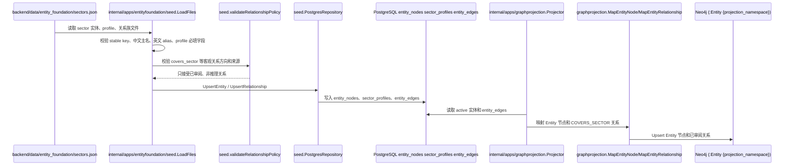
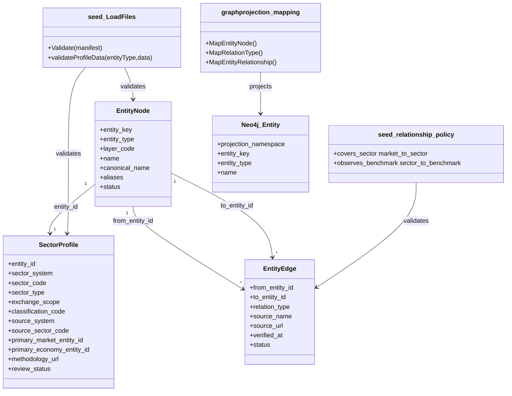

## Context

当前系统已经具备统一实体表 `entity_nodes`、类型 profile 表、实体关系表 `entity_edges`、实体基础库 seed 命令和 PostgreSQL 到 Neo4j 的实体图投影。`sector` 已存在于 `domain.EntityTypeSector`、`sector_profiles`、`backend/data/entity_foundation/sectors.json` 和 seed loader 中；当前 `sectors.json` 包含 60 个板块，按 `concept`、`industry`、`index` 各 20 个初始化，字段包括 `sector_system`、`sector_code`、`sector_type`、`exchange_scope`、`rank_snapshot` 和 `snapshot_date`。

现有状态适合初始化“行情源板块快照”，但还不足以作为事件驱动投研的长期板块基础层：

- `sector_type=index` 容易与正式 `index` 实体混淆；但用户已澄清同花顺“指数板块”示例是“半导体材料设备”“卫星产业”这类板块，不是上证指数、VIX 或国债收益率这类宏观 benchmark，因此它们仍应允许映射为 `sector`。
- `exchange_scope` 只能粗略表达市场范围，不能明确连接到 `market:a_share`、`market:hk_stock`、`market:us_stock` 等既有市场实体。
- 现有关系策略没有允许 `market -> sector`、`sector -> benchmark` 或 `sector -> chain_node` 的客观关系。
- 事件推理后续会需要“事件影响到哪些板块”，但本 change 不能把推理结论、涨跌预测或股票推荐写入基础 seed。

用户已确认以同花顺作为候选池来源，概念板块、行业板块、指数板块三个来源分类各取 Top 20，形成约 60 个原始候选，用于事件推理 MVP。三类都属于 `sector` 候选，Top 仅用于候选生成，不是永久主数据属性；同花顺的“概念板块/行业板块/指数板块”是 external/source taxonomy，观潮家的语义板块是 semantic sector，benchmark 是 market benchmark，三层必须拆开建模。

本 change 仍处于 Propose 阶段，只定义后续实现方案，不修改源码、migration、seed 或 Neo4j 数据。

## Goals / Non-Goals

**Goals:**

- 建立 `market-sector-foundation` 能力，定义市场板块实体的分类法、稳定标识、命名规则、关系边界和可验证完成标准。
- 复用既有 `entity_nodes`、`sector_profiles`、`entity_edges`、`backend/data/entity_foundation/sectors.json`、`backend/internal/apps/entityfoundation/seed`、`backend/internal/apps/graphprojection`。
- 明确第一版板块分类：`market_sector`、`theme_sector`、`industry_sector`、`style_sector`、`region_sector`、`index_sector`。其中 `index_sector` 表达来源系统定义的指数板块或指数型板块暴露，仍是 `sector` 候选，不替代正式 `index` 实体，也不等于 benchmark。
- 明确三层概念：external/source taxonomy 保存来源系统分类，例如 `concept`、`industry`、`index_sector`；semantic sector 表达可被事件影响的产业/主题暴露；market benchmark 表达用于量化验证的可观测行情标尺。
- 定义候选准入策略：Top 排名只保存为来源快照，长期入选必须通过事件可映射性、传导差异、稳定性、市场覆盖、数据可获得性和重叠度筛选。
- 给出 MVP 候选策略：同花顺概念板块、行业板块、指数板块各 Top 20 均进入 Review 候选池，总量约 60 个；筛选重点是去重、交叉关系和职责判别，而不是预先削减 `index_sector` 配额。
- 采纳 MVP 候选评估策略：按事件可解释性 25、传导独立性 20、行情敏感度 15、数据完整性 15、长期稳定性 15、市场代表性 10 评分，原则上 70 分以上进入 MVP。
- 明确最终正式 sector 规模约 50-60 个，覆盖金融地产、能源电力、有色化工材料、工业基建、半导体电子、AI 软件通信、汽车新能源、医药生科、消费农业、交通公用、国防航天卫星、政策主题等传导簇。
- 明确运行分层：核心约 30、扩展约 20、观察约 10，用于推理调度优先级或 Review 工作流，不作为实体身份、稳定 key 或不可变主数据属性。
- 为后续实现定义关系草案：`market -> covers_sector -> sector`、`sector -> observes_benchmark -> benchmark`、`sector -> maps_to_chain_node -> chain_node`。其中第一版推荐只实现 `covers_sector`，其余关系进入后续人工 review。
- 明确 PG/Neo4j 边界：PostgreSQL 是板块实体、profile 和关系事实源；Neo4j 只投影已审阅 active 实体关系；板块行情时序、事件推理结果、传导强度和推荐内容不进入实体基础图。
- 定义 TDD 策略：实现阶段先补 seed loader/relationship policy/migration/projection tests，再修改生产代码，并以 `go test ./...` 作为最终验证。

**Non-Goals:**

- 不实现板块行情时序、涨跌幅、热度排名、资金流、成分股调仓历史或实时行情采集。
- 不实现具体股票推荐、买卖建议、目标价、仓位建议或投资组合生成。
- 不实现事件抽取、事件到板块的影响评分、传导强度、受益承压判断或 Agent 编排。
- 不建立新的图数据库事实源，不让采集 connector 或前端直接写 Neo4j。
- 不新增小程序页面、管理后台页面、API 契约或前端展示模型。
- 不修改 `prototype` 或上级 `doc`。

## Decisions

### Decision 1: 复用 `sector` 实体和 `sector_profiles`，不新增平行实体类型

推荐方案：继续使用 `entity_nodes.entity_type='sector'` 和 `sector_profiles`。后续 implementation 通过增量 migration 扩展 `sector_profiles`，补充可长期使用的字段：

- `classification_code`：内部标准化分类代码，例如 `theme_sector`、`industry_sector`、`index_sector`。
- `source_taxonomy_type`：来源系统分类，例如 `concept`、`industry`、`index_sector`。
- `source_system`：来源系统，例如 `ths`、`citics`、`gics`、`custom_tidewise`。
- `source_sector_code`：来源系统原始板块代码。
- `primary_market_entity_id`：主要市场范围，引用 `entity_nodes` 中的 `market`。
- `primary_economy_entity_id`：主要经济体范围，引用 `entity_nodes` 中的 `economy`，允许全球类板块为空。
- `methodology_url`：分类方法或来源说明 URL。
- `review_status`：`candidate`、`approved`、`rejected`。
- `selection_score` 和评分分项不建议进入长期 `sector_profiles` 作为实体身份字段；如实现阶段确需保存，应放入候选 Review 文件、source snapshot 或单独评估记录，避免把动态评估固化为主数据本体。
- `runtime_tier` 不建议作为第一版主数据硬字段；核心、扩展、观察分层更适合作为推理调度配置或 Review 状态视图。

备选方案 A：新增 `market_sector_profiles` 表。优点是语义更窄，缺点是与已有 `sector_profiles`、loader、seed、repository、projection 形成平行结构。

备选方案 B：把板块全部建成 `index` 或 `chain_node`。优点是少建字段，缺点是概念错误：板块不是正式指数，也不是产业链环节。

取舍：选择复用现有 profile，避免平行设计，并通过字段和校验收紧语义。

### Decision 2: 稳定 key 采用 `sector:<source_system>_<classification>_<slug>`

板块 `entity_key` MUST 稳定、可读、可审阅。推荐格式：

```text
sector:<source_system>_<classification>_<slug>
```

示例：

- `sector:ths_theme_ai`
- `sector:ths_industry_semiconductor_components`
- `sector:ths_index_sector_satellite_industry`
- `sector:tidewise_theme_energy_transition`

迁移旧数据时，不应批量删除现有 key；应通过审阅后的前向迁移或 seed 更新把 `sector:ths_concept_ai` 等旧 key 映射到新分类策略。若 key 需要改名，必须使用兼容迁移或保留 alias/merged 状态，避免 Neo4j、事件链接和审计记录断裂。

### Decision 3: 中文主名称 + 英文 aliases

市场板块面向中文投研体验，`name` 和 `canonical_name` 使用中文主名称；英文名称、来源系统英文名和常见别名进入 `aliases`。涉及中国香港、中国台湾的板块或市场名称继续遵守既有政治命名要求，正式中文主名包含“中国香港”或“中国台湾”，简称只作为 alias。

### Decision 4: 第一版关系只写客观覆盖关系，不写推理关系

推荐第一版关系：

| relation_type | 方向 | 含义 | 第一版状态 |
| --- | --- | --- | --- |
| `covers_sector` | `market -> sector` | 某市场覆盖或展示某板块分类 | 本 change 后续实现候选 |
| `observes_benchmark` | `sector -> benchmark` | 某板块观察某个可核验 benchmark | 先设计，后续 review 再写 |
| `maps_to_chain_node` | `sector -> chain_node` | 某板块映射到产业链节点 | 先设计，后续产业链 change 再写 |

不采用 `sector -> economy` 直接归属作为第一关系，因为经济体范围可通过 `primary_economy_entity_id` 或 `market -> sector` 间接表达；多经济体板块也不适合强行单属地。

不采用 `sector -> company/security` 作为基础关系，因为成分股会随时间变动，且容易被误用为推荐列表。后续如需要成分关系，应通过独立 change 定义时间版本、来源和状态。

### Decision 4.5: external/source taxonomy、semantic sector、market benchmark 三层分离

同花顺候选的概念板块、行业板块、指数板块都可以作为 `sector` 候选。`source_taxonomy_type` 只表示来源系统如何组织行情页面，不直接决定观潮家领域职责。观潮家采用三层概念：

| 层次 | 作用 | 示例 | 存储建议 |
| --- | --- | --- | --- |
| external/source taxonomy | 记录同花顺等来源系统的候选分类 | `concept`、`industry`、`index_sector` | `sector_profiles.source_taxonomy_type` 或候选审阅元数据 |
| semantic sector | 表达可被事件影响的产业/主题暴露 | 半导体材料设备、卫星产业、低空经济 | `entity_type=sector` + `sector_profiles.classification_code` |
| market benchmark | 表达用于量化验证的可观测行情标尺 | 某板块指数行情序列、正式指数代码、885/886 板块指数代码 | `benchmark` 或与 sector 的已审阅参考关系 |

转换规则如下：

| 候选源分类 | 推荐领域处理 | 入选原则 |
| --- | --- | --- |
| 同花顺行业 Top 20 | 优先进入 `industry_sector` 候选 | 作为稳定板块骨架，但需覆盖金融地产、资源能源、工业制造、科技成长、消费医药、交通公用、国防安全等主要传导簇 |
| 同花顺概念 Top 20 | 选择进入 `theme_sector` 候选 | 必须可解释、非短期炒作、有稳定定义，优先政策、技术、商品冲击可映射主题 |
| 同花顺指数板块 Top 20 | 允许进入 `index_sector` 候选 | 只要其表达行业/主题板块暴露，就仍是 `sector` 候选；若同时有正式指数代码、成分样本和行情序列，则另建或关联 benchmark 作为量化验证标尺 |

建议筛选评分维度：

| 维度 | 含义 | 用途 |
| --- | --- | --- |
| 事件可映射性 | 宏观、政策、产业、商品或技术事件能否自然映射到该板块 | 排除纯交易热词 |
| 传导差异 | 与其他板块相比是否有不同影响路径 | 降低重复计权 |
| 稳定性 | 名称、定义、覆盖范围是否能跨周期存在 | 避免短期炒作概念 |
| 市场覆盖 | 是否覆盖目标市场与经济体 | 保证 MVP 主要市场可用 |
| 数据可获得性 | 是否有可持续行情、指数或来源说明 | 保证后续验证 |
| 重叠度 | 与已有行业、主题、benchmark 是否高度重复 | 决定合并、降级或淘汰 |

建议 Review 策略：

- 概念板块、行业板块、指数板块各 Top 20 都进入 Review 候选池，总量约 60 个。
- 按已确认权重评估候选：事件可解释性 25、传导独立性 20、行情敏感度 15、数据完整性 15、长期稳定性 15、市场代表性 10；原则上 70 分以上进入 MVP。
- 最终正式 sector 约 50-60 个，必须覆盖金融地产、能源电力、有色化工材料、工业基建、半导体电子、AI 软件通信、汽车新能源、医药生科、消费农业、交通公用、国防航天卫星、政策主题等传导簇。
- 不预设削减 `index_sector` 配额；重点检查指数板块是否与行业/概念重复、是否表达稳定产业/主题暴露、是否需要关联 benchmark。
- 若某个指数板块由中证、国证等指数提供方编制，具备正式指数代码、成分样本和行情序列，则 sector 表达“可被事件影响的产业/主题暴露”，benchmark 表达“用于量化验证的可观测行情标尺”，两者可以一对一或多对一关联。
- 同花顺概念板块即使具备 885/886 等板块指数代码和行情，也不自动变成 benchmark-only；它首先仍可作为 semantic sector，行情代码作为 benchmark 或 source metadata 审阅。
- 若 Top 60 中存在高度重复或短期炒作对象，应在 Review 中合并、降级或替换，而不是按来源分类机械保留。
- 运行上分为核心约 30、扩展约 20、观察约 10；该分层服务推理调度频率、Review 优先级或候选池管理，不应成为 `entity_key`、`classification_code` 或不可变实体身份。

去重规则：

- 同名或近义行业/概念优先合并为一个领域 `sector`，来源别名进入 aliases 或 source metadata。
- 行业和概念重叠时，保留行业作为稳定骨架，概念仅在存在独立事件触发逻辑时保留。
- 同一产业/主题在概念板块、行业板块、指数板块中重复出现时，保留一个 canonical `sector`，将其他来源分类作为 aliases、source mappings 或 cross-reference，而不是创建多个语义重复 sector。
- 完全同义且范围一致的候选合并为一个 canonical `sector`，保留多个来源映射。
- 不同粒度或部分重叠的板块分别保留，并通过后续已审阅的上下位或交叉关系表达，不用合并抹平差异。
- 指数板块若同时有正式行情序列，不复制 sector 职责；sector 保留事件暴露职责，benchmark 保留量化行情标尺职责，通过后续已审阅关系连接。
- 商品、利率、收益率、波动率、汇率和加密资产参考价格不得作为 `sector`。

### Decision 5: Neo4j 只投影实体和已审阅关系

Graph projection 继续从 repository 读取 `GraphEntityNode` 和 `GraphEntityEdge`。实现阶段只需要把新 relation type 加入：

- `backend/internal/apps/entityfoundation/seed/relationship_policy.go`
- `backend/internal/apps/graphprojection/mapping.go`
- 对应 mapping/loader tests

Neo4j 节点仍使用单一 `Entity` 标签和 `projection_namespace='tidewise'`。板块节点可以通过 `entity_type='sector'`、`entity_key` 和 profile 投影属性被查询；不新增 `Sector` 标签，不投影历史行情点，不投影事件影响评分。

### Decision 6: 后续 Apply 必须测试先行

后端实现阶段按 TDD 执行：

- loader test 先验证新版 sector profile 必填字段、旧字段兼容、禁用推理字段、重复 key 和悬空关系。
- migration test 先验证 `sector_profiles` 增量字段、非破坏性 SQL 和回滚说明。
- relationship policy test 先验证 `covers_sector` 方向为 `market -> sector`，并拒绝反向、推理文案和未知端点。
- graph projection mapping test 先验证 `covers_sector` 映射为 `COVERS_SECTOR`，未知或不安全类型仍 fallback。
- seed fixture test 先验证首批 reviewed sector 清单数量、分类分布、中文主名/英文 alias 和来源字段。
- 最终运行 `go test ./...`。

## Architecture Diagrams

### Seed 到投影流程



### 后端组件与表关系



## Risks / Trade-offs

- `sector_type=index` 历史语义可能误导后续实现 -> 通过 `index_sector` 明确其表示来源系统定义的指数板块暴露，不替代正式 `index` 实体，也不等于 benchmark。
- `index_sector` 可能再次被误读为 benchmark-only -> 在 profile 中同时保存 `source_taxonomy_type` 和 `classification_code`，并在 Review 清单中分别判定 semantic sector 和 market benchmark 职责。
- 板块关系过早扩张会把推理结论写成事实 -> 第一版只允许客观来源可核验关系，事件影响和传导强度留给后续事件推理 change。
- 旧 `sector_code` 不是权威代码，可能与来源系统真实代码不一致 -> 新增 `source_sector_code` 和 `methodology_url`，旧字段保留兼容，正式 source code 需人工 review。
- 候选评分和运行分层可能被误当成实体身份 -> 将评分和核心/扩展/观察作为 Review 或推理调度层数据处理，第一版不把它们放入 stable key 或长期身份字段。
- 多市场板块可能不适合单一 `primary_market_entity_id` -> 第一版用主市场字段表达主要范围，多市场覆盖通过多条 `covers_sector` 关系表达。
- 成分股关系容易被理解为推荐 -> 本 change 不建立 sector-company/security 基础关系，后续需要时必须引入时间版本和非推荐说明。
- Neo4j 查询想直接看板块属性 -> 投影仍以 PG 为事实源；可投影必要 profile 属性，但不得把 Neo4j 变成独立维护入口。

## Migration Plan

后续 Apply 阶段建议分四步执行：

1. 先补 Go 测试：seed loader、relationship policy、migration 静态验证、graph projection mapping 和 seed fixture。
2. 追加非破坏性 migration，扩展 `sector_profiles` 字段和必要约束；不得删除已有 `sector_profiles`、`entity_nodes` 或 `entity_edges` 数据。
3. 更新 seed 数据和关系族文件，只纳入已审阅的首批板块和 `covers_sector` 关系；不写 `observes_benchmark` 或 `maps_to_chain_node` 正式关系，除非 Review 后明确批准。
4. 重建 local PG/Neo4j 仅作为显式验证步骤；未经用户 Review 不执行 seed 写入或 graph-projector rebuild。

回滚策略：由于数据库采用前向 migration，回滚应通过新的审阅迁移禁用或修正新增字段/seed 记录；不得清空业务表。若首批 seed 有错误，应通过 status、review_status 或前向数据修正处理。

## Open Questions

- 首批正式板块已确认以同花顺概念板块、行业板块、指数板块 Top 20×3 约 60 个作为原始候选池，并按已确认评分权重、70 分原则线、去重、交叉映射和 benchmark 关联规则审阅。
- `sector:ths_concept_*` 是否在本 change 实现中改名为 `sector:ths_theme_*`，还是保持旧 key 并只新增 `classification_code`？
- `covers_sector` 是否第一版只连接抽象市场，如 `market:a_share`、`market:hk_stock`、`market:us_stock`，而不连接具体交易所？
- `sector -> benchmark` 的关系名称是否复用 `observes_benchmark`，还是新增更窄的 `uses_benchmark` / `tracked_by_benchmark`？
- 产业链节点映射是否应由本 change 只预留规范，实际关系放入后续 `industry-chain` 专门 change？
- 哪些同花顺指数板块需要一对一或多对一关联 benchmark，哪些只保留 source metadata，需要用户逐项 Review。
- 核心/扩展/观察分层在实现阶段应落在推理调度配置、候选 Review 记录还是 source snapshot，仍需 Review 技术落点。
