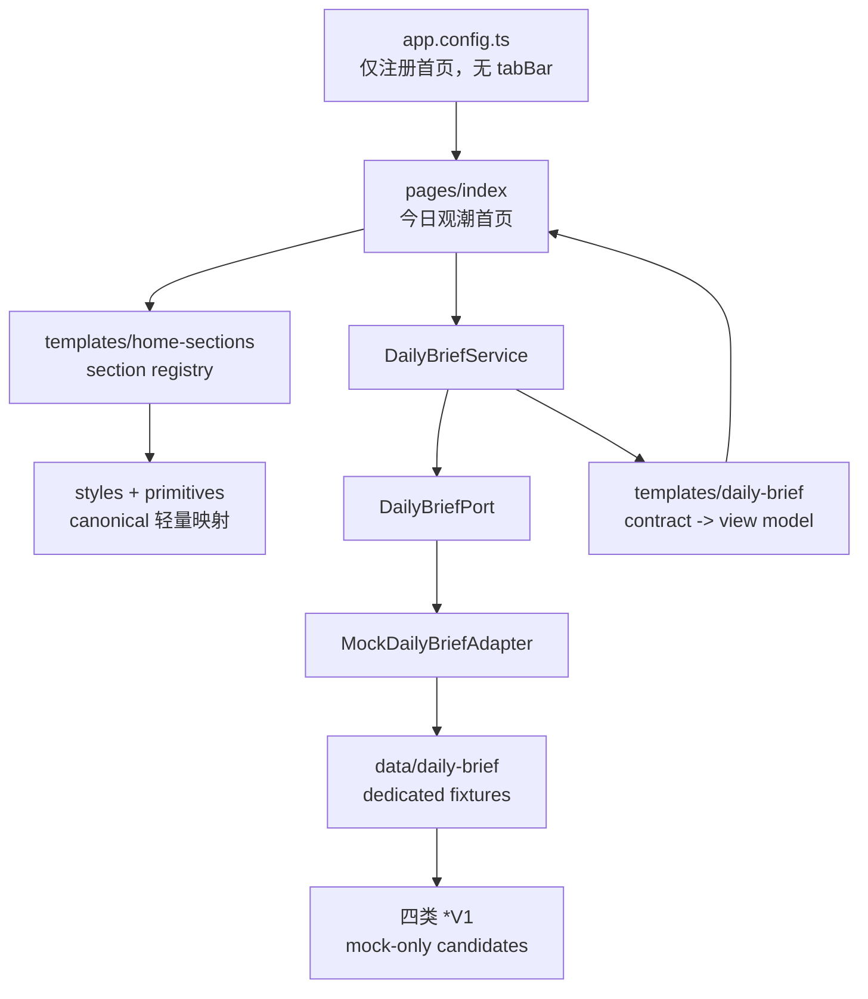
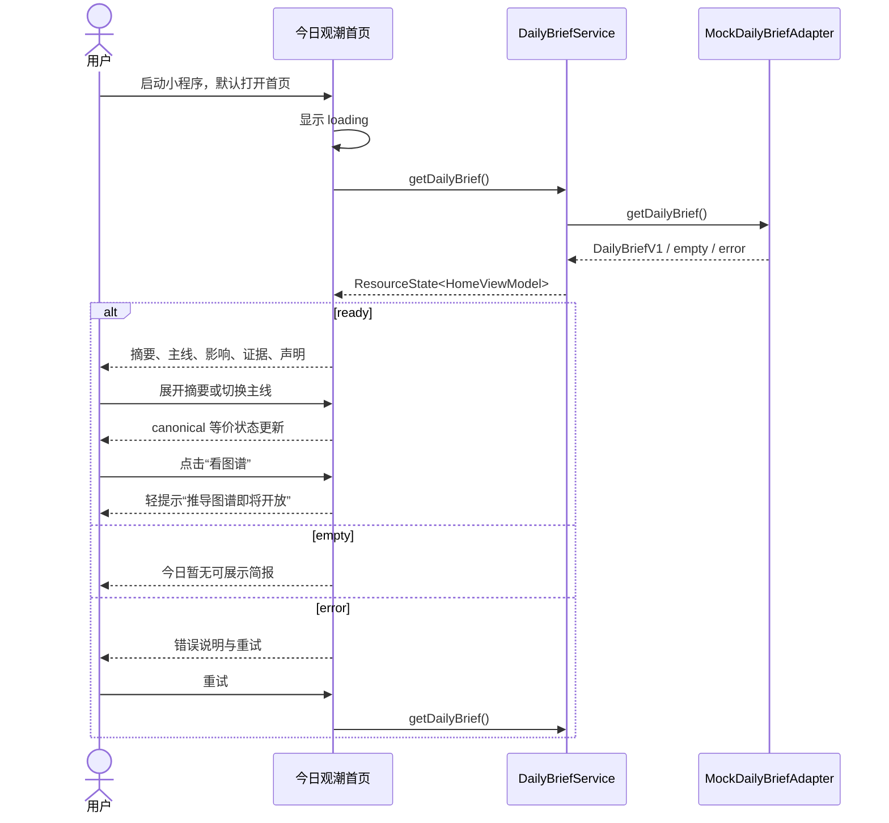

## Context

`frontend/miniapp/` 已是具有微信和抖音构建能力的 Taro + React + TypeScript 工程，保留既有页面源码、components、models、dedicated data、services、request、styles 和 utils。当前 change 仅注册 `pages/index/index` 并以微信小程序作为运行与视觉验收目标；既有其他页面源码、抖音依赖和脚本保留但不进入本 change 导航或验收。

本 change 只交付首页“今日观潮”Mock shell。`/Users/meierlink/Documents/david/创业项目/观潮家/prototype2/miniprogram.html` 首页最终渲染是已批准的 page-level canonical visual/interaction source，优先级高于旧 `ganchaojia-design` skill。旧 skill 及关联 design library 仅解释历史 token 和基础组件来源，不能覆盖首页最终效果。

原型使用单文件 mock、`document`、`innerHTML`、内联 `onclick`、DOM 测量和 Web 资源加载，并含个股推荐暗示，不能直接复制到小程序。生产实现必须做 Taro/React 等价转译，以截图基线和视觉对比验收。

## Goals / Non-Goals

**Goals:**

- 在现有 `pages/index` 交付“今日观潮”唯一微信首页；移除生产 app config 的 `tabBar`，只注销而不删除其他页面源码。
- 覆盖日报摘要、市场/情绪结论、主题、主线、影响、证据、安全声明和 canonical 首页交互。
- 覆盖 loading、empty、error、ready 四态并支持错误重试。
- 以 mock-only 候选 contracts、service port、mock adapter、dedicated fixtures、view model/template 和 section registry 隔离页面与数据来源。
- 在 375×812 viewport 以截图基线/视觉对比验收 canonical 首页，平台差异只做有记录的等价转译。
- 保留“看图谱”视觉入口，但本期只提供明确未开放反馈。

**Non-Goals:**

- 不实现图谱页、图谱 overlay、图谱数据加载、图谱组件、`ReasoningGraphV1` 或 `ReasoningPathStepV1`。
- 不实现或调用 Go API/BFF、数据库、Neo4j、Agent/RAG、鉴权、订阅、支付或推送。
- 不冻结正式 API DTO，不定义真实 URL、错误 envelope、鉴权或服务端兼容策略。
- 不展示个股推荐、买卖信号、收益预测、个股排行或可执行投资建议。
- 不复制或修改 prototype HTML/CSS/脚本、prototype shell、annotation/debug 资产或整套 `.design_library`，不修改 `doc/` 与 prototype 源文件。
- 不在本 change 创建 repo-local miniapp design skill，不重构其他四个 tab。
- 不要求抖音构建、开发者工具预览、模拟器 smoke 或视觉一致性；不为收缩范围删除既有抖音依赖和脚本。

## Visual Source Baseline

| 角色 | 固定绝对路径 | SHA-256 / 版本标识 |
|---|---|---|
| 首页 canonical source | `/Users/meierlink/Documents/david/创业项目/观潮家/prototype2/miniprogram.html` | `ad90bcc8942cf30cdcd730134361e596e86b581c93e0a28087df2eb00d43f69a` |
| 关联 token CSS | `/Users/meierlink/Documents/david/创业项目/观潮家/prototype2/.design_library/观潮家/colors_and_type.css` | `3605c97214cbc09d66c270a9280a3373251a2f2ad8c653850f3cb3680c23a889` |
| 关联 component CSS | `/Users/meierlink/Documents/david/创业项目/观潮家/prototype2/.design_library/观潮家/components.css` | `f0c32a315a1c3e96355dcc7b9efee9650144a4db0b5a39d6317916bad43757c1` |
| canonical viewport | prototype `.phone-frame` | `375×812 CSS px` |

Apply 开始前必须重算三个指纹；任一变化都暂停实现并返回 Review。ready 基线覆盖首页摘要展开/折叠、纳入首版的每条主线和“看图谱”占位反馈；loading、empty、error 分别建立补充截图基线。

## Decisions

### Decision 1: 单页微信首页 shell

保持 `pages/index/index` 路径，把“指数”占位内容替换为“今日观潮”。canonical HTML 已无底部菜单，因此 app config 的 pages 精确为该首页且不定义 `tabBar`。feed、ai、sectors、subscribe 页面源码不删除、不重构，只是不注册到本期微信首页 shell。首页“问潮”视觉入口保留并显示未开放 toast，不切换到未注册页面。不注册任何图谱页面。

### Decision 2: “看图谱”保留视觉入口并使用轻提示占位

prototype2 首页存在“看图谱”入口，视觉位置、字体、颜色和点击反馈纳入 canonical 基线。本期推荐点击后使用 Taro toast 或视觉等价的轻提示“推导图谱即将开放”；不导航、不加载图谱、不渲染假内容。

备选是禁用入口。禁用能更强表达不可用，但会改变 canonical 点击反馈且用户难以理解原因；轻提示更符合“保留原型入口但不误导能力状态”的目标。该选择必须在 proposal Review 明确确认。

### Decision 3: 使用 service port + mock adapter

拟议边界：

```text
contracts/daily-brief-v1.ts       mock-only 首页候选结构
services/daily-brief/port.ts      DailyBriefPort
services/daily-brief/index.ts     页面唯一 service 入口
services/daily-brief/mock.ts      MockDailyBriefAdapter
data/daily-brief/*.ts             dedicated fixtures
models/daily-brief-view.ts        首页 view model 与 ResourceState
templates/daily-brief.ts          contract -> view model 纯映射
templates/home-sections.ts        首页 section registry
```

首页只调用 `dailyBriefService.getDailyBrief()` 并消费 view model。未来独立 API integration change 新增 HTTP adapter并替换 composition root；页面、registry 和组件不感知 transport。页面不得 import fixture 或在 JSX 中硬编码业务数据。

### Decision 4: 候选 DTO 聚焦首页且明确 mock-only

- `DailyBriefV1`：mock schemaVersion、ID、asOf、标题、摘要、市场状态、情绪、主题、conclusions、disclaimer。
- `ReasoningConclusionV1`：结论 ID、标题、摘要、方向、置信标签、impact IDs、evidence IDs，以及仅用于“看图谱”占位入口的 `graphAvailability: 'coming_soon' | 'unavailable'`，不包含 graph ID 或路径。
- `ImpactAssessmentV1`：对象 ID/类型/名称、方向、时间范围、强度、依据与不确定性；对象类型仅允许 `market`、`sector`、`benchmark`、`commodity`、`economy`、`industry_chain`。
- `EvidenceItemV1`：证据 ID、来源、标题/摘要、发布时间、证据时间、可信度标签。

不定义 `ReasoningGraphV1`、`ReasoningPathStepV1`、节点、边或路径。正式 API 的 ID、时间、nullability、错误、鉴权和兼容性由后续 integration change 重新 Review。

### Decision 5: ResourceState 与 section registry 控制四态

资源状态统一为 `idle | loading | ready | empty | error`。ready registry 依次渲染 `brief-summary`、`themes`、`conclusions`、`impacts`、`evidence`、`safety-note`；registry 只保存 section key、顺序和可见条件，不保存 mock 文案。loading/empty/error 使用共享 resource-state primitive，并保持 canonical 页面高度、背景和层级，减少切换布局跳变。

### Decision 6: Canonical 交互转译为 React/Taro

- HTML 字符串改为 typed React components 与数组渲染。
- 全局变量、class 切换和内联事件改为 `useState`、`useMemo`、组件事件与条件渲染。
- 摘要折叠与主线切换使用受控状态；如需横向滑动，使用 Taro `Swiper`/`ScrollView` 并以视觉对比选择最接近方案。
- “看图谱”使用 Taro toast/等价轻提示。
- DOM 测量与手工 touch listener不直接进入业务层；不可避免的平台 selector query 必须封装并记录差异。
- 红涨、绿跌、橙中性同时配文字/图标，不只依赖颜色。

### Decision 7: 轻量 tokens/primitives/compositions 留在现有边界

生产实际使用的蓝/灰/红/绿/橙色、字体、间距、圆角、阴影、状态与 motion 映射到 `frontend/miniapp/src/styles`。稳定的按钮、卡片、chip、resource state进入现有 components；日报顶部、波浪分隔、主线内容等页面组合留在首页 composition。页面最终效果服从 prototype2，不复制整套 design library。

Apply 同步更新 `.agents/frontend-boundaries.md`：旧 `ganchaojia-design` skill 仅作历史/基础 token 参考；已批准 change 指定的 page-level canonical prototype 拥有生产小程序页面视觉裁决权；admin Minimal Dashboard 路由保持不变。

### Decision 8: 资产逐项准入

| 原型资产 | SHA-256 / 来源 | 本 change 处理 |
|---|---|---|
| `assets/home-header-sea.jpg` | `667dcd64bcfb7c3d40e4f5f5a6d0b9be1f88a90824e5e3db88527f08703b6fdc` | 已获用户授权；复制到生产 assets，并以绝对定位 Taro `Image` 输出为独立文件，禁止 CSS base64 内联 |
| `assets/nav-avatar.png` | `47978d1216edc9cdb844b668b84fc332f3edf61506a17a0459f945e709c49327` | prototype shell/avatar，排除 |
| Google Fonts `Inter` / `Noto Sans SC` | CSS 远程 `@import` | 不直接远程加载；优先系统字体，必要本地字体需单独确认授权 |
| 内联箭头 SVG data URI | HTML 行内资源 | 转译为 Taro 图标或 CSS，不复制 data URI |

新发现资产必须先记录生产必要性、授权、来源、目标路径和 SHA-256。授权不明确时不得复制，必须返回 Review。

### Decision 9: 自动验证 + 微信开发者工具人工验收

Apply 使用 TDD 为 contract mapper、resource reducer、section registry、mock adapter 和占位策略纯函数先写失败测试。最终自动验证包括 lint、typecheck、单元测试和 `build:weapp`，构建产物不提交。

本地人工验收说明必须给出微信构建产物路径、微信开发者工具导入方式、测试 AppID/本地模式注意事项、确认启动即进入首页、切换 mock 四态、操作折叠/主线/占位入口和采集 375×812 截图的步骤。CLI 无法替代开发者工具渲染，因此人工预览结果作为 Apply evidence 单独记录。

### Decision 10: 固定微信预览发布目录

根与 miniapp workspace 提供 `preview:weapp`，固定执行 `build:weapp → verify:weapp-output → publish:weapp`。发布器默认使用 `os.homedir()/WeChatProjects/tidewise-ai-preview`，可通过 `TIDEWISE_WEAPP_PREVIEW_DIR` 覆盖，源码不硬编码个人绝对路径。

发布使用目标同级 staging/backup 目录完成可重复替换：先完整复制并写 marker，再将旧目标换出、staging 原子 rename 为目标，最后只清理目标同级的本次 backup。危险目标（文件系统根、home 本身、source 本身）在任何删除前拒绝。`tidewise-build.json` 只记录 branch、commit、builtAt、`weapp` target 和 source `app.json` SHA-256，不含环境变量或 secret。`dist` 和固定预览目录均不提交 Git。

## Component Diagram



## Interaction Sequence



## Visual Mapping

| canonical 元素 | Taro 映射 | 验收关注点 |
|---|---|---|
| 海面背景与透明顶部区 | page background composition + 经授权图片 | 裁切、蓝色层次、文字对比度 |
| 日期/更新进度、市场/情绪 | brief hero primitives | 字号、对齐、密度、折叠状态 |
| 波浪分隔与折叠按钮 | View/SVG composition | 曲线、层级、按钮位置和反馈 |
| “观潮分析”主线卡 | conclusion composition | 卡片尺寸、内容层级、切换行为 |
| 影响和证据摘要 | impact/evidence primitives | 状态色、来源、时间、不确定性 |
| “看图谱” | canonical trigger + coming-soon feedback | 位置、样式、点击反馈、不导航 |
| loading/empty/error | resource-state primitives | 背景、层级、无布局跳变 |

允许差异仅限微信安全区、原生导航、字体渲染和平台组件行为；每项在 evidence 说明原因、影响和等价处理。未记录偏差视为未通过。

## Canonical Homepage Structural Mapping Audit

| canonical 首页可见 section / 控件 | 生产对应实现 | 审计状态 |
|---|---|---|
| 海面摄影背景、蓝色渐变与透明顶部区 | `pages/index` 的绝对定位 Taro `Image mode="aspectFill"`、渐变层与 hero composition | 已实现；图片独立输出，裁切待 375×812 人工对比 |
| 日期、更新环与“今日观潮”标题 | `DailyBriefHero` 日期、更新时间与进度环 | 已实现 |
| 市场/情绪 KPI、趋势文案与问号提示 | hero KPI primitives 与 Taro toast 提示 | 已实现 |
| 可折叠新闻摘要、摘要主题 chips | 受控 `expanded` 状态、摘要正文与主题 chips | 已实现 |
| 事件数、传导链、关注数统计 | `eventCount`、`chainCount`、`watchingCount` view model | 已实现；业务值来自 fixture→mapper，不在 JSX 硬编码 |
| 海浪分隔和折叠/展开控件 | CSS wave composition 与受控按钮 | 已实现；波形细节待人工视觉对比 |
| “观潮分析 · N 条主线”分隔标题 | conclusions section heading | 已实现 |
| 上一条/下一条主线切换与当前序号 | 主线切换按钮、当前索引状态 | 已实现；使用小程序按钮等价转译，手势与位置待人工验收 |
| 主线编号、标题、结论摘要与置信度 | `MainlineCard` badge、headline、summary、confidence | 已实现 |
| “关注”控件 | 主线 follow button，当前以 toast 表达 Mock 占位 | 已实现，不写入订阅状态 |
| 关键事件 chips | `keyEvents` typed view model 与 chips；点击显示摘要 toast | 已实现 |
| 传导链摘要与“看图谱”入口 | `transmissionTitle`、步骤链和 canonical trigger | 已实现；点击仅 toast“推导图谱即将开放”，不导航/请求 |
| 核心影响、方向、周期、强度与不确定性 | impact cards | 已实现；对象限定为市场/板块/benchmark/商品/经济体/产业链 |
| 证据来源、标题、时间与可信度 | evidence cards | 已实现 |
| 决策辅助/非投资建议声明 | safety-note section | 已实现 |
| 首页悬浮“问潮”入口 | fixed FAB，显示“问潮即将开放”toast | 已实现；不导航到未注册页面 |
| 无底部菜单 | app pages 精确为 `pages/index/index` 且无 `tabBar` | 已实现并由配置单测与构建产物门禁锁定 |
| prototype 状态栏、胶囊、头像和标注/debug shell | 使用微信原生容器；prototype shell 资产不进入生产 | 按已批准平台等价转译/排除，不是内容缺失 |

该审计只证明结构覆盖，不替代像素验收。安全区、字体栅格化、图片裁切、波浪轮廓和主线切换控件位置，均须在微信开发者工具 375×812 截图对比后才能通过。

## Risks / Trade-offs

- [候选 V1 被误认为正式 API] → mock schemaVersion、模块命名和 spec 明确边界；后续 integration change 重新定义 API。
- [“看图谱”入口误导用户] → 使用明确 coming-soon 轻提示且不导航、不请求；由 Review 确认策略。
- [设计源漂移] → Apply 前重算 SHA-256，变化即暂停。
- [Web 到微信小程序有视觉差异] → 固定 viewport 截图对比，只接受有记录的平台等价差异。
- [海面图片被构建器内联导致页面样式超限] → 使用 Taro `Image` 背景层独立输出；构建门禁校验图片指纹、WXSS 小于 64 KiB 和首页入口配置。
- [测试依赖扩大范围] → 优先纯 TypeScript；仅做 miniapp workspace 最小增量。

## Migration Plan

1. Apply 前重算 canonical 指纹并确认必要资产授权。
2. 更新 `.agents/frontend-boundaries.md` 的 miniapp 视觉路由。
3. 在现有 styles/components 内建立轻量 design primitives；先写 contracts/adapter/mapper/state 测试，再实现数据边界。
4. 增量替换 index 首页并实现四态、canonical 交互和“看图谱”占位反馈。
5. 完成 lint、typecheck、单元测试、微信构建、微信开发者工具预览和 375×812 视觉对比。
6. 提交 Apply scoped diff 等待人工 Review；不存在数据库或服务端迁移。
7. 回滚时恢复 frontend rule 与 index 文件，删除本 change 新增模块和已准入资产。

## Open Questions

无。Proposal Review 已确认“看图谱”使用轻提示“推导图谱即将开放”，并明确授权 `home-header-sea.jpg` 用于生产小程序。

## First Manual Acceptance Failure Retrospective

首次人工截图不能用于判断本 branch 的视觉质量，因为微信开发者工具实际加载了主仓库旧构建产物，而不是当前 Desktop task worktree 的构建产物：

| 证据 | 主仓库旧 `dist/app.json` | 当前 worktree `dist/app.json` |
|---|---|---|
| 绝对路径 | `/Users/meierlink/Documents/david/创业项目/观潮家/tidewise-ai/frontend/miniapp/dist/app.json` | `/Users/meierlink/.codex/worktrees/ed41/tidewise-ai/frontend/miniapp/dist/app.json` |
| 检查时 mtime | `2026-07-05 19:18:38` | `2026-07-12 21:46:06` |
| pages 第一项 | `pages/feed/index` | `pages/index/index` |
| tab 顺序/文案 | 行情 / 指数 / AI 助手 / 板块 / 订阅 | 首页 / 行情 / AI 助手 / 板块 / 订阅 |
| selectedColor | `#0f766e` | `#2563eb` |

失败截图的 tab 文案、顺序和青色 selected state 与左列逐项一致，因此根因是导入路径或开发者工具缓存指向旧 main `dist`。这只能排除该截图作为新 UI 证据，不能证明当前实现已达到 canonical 视觉要求。后续必须先通过 worktree 路径与 tab/颜色指纹门禁，再对正确构建的 375×812 截图逐项复盘视觉差异。

不提交 `dist`，也不通过修改生产 UI 添加验收标识。后续改为发布到不依赖 worktree 生命周期的固定预览目录；构建身份以无底部菜单的 `app.json`、`tidewise-build.json` 和 `verify:weapp-output` 共同确认。

## Apply Evidence

- 用户已明确授权 `/Users/meierlink/Documents/david/创业项目/观潮家/prototype2/assets/home-header-sea.jpg` 用于生产小程序；目标文件及 provenance 为 `frontend/miniapp/src/assets/home-header-sea.jpg` 与 `frontend/miniapp/src/assets/README.md`。
- Apply 前重算结果与 proposal 完全一致：HTML `ad90bcc8...f69a`、token CSS `3605c972...a889`、component CSS `f0c32a31...57c1`、海面资产 `667dcd64...b6fdc`。
- TDD red：首轮因缺少 `mock-daily-brief` module 失败；第二轮因缺少 `components/daily-brief/ui-meta` module 失败。对应生产边界实现后分别获得 11/11 与 13/13 green。
- Taro 4.2 native doctor 在当前 macOS 环境读取 system configuration 时 panic；定位到 `@tarojs/plugin-doctor-darwin-*` 后使用官方 `--no-check` 跳过前置 doctor，实际 webpack 编译正常执行。
- 当前 change 收缩为仅微信验收；既有抖音依赖与脚本保留，但不再要求 `build:tt` 或抖音预览，微信验收前最后一次构建必须是 `build:weapp`。
- 自动截图尝试 H5 等价渲染时确认 workspace 未安装 `@tarojs/plugin-platform-h5`。本 change 不为视觉 QA 扩大目标平台或新增 H5 依赖；微信开发者工具 375×812 人工截图保留为 Apply 后 Review 待验收项。
- Review 修复后海面图改为 Taro `Image` 背景层：微信构建独立输出 `dist/assets/home-header-sea.jpg` 且 SHA-256 与授权源一致，`dist/pages/index/index.wxss` 从约 260 KiB 降至 8,969 bytes；构建产物门禁要求其持续低于 64 KiB。
- 仍存在的非阻塞构建警告为现有 Sass `@import` 弃用提示和 webpack 无异步 chunk 性能建议；不包含图片内联体积警告。
