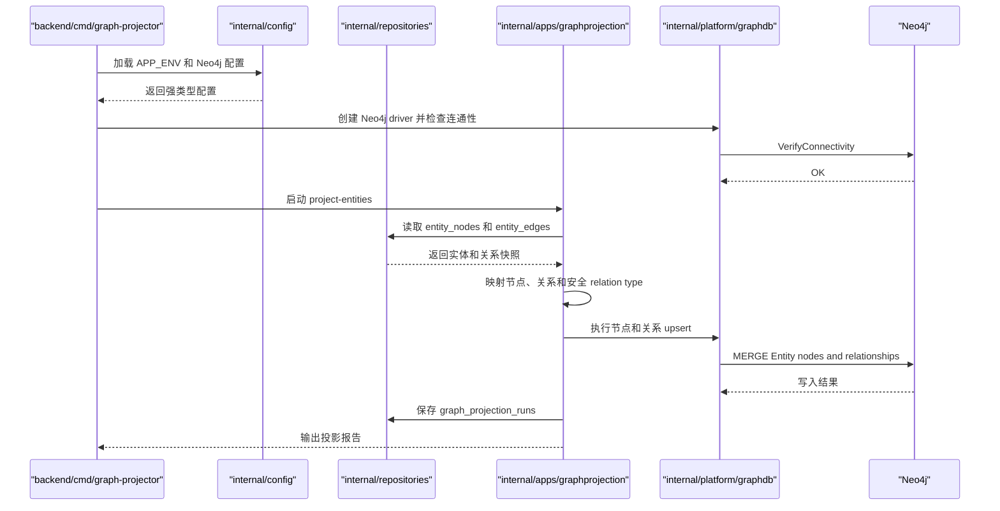
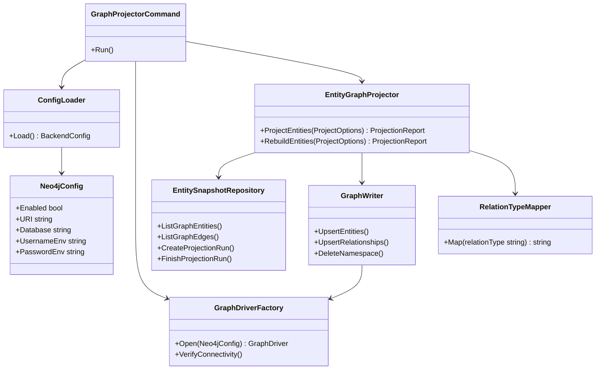

## Context

当前系统已经通过 PostgreSQL 保存 `entity_nodes`、`entity_edges`、实体 profile、原始文档、事件事实、证据和事件实体关联等事实基础。现有 `event-knowledge-schema` 主规格也已经要求后续图谱能力必须能够从 PostgreSQL 中的实体、事件、标签和关系表投影数据，而不是让采集层直接写入图数据库。

本 change 引入 Neo4j，但不改变 PostgreSQL 的权威事实源地位。Neo4j 的职责是保存可重建的图谱查询视图，用于后续多跳关系查询、路径分析、图谱推理和可视化。它更接近从 PostgreSQL 派生出来的图索引，而不是新的主事实库。

现有后端采用单 Go module、多可部署子系统结构。Neo4j 连接属于跨子系统平台能力，建议放在 `backend/internal/platform/graphdb`；PG 到 Neo4j 的投影编排属于业务子系统能力，建议放在 `backend/internal/apps/graphprojection`；命令入口建议放在 `backend/cmd/graph-projector`。

## Goals / Non-Goals

**Goals:**

- 建立 Neo4j 配置、连接、健康检查和凭证注入边界。
- 定义从 PostgreSQL 到 Neo4j 的实体图投影模型。
- 将 `entity_nodes` 和 `entity_edges` 投影为 Neo4j `Entity` 节点和实体关系。
- 支持幂等 upsert、显式全量重建、增量投影和投影运行报告。
- 保存投影运行记录，使本地、uat 和 prod 都能审计投影批次、数量、失败原因和耗时。
- 通过测试先行验证配置校验、Cypher 生成安全、实体/关系映射、幂等行为和失败处理。

**Non-Goals:**

- 不实现 AI event 提取、标签标注、事件实体关联或事件图谱投影。
- 不实现面向小程序或管理后台的图谱查询 API。
- 不实现图谱可视化页面。
- 不把 Neo4j 作为实体、事件或关系的主事实库。
- 不在采集 connector、parser 或 scheduler 中直接写入 Neo4j。
- 不引入向量数据库、RAG 检索、LangChain、LangGraph 或外部 Agent 平台编排。
- 不生成投资建议、利好利空、涨跌预测、传导强度或事件评分。

## Decisions

### Decision: PostgreSQL 是事实源，Neo4j 是图谱投影库

系统事实继续写入 PostgreSQL。Neo4j 中的节点和关系必须能从 PostgreSQL 的 `entity_nodes`、`entity_edges` 和后续事件关系表重新生成。Neo4j 损坏、清空或结构调整时，系统应支持从 PostgreSQL 重新投影恢复。

替代方案是让 Neo4j 成为实体关系事实库。该方案会让审计、状态流转、幂等写入、migration 和现有 repository 边界变复杂，也会让 AI 提取错误更容易污染事实层。因此本 change 不采用。

### Decision: Neo4j 连接放在 `platform`，投影编排放在 `apps/graphprojection`

Neo4j 驱动创建、连接池、连通性检查和关闭流程属于基础设施能力，放在 `backend/internal/platform/graphdb`。投影规则、PG 数据读取、Neo4j 写入编排、运行报告和错误处理属于业务流程，放在 `backend/internal/apps/graphprojection`。

这样可以避免把 Neo4j 写入逻辑混进 `entityfoundation`、`ingestion` 或 `adminapi`。实体 seed 仍然只负责初始化 PG 实体基础库，图谱投影由独立命令或 worker 显式执行。

### Decision: 使用 `backend/cmd/graph-projector` 作为首期入口

首期提供显式命令入口，支持：

- `check`：检查 Neo4j 配置和连通性。
- `project-entities`：从 PG 投影实体节点和实体关系。
- `rebuild-entities`：清理本系统管理的 Neo4j 实体图后重新全量投影。

后续如果需要定时图谱更新，再通过独立 change 接入 scheduler 或 job 队列。首期不把 Neo4j 投影放进采集调度器，避免采集链路和图谱投影链路互相阻塞。

### Decision: Neo4j 图模型使用稳定业务键和投影命名空间

实体节点使用以下核心属性：

```text
entity_id
entity_key
entity_type
layer_code
name
canonical_name
status
projection_namespace
updated_at
```

所有本系统写入的节点使用 `:Entity` 和 `:TidewiseEntity` 标签。`projection_namespace` 固定为本系统命名空间，用于安全清理和重建，避免误删 Neo4j 中未来可能存在的其他图数据。

实体关系从 `entity_edges` 投影。关系必须包含：

```text
edge_id
relation_type
source
confidence
status
projection_namespace
updated_at
```

Cypher 关系类型不能直接拼接外部字符串。实现时必须通过关系类型映射器把 PG 中的 `relation_type` 转成安全的 Neo4j relationship type；未知或不合法类型应拒绝投影或映射为明确的 `RELATED_TO` 并保留原始 `relation_type` 属性，具体策略由实现测试固定。

### Decision: 投影运行记录保存在 PostgreSQL

新增或复用 PostgreSQL 运行记录结构保存投影批次。建议新增：

```text
graph_projection_runs
graph_projection_run_items
```

运行记录保存 projection type、mode、status、started_at、finished_at、source row count、projected count、skipped count、failed count、error summary 和 config summary。Neo4j 只保存图结构，不保存完整运行审计。

### Decision: 支持全量重建和增量投影

全量重建只清理 `projection_namespace=tidewise` 且属于本系统管理标签的节点和关系，再从 PostgreSQL 重新投影。不得清空整个 Neo4j database。

增量投影基于 PostgreSQL 中实体和关系的 `updated_at`、投影运行记录或显式参数选择候选数据。首期实现可以先支持全量投影和显式重建，增量投影接口和测试边界必须保留，避免后续重构。

### Decision: 测试先行并隔离真实 Neo4j

普通单元测试不依赖真实 Neo4j。测试优先覆盖：

- Neo4j config 校验和 secret 隔离。
- PG entity/edge 到 Neo4j node/relationship 的映射。
- relation type 安全映射，避免 Cypher 注入。
- fake graph writer 的幂等 upsert 行为。
- 投影运行报告和失败处理。
- repository 读取实体和关系的 SQL 或 fake repository 边界。

真实 Neo4j smoke 必须显式 gated，例如需要 `TIDEWISE_ENABLE_NEO4J_SMOKE=true` 和本地 Neo4j 凭证；默认 `go test ./...` 不访问真实 Neo4j。

## Sequence Diagram



## Component Diagram



## Risks / Trade-offs

- [Risk] Neo4j 与 PostgreSQL 数据短时间不一致。→ Mitigation：PG 是事实源，Neo4j 只用于查询；投影运行记录展示最后同步时间和状态，失败后可重跑。
- [Risk] 关系类型从 PG 拼接到 Cypher 造成注入风险。→ Mitigation：只允许经过 mapper 白名单或安全转换后的关系类型进入 Cypher。
- [Risk] 全量重建误删非本系统数据。→ Mitigation：所有节点和关系写入 `projection_namespace`，重建只清理本系统命名空间。
- [Risk] Neo4j 引入增加本地开发复杂度。→ Mitigation：默认配置可关闭 Neo4j；真实 smoke 显式 gated；普通测试使用 fake graph writer。
- [Risk] 后续事件图谱和实体图谱模型不一致。→ Mitigation：本 change 只建立实体图模型和投影边界，事件图谱通过后续 change 基于同一命名空间和稳定 ID 扩展。
- [Risk] 投影数据量增加后单次全量投影变慢。→ Mitigation：保留增量投影接口和运行记录，后续可按 updated_at、批次或队列扩展。

## Migration Plan

1. 增加 Neo4j 非敏感配置模板和强类型配置校验。
2. 增加 `platform/graphdb` 连接基础设施和 fakeable graph writer 接口。
3. 增加 `graphprojection` 子系统，先用 fake repository 和 fake writer 完成 TDD。
4. 增加 repository 查询实体和关系快照，以及投影运行记录 migration。
5. 增加 `backend/cmd/graph-projector` 显式命令入口。
6. 更新本地基础设施说明和可选 Neo4j docker compose 配置。
7. 运行 `go test ./...` 和 `openspec validate add-neo4j-graph-projection-foundation`。

回滚策略：如果 Neo4j 不稳定，可以关闭配置开关并停止运行 `graph-projector`。PostgreSQL 事实数据不受影响。Neo4j 中本系统命名空间的数据可以清理后从 PostgreSQL 重新投影。

## Open Questions

- 首期是否必须提供本地 Neo4j docker compose，还是只提供配置模板和 gated smoke。
- 关系类型遇到未知值时，是拒绝投影并记录失败，还是映射为 `RELATED_TO` 并保留原始类型属性。
- 投影运行记录是否需要在管理后台展示，还是先只通过命令输出和 SQL 查询验证。
