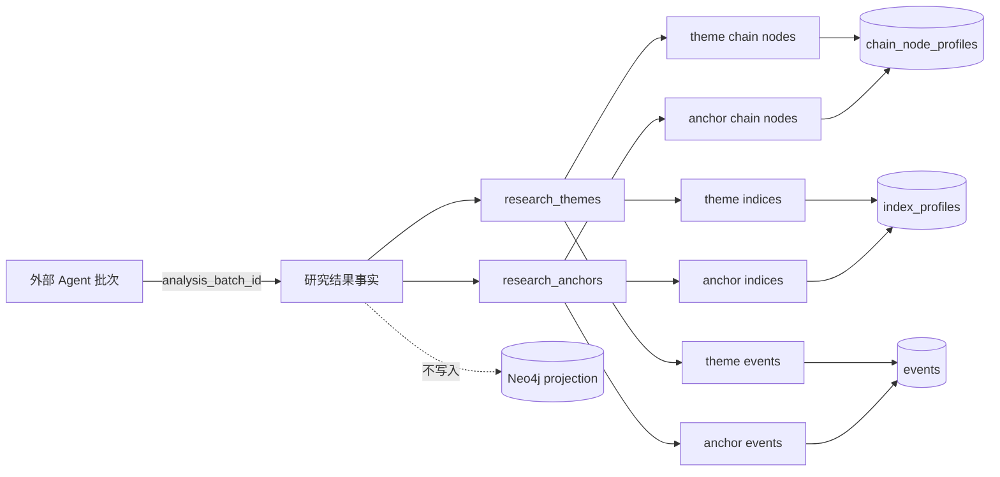

## Context

现有 schema 以 UUID 作为实体、事件和 profile 的主键，关系表通常使用 `created_at`/`updated_at`，文本字段使用 `btrim(...) <> ''`，受控值使用 PostgreSQL `CHECK`。`index_profiles.entity_id`、`chain_node_profiles.entity_id` 和 `events.id` 已存在，且当前主数据可能未完整填充。本 change 只定义研究结果的事实结构，不创建研究运行记录，也不把研究结果挂到 `entity_nodes` 的 theme 主数据上。

边界如下：

## Goals / Non-Goals

**Goals:**

- 建立 8 张 PostgreSQL 表，分别承载主题、锚点及其三类独立关联。
- 保证主题与锚点平行、无直接 FK/关联表；一句话结论只是各自结果属性。
- 固定 UUID 策略、外部批次编号、审计字段、FK 删除边界、非空文本、时间窗口、索引和复合唯一性。
- 为后续 domain/repository 实现提供可测试的 schema contract；本阶段仅产出 OpenSpec artifacts。

**Non-Goals:**

- 不创建 `research_analysis_runs`、`research_conclusions`、`research_conclusion_*`、路径步骤、评分明细、模型元数据或 display order。
- 不修改 `theme_profiles`、`entity_nodes`、事件/产业链/指数主数据，不灌入指数或任何研究实例。
- 不做 Event 提取 Agent、研究报告 Agent、API、scheduler、页面、Neo4j、seed、查询投影或部署。

## Decisions

### 1. 两套平行结果，不复用 theme 主数据

`research_themes` 与 `research_anchors` 各自拥有完整结果字段和独立关联表，不共享父表、不互相引用。这样能保持“研究主题/锚点”与 `theme-foundation` 中的长期主数据概念分离，也避免通用多态关系表掩盖 FK 类型和查询边界。

备选方案是创建统一 `research_conclusions` 父表或把锚点作为主题子类型；两者都会制造用户明确禁止的第三实体或隐式关系，因此不采用。

### 2. UUID 和审计字段

所有 `id`、`theme_id`、`anchor_id`、`chain_node_entity_id`、`index_entity_id`、`event_id` 使用 PostgreSQL `UUID`；主记录 ID 由调用方在 domain 层生成并显式写入，migration 不依赖数据库 UUID extension 或默认生成器，延续现有 migration 的 UUID 主键惯例。关联表采用无独立 id 的复合主键。8 张表均加入 `created_at TIMESTAMPTZ NOT NULL DEFAULT now()` 和 `updated_at TIMESTAMPTZ NOT NULL DEFAULT now()`，仅作为平台一致性/审计字段，不改变业务语义；后续 repository 更新时维护 `updated_at`。

`analysis_batch_id` 使用 `TEXT NOT NULL`，并以 `btrim(analysis_batch_id) <> ''` 校验；它是外部 Agent 批次编号，不是本地 FK、运行记录或 UUID。

### 3. 精确结构与约束

主表：

| Table | Columns | Constraints |
|---|---|---|
| `research_themes` | `id UUID PK`; `analysis_batch_id TEXT`; `name TEXT`; `one_line_conclusion TEXT`; `impact_level TEXT`; `transmission_path TEXT`; `trading_direction TEXT`; `transmission_stage TEXT`; `next_checkpoint TEXT`; `index_impact_summary TEXT`; `window_start TIMESTAMPTZ`; `window_end TIMESTAMPTZ`; `published_at TIMESTAMPTZ`; `created_at/updated_at TIMESTAMPTZ` | 除时间和 published_at 外字段 `NOT NULL`；所有必填文本 `btrim <> ''`；`window_end >= window_start`（两者同时 NULL 时允许；仅一端 NULL 时拒绝）；受控值 CHECK |
| `research_anchors` | `id UUID PK`; `analysis_batch_id TEXT`; `anchor_type TEXT`; `name TEXT`; `one_line_conclusion TEXT`; `importance TEXT`; `transmission_path TEXT`; `trading_direction TEXT`; `published_at TIMESTAMPTZ`; `created_at/updated_at TIMESTAMPTZ` | 必填文本 `NOT NULL` 且 `btrim <> ''`；受控值 CHECK |

关联表均使用 `ON DELETE CASCADE` 指向所属主题/锚点，使用默认 `NO ACTION`（不级联）指向 `events`、`chain_node_profiles`、`index_profiles`。精确列如下：

| Table | Columns and key | FK / text constraints |
|---|---|---|
| `research_theme_chain_nodes` | `theme_id UUID`, `chain_node_entity_id UUID`, `relation_role TEXT`, `impact_summary TEXT`, PK(`theme_id`,`chain_node_entity_id`) | theme CASCADE；chain node FK；relation/summary 非空 |
| `research_theme_indices` | `theme_id UUID`, `index_entity_id UUID`, `impact_direction TEXT`, `impact_summary TEXT`, PK(`theme_id`,`index_entity_id`) | theme CASCADE；index FK；受控 impact_direction；summary 非空 |
| `research_theme_events` | `theme_id UUID`, `event_id UUID`, `evidence_role TEXT`, `supported_claim TEXT`, PK(`theme_id`,`event_id`) | theme CASCADE；event FK；受控 evidence_role；claim 非空 |
| `research_anchor_chain_nodes` | `anchor_id UUID`, `chain_node_entity_id UUID`, `relation_role TEXT`, `relation_summary TEXT`, PK(`anchor_id`,`chain_node_entity_id`) | anchor CASCADE；chain node FK；relation/summary 非空 |
| `research_anchor_indices` | `anchor_id UUID`, `index_entity_id UUID`, `impact_direction TEXT`, `impact_summary TEXT`, PK(`anchor_id`,`index_entity_id`) | anchor CASCADE；index FK；受控 impact_direction；summary 非空 |
| `research_anchor_events` | `anchor_id UUID`, `event_id UUID`, `evidence_role TEXT`, `supported_claim TEXT`, PK(`anchor_id`,`event_id`) | anchor CASCADE；event FK；受控 evidence_role；claim 非空 |

每个主表建立 `analysis_batch_id`、`published_at` 查询索引；每个关联表为反向主数据 FK 建立单列索引（若复合 PK 已以该列开头则复用），并为 `evidence_role`/`impact_direction` 不额外建索引，避免为当前无查询 API 的字段预优化。

### 4. Proposal Review 的受控值候选

以下集合是本 change 的精确候选，不允许在 Apply 时自行扩大；Review 必须逐项确认名称、语义和是否以 `CHECK` 固化：

| Field | Candidate values | Meaning |
|---|---|---|
| `impact_level` | `low`, `medium`, `high`, `critical` | 主题对研究对象/市场理解的影响强度，不是收益预测 |
| `transmission_stage` | `upstream`, `midstream`, `downstream`, `infrastructure`, `service` | 复用产业链既有 stage 惯例，表示传导落点 |
| `relation_role` | `driver`, `beneficiary`, `constraint`, `exposure` | chain node 在主题/锚点传导中的驱动、受益、约束或暴露角色 |
| `importance` | `primary`, `secondary`, `contextual` | 锚点对该批次研究的主次程度 |
| `evidence_role` | `supports`, `contradicts`, `context` | 复用事件事实已有证据语义，表示事件支持、反驳或提供背景 |
| `impact_direction` | `positive`, `negative`, `mixed`, `neutral` | 对指数的方向性描述；不是交易指令或正负收益枚举 |
| `anchor_type` | `policy`, `supply`, `demand`, `technology`, `cost`, `geopolitics`, `market_structure` | 锚点所代表的稳定观察切入类型 |

`trading_direction` 明确保持 `TEXT` 自然语言并只做非空校验，不收窄为上述方向枚举。研究输出必须仍定位为市场理解和决策辅助，不得表达直接投资建议。

### 5. 迁移、回滚和实现边界

后续 Apply 只新增一个按现有 goose 规则命名的 forward-only SQL migration，放在 `backend/migrations/`，创建顺序为两张主表后各自三张关联表，再建立索引和约束。migration 不写任何主数据；不会触发 `index_profiles`、`events` 或 `chain_node_profiles` 的 seed。

由于项目迁移惯例禁止破坏性 down，本 change 的 rollback 采用 forward-fix：保留已发布表，若发现 schema 问题则通过新的审阅 migration 增量修正；不执行 DROP，不删除既有事实。local migration apply 属 R2，必须在获批后按 Stateful Layer Map 执行并做 backup、schema、引用表计数断言。

后续实现仅在确有调用需要时新增共享 `internal/domain` 类型和 `internal/repositories` repository；不新增 app、API 或通用多态 repository。Go 测试先行覆盖 schema 静态契约、枚举/非空/时间校验和 repository SQL mock；migration 结构验证使用可重复的 SQL/迁移解析测试，不连接真实 UAT/prod。

## Risks / Trade-offs

- [受控枚举过早冻结导致 Agent 输出不兼容] → 将候选集合逐项列入 Proposal Review；未获确认不得扩大，未来新增值走独立 spec/migration review。
- [外部 Agent 批次编号可能不稳定] → 使用非空 TEXT 而非隐式 UUID/FK；由后续回写契约约定批次编号格式和幂等策略。
- [关联表主键限制同一结果与同一主数据的一条关系] → 当前语义不需要重复关系；若未来需要多条不同证据，必须新 change 明确定义关系维度，不能偷偷加 display_order。
- [新增表的 R2 migration 可能影响 local schema] → forward-only、local-only 独立授权、backup 和 before/after schema assertions；任何漂移立即停止。
- [主数据未填充导致 FK 回写失败] → 只建立 FK，不灌入 index/chain/event 主数据；后续写入必须先由调用方确认引用存在。

## Migration Plan

1. Proposal Review 确认表结构、受控集合、字段语义和风险边界。
2. 获批后按 tasks 先写测试/契约，再实现 migration、domain/repository（仅在必要时）。
3. 在独立 R2 授权下对 local PostgreSQL 执行一次 preflight → migration → schema assertions；不执行 UAT/prod 或业务写入。
4. Apply-final Review 通过后，另行取得 Sync/Archive 授权；任何失败通过 forward-fix 修正，不执行 destructive rollback。

## Open Questions

- Proposal Review 必须确认上述 `anchor_type`、`relation_role`、`impact_level`、`transmission_stage`、`importance`、`evidence_role`、`impact_direction` 是否作为首版精确集合。
- Proposal Review 必须确认 `published_at` 是否允许 NULL（本设计允许，以支持草稿/待发布结果）以及 `window_start/window_end` 是否允许同时 NULL（本设计允许）。
- 是否需要在后续 API/Agent change 中对 `analysis_batch_id` 增加格式或幂等唯一约束，本 change 不预设。
