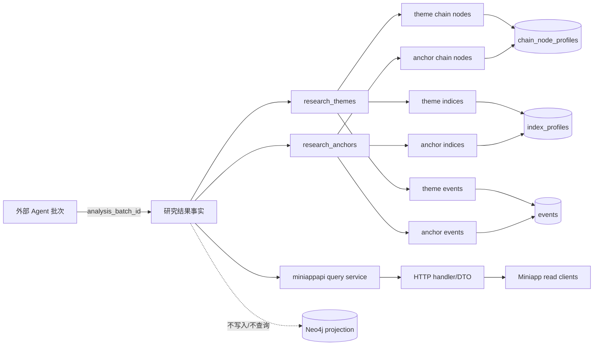

## Context

现有 schema 以 UUID 作为实体、事件和 profile 的主键，关系表通常使用 `created_at`/`updated_at`，文本字段使用 `btrim(...) <> ''`，受控值使用 PostgreSQL `CHECK`。`index_profiles.entity_id`、`chain_node_profiles.entity_id` 和 `events.id` 已存在，且当前主数据可能未完整填充。本 change 只定义研究结果事实结构和 Miniapp 只读读取，不创建研究运行记录，也不把研究结果挂到 `entity_nodes` 的 theme 主数据上。

当前 `backend/internal/apps/miniappapi` 只有包说明，`backend/internal/http/router.go` 的 `registerV1Routes` 为空，没有既有 Miniapp route/cursor/DTO convention；已有 Admin API 使用 Gin、`/admin` 路径、`{"error":"..."}` 错误 JSON 和 RFC3339 时间。故本 change 首次定义 `/api/v1/miniapp/research` 只读边界，并在后续 Apply 中通过依赖注入接入现有 `cmd/api`/`repositories.NewPostgresRepository`，不在 handler 中直接连接数据库。

原型只读核对结果：`renderConclusionNewsCard` 展示高影响/重点关注/持续观察、主线结论、因果路径、受影响产业数量、下一步信号、事件数和“查看影响路径”；`getConclusionCausalView` 将 root fact、support branch、hotspot 和 next checkpoint 组合成 path summary；`evt-ai-supply` 的示例体现主题卡片而非 Event 卡片。锚点截图展示类型、名称、一句话结论、重要性、产业链锚点、相关指数、传导路径/交易指向和关联事件编号。原型 HTML/JS 和截图不是后端源码来源。

边界如下：



## Goals / Non-Goals

**Goals:**

- 建立 8 张 PostgreSQL 表，分别承载主题、锚点及其三类独立关联。
- 提供四个 Miniapp GET endpoint，返回首页卡片、批次摘要、影响路径、锚点层和脱敏 Event 摘要。
- 保证主题与锚点平行、无直接 FK/关联表；一句话结论只是各自结果属性。
- 固定 UUID/FK、外部批次编号、审计字段、非空文本、时间窗口、发布可见性、索引、复合唯一性、分页和 DTO。
- 通过 repository read interface + query application service + HTTP handler 分层实现，并保证列表避免 N+1。

**Non-Goals:**

- 不创建 `research_analysis_runs`、`research_conclusions`、`research_conclusion_*`、路径步骤、评分明细、模型元数据、分类表或 display order。
- 不修改 `theme_profiles`、`entity_nodes`、事件/产业链/指数主数据，不灌入指数或任何研究实例。
- 不做 Agent 生成/导入写 API、定时任务、小程序前端、Neo4j 查询/写入、raw document 内容输出或其他查询 API。

## Decisions

### 1. 两套平行结果，不复用 theme 主数据

`research_themes` 与 `research_anchors` 各自拥有完整结果字段和独立关联表，不共享父表、不互相引用。这样保持“研究主题/锚点”与 `theme-foundation` 中长期主数据概念分离，也避免通用多态关系表掩盖 FK 类型和查询边界。

### 2. 精确数据结构、UUID 和审计字段

所有 `id`、关系主键和 FK 使用 PostgreSQL `UUID`；主记录 ID 由后续写入方在 domain 层生成并显式写入，migration 不依赖 UUID extension 或默认生成器。`analysis_batch_id` 使用 `TEXT NOT NULL` + `btrim <> ''`，是外部 Agent 批次编号，不是本地 FK、运行记录或 UUID。

8 张表均加入 `created_at TIMESTAMPTZ NOT NULL DEFAULT now()` 和 `updated_at TIMESTAMPTZ NOT NULL DEFAULT now()`，仅作为平台一致性/审计字段；关联表不设独立 id。主表与关联表精确结构如下：

| Table | Columns | Constraints |
|---|---|---|
| `research_themes` | `id UUID PK`; `analysis_batch_id TEXT`; `name TEXT`; `one_line_conclusion TEXT`; `impact_level TEXT`; `transmission_path TEXT`; `trading_direction TEXT`; `transmission_stage TEXT`; `next_checkpoint TEXT`; `index_impact_summary TEXT`; `window_start TIMESTAMPTZ`; `window_end TIMESTAMPTZ`; `published_at TIMESTAMPTZ`; `created_at/updated_at TIMESTAMPTZ` | 除时间和 `published_at` 外字段 `NOT NULL`；所有必填文本 `btrim <> ''`；窗口两端必须同时为空或同时存在且 end >= start；受控值 CHECK |
| `research_theme_chain_nodes` | `theme_id UUID`; `chain_node_entity_id UUID`; `relation_role TEXT`; `impact_summary TEXT`; PK(`theme_id`,`chain_node_entity_id`) | theme CASCADE；chain node FK；文本非空 |
| `research_theme_indices` | `theme_id UUID`; `index_entity_id UUID`; `impact_direction TEXT`; `impact_summary TEXT`; PK(`theme_id`,`index_entity_id`) | theme CASCADE；index FK；方向/文本校验 |
| `research_theme_events` | `theme_id UUID`; `event_id UUID`; `evidence_role TEXT`; `supported_claim TEXT`; PK(`theme_id`,`event_id`) | theme CASCADE；event FK；证据/claim 校验 |
| `research_anchors` | `id UUID PK`; `analysis_batch_id TEXT`; `anchor_type TEXT`; `name TEXT`; `one_line_conclusion TEXT`; `importance TEXT`; `transmission_path TEXT`; `trading_direction TEXT`; `published_at TIMESTAMPTZ`; `created_at/updated_at TIMESTAMPTZ` | 必填文本 `NOT NULL` + `btrim <> ''`；受控值 CHECK |
| `research_anchor_chain_nodes` | `anchor_id UUID`; `chain_node_entity_id UUID`; `relation_role TEXT`; `relation_summary TEXT`; PK(`anchor_id`,`chain_node_entity_id`) | anchor CASCADE；chain node FK；文本非空 |
| `research_anchor_indices` | `anchor_id UUID`; `index_entity_id UUID`; `impact_direction TEXT`; `impact_summary TEXT`; PK(`anchor_id`,`index_entity_id`) | anchor CASCADE；index FK；方向/文本校验 |
| `research_anchor_events` | `anchor_id UUID`; `event_id UUID`; `evidence_role TEXT`; `supported_claim TEXT`; PK(`anchor_id`,`event_id`) | anchor CASCADE；event FK；证据/claim 校验 |

所有关系表指向所属主题/锚点使用 `ON DELETE CASCADE`，指向 `events`、`chain_node_profiles`、`index_profiles` 使用默认 `NO ACTION`。主表建立 `analysis_batch_id`、`published_at` 索引；关联表建立反向 FK 索引，复合 PK 已覆盖前缀查询时不重复建同列索引。

### 3. Proposal Review 的受控值候选与可见性

为匹配首页业务语义，首版候选集合固定如下，Apply 不得自行扩大：

| Field | Candidate values | Meaning |
|---|---|---|
| `impact_level` | `high`, `focus`, `watch` | 首页排序与展示级别，排序固定 high > focus > watch |
| `transmission_stage` | `upstream`, `midstream`, `downstream`, `infrastructure`, `service` | 复用产业链既有 stage 惯例，表示传导落点 |
| `relation_role` | `driver`, `beneficiary`, `constraint`, `exposure` | chain node 在主题/锚点传导中的驱动、受益、约束或暴露角色 |
| `importance` | `primary`, `secondary`, `contextual` | 锚点业务优先级，排序 primary > secondary > contextual |
| `evidence_role` | `driver`, `supporting`, `contradicting`, `context` | Event 对结果的主因、支持、反证或背景角色；supporting count 与 driver count 合并去重 |
| `impact_direction` | `positive`, `negative`, `mixed`, `neutral` | 对指数的方向描述，不是收益或交易指令枚举 |
| `anchor_type` | `policy`, `supply`, `demand`, `technology`, `cost`, `geopolitics`, `market_structure` | 锚点观察切入类型 |

`trading_direction` 保持 `TEXT` 自然语言并只做非空校验，不收窄为正负枚举。发布可见性不依赖 status/run 表：`published_at IS NOT NULL` 即已发布；每个查询再要求 `published_at` 落在窗口 `[window_start, as_of]` 内。`as_of` 为首次请求时的 UTC 当前时间，cursor 后续请求复用同一值。

### 4. Miniapp API 路径、参数和响应

统一前缀为 `/api/v1/miniapp/research`，四个 endpoint 固定如下：

| Method / Path | Query | Purpose |
|---|---|---|
| `GET /api/v1/miniapp/research/themes` | `window_hours` 默认 24、范围 1..168；`limit` 默认 20、范围 1..50；`cursor` 可选 opaque cursor | 首页主题列表和批次摘要 |
| `GET /api/v1/miniapp/research/themes/{theme_id}` | `window_hours` 默认 24、范围 1..168 | 主题完整字段、全部节点/指数和 Event 摘要 |
| `GET /api/v1/miniapp/research/anchors` | `window_hours` 默认 24、范围 1..168；`limit` 默认 20、范围 1..50；`cursor` 可选 opaque cursor | 锚点层列表 |
| `GET /api/v1/miniapp/research/anchors/{anchor_id}` | `window_hours` 默认 24、范围 1..168 | 锚点自身、上下游节点、指数和 Event 摘要 |

RFC3339 时间统一输出 UTC；无关联节点、指数或 Event 时 JSON 必须是 `[]`，计数为 `0`，不得是 null。Index 缺失或无映射只返回空数组，不报错。详情 Event 只返回 `event_id/title/summary/event_time/evidence_role/supported_claim`，绝不返回 `raw_documents.content_text`。

主题列表项至少返回：

```json
{
  "id":"theme-ai-capex",
  "name":"算力基建",
  "one_line_conclusion":"算力资本开支维持高位，供给瓶颈向互联和结构材料传导。",
  "impact_level":"high",
  "transmission_path":"算力需求 → 光模块景气 → 结构材料",
  "trading_direction":"关注传导路径中的供给约束与验证节点",
  "transmission_stage":"midstream",
  "next_checkpoint":"下一批光模块与载板交付数据",
  "published_at":"2026-07-17T01:00:00Z",
  "affected_chain_nodes":[{"id":"node-optical","name":"光模块","relation_role":"driver","impact_summary":"订单与出口验证需求"}],
  "related_indices":[],
  "supporting_event_count":7,
  "contradicting_event_count":1,
  "has_more_detail":true
}
```

列表响应统一包含 `window_start/window_end/as_of/theme_count/event_count/items/next_cursor`；锚点列表项包含 `id/anchor_type/name/one_line_conclusion/importance/transmission_path/trading_direction/published_at/related_chain_nodes/related_indices/related_event_count`。`event_count` 是这些主题/锚点关联的去重 Event 数，不是当前 page 的行数。

### 5. 稳定 cursor 语义

cursor 是 opaque base64url JSON，版本化保存 `v`、资源类型、`window_hours`、固定 `as_of`、最后一项的 `impact_rank`/`importance_rank`、`published_at` 和 `id`；客户端不得解析或修改。查询排序键：

- theme：`impact_rank DESC, published_at DESC, id ASC`，rank 为 high=3、focus=2、watch=1。
- anchor：`importance_rank DESC, published_at DESC, id ASC`，rank 为 primary=3、secondary=2、contextual=1。

下一页条件使用严格 keyset predicate：rank 更低，或 rank 相同且 published_at 更早，或两者相同且 id 更大。cursor 的资源类型、窗口或查询版本不匹配返回 400；无下一页 `next_cursor: null`。固定 `as_of` 避免分页期间新发布记录导致重复/漏项。

### 6. Query application service、repository 和路由组成

后续实现按以下边界组织：

- `internal/repositories` 提供 `ResearchReadRepository` interface 与 PostgreSQL implementation，返回 query read model；列表使用 CTE/聚合或批量查询一次性取得主记录、节点、指数、Event 计数，禁止每个 item 单独查询。
- `internal/apps/miniappapi` 提供参数校验、cursor 编解码、as_of/window 计算、query service 和 DTO 映射；service 依赖 repository interface，便于 fake 测试。
- `internal/apps/miniappapi` handler 只处理 Gin path/query、HTTP 状态、JSON DTO 和统一错误；不得访问 `database/sql`。
- `internal/http/router.go` 的 `/api/v1` 组装 Miniapp research routes；`cmd/api` 负责打开 PostgreSQL、构造 repository/service/router，沿用现有依赖注入方向。
- 资源不存在、未发布或不在窗口内统一按 not found 处理；非法 UUID/参数/cursor 返回 400，repository 失败返回 500，错误 JSON 维持 `{"error":"..."}`。

### 7. Migration、回滚和实现边界

后续 Apply 只新增一个按现有 goose 规则命名的 forward-only SQL migration，放在 `backend/migrations/`，创建顺序为两张主表后各自三张关系表，再建立索引和约束。migration 不写任何主数据，不触发 seed。

由于项目迁移惯例禁止破坏性 down，本 change 的 rollback 采用 forward-fix：保留已发布表，若发现 schema 问题则通过新的审阅 migration 增量修正；不执行 DROP，不删除既有事实。local migration apply 属 R2，必须在获批后按 Stateful Layer Map 执行并做 backup、schema、引用表计数断言。

## Risks / Trade-offs

- [受控枚举过早冻结导致 Agent 输出不兼容] → 将首页实际使用的级别、证据角色和锚点类型逐项列入 Proposal Review；未获确认不得扩大。
- [cursor 与排序不一致导致分页重复/漏项] → cursor 固定 as_of、版本、资源类型和完整排序键；服务端拒绝不匹配 cursor，并用边界测试验证。
- [详情窗口导致列表点击时资源过期] → 详情复用显式 `window_hours`，过期/未发布按 not found；前端应以列表响应窗口请求详情。
- [列表出现 N+1 查询或计数重复] → repository 采用批量聚合/CTE，Event 计数按 event_id 去重，并用 query expectation/集成 SQL 测试锁定查询形态。
- [主数据未填充导致 FK 回写失败] → 只建立 FK，不灌入 index/chain/event 主数据；无 index 映射在读取时返回空数组。
- [接口输出泄露原始材料] → DTO 白名单只允许 Event 摘要，不包含 raw document 内容、凭证或内部 Agent 元数据。
- [Miniapp API 首次接入影响现有通用 router] → 保持 `miniappapi` service/handler 独立，通过 `cmd/api` 依赖注入；handler 不承载组装和数据库逻辑。

## Migration Plan

1. Proposal Review 确认表结构、受控集合、发布可见性、API path、DTO、cursor 和错误语义。
2. 获批后按 tasks 先写 schema/repository/query/handler 测试，再实现 migration、domain/repository、query service、DTO 和 routes。
3. 在独立 R2 授权下对 local PostgreSQL 执行一次 preflight → migration → schema assertions；不执行 UAT/prod、seed、业务写入或 Neo4j。
4. 执行 Miniapp API targeted tests、repository SQL tests、受影响 backend suite 和 architecture/task lint。
5. Apply-final Review 通过后，另行取得 Sync/Archive 授权；任何失败通过 forward-fix 修正，不执行 destructive rollback。

## Open Questions

- Proposal Review 必须确认首版 `impact_level` 是否固定为 `high/focus/watch`，以及 `evidence_role` 是否固定包含 `driver/supporting/contradicting/context`。
- Proposal Review 必须确认详情 endpoint 也使用 `window_hours` 默认 24 的窗口可见性（本设计采用该方案）。
- 是否需要在后续 API/Agent change 中对 `analysis_batch_id` 增加格式或幂等唯一约束，本 change 不预设。
