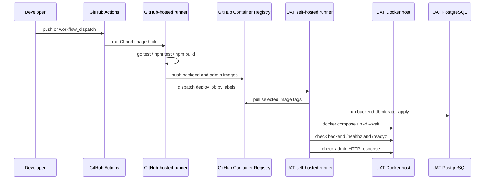
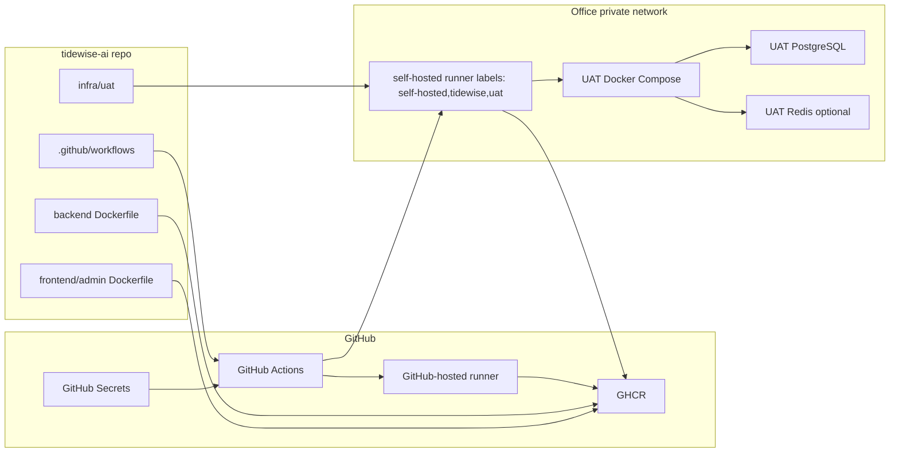

## Context

当前仓库已经具备 `backend/` Go 后端、`frontend/admin/` Vite 管理后台、`backend/config/config.uat.yaml`、数据库 migration 命令和本地 PostgreSQL compose 模板，但还没有 `.github/workflows/`、生产或 UAT Dockerfile，也没有 UAT 部署模板。用户目标是通过 GitHub Actions 机制完成观潮家 backend 和 admin portal 的打包与 UAT 环境部署。

UAT 发布的网络边界是：GitHub 云端可以编排 CI 和构建镜像，但办公室私有网络内的 UAT 机器不能要求暴露给 GitHub 云端。部署执行必须由办公室网络内的 GitHub Actions self-hosted runner 主动连接 GitHub、拉取任务，并在内网访问 UAT 服务器、PostgreSQL、Redis 或 Docker 环境。

本 change 不实现新的后端业务功能和前端页面功能。后端代码仍复用已有 `backend/cmd/admin-api`、`backend/cmd/dbmigrate`、统一 config、migration 和健康检查；管理后台仍复用 `frontend/admin` 的 Vite 构建产物。实现重点是把已有运行边界打包为可重复的 UAT 发布机制。

## Goals / Non-Goals

**Goals:**

- 建立 GitHub-hosted runner 上的轻量 CI，验证 backend 和 admin portal 在干净环境中可测试、可构建。
- 建立 backend 和 admin portal 的 Docker image 构建与 GHCR 发布约定。
- 建立 UAT self-hosted runner 部署流程，使 UAT 环境从明确镜像版本启动服务。
- 建立 `infra/uat` 模板，记录 compose 服务、环境变量、secret 注入、runner labels、健康检查和回滚方式。
- 保持真实 secret 只存在于 GitHub Secrets、UAT runner 环境或 UAT 未提交 `.env` 文件中。

**Non-Goals:**

- 不发布微信或抖音小程序。
- 不实现 prod 部署、高可用、多机编排或 Kubernetes。
- 不搭建办公室网络、VPN、域名、证书或防火墙规则。
- 不把真实数据库密码、Admin Token、GHCR token 或生产连接串写入 repo。
- 不新增业务 API、页面、数据表或采集逻辑。

## Decisions

### Decision: 云端 CI 和内网部署分离

GitHub-hosted runner 负责测试、构建镜像和推送 GHCR；UAT self-hosted runner 负责拉取镜像、执行 migration、启动服务和健康检查。

选择该方案是因为它避免 GitHub 云端直接访问办公室内网，同时保留 GitHub Actions 的编排、日志和审批能力。备选方案一是把所有步骤都放在 self-hosted runner 上，优点是网络简单，缺点是 runner 需要承担依赖安装、构建和部署全部负载，且更容易受内网机器环境污染。备选方案二是让 GitHub-hosted runner 通过 VPN 进入内网，早期网络复杂度过高，本 change 不采用。

### Decision: 镜像是部署边界，UAT 不临场编译

backend 和 admin portal 都应在 CI 阶段构建为镜像并推送到 GHCR。UAT runner 只拉取镜像并部署，不在 UAT 机器上执行 Go 或 Node 构建。

这样可以保证部署产物和 CI 验证使用同一份提交，降低 UAT 机器依赖 Go、Node、npm cache 或未提交文件的风险。备选方案是在 UAT runner 上 `git pull` 后编译，虽然更直观，但不可重复性和回滚成本更高。

### Decision: UAT 镜像目标为 Linux ARM64

当前 UAT Docker host 运行在 Apple Silicon Mini 的 Linux ARM64 虚拟化环境中。因此 GitHub-hosted runner 必须通过 Buildx 构建并发布 `linux/arm64` backend 和 admin portal 镜像；UAT runner 只拉取对应架构的镜像。第一版不额外发布 `linux/amd64` 多架构 manifest，以缩短 UAT 发布链路；后续新增 AMD64 部署目标时应通过独立 change 扩展为多架构发布。

### Decision: backend image 包含服务进程和 migration 命令

backend Dockerfile 应从 `backend/` Go module 构建至少两个可执行文件：`admin-api` 和 `dbmigrate`。UAT compose 默认运行 `admin-api`；部署流程在启动或更新服务前用同一 backend image 运行 `dbmigrate -apply`。

这样 migration 来源、Go 依赖和服务二进制来自同一镜像版本，避免 UAT 部署时混用不同提交。未来如果新增 `ingestion-scheduler` 或 `miniapp-api`，应在独立任务中扩展同一镜像或新增专用镜像。

### Decision: admin portal 使用静态容器服务

admin portal Dockerfile 应执行 `frontend/admin` 的 `npm` 安装和 `npm run build`，再用轻量 HTTP server 或 Nginx 承载 `dist/`。UAT 环境通过非敏感构建参数或运行时配置明确后端 Admin API base URL，真实 Admin Token 仍由管理员登录输入或 UAT secret 注入后端。

本 change 不改变 Minimal Dashboard 页面实现，不复制 prototype 或 preview HTML。

### Decision: UAT 部署模板放入 `infra/uat`

`infra/uat` 应包含 compose 模板、`.env.example` 和操作说明。compose 模板只引用镜像、端口、网络、健康检查和环境变量名；真实 `.env` 必须由 UAT 机器本地维护且不提交。

### Decision: UAT 发布手动触发，后续再考虑自动触发

第一版 `deploy-uat.yml` 应支持 `workflow_dispatch`，输入镜像 tag 或默认使用当前提交 SHA。这样用户可以先熟悉 UAT runner 和部署结果，再决定是否把 `main` 合并自动部署到 UAT。

## Component Model

## Risks / Trade-offs

- [Risk] self-hosted runner 权限过大，可能影响 UAT 主机安全。→ Mitigation：runner 使用专用机器或专用系统用户，workflow 只允许受保护分支或手动触发，runner label 精确匹配 `self-hosted,tidewise,uat`。
- [Risk] GHCR 权限或私有镜像拉取失败。→ Mitigation：优先使用 GitHub Actions `GITHUB_TOKEN` 推送；UAT runner 配置只读拉取凭证或使用 GitHub runner 上下文登录 GHCR。
- [Risk] migration 执行成功但服务启动失败、启动后立即探测过早，或 Colima 主机端口转发与容器网络不一致。→ Mitigation：部署流程必须先拉取镜像、执行 migration，再使用带超时的 `docker compose up -d --wait` 等待容器 healthcheck 成功，最后通过 `docker compose exec -T` 在 backend/admin 容器内运行 HTTP 健康检查；失败时保留上一版本回滚说明。
- [Risk] admin portal 的 API base URL 在构建时固化后不适配 UAT。→ Mitigation：第一版明确 UAT 配置来源，优先使用 compose/nginx/runtime 配置或可审计构建参数；不得把 secret 编译进前端。
- [Risk] 云端 CI 误连接真实内网数据库。→ Mitigation：CI 只运行不依赖真实外部服务的测试和构建；数据库 migration apply 只在 UAT self-hosted runner 部署阶段执行。

## Migration Plan

1. 在 propose 阶段创建本 change artifacts 并通过 `openspec validate define-uat-github-actions-deployment`。
2. 在 apply 阶段新增 Dockerfile、GitHub Actions workflow、`infra/uat` 模板和健康检查脚本。
3. 本地验证 backend Go 测试、admin 测试和构建、Dockerfile 语法或可构建性。
4. 在 GitHub repo 设置中注册 UAT self-hosted runner，并添加 labels：`self-hosted`、`tidewise`、`uat`。
5. 在 GitHub Secrets 或 UAT runner 本地 `.env` 配置 UAT 所需 secret。
6. 手动触发 `deploy-uat.yml`，确认镜像拉取、migration、compose 启动和健康检查通过。
7. 如部署失败，使用 `infra/uat` 文档中的上一镜像 tag 回滚，并保留失败日志用于修复。

## Open Questions

- UAT self-hosted runner 是单独机器，还是暂时与 UAT Docker host 同机运行？
- UAT admin portal 对外访问域名、端口和反向代理由本 change 管理，还是由办公室现有网关独立管理？
- GHCR image visibility 使用私有还是公开？默认建议私有。
