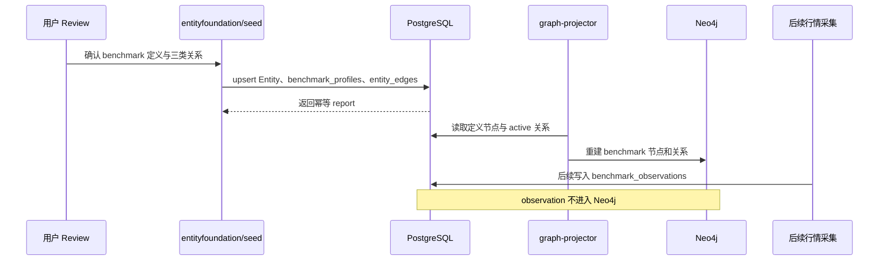
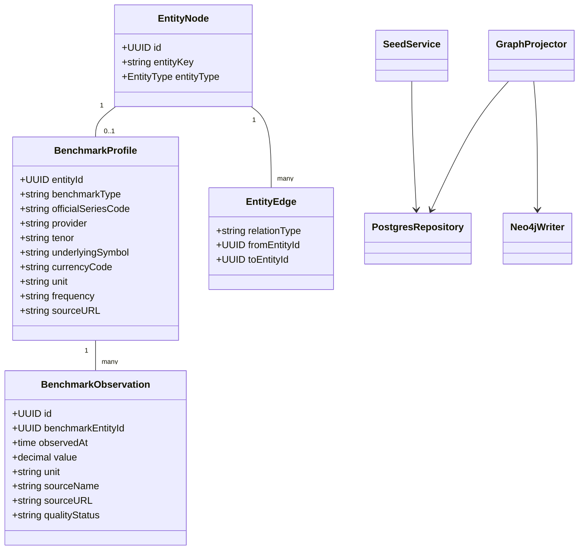

## Context

当前实体图已经完成经济体、市场和正式指数关系清洗，PG 有 548 个实体，Neo4j 是其可重建投影。此前被误建为 index 的五个主权债收益率、三类商品价格和两个数字资产参考利率已从现有 seed 与本地图谱移除。系统尚无 benchmark 类型、profile 或观测值表，因此事件推导无法把“日本 10 年期国债收益率上升”等行情事实稳定映射为市场观测对象。

现有 `metric` 表达通用测量维度，`commodity` 表达实物标的，`instrument` 表达交易工具类别，`index` 表达有明确编制方法的正式指数。benchmark 必须在这四者之间建立具体、可观测、可追溯的定义层，同时避免把逐时点值塞入 Neo4j。

## Goals / Non-Goals

**Goals:**

- 新增 benchmark 实体、profile 和 PostgreSQL 观测值 schema。
- 明确 index、benchmark、metric、commodity、instrument、observation 的互斥语义。
- 新增三类客观关系并沿用人工 review、PG 事实源和 Neo4j 重建流程。
- 首批迁移 10 个跨资产 benchmark，并保证官方 series code 不明确时使用空值而不是内部伪代码。
- 修正 `metric:fear_index` 与 `index:vix` 的重复语义。
- 使用 TDD 覆盖 migration、loader、profile repository、关系策略、观测值幂等和图投影。

**Non-Goals:**

- 不实现实时行情 connector、scheduler、外部 API 调用或历史数据回填。
- 不提供面向前端的行情 API，不生成事件影响、方向、强度或投资建议。
- 不把 observation 投影为 Neo4j 节点或关系。
- 不在本 change 建设市场、板块、商品和产业链传导规则。
- 不创建 BTC、ETH 等具体 instrument 实体；现有 instrument 继续表达工具类别。

## Decisions

### Decision: benchmark 是具体观测定义，observation 是时序事实

`benchmark` 表达稳定定义，例如“美国 10 年期国债收益率”或“CME CF Bitcoin Reference Rate”。`benchmark_observations` 表达某个时间点的数值。两者分离可以让图谱路径稳定，同时让高频数据留在适合过滤、排序和聚合的 PostgreSQL。

不选择把 benchmark 继续放入 index，因为收益率和现货价格通常不是正式指数；也不选择只用 metric，因为 `metric:government_bond_yield` 无法区分国家、期限、来源和 series code。

### Decision: PostgreSQL 保存定义和观测，Neo4j 只投影定义

PG 继续作为事实源，保存 `entity_nodes`、`benchmark_profiles`、`benchmark_observations` 和 `entity_edges`。Neo4j 投影 benchmark 的 `Entity` 节点以及 `OBSERVES_BENCHMARK`、`MEASURES`、`REFERENCES`，不投影每个观测点。

这样避免高频观测值造成图节点爆炸，也保持“删掉 Neo4j 后可以从 PG 重建”的现有架构。

### Decision: benchmark profile 使用最小稳定字段

`benchmark_profiles` 包含：

- `entity_id`：对应统一实体节点。
- `benchmark_type`：`government_bond_yield`、`futures_price`、`spot_price` 或 `reference_rate`。
- `official_series_code`：可空；只保存来源机构公开定义的代码。
- `provider`：发布或管理机构稳定 key。
- `tenor`：可空，例如 `10Y`。
- `underlying_symbol`：可空，例如 `BTCUSD`、`ETHUSD`。
- `currency_code`、`unit`、`frequency`、`source_url`。

市场归属不在 profile 中重复保存，由 `observes_benchmark` 表达。商品或工具类别由 `references` 表达。

### Decision: observation 使用可审计幂等模型

`benchmark_observations` 包含 UUID 主键、benchmark FK、`observed_at`、numeric value、unit、source name、source URL、external series code、quality status、created/updated time。唯一约束使用 `(benchmark_entity_id, observed_at, source_name)`，允许同一 benchmark 接受不同权威来源，同时保证单一来源重试幂等。

`quality_status` 只允许 `raw`、`validated`、`suspect`、`rejected`。当前 change 只实现 repository 与测试，不导入真实行情值。

### Decision: 使用三类明确关系

- `market -> observes_benchmark -> benchmark`：市场关注或由该基准代表。
- `benchmark -> measures -> metric`：具体 benchmark 测量的通用维度。
- `benchmark -> references -> commodity/instrument`：benchmark 对应的实物标的或交易工具类别。

五个国债收益率连接 `metric:government_bond_yield`；Brent/WTI 连接 `metric:oil_price` 和对应 commodity；黄金连接本 change 新增的 `metric:gold_price` 并引用 `commodity:gold`；BTC/ETH 连接 `metric:exchange_rate`，引用 `instrument:digital_asset` 并通过 `underlying_symbol` 区分。WTI 在当前不新增 NYMEX 市场实体的约束下暂由 `market:global_commodity_futures` 观测，后续独立新增 `market:nymex` 后迁移到精确端点。

不在关系中保存涨跌、利好利空、影响方向或强度。

### Decision: 首批 seed 先 review 后写入

首批 10 个 benchmark 保留此前审阅的权威来源，但重新核验名称、类型、provider、官方 series code、单位、频率和关系。无法确认官方代码时 `official_series_code` 保持 null，禁止使用 `CN_10Y_GOV_YIELD` 等内部占位符冒充官方代码。

tasks 4.1-4.3 的 repo/PG 只读审计、精确迁移方案、首批 10 个 benchmark 候选和三类关系候选统一记录在 [Benchmark Foundation 审阅清单](reviews/benchmark-foundation-review.md)。该清单在 task 4.4 用户明确确认前不得转写为正式 seed 或数据库数据。

### Decision: 将 fear_index 迁移为 implied_volatility

`index:vix` 保留为 Cboe 正式指数。通用 metric 改为 `metric:implied_volatility`，名称为“隐含波动率”，表达测量维度而非某个指数。实现前检查 `metric:fear_index` 的 PG 引用；无业务引用时受控迁移并删除旧 key，有引用时先迁移引用再删除。

### Decision: 沿用 entityfoundation 模块边界

benchmark seed 和 profile 写入继续放在 `internal/apps/entityfoundation/seed`，观测值领域模型放在 `internal/domain`，repository 放在 `internal/repositories`。不新建平行服务。

## Risks / Trade-offs

- [Risk] benchmark 与 index 再次发生语义漂移。 → 在 seed 测试中禁止收益率、现货价和参考利率使用 index 类型，并为 benchmark_type 设置枚举约束。
- [Risk] 官方 series code 在不同来源中不统一。 → 字段允许 null，只保存来源机构可核验代码，不生成内部伪代码。
- [Risk] profile 市场字段和关系重复。 → profile 不保存 market FK，市场归属只由 `observes_benchmark` 表达。
- [Risk] observation 数量未来快速增长。 → 当前使用复合唯一索引和 benchmark/time 索引；分区、压缩和 retention 由真实采集 change 根据容量设计。
- [Risk] 删除 `metric:fear_index` 影响现有引用。 → 实现前查询 PG 和 repo 全部引用，在事务中迁移并核验后再删除。
- [Risk] 首批只覆盖 10 个 benchmark，无法支撑完整跨资产分析。 → 当前先验证模型与流程，后续按 review gate 增量扩展。

## Migration Plan

1. 使用 TDD 增加 migration 静态测试、实体类型测试、profile/observation repository 测试和关系策略测试。
2. 追加非破坏性 migration，创建 `benchmark_profiles`、`benchmark_observations`、约束与索引。
3. 实现 benchmark 实体/profile seed、report、repository 和三类关系映射。
4. 生成首批 10 个 benchmark 审阅清单，用户确认前不写正式 seed 或数据库。
5. 受控迁移 `metric:fear_index`，写入已确认 benchmark 与关系并核验 PG。
6. 重建 Neo4j，核验 benchmark 定义和三类关系，不出现 observation 节点。
7. 运行 `go test ./...` 和 OpenSpec 全局校验。

回滚不删除已经产生的观测数据。代码回退通过后续前向 migration 兼容；若首批 seed 需要撤回，只将对应关系和实体标记 inactive 或执行经过确认的 local 精确清理。

## Open Questions

- 首批 10 个 benchmark 的最终官方 series code、频率和单位在 review 清单中逐项确认。
- 真实行情 connector、历史回填范围和 observation 分区策略由后续 `add-benchmark-market-data-ingestion` change 决定。
