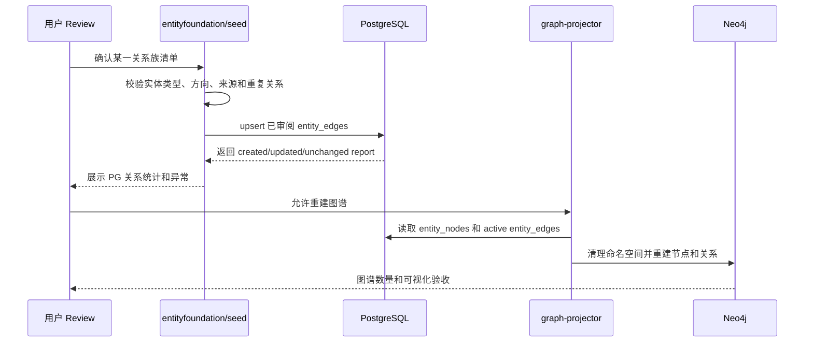
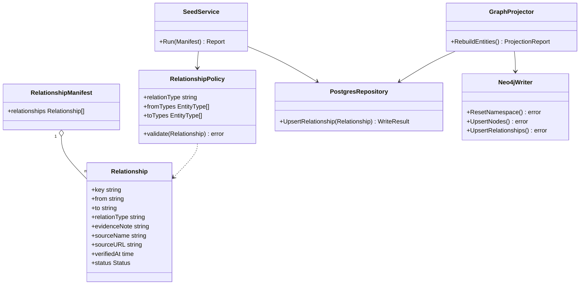

## Context

实体基础库当前包含 535 个左右实体节点以及 78 条样例关系。实体节点和各类型 profile 已经作为主数据保存在 PostgreSQL；关系则集中在 `backend/data/entity_foundation/relationships.json`，仅覆盖 7 个关系类型，且 `member_of` 只有 10 条，无法作为后续事件实体关联和图谱推理的可信基础。

Neo4j 当前是 PostgreSQL 的可重建投影，不是事实源。`graph-projector rebuild-entities` 已经能够清空指定命名空间后，从 PostgreSQL `entity_nodes` 和 `entity_edges` 重建实体节点与关系。因此本 change 可以先建立空关系基线，再逐批恢复已审阅关系。

## Goals / Non-Goals

**Goals:**

- 保留 PostgreSQL 全部实体节点和 profile，清空 local `entity_edges`，并防止实体 seed 自动恢复旧样例关系。
- 清空 local Neo4j 中的节点和关系数据，同时保留数据库、约束和索引配置。
- 建立关系族分批 review、校验、写入 PG、重建 Neo4j 和验收的固定流程。
- 为每条关系保存最小来源元数据，支持后续核验和更新。
- 第一批完成联盟组织与国家/经济体的 `member_of` 关系清洗；后续关系族按 review gate 逐批推进。
- 第二批在写入 `has_market` 前补足事件投研第一版所需的核心债券、商品和关键区域市场实体，并对新增实体单独 review。
- 通过 TDD 覆盖 migration、loader、validator、repository、report 和 graph projection 边界。

**Non-Goals:**

- 除第二批 review 通过的最小市场实体增量外，不修改实体主数据名称、类型、profile 或 aliases；其他实体主数据问题另行记录并经用户确认。
- 不实现事件提取、事件实体关联、事件图谱或 AI 推理。
- 不实现生产环境或管理后台可调用的一键清空接口。
- 不建立完整的关系历史版本、双时态模型或独立证据表。
- 不修改 `frontend`、`prototype` 或 `doc`。

## Decisions

### Decision: 先建立空关系基线，再逐批恢复

先把 repo 默认关系 seed 调整为空基线，再在事务中删除 local PostgreSQL `entity_edges`，最后清空 local Neo4j 节点和关系。该顺序避免数据库清空后再次运行 `entity-seed` 时恢复旧关系。

不选择“直接在现有 78 条关系上修补”，因为无法明确区分已审阅关系与历史样例；也不选择删除实体节点，因为实体主数据已经确认且被 profile、市场、证券和后续事件能力复用。

### Decision: 清空是受控 local 操作，不是 destructive migration

关系清空不得写入会在 uat/prod 自动执行的 migration，也不新增公开 reset API。执行前必须验证目标环境为 local，记录实体和关系数量；PG 操作只执行 `DELETE FROM entity_edges`，执行后再次确认实体数量未变化、关系数量为零。

Neo4j 清空只删除节点和关系数据，不删除约束、索引、用户、database 或 volume。清空后必须验证节点数和关系数均为零。

### Decision: 每个关系族独立 seed 文件并设置人工 review gate

关系数据从单一 `relationships.json` 收敛为 `backend/data/entity_foundation/relationships/` 下按关系族管理的文件。关系治理能力支持以下关系族：

1. `member_of`：国家/经济体属于联盟组织。
2. `has_market`：国家/经济体拥有或对应市场。
3. `tracks_index`：市场对应代表指数。
4. `issues`：公司发行证券。
5. `participates_in`：公司参与具体产业链节点。
6. `affiliated_with`：人物与机构或公司的客观任职/从属关系。
7. `applies_to`：指标适用于交易工具、商品或产业链节点。

每一批先生成包含中文名称、实体 key、关系方向、来源和核验时间的审阅清单。用户明确通过后，才允许写入正式 seed 文件、执行 `entity-seed` 并更新 PostgreSQL。下一批不能在前一批 PG 和 Neo4j 验收前开始。

本 change 实际写入并验收前三个投研优先关系族：`member_of`、`has_market` 和 `tracks_index`。其余关系类型继续保留 loader、policy、repository 和 Neo4j mapper 支持，但没有通过 review 的数据文件保持为空。

### Decision: 按事件推导价值调整后续关系优先级

产品第一版不输出具体股票推荐，事件推理需要先贯通“经济体与政策 -> 市场 -> benchmark、指标与商品 -> 板块 -> 产业链节点”。因此公司发行证券的 `issues`、公司参与产业链的 `participates_in` 和普通人物从属关系暂不写入。`applies_to` 依赖 metric、benchmark、commodity 和 instrument 的语义复核，也延后到 benchmark 基础与市场产业传导设计之后。

后续顺序为：

1. `add-market-benchmark-foundation`：新增 benchmark 定义、观测值和市场观测关系。
2. `build-market-sector-chain-transmission-foundation`：整理市场、板块、商品、指标和产业链节点之间的客观传导基础。
3. 在需要公司暴露和证券落点时恢复 `participates_in` 与 `issues`。

`reviews/issues.md` 仅保存已生成的 77 条候选输入，不代表 review 通过，也不允许被当前 seed 自动加载。

### Decision: 第二批先补齐跨资产市场覆盖

现有市场实体以股票市场和证券交易所为主，只能支撑事件到股票指数的基础映射，无法完整承接利率、财政、通胀、制裁、能源和供应链事件。第二批 `has_market` 在关系写入前增加最小市场实体补充 review，优先覆盖：

- 中国、美国、欧元区、日本和英国的核心主权债券或利率市场。
- 上海国际能源交易中心、大连商品交易所、郑州商品交易所、伦敦金属交易所，以及拆分后的具体 ICE 交易场所。
- 沙特阿拉伯、印度尼西亚和越南等与能源、资源和制造业转移高度相关的区域股票市场。

新增市场必须具备稳定 entity key、规范名称、所属经济体、币种、市场类别和权威来源。现有 27 条无歧义 `has_market` 关系已通过 review；`market:europe_stock`、`market:ice` 和三个以 `economy:global` 为端点的聚合关系暂不写入。补充市场清单通过 review 后，才允许把新增市场及全部已确认 `has_market` 关系写入正式 seed。

### Decision: 区分抽象市场与交易场所

`market` 实体允许同时表达抽象市场和具体交易场所，但 profile 必须通过明确类别区分。事件推导以抽象市场作为主要影响落点，交易场所用于指数归属、行情来源和基础设施关系；同一事件不得把抽象市场及其交易场所重复计为多个独立影响对象。

`economy:global` 是分析聚合实体，不代表真实属地，因此不得通过 `has_market` 连接全球外汇、全球商品期货或全球数字资产市场。跨地域聚合市场后续应通过分析范围或适用关系表达。

### Decision: 第三批只保留正式指数关系

`tracks_index` 只表达 `market -> index`，其中 `index` 必须是具有明确编制机构和方法的正式指数。道琼斯指数改挂美国股票市场，MSCI World 和 MSCI EM 改挂新增全球股票市场，中债综合指数改挂中国债券市场，并补充沙特 TASI、印度尼西亚雅加达综合指数和越南 VN-Index。第三批最终形成 43 条 `tracks_index` 客观关系。

语义复核后，以下 10 个概念不属于 `index`：中国、美国、欧元区、日本和英国 10 年期政府债券收益率，Brent 与 WTI 连续价格，黄金现货价格，以及 CME CF Bitcoin 和 Ether 参考利率。当前 change 从 `indices.json` 和 `tracks_index.json` 移除这些错误类型及关系，由后续 `add-market-benchmark-foundation` 建立 `benchmark`、`observes_benchmark` 和观测值存储后再迁移。

`market:global_equity` 和 `market:global_precious_metals` 只表达跨地域分析市场，不与 `economy:global` 建立 `has_market`。市场实体可以先于关系存在；商品与等级层级、合约关系、benchmark 实时采集均不属于当前 change。

### Decision: 使用最小关系来源元数据

`Relationship` 和 `entity_edges` 在保留 `evidence_note` 的基础上增加：

- `source_name`：官方机构或权威来源名称。
- `source_url`：可核验来源地址。
- `verified_at`：本次关系事实核验时间。

不在本 change 引入完整证据表、`valid_from`、`valid_to` 或历史版本。成员资格等会变化的事实通过后续更新同一稳定关系 key、来源和核验时间维护；需要历史查询时再通过独立 change 扩展。

### Decision: 关系类型和方向使用显式规则表校验

seed validator 必须按照 `relation_type` 校验允许的 from/to 实体类型组合。例如 `member_of` 只允许 `economy -> alliance_org`，`issues` 只允许 `company -> security`。validator 还必须拒绝自环、重复端点与关系类型组合、悬空 key、缺少来源、非法 URL 和推理性关系。

关系方向继续采用当前语义，不为反向查询复制一条反向事实；Neo4j 查询可以通过无向匹配或反向 traversal 使用同一条关系。

### Decision: PostgreSQL 验收后统一重建 Neo4j

每批关系写入 PG 后，先校验 PG 节点数量、该批关系数量、关系方向和来源字段，再运行 `graph-projector rebuild-entities`。Neo4j 只接收 PostgreSQL 中 active 的已审阅关系，不允许手工补关系。

Neo4j 投影节点统一使用 `Entity` 标签，不再叠加与数据集合完全相同的 `TidewiseEntity` 标签。所有图数据都来自 PostgreSQL，节点归属继续通过 `projection_namespace=tidewise` 标识；重建和清理必须使用 `Entity + projection_namespace` 限定范围。

## Risks / Trade-offs

- [Risk] 清空 local 关系后，事件提取前暂时没有实体关系可查询。 → 通过逐批 review 和重建恢复，且当前尚未启用正式事件提取流水线。
- [Risk] 联盟成员资格、任职和市场关系会随时间变化。 → 保存来源和 `verified_at`，后续按稳定 key 更新；历史版本不在本 change 范围。
- [Risk] 单个 change 覆盖 7 类关系，持续时间可能较长。 → 每类关系设置独立 review、测试和提交检查点，tasks 状态明确记录进度。
- [Risk] 误连非 local 数据库可能造成数据丢失。 → 清空不进入 migration，运行前强制核验 local 配置、数据库名和计数；本 change 不提供 uat/prod reset 入口。
- [Risk] 只保存单一来源可能不足以证明争议关系。 → 当前仅保存权威主来源；需要多证据时再引入独立关系证据表。

## Migration Plan

1. 新增增量 migration，为 `entity_edges` 增加 `source_name`、`source_url` 和 `verified_at`，不删除任何现有数据。
2. 完成 loader、policy validator、repository 和 report 的测试及实现。
3. 将旧样例关系从默认 seed 路径移除，建立空关系基线和按关系族目录。
4. 在 local PG 执行受控关系清空，确认 `entity_nodes` 和 profile 数量保持不变。
5. 清空 local Neo4j 数据，确认节点和关系均为零、约束和索引仍存在。
6. 按 review gate 从 `member_of` 开始逐批写入 PG、重建 Neo4j 并验收。

回滚时不恢复未经审阅的旧关系。代码和 migration 可以通过后续兼容变更回退；关系数据只能重新应用已经通过 review 的 seed 批次。旧样例数据仍可从 Git 历史查阅，但不得直接回灌。

## Open Questions

- 每个关系族的具体实体清单、来源和数量在进入该批 review 时逐项确认，不在本设计中预先锁死。
