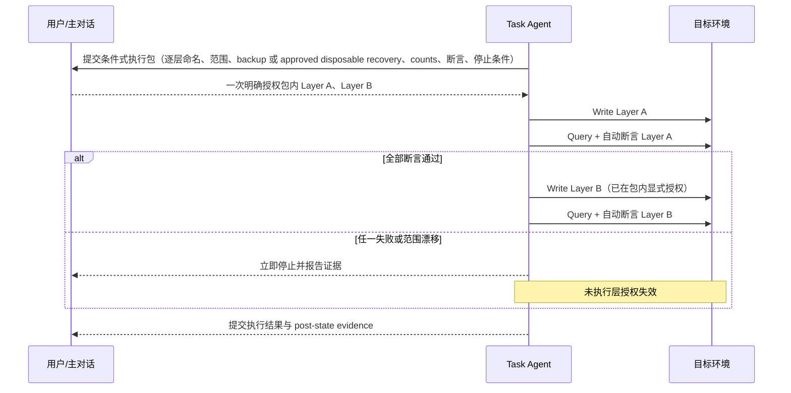
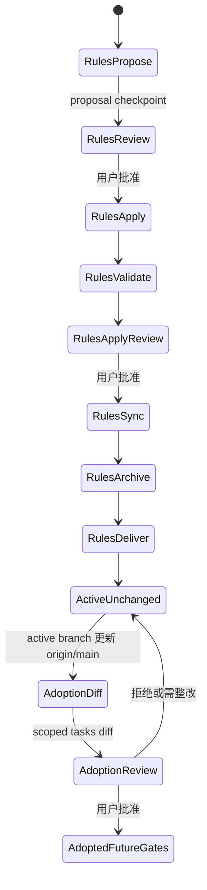

## Context

现有规则已经确立 OpenSpec 全生命周期、Proposal/Apply 后人工 Review、Desktop-managed worktree、分层数据操作与交付清理硬门，但 active change 的 tasks 显示三类复杂度正在叠加：普通实现 checkbox 被写成人工 gate、候选数据正常项被逐条审阅、每个数据层都重复请求授权。结果是低风险工作被频繁打断，而高风险授权的环境、范围、断言和停止条件仍可能散落在多个消息中。

本 change 只调整仓库内研发流程契约。它不修改业务代码、migration、seed、数据库、图谱或部署状态。新规则必须在效率优化与授权不可推定之间保持清晰边界。

## Goals / Non-Goals

**Goals:**

- 用 R0—R3 统一描述 change、阶段和操作风险，并让人工 gate 必须说明风险理由。
- 用阶段 Review package 合并可共同验收的 contract、实现、测试、dry-run 与只读 preflight。
- 让验证深度随风险与生命周期递增，避免每个微型 task 都运行全量验证或提交。
- 在主对话验收前强制 task agent 完成内部 self-review/code review 与阻断整改。
- 用生成规则、抽样和异常/冲突清单审阅规模化候选，同时保留高风险项逐项审阅。
- 用条件式执行包一次明确授权多个 R2 命名层，仍保证每层都是显式授权且按 `Write -> Query` 自动断言串行推进。
- 为 active changes 提供只影响未来 gate 的显式 adoption 路径。

**Non-Goals:**

- 不缩短、跳过或调换 `Explore -> Propose -> Review -> Apply -> Validate -> Sync -> Archive -> Deliver`。
- 不取消 Proposal 后或 Apply 后人工 Review。
- 不改变 Desktop worktree/branch、PR、merge 或 cleanup 所有权边界。
- 不把普通 Apply 批准、历史批准或上一层批准解释为数据库、图谱或部署授权。
- 不允许 R3 默认跨层批量执行，不合并生产、不可逆清理或 Neo4j rebuild 的独立授权。
- 不自动重写 active change，不追认历史操作，不扩大既有授权。
- 不修改业务源码、`prototype/`、`doc/`、数据库或部署环境。

## Decisions

### 1. 风险等级采用“change 基线 + 操作上调”

每个正式 change 在 Proposal 中声明基线等级；阶段或命名操作可以上调，不能仅因同一 change 的其他工作较低风险而下调。混合风险 change 按当前操作最高等级执行对应 gate。

| 等级 | 定义 | 典型范围 | 最低人工边界 |
|---|---|---|---|
| R0 | 文档、调研、只读审计 | OpenSpec artifacts、规则说明、只读查询、diff 审阅 | Proposal/Apply 生命周期 Review；额外 gate 仅在有明确风险理由时设置 |
| R1 | 源码/测试变更但无有状态写入 | API、前后端实现、测试、migration/seed 代码但不 apply | 阶段 Review package、targeted tests、受影响交付边界的完整验证 |
| R2 | 可恢复的 migration、seed、本地/UAT 数据变更 | PostgreSQL schema/data 写入、UAT 可恢复变更 | 明确授权、可验证 recovery evidence、pre/post assertions、命名层 `Write -> Query` |
| R3 | 生产、高破坏性或特殊投影操作 | 生产变更、不可逆清理、Neo4j rebuild、敏感部署 | 独立授权、备份/恢复或等价灾难恢复证据；默认不得跨层批量；cleanup 若为 R3 必须单独 |

选择该方案而不是“按文件类型固定等级”，因为同一 migration 文件的静态审阅是 R1，而实际 apply 可能是 R2 或 R3。风险属于操作及环境，不只属于 artifact。

### 2. 普通 task 与人工 gate 分离

普通 checkbox 表示可验证工作单元，不自动成为人工门禁。人工 gate 必须显式命名为 `Review Gate`、`Authorization Gate` 或 `Acceptance Gate`，并记录：风险等级、风险理由、所需证据、通过后允许的下一步、明确不授权的操作。

#### Before / After gate 表

| 场景 | Before | After |
|---|---|---|
| 微型实现 task | checkbox 常被写成一次 Review | checkbox 完成后汇入阶段 Review package，不单独打断 |
| Contract + 实现 + 测试 | 分散验收，重复上下文 | 在无状态写入前组成同一阶段 package 验收 |
| 候选数据 | 全部正常项机械逐条确认 | 生成规则 + 可复现抽样 + 异常/冲突清单；高风险/宽边界/冲突逐项 |
| checkpoint | 每个微型 task commit/push | 每个可独立验证阶段形成一个 commit/checkpoint |
| R2 多层数据写入 | 每层临时重新描述与授权 | 可使用一次明确的条件式执行包预授权多个命名层 |
| R3 操作 | 可能混入数据阶段 | 生产、不可逆 cleanup、Neo4j rebuild、敏感部署独立授权 |
| task agent 通知验收 | 直接提交结果给主对话 | 先 self-review/code review，阻断问题整改后再通知 |

### 3. 阶段 Review package 是验收单位

一个 package 可以包含同一风险边界内的 contract、实现、测试、dry-run、只读 preflight、diff、异常清单和验证结果。package 必须说明 scope、non-goals、风险等级、证据、未验证项、阻断项和下一步授权边界。它不得跨越 Proposal 后或 Apply 后人工 Review，也不得把 R2/R3 有状态授权隐含在普通实现验收中。

阶段级 checkpoint 对应一次内聚的 Review package；不要求每个微型 task commit、push 或 Review。若 package 内出现阻断缺陷，task agent 在提交主对话前先修复并刷新证据。

### 4. 验证随风险和生命周期递增

#### 验证矩阵

| Checkpoint | R0 | R1 | R2 | R3 |
|---|---|---|---|---|
| Artifact/阶段 checkpoint | OpenSpec validate、scoped diff、secret 检查 | R0 + targeted tests | R1 + 只读 preflight、可验证 recovery evidence、before state/counts | R2 + 环境/权限/备份恢复或灾难恢复路径/停止条件专项检查 |
| 命名操作执行后 | 不适用 | 不适用 | post state/counts、幂等/保护断言；全部通过才进入下一预授权层 | 独立 post assertions；不得默认进入下一层 |
| Apply final | OpenSpec strict、diff/scope/secret、受影响交付边界的完整验证 | R0 + 共享 architecture/contract tests | R1 + 全部 R2 pre/post 证据汇总 | R2 + 全部 R3 独立授权与恢复证据汇总 |

阶段 checkpoint 运行与变更范围匹配的 targeted tests。Apply final 必须完整运行受影响 app/module/package 的 suite，并运行共享 architecture/contract tests；只有共享规则、跨模块契约、公共基础设施或 repo-wide 变更才强制 repo-wide full validation。选择记录必须写明受影响交付边界、共享测试与是否触发 repo-wide 的理由；边界、理由或 suite 不清楚时 fail-closed，不得自行降级，应扩大到 repo-wide 或停止等待澄清。本 workflow change 修改全项目规则与 architecture tests，故 Apply final 仍必须运行 `go test ./...`、相关 OpenSpec 与规则检查。任何环境限制、未验证项或失败必须进入 package，不能用旧日志替代。

### 5. 候选数据按风险聚焦审阅

候选 package 必须包含：候选生成规则与版本/输入指纹、总体 counts、确定性抽样方法与样本、异常/冲突清单、宽边界清单、预期动作分类和 fail-closed 条件。正常项通过规则与抽样审阅，不机械逐条人工确认；下列项目仍逐项审阅：高风险操作影响项、宽边界语义项、身份/来源/映射冲突、异常 disposition、用户指定必须人工确认的清单。

该策略不替代联盟 final manifest 等业务上明确要求逐项确认的契约；它优化的是大规模正常项，而不是取消语义决策。

### 6. 条件式执行包必须把每层授权写在包内

条件式执行包不是 Apply 批准的扩展，而是一份独立授权对象。执行前用户必须一次明确确认包内每个命名操作的：

- 环境与目标连接类别；
- 严格执行顺序与层名；
- 数据/对象范围及排除范围；
- recovery evidence 类型：可恢复备份，或经批准的 disposable recovery；以及对应恢复/forward-fix 边界；
- 每层 expected counts 或允许区间；
- before/after assertions；
- 失败、漂移、超时、冲突和人工中止条件。

R2 包可以列出多个命名层。每层都必须在授权文本中逐一出现，而非使用“其余层”“后续数据”等概括语。每层还必须逐一选择 recovery evidence：

- `backup`：shared local、开发主数据、UAT 或任何不可替代数据必须提供可恢复备份；
- `approved disposable recovery`：仅限明确声明为 disposable、没有不可替代数据、已有确定性 recreate/reseed 路径的 local/test；必须提供环境身份、disposable 声明、重建/重灌命令、预计耗时与完成后的验证断言。

当前 tidewise 本地 curated PostgreSQL 不得自动视为 disposable。若包内未逐层声明并证明上述条件，或重建/验证无法完成，必须 fail-closed：不得执行或继续该层。运行时严格执行 `Write(layer N) -> Query/assert(layer N)`；只有全部自动断言通过，才可进入包内已经显式命名的下一层。任一断言失败、实际范围漂移、recovery evidence 不成立或停止条件触发时立即停止，未执行层的剩余授权自动失效，重新执行必须获得新授权。

这与“上一层批准不得推定下一层”兼容：下一层不是从上一层推定，而是在同一执行包中被用户逐层、逐名明确授权；上一层 Query 只是已授权下一层的执行条件。未被命名的层永远不在授权范围内。

R3 默认不得跨层批量执行。生产、不可逆清理、Neo4j rebuild 和敏感部署继续分别请求独立授权；若 cleanup 被判定为 R3，必须单独成包，不能与 schema、seed 或映射写入合并。

### 7. Agent 自审先于主对话验收

task agent 在通知主对话验收前必须执行：artifact/代码 diff 自审、需求覆盖检查、适用的 code review、测试结果复读、secret/scope 检查与阻断分级。阻断问题必须先自行整改并刷新验证；非阻断风险可以随 Review package 明示。该自审不能替代用户的 Proposal 或 Apply 后人工 Review。

### 8. Active change 通过 scoped adoption 迁移

新 change 从本规则 Deliver 后默认使用新规则。已 active change 保持原 artifacts 与历史证据，不自动改写、不追认历史操作。

每个 active change 只有在本规则 Deliver 后才能：

1. `git fetch origin` 并将 active branch 更新到最新 `origin/main`；
2. 检查共享规则与 tasks 冲突；
3. 只提交 scoped workflow-adoption tasks diff，标明新风险等级、未来 Review packages、保留 gate 与授权边界；
4. 由用户一次人工 Review 后采用。

adoption 只能合并未来尚未开始的 gate。已经开始的写操作仍按原验收完成；既有批准的环境、层、范围和时效不扩大；历史缺失授权不能追认。

### 9. 两个 active change 的 adoption 示例

#### `refactor-industry-chain-node-foundation`

- 当前只读 task 1.13 完成后冻结，不自动改写历史 gate。
- cleanup 判定为 R3，保持单独条件包与独立授权。
- Phase A 的 schema、node/profile、mapping 可在 adoption Review 后组织为一个 R2 条件式执行包；每一层逐名授权，并在每层 `Write -> Query` 全部断言通过后才进入下一层。
- Phase B 仍是独立包，不被 Phase A 授权覆盖。

#### `reinitialize-alliance-economy-foundation`

- 保持在 B candidate Review；联盟 final manifest 仍由用户人工确认。
- 后续 economy/member candidates 可合并为数据 Review package，使用生成规则、抽样与异常/冲突清单；业务契约要求逐项确认的联盟清单不降级。
- Apply 继续等待产业链 change Deliver，不因 adoption 改变依赖顺序。
- PostgreSQL 的 alliance、economy、member_of 等命名层可在 adoption 后按 R2 条件包逐层授权；Neo4j rebuild 为独立 R3 授权。

### 10. 规则文件保持分层单一事实来源

Apply 预计只修改：

- `AGENTS.md`：保留风险分级、人工授权和详细规则路由的简短总原则，不复制完整矩阵或执行步骤。
- `.agents/openspec-workflow.md`：风险等级、Review package、gate 标注、条件式执行包、候选审阅、agent 自审、active adoption 的唯一详细规则。
- `.agents/testing-tdd.md`：targeted/full 验证层级及 self-review 与测试证据边界。
- `.agents/git-workflow.md`：阶段级 commit/checkpoint 与 adoption branch 更新/提交边界。
- `.agents/skill-routing.md`：仅补充 self-review/code review 与阶段 package 的 Skill 路由，不复制流程正文。
- `backend/internal/architecture/*_test.go` 或现有等价工作流架构测试：用自动化断言保护不可削弱语义。
- `openspec/specs/skill-driven-development-workflow/spec.md`：Sync 时接收本 change delta。

明确不修改：业务应用源码、API、migration、seed、数据库访问实现、部署 workflow、`prototype/`、`doc/`、其他 active change artifacts。若架构测试位于不同现有路径，Apply 时复用现有测试文件，不新建平行测试体系。

## Risks / Trade-offs

- [风险等级被刻意低报] → 采用 change 基线 + 操作上调，混合 change 按当前操作最高风险执行；架构测试覆盖典型分类。
- [阶段 package 过大导致 Review 失焦] → package 必须单一风险边界、明确 scope/non-goals；跨 R2/R3 或存在不同授权对象时拆包。
- [R2 条件包被误解为隐式跨层授权] → 每层逐名写入授权文本，禁止概括，失败后剩余授权失效；规格与测试同时覆盖。
- [抽样掩盖正常项中的系统性错误] → 固定生成规则、输入指纹、确定性抽样、总体 counts 与异常检测；宽边界和冲突逐项审阅。
- [自审成为形式化 checkbox] → Review package 必须附实际 diff、验证结果与阻断整改证据；不得只写“已自审”。
- [active adoption 改变进行中授权] → adoption 仅合并未来 gate，进行中的写操作继续原验收，既有授权不扩张。
- [规则在多个文件重复膨胀] → 以 `.agents/openspec-workflow.md` 为详细唯一事实源，其他文件只保留专责内容和引用，并以重复/冲突扫描验证。
- [disposable 例外被滥用以绕过恢复能力] → 仅接受逐层批准的环境身份、disposable 声明、确定性重建/重灌命令、耗时与验证断言；shared local、开发主数据、UAT、不可替代数据及 R3 不适用例外。
- [交付边界验证被任意缩小] → Apply final 必须记录受影响边界、完整 suite、共享 tests 与 repo-wide 判定理由；不清楚时 fail-closed，扩大到 repo-wide 或停止等待澄清。
- [阶段验证减少导致缺陷延后] → R1 仍要求 targeted tests，R2/R3 仍要求 pre/post assertions，Apply final 保留受影响交付边界的完整验证，并在共享规则/跨模块契约/公共基础设施/repo-wide change 时运行 repo-wide full validation。

## Migration Plan

1. 在 Apply 中先更新工作流架构测试，使关键新语义产生预期失败。
2. 按文件所有权更新 `.agents` 详细规则，再精简根 `AGENTS.md` 摘要；不触碰业务代码与状态资源。
3. 运行 targeted 架构测试、OpenSpec strict validation、规则链接/重复/冲突、diff/scope/secret 检查，形成 R0/R1 阶段 Review package。
4. Apply final 按受影响交付边界运行完整 suite 与共享 architecture/contract tests；本 workflow change 作为共享规则 change 运行 `go test ./...`、相关 OpenSpec 与规则检查，再提交 scoped diff，等待 Apply 后人工 Review。
5. Review 通过后依次 Sync、Archive、Deliver；在 Deliver 前不迁移 active changes。
6. Deliver 后各 active change 独立更新 `origin/main`，提交 scoped adoption tasks diff 并等待一次人工 Review。

回退策略：本 change 只改版本化文本规则、规格和架构测试，Apply 阶段可通过新的 forward commit 恢复上一版规则语义；不得用破坏性 Git 命令。若 adoption 发现冲突，保持 active change 原 tasks 不变并停止采用；已完成或已开始的有状态操作不因规则回退而重写历史。

## Open Questions

无。R0—R3 定义、R2 条件包、R3 独立授权和 active adoption 边界均由本 proposal 固定，后续只能在人工 Review 中修订 artifacts 后再进入 Apply。
