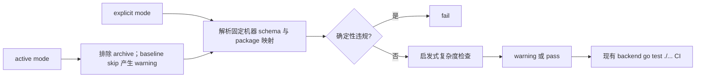

## Context

`optimize-risk-tiered-development-workflow` 已建立风险等级、阶段 Review package、条件式执行包和 active adoption，但这些规则主要约束执行阶段，没有在 Propose 时强制 Agent 交付一个低停顿、可静态审计的 tasks 结构。`refactor-industry-chain-node-foundation` 暴露出的主要问题不是工作范围过大，而是普通 checkbox、测试、dry-run、commit/push 被包装成独立 checkpoint 与人工停顿。

仓库已有可复用模式是 `backend/internal/architecture/workflow_rules_test.go`：用 Go 标准库读取规则文件，并由现有 CI 的 backend `go test ./...` 自动执行。当前没有独立 OpenSpec lint 工具或 repo-level scripts，因此应在现有架构测试边界扩展最小实现，不引入新依赖。

本 change 只设计未来规则。当前 Proposal artifacts 只写入自己的 change 目录；`refactor-industry-chain-node-foundation` 与其他 active change 不 adoption、不改写、不追认，也不触碰其数据库状态。

## Goals / Non-Goals

**Goals:**

- 让一级 task 表达内聚交付 package，并在 Proposal/tasks 开头提供可机器读取的 Gate Map 与复杂度预算。
- 把人工 gate 限定为真实语义、安全、环境、漂移恢复、Apply-final 和 Git 完成边界。
- 让普通实现、测试、修复、dry-run、validate、diff/secret check、commit/push 留在 package 内连续执行。
- 为 local-only R2 条件式执行包定义多层顺序执行、recovery baseline 复用与 fail-closed 语义。
- 用无新依赖的 lint 对确定性违规 fail，对任务拆分复杂度只 warning。
- 让 lint 只处理 active changes 或显式传入的 change，永不扫描或改写 archive。

**Non-Goals:**

- 不重写或扩展 OpenSpec CLI。
- 不修改 archive 历史、active change artifacts/tasks 或既有授权。
- 不削弱 R3、Neo4j、UAT/prod/shared、部署、secret、权限、漂移/失败恢复、Apply-final、PR merge/cleanup 门禁。
- 不修改业务功能、API、前端、migration、seed、数据库或部署状态。
- 不要求通过自然语言关键词准确判断所有任务质量。

## Decisions

### 1. 一级 task 是 package，操作步骤是包内子项

`tasks.md` 的一级编号只表达阶段 package。每个 package 记录 scope、风险、执行连续性、证据和停止条件；测试、修复、dry-run、validate、diff/secret check、commit/push 只能作为包内子项。人工 gate 是 package 边界，不是 checkbox 的默认属性。

本 change 自身只使用三个一级 package：Proposal Review、一个 R0/R1 Apply package、Apply-final Review。这样 artifacts 直接示范目标结构，而不是用过度拆分的 tasks 描述“减少过度拆分”。

**替代方案：**保留任意一级任务，只在文案中建议合并。该方案无法静态判断 package 边界，也无法阻止微型 checkpoint 回归，因此不采用。

### 2. Gate Map 使用固定 Markdown schema 和 package ID

Proposal 中 `## Gate Map` 必须是 `## Why` 后第一个二级 heading，tasks 中必须是第一个二级 heading；两者的下一张表必须使用完全一致的固定表头：

```markdown
| Package | Gate | Risk | Human | Reason Code | Allowed Scope |
|---|---|---|---|---|---|
```

解析规则固定如下：

- `Package` 是不带前导零的正整数，必须与 tasks 一级 package heading `## <Package>. <name> Package` 一一对应；表格行顺序必须与 heading 顺序一致，不允许缺失、重复或多余行。
- `Gate` 是非空显示名称，只用于人读；linter 通过 `Package` 关联，不通过 Gate 文案猜测。
- `Risk` 必须是单值 `R0`、`R1`、`R2` 或 `R3`，不接受区间或说明文字；混合 package 填当前 package 的最高风险。
- `Human` 只能是小写 `yes` 或 `no`。
- `Reason Code` 在 `Human=yes` 时必须是以下合法原因码之一，在 `Human=no` 时必须精确为 `NONE`；说明文字不得混入该单元格。
- `Allowed Scope` 必须为单行非空文本，负责说明通过后的允许范围和未授权边界，不作为 package 关联键。
- Proposal 与 tasks 的 Gate Map 经空白规范化后必须逐行相同；linter 同时读取两份 artifacts，不允许只修其中一份。

人工 gate 使用以下稳定原因码：

| 原因码 | 合法边界 |
|---|---|
| `SPEC_SEMANTICS` | Spec 或业务语义人工决策，包括 Proposal Review |
| `R3_OPERATION` | 生产、不可逆 cleanup 等 R3 操作 |
| `NEO4J` | Neo4j 写入或 rebuild |
| `SHARED_ENV` | UAT、prod 或 shared 环境 |
| `DEPLOYMENT_SECURITY` | 部署、secret、权限 |
| `DRIFT_RECOVERY` | scope/count/hash/schema 漂移或失败恢复 |
| `APPLY_FINAL` | Apply-final 人工 Review |
| `GIT_COMPLETION` | PR merge 或 cleanup |

普通源码实现、测试/修复、dry-run、validate、diff/secret check、commit/push 不属于合法人工 gate 原因。使用 package ID 和原因码而不是模糊关键词，使 lint 能可靠 fail；复杂度启发式仍只 warning。

**替代方案：**对任意中文理由做关键词匹配。该方案容易因措辞变化误报或漏报，不采用。

### 3. Complexity Budget 使用固定键和 selector

Proposal 的 `## Complexity Budget` 必须紧跟 Gate Map，tasks 中也必须作为 Gate Map 后的第二个二级 heading；下一张表固定为：

```markdown
| Key | Value |
|---|---|
| human_gates | <integer> |
| stateful_layers | <integer> |
| checkpoints | <integer> |
| full_test_runs | <integer> |
| continuous_automation_scope | packages:<selector> |
```

五个 key 必须按上述顺序各出现一次。前四个 value 必须是无符号十进制整数，允许 `0`，不允许单位、标点或说明文字。`continuous_automation_scope` 固定使用 `packages:<selector>`；selector 是升序、无重复的 package ID 或闭区间，以逗号分隔，例如 `packages:2`、`packages:2-4,6`。selector 中每个 package 必须存在于 Gate Map 且 `Human=no`，空范围使用 `packages:none`。

lint 必须校验 `human_gates` 等于 Gate Map 中 `Human=yes` 的行数，`stateful_layers` 等于 Stateful Layer Map 数据行数，selector 与 package 映射有效；Proposal 与 tasks 的 Complexity Budget 经规范化后必须相同。超出建议阈值只 warning，因为某些高风险 change 合理地需要更多 gate。

建议阈值不是硬上限：R0/R1 通常为 2 个生命周期人工 gate、1 个 Apply package、Apply-final 1 次完整验证；R2/R3 可因命名环境与独立授权增加。warning 要求作者复核，但不以任意数量阻断合理风险设计。

### 4. Stateful Layer Map 固定描述有状态层

当 `stateful_layers=0` 时，Proposal 和 tasks 可以省略 `## Stateful Layer Map`；若出现该 heading，必须使用固定表头且不得包含数据行。当 `stateful_layers>0` 时，两份 artifacts 都必须在 Complexity Budget 后、首个编号 package 前包含该 heading 和完全一致的数据表：

```markdown
| Layer | Package | Environment | Order | Scope | Exclusions | Recovery Evidence | Recovery Baseline | Expected Counts/Hash/Schema | Before Assertions | After Assertions | Stop Conditions |
|---|---|---|---|---|---|---|---|---|---|---|---|
```

稳定解析规则如下：

- `Layer` 必须是唯一 kebab-case 标识；数据行总数必须精确等于 `stateful_layers`。
- `Package` 必须引用 Gate Map 中存在且 Risk 为 `R2` 或 `R3` 的 package；linter 只用该整数关联，不从 scope 或 heading 文案推断。
- `Environment` 必须是 `local`、`shared-local`、`uat` 或 `prod`；Neo4j 操作仍通过 Gate Map 的 `NEO4J` 原因码与 R3 package 表达，不把产品名当环境值。
- `Order` 必须是 package 内从 `1` 开始连续、唯一的正整数，决定命名层执行顺序。
- `Scope`、`Before Assertions`、`After Assertions` 与 `Stop Conditions` 必须为单行非空值；`Exclusions` 无排除项时必须写 `none`，不能留空。
- `Recovery Evidence` 只能是 `backup` 或 `approved-disposable-recovery`；R3、shared-local、UAT、prod 不得使用后者。
- `Recovery Baseline` 只能是 `new:<kebab-id>` 或 `reuse:<kebab-id>`。`reuse` 必须引用同一 Environment、同一维护窗口中更早 order 的 `new` baseline，并由 before assertions 复验 identity、scope、count/hash/schema。
- `Expected Counts/Hash/Schema` 固定采用 `counts=<value>;hash=<value>;schema=<value>`，三个键都必须出现；不适用项写 `na`，不得省略键。
- Proposal 与 tasks 的 Stateful Layer Map 经规范化后必须逐行相同。

### 5. local-only R2 允许一个条件式执行包内顺序多层

仅在 Spec 已批准、环境精确为 local 且范围精确匹配时，一个独立获批的 R2 条件式执行包可以逐名列出多个 layer。每层必须具有：

1. 环境、范围与排除范围；
2. 只读 preflight 与 expected counts/hash/schema；
3. recovery evidence 或可复用 recovery baseline 引用；
4. `Write(layer N)`；
5. `Query/assert(layer N)`；
6. 漂移、失败、超时、冲突与人工中止条件。

执行严格为 `preflight -> Write -> Query/assert`。当前层全部断言通过后，才自动进入同一授权包内已经逐名列出的下一层；任何漂移或失败立即停止，未执行层剩余授权失效。

同一环境、同一维护窗口且基础状态的 identity、scope、count/hash/schema 未变化时，后续层可复验并引用同一 recovery baseline，而不是重新生成完整 backup package。复用前必须验证 baseline 指纹与当前 preflight 一致；不一致时停止并重新建立 recovery evidence。shared local、UAT、prod、Neo4j 或 R3 不适用此简化。

### 6. 验证以 package 为单位递增

- 开发中：只运行与当前失败或实现直接相关的 targeted tests。
- package checkpoint：运行一次与整个 package 匹配的验证，包含 OpenSpec/lint、diff、scope、secret 和 targeted suite。
- Apply-final：运行一次受影响交付边界完整验证与共享 architecture/contract tests；共享规则变更触发 repo-wide full validation。

测试失败与修复留在同一 package 内循环，不创建新人工 gate。旧日志不能替代 checkpoint 或 Apply-final 的新鲜证据。

### 7. 候选审阅先全量机器校验，再人工聚焦例外

候选 package 必须先对全量数据运行可重复机器校验与总体断言，再生成异常、冲突、宽边界、低置信度和用户明确指定项清单供人工逐项审阅。普通正常项不再依赖机械逐条人工确认；已批准 Spec 明确要求逐项确认的 final manifest 仍保持人工决策。

### 8. lint 复用 Go 架构测试并最小接入 CI

未来 Apply 优先在 `backend/internal/architecture/` 增加 task-design lint 与测试，沿用现有标准库文件读取模式；fixture 放在该包的 `testdata/task_design/`，覆盖合规 zero-stateful、合规 multi-layer stateful、固定表头/枚举/package 映射违规、预算整数/selector 违规、layer count/字段/order 违规、baseline stale/duplicate/unknown/archived、explicit mode 和启发式 warning。

lint 提供两种作用域：

- active 模式：`OPENSPEC_TASK_LINT_CHANGE` 未设置时，只枚举 `openspec/changes/<change>/tasks.md`，先排除 `openspec/changes/archive/`，再跳过 legacy active baseline 中的名字；现有 CI 的 backend `go test ./...` 自动使用此模式。
- explicit 模式：`OPENSPEC_TASK_LINT_CHANGE=<change-name>` 时，只检查该 change 的 proposal/tasks，忽略 baseline 跳过状态；change name 必须是单段 kebab-case active change，archive、路径分隔符、未知 change 直接 fail。

Proposal 与 package checkpoint 从 `backend/` 执行的精确命令为：

```bash
OPENSPEC_TASK_LINT_CHANGE=optimize-openspec-task-packaging go test ./internal/architecture -run '^TestOpenSpecTaskDesignLint$' -count=1
```

不增加 wrapper；只有 Apply 中 RED 测试证明 Go test 环境变量接口无法满足作用域时，才允许在同一 package 内提出薄 wrapper，并回到 Proposal Review 修订本设计，不能临时偏离。

legacy baseline 的最小 repo-local 契约为 `.agents/openspec-task-lint-baseline.tsv`，固定 UTF-8 TSV header 为 `change_name<TAB>reason`。每行只允许规则 Deliver 时仍 active 的 kebab-case change name 与非空、不得包含 TAB/CR/LF 的单行 reason；文件语义归 `.agents/openspec-workflow.md` 所有，实际列表由采用/归档该工作流的 scoped OpenSpec change 维护，不由 linter 自动改写。

- active mode 仅对“baseline 名称仍对应 active change”的条目执行跳过，并为每次跳过输出包含 reason 与 adoption 后移除提示的 warning，确保 legacy 例外不会无限静默存在。
- archive 目录始终先于 baseline 自动排除；baseline 中已归档、目录未知或重复的条目至少 warning，且不产生额外跳过能力。
- baseline header 错误、空 name/reason、非法 name 或多余列属于确定性格式错误并 fail。
- active change 完成显式 adoption 后，adoption diff 必须移除其 baseline 行；若未移除则 warning，不能无限静默跳过。
- explicit mode 始终校验指定 change，即使它仍在 baseline 中，以支持 adoption 与人工整改。

确定性 fail：固定 heading/table schema 缺失或顺序错误、Gate Map 枚举/package 映射错误、预算 key/整数/selector 错误、stateful count/map/字段/order 错误、Proposal 与 tasks 的机器表不一致、explicit archive/未知 change、baseline 格式错误。启发式 warning：一级 package 数过多、相邻/重复微型 Review 或 checkpoint、把测试/dry-run/commit/push 疑似提升为一级 package，以及 stale/duplicate/unknown/archived baseline 条目。warning 只输出复核依据，不使测试失败。

接入点保持最小：现有 `backend` CI 已运行 `go test ./...`，因此 active lint 作为架构测试自动进入 CI，不新增 job、wrapper 或依赖；显式 change 验证命令用于 Proposal/package checkpoint。任何接口变更都必须先回到 Proposal Review。



**替代方案：**新建独立 Node/Python lint 工具。它会增加运行时、依赖和 CI 安装面；现有 Go 架构测试已经覆盖同类规则，因此不采用。

### 9. TDD 与验证边界

Apply 若获批，先添加 fixture 和失败测试，证明固定 Markdown schema、package/layer 对应、baseline 维护和 explicit scope 缺陷会 RED，再实现解析/校验使其 GREEN。关键测试边界是合法 zero-stateful、合法 multi-layer、所有固定字段与枚举、archive 排除、baseline stale/duplicate/unknown/archived、explicit bypass 和 warning 不失败；不访问网络、数据库或 secret。

targeted 命令为 `go test ./internal/architecture -run '^TestOpenSpecTaskDesignLint' -count=1`，显式 checkpoint 命令使用上一节的环境变量形式。由于本 change 修改共享工作流规则与架构测试，Apply-final 运行 backend `go test ./...`、OpenSpec strict validation、规则链接/重复检查、diff/scope/secret 检查；不需要前端测试，因为无前端影响。

## Risks / Trade-offs

- [Markdown 格式演进导致解析脆弱] → 只硬校验本设计固定的 heading、表头、枚举、整数、selector 与 package ID；自由文本不参与关联，格式演进必须走新 OpenSpec change。
- [旧 active change 被新 lint 阻断] → 在规则 Deliver 时写入 `.agents/openspec-task-lint-baseline.tsv`，active mode 可见跳过；stale/duplicate/unknown/archived 至少 warning，explicit mode 不跳过。
- [固定原因码看似增加写作负担] → 原因码只用于 Gate Map，中文解释仍自由；换取可靠 lint 和清晰授权边界。
- [warning 被忽略] → checkpoint self-review 必须记录 warning disposition，但 warning 本身不升级成人工 gate。
- [recovery baseline 被错误复用] → 仅限同环境、同维护窗口且基础指纹复验一致；任何漂移立即 fail-closed。

## Migration Plan

1. Proposal Review 通过后，在一个 R0/R1 Apply package 内测试先行实现规则与 lint。
2. 用 zero-stateful、multi-layer、schema/baseline/explicit 合规与违规 fixture 实现 lint；在 `.agents/openspec-task-lint-baseline.tsv` 仅登记 Deliver 时仍 active 的 change，确认不修改其 artifacts。
3. 运行一次 package checkpoint 验证并提交 scoped checkpoint。
4. Apply-final 运行受影响边界完整验证，提交人工 Review；批准前不 Sync、Archive 或 Deliver。
5. 新规则 Deliver 后只默认应用于新创建 change；active change 必须按既有 adoption 流程单独批准。

回退方式为 revert 本 change 的规则/lint/CI 接入 commit；没有数据库或部署状态需要恢复。

## Open Questions

无。若 Apply 的 RED 测试证明环境变量接口无法可靠支持 explicit mode，必须先回到 Proposal Review 修订设计；不得在 Apply 内自行引入 wrapper 或扩大工具链。
