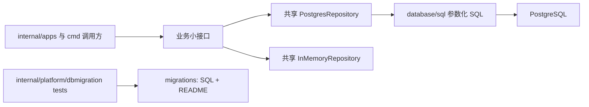

## Context

当前 `backend/internal/repositories` 只有一个 Go package，但主要实现集中在 `repository.go`（950 行）和 `postgres_repository.go`（1251 行）。前者同时承载业务接口、DTO、`InMemoryRepository` state/constructor、八类业务方法和通用工具；后者同时承载 `PostgresRepository`、全部业务 SQL、Scan 和 normalize。最新 `origin/main` 的 `backend/migrations` 包含 000001–000018 SQL 和 10 个 `*_test.go`，而现有 `backend/internal/platform/dbmigration` 已经承担 migration source、runner、Goose executor 和多数 migration contract tests。

本 change 只改变源码组织，不改变调用关系或运行时对象。更新到最新 `origin/main` 后的 fresh overlap audit 已确认：本 change 与 `rebuild-foundation-graph-and-enrich-chain-data` 仅分别修改各自 OpenSpec artifacts，当前无共享源码、测试文件或数据库写状态，因此可以并行执行独立 R1 Apply。

## Goals / Non-Goals

**Goals:**

- 保持业务接口和两个共享具体 adapter，按业务职责拆分文件，使接口、DTO、SQL、Scan/normalize 和 memory 方法可一起定位。
- 让 `postgres.go` 与 `memory.go` 只承载共享 adapter 的最小核心。
- 让 `backend/migrations` 最终只包含 SQL 与 `README.md`，并在现有 `internal/platform/dbmigration` 下统一保护有效 migration 契约。
- 先用现有测试建立行为基线，再机械移动；Apply-final 运行一次受影响 backend 完整验证。

**Non-Goals:**

- 不引入 GORM、sqlc、ORM、codegen、repository framework、通用 query builder 或新 package。
- 不创建 `PostgresSourceCatalogRepository` 等业务专用具体类型，不把 `InMemoryRepository` 扩展为内存数据库框架。
- 不改变业务 API、公开 repository 方法语义、domain 规则、service 编排、SQL 语义、schema、migration SQL、数据或 Neo4j。
- 不执行 migration、seed、PostgreSQL/Neo4j write，不修改 `prototype/` 或 `doc/`。
- 不在本 change 重做 graph projector，也不重复前置 graph change 的 legacy 修复。

## Decisions

### 1. 采用“单 package、共享 adapter、业务文件”结构

选择保留 `repositories` 单 package、`PostgresRepository` 和 `InMemoryRepository`，只把方法按业务文件分布。业务接口仍只表达调用方实际需要的能力；repository 层只负责参数化 SQL、参数转换、Scan/结果映射和数据库错误包装。domain 负责业务规则，service 负责编排，`database/sql` 是唯一通用 SQL 执行器。

拒绝两种替代方案：为每个业务创建新 package 会引入 import 与所有权迁移；为每个业务创建新 PostgreSQL 具体类型会增加 constructor/transaction 组合成本。两者都超出行为保持整理。

### 2. 当前文件到目标文件的精确映射

| 当前文件 | 目标文件 | 处置 |
|---|---|---|
| `doc.go` | 无 | 删除空文件 |
| `repository.go` | `memory.go` | 移动 `InMemoryRepository` state、mutex、constructor；原文件最终删除 |
| `repository.go` | `source_catalog.go` | 移动 source filter/interface/stats、memory seed/query/stats 和专属 clone/normalize/stats helpers |
| `repository.go` | `raw_document.go` | 移动 raw document interface/result、memory upsert/status/read/count、duplicate 与专属 clone/normalize helpers |
| `repository.go` | `benchmark_observation.go` | 移动 observation interface/filter/result、memory upsert/list 和专属 key/filter helpers |
| `repository.go` | `admin_query.go` | 移动 admin filters/pages/interface、event seed、raw/event/source list 和 pagination helpers |
| `repository.go` | `scheduler.go` | 移动 `SchedulerRepository`、scheduler config load/save 和专属 clone/default/normalize helpers |
| `repository.go` | `ingestion_run.go` | 移动 ingestion run create/source/complete/recent/read methods 和专属 clone helpers；`SchedulerRepository` 的现有方法集合保持不变 |
| `repository.go` | `graph_projection.go` | 移动 graph types/interface、memory seed/query/run methods 和专属 clone/normalize helpers |
| `postgres_repository.go` | `postgres.go` | 移动 `PostgresRepository`、`db *sql.DB`、constructor、共享 row scanner 与极少量跨业务 SQL 参数 helpers；原文件最终删除 |
| `postgres_repository.go` | 上述八个业务文件 | 按方法职责移动全部参数化 SQL、Scan、normalize 和错误包装 |
| `uuid.go` | `identity.go` | 移动稳定 UUID/原始文档 ID 能力；Apply 先审计名称与调用点，默认保留函数签名，只有证据证明命名误导且可一次性更新全部调用/测试时才最小重命名 |
| `industry_chain.go` | `industry_chain.go` | fresh audit 证明删除会改变当前导出接口和既有测试；本 change 保留其类型、SQL、memory/PG 方法与行为，未来 graph source 变更归 graph change |
| `repository_test.go` | `source_catalog_test.go`、`raw_document_test.go`、`benchmark_observation_test.go`、`admin_query_test.go`、`scheduler_test.go`、`ingestion_run_test.go`、`graph_projection_test.go` | 按被测业务机械拆分，fixture/helper 跟随唯一消费者；跨业务共享 helper 保持最小 |
| `postgres_repository_integration_test.go` | `source_catalog_postgres_test.go`、`raw_document_postgres_test.go`、`scheduler_postgres_test.go`、`ingestion_run_postgres_test.go`、`graph_projection_postgres_test.go`、`benchmark_observation_postgres_test.go` | 按现有测试函数职责拆分，继续使用 `TIDEWISE_TEST_DATABASE_URL` opt-in 边界 |
| `graph_projection_source_test.go` | `graph_projection_test.go` | 合并当前 source SQL 静态契约，保持当前 query 行为不变 |
| `uuid_test.go` | `identity_test.go` | 随 identity 文件移动，保持稳定 ID 行为测试 |
| `industry_chain_test.go` | `industry_chain_test.go` | 保留当前行为测试，不在机械整理中删除或改写 legacy contract |

### 3. 保留、移动、删除边界

| 类别 | 清单 |
|---|---|
| 保留 | 业务小接口；`PostgresRepository`；`InMemoryRepository`；原生参数化 SQL；现有 error wrapping；现有 opt-in PostgreSQL integration 边界；migration 安全契约 |
| 移动 | 业务 DTO/filters/results、具体 adapter 方法、业务专属 Scan/normalize/helper、对应 unit/integration tests |
| 无条件删除 | 空 `doc.go`；机械拆分后为空的 `repository.go`、`postgres_repository.go`、`uuid.go`；`backend/migrations` 下迁移完成的 Go test 文件 |
| 条件删除 | 只断言已被后续 migration 废止最终 schema、且不再保护完整迁移链安全的测试；本次审计未删除 repository 导出接口或既有行为测试 |

### 4. legacy graph/sector/industry-chain 处置

当前 graph 分支仍只有自身 Proposal artifacts；双方 diff 不共享 `backend/internal/repositories`、`backend/internal/platform/dbmigration`、`backend/migrations` 或数据库写状态。本 change 拥有上述 repository 与 migration-test 整理文件，可独立推进，不等待 graph change Deliver。

审计输出仍须把每个 legacy symbol 分类为 `retain-and-move`、`already-removed` 或 `remove-as-orphan`，并提供调用点、当前 schema 和主规格证据。若并行期间 graph change 开始修改同一源码或改变 graph source contract，立即停止并重新排序，不得自行合并范围。

### 5. migration test 统一到现有 dbmigration package

唯一目标目录是 `backend/internal/platform/dbmigration`，不新增 test framework 或平行 package。测试通过相对路径读取 `backend/migrations/*.sql`；新增一个目录纯度断言，确保 `backend/migrations` 仅含版本化 SQL 与 `README.md`。

| 当前 migration test | 目标 | 处置矩阵 |
|---|---|---|
| `benchmark_schema_test.go` | `internal/platform/dbmigration/benchmark_contract_test.go` | 保留并移动 000008/000009 schema、非破坏性和确定性替换契约 |
| `chain_node_relations_schema_test.go` | `internal/platform/dbmigration/industry_chain_contract_test.go` | 保留并移动 000017 当前关系/约束契约 |
| `entity_external_identifiers_schema_test.go` | `internal/platform/dbmigration/identity_contract_test.go` | 保留并移动 000016 授权、schema 与禁止项契约 |
| `refactor_industry_chain_node_phase_a_schema_test.go` | `internal/platform/dbmigration/industry_chain_contract_test.go` | 保留并移动 000015 授权、受限删除、最终 profile 与不可逆边界 |
| `alliance_economy_foundation_schema_test.go` | `internal/platform/dbmigration/alliance_economy_contract_test.go` | 保留并移动 000018 授权、最小 schema、禁止数据写和不可逆边界 |
| `industry_chain_schema_test.go` | `internal/platform/dbmigration/industry_chain_contract_test.go` 或删除 | 条件项：仅保留完整 migration chain 仍需要的 000014 执行/过渡安全；删除只要求已被 000015 废止表作为最终结构存在的断言 |
| `sector_schema_test.go` | `internal/platform/dbmigration/legacy_migration_contract_test.go` 或删除 | 条件项：保留仍有价值的 000010 顺序/非破坏性迁移契约；删除只保护已由 000015 移除的 sector 最终 schema 断言 |
| `convergence_schema_test.go` | `internal/platform/dbmigration/legacy_migration_contract_test.go` | 保留 Goose PL/pgSQL statement boundary；删除只保护已由 000015 移除的 convergence 最终 schema 断言 |
| `convergence_alias_repair_test.go` | `internal/platform/dbmigration/legacy_migration_contract_test.go` | 保留静态幂等、Goose transaction/rollback 契约；删除依赖最新数据库仍存在旧表的过期 EXPLAIN integration 用例 |
| `convergence_alias_order_test.go` | `internal/platform/dbmigration/legacy_migration_contract_test.go` | 保留静态顺序与 Goose transaction 契约；删除依赖最新数据库仍存在旧表的过期 EXPLAIN integration 用例 |

删除任何断言前必须证明其保护对象已由后续 migration/主规格废止，并确认 `migrations_test.go`、`source_test.go` 或迁移后的专项 contract 已覆盖版本、Goose 格式、完整链顺序和剩余安全边界。

### 6. 测试先行与测试预算

Apply 的第一步先运行并保存当前基线：`go test ./internal/repositories ./internal/platform/dbmigration ./migrations`。随后先补充文件边界/目录纯度和必要 contract 测试，使错误移动或测试丢失先失败，再机械拆分。

| 层级 | 预算 | 命令/范围 |
|---|---:|---|
| 基线 | 1 次 | `go test ./internal/repositories ./internal/platform/dbmigration ./migrations` |
| 开发 targeted | 按失败点 | `go test ./internal/repositories`；`go test ./internal/platform/dbmigration` |
| 受影响 apps | 1 次 package checkpoint | `go test ./internal/apps/...`，证明接口消费者行为不变 |
| Apply-final full | 1 次 | `go test ./...`，因为 repository 与 migration contract 是跨多个 backend app 的共享边界 |
| OpenSpec/静态 | 1 次 checkpoint | strict validate、task-design lint、`git diff --check`、scope/secret scan |

真实 PostgreSQL integration tests 继续 opt-in；本 change 未授权数据库写入，因此 Proposal/默认 Apply 验证不得设置真实 DSN 或执行 migration。fixture、sqlmock 与静态 SQL contract 继续复用现有方式。

### 7. 过度设计审计

- 顶层 package 固定为 3 个，其中只有 Package 1 是连续实现包；没有逐文件 gate。
- 新增 Go package 数为 0，新具体 repository 类型数为 0，新依赖数为 0，新 runtime abstraction 数为 0。
- 所有目标文件都对应现有业务接口或当前测试职责；不为未来业务预留空 interface、base repository、transaction manager 或 query DSL。
- 若机械移动必须修改业务 SQL、接口签名或 domain/service 规则，立即停止并回到 Review，而不是把整理升级成架构重写。

## Risks / Trade-offs

- [并行 graph change 后续出现真实文件重叠] → 当前 audit 证明无重叠；执行中再次出现共享源码或测试文件时立即停止并重新排序。
- [机械移动遗漏方法或 helper] → 先锁定基线，按业务逐组移动，每组运行 targeted tests，Apply-final 跑完整 backend suite。
- [删除历史 migration 测试削弱安全性] → 使用逐文件处置矩阵，仅删除已废止最终 schema 断言，并先确认完整链和剩余契约覆盖。
- [文件过细导致导航成本上升] → 文件只按八个已存在职责拆分，不创建新 package 或 adapter 类型。
- [identity 重命名扩大 diff] → 默认保留函数签名；没有明确证据时只移动文件，不重命名。

## Migration Plan

本 change 没有数据库 migration 或运行时部署迁移。代码回滚为 revert scoped R1 commit；任何测试失败都在同一 package 内修复。执行中若 overlap gate 发生变化则停止。

## Open Questions

没有需要新增人工选择的问题。fresh audit 已决定保留 `industry_chain.go` 及其测试；历史 migration tests 全部仍保护版本化完整链或迁移安全，因此迁入统一边界而不删除。
