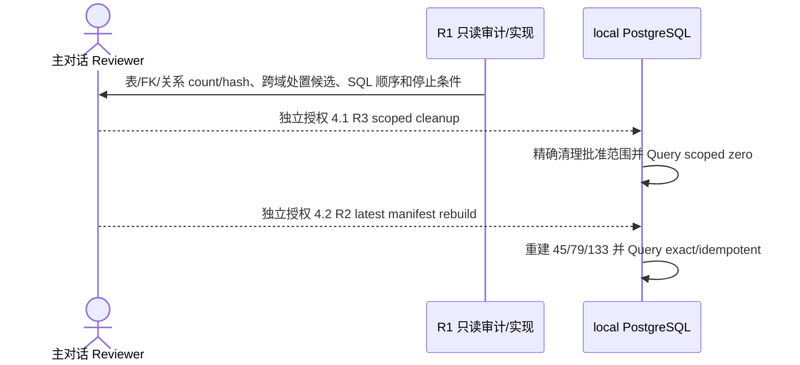

## Context

最新 `origin/main` 的仓库 fixture 基线为 10 个 `alliance_org`、50 个 economy、223 条 active `member_of`，另有 40 条 `economy -> market` 的 active `has_market`。`alliance_org_profiles` 仍是 `org_code/org_type/primary_domain/scope_region/official_url`；`economy_profiles` 已能以 `country_code/currency_code/region` 表达本批批准的 79 条数据。Package 1、2 已冻结 45 个 alliance、79 个 economy 和 133 条 formal-active `member_of`。

本 change 现在明确收缩为 local PostgreSQL 探索环境的一次性业务数据重建。它不是通用导入产品，不为未来任意 manifest、entity type 或 relation type 建框架。R1 只准备 change-specific importer、最小 migration/repository 适配、测试和只读执行包；所有写入仍由 Package 4 单独授权。

## Goals / Non-Goals

**Goals:**

- 联盟名称只保存在 `entity_nodes`；`alliance_org_profiles` 只保留 abbreviation、leadership summary、influence scope summary。
- 冻结并校验 approved 45/79/133 data artifact。
- 复用现有 entity-seed/repository，提供一个 change-specific、fail-closed、幂等、可重放 importer。
- 先只读审计目标数据的 FK 和跨域关系，再以独立授权的 R3 cleanup 与 R2 rebuild 完成 local 探索基线。
- cleanup 后验证 alliance/profile/member_of scoped zero、economy=50/profile=50 与跨域保护 hash；rebuild 后验证 45/79/133、15 non-target economy 保留、端点、方向、孤儿、重复和幂等。

**Non-Goals:**

- 不建设通用 manifest framework、通用 service、relationship policy engine、mapping-only framework 或复杂 dry-run/report 子系统。
- 不新增 `economy_profiles.identity_kind`、区域/货币 schema 规则、全局 `entity_nodes.entity_key` 唯一索引或平行 profile 表。
- 不实现 `led_by`、`part_of`、`participates_in`、`signatory_to`、API、graph policy 或 Neo4j。
- 不处理产业链、市场、benchmark/index、事件推理、观测数据、实体标签或股票推荐。
- 不把 local 清理豁免推广到 UAT、prod 或 shared。

## Decisions

### 1. 最小 schema 演进

`entity_nodes` 继续承载 identity、name、canonical name、aliases 和 status，不增加全局 identity 约束。`economy_profiles` 保持现有三字段结构：

```text
entity_id, country_code, currency_code, region
```

本 change 的 migration 只把现有 `alliance_org_profiles` 原地演进为：

| 字段 | 目标契约 |
|---|---|
| `entity_id` | `UUID` PK/FK，指向 `entity_type=alliance_org` 的 `entity_nodes` |
| `abbreviation` | `TEXT NOT NULL DEFAULT ''`，`btrim` 后最长 32；非空值进入 aliases；不全局唯一 |
| `leadership_summary` | `TEXT NOT NULL`、无 default，`btrim` 后非空，最长 500 |
| `influence_scope_summary` | `TEXT NOT NULL`、无 default，`btrim` 后非空，最长 1000 |

不得创建平行 v18 profile 表，也不得在 profile 重复保存 name 或恢复 categories。migration 只处理这三个业务字段及旧列的最小兼容/移除；执行顺序和现有行处理必须进入 Package 4 执行包。

### 2. Economy 采用 approved artifact，不扩 schema

79 条 economy 继续使用现有 `entity_nodes` identity 与 `economy_profiles.country_code/currency_code/region`。主权国家、地区经济体、EU/global 聚合的业务边界由冻结 manifest 与 validator 检查，不转化为新数据库列。EU/global 不得替代国家端点，`economy:global` 不生成 `member_of`。如果 R1 证明某条 approved economy 无法用现有三字段表达，必须携最小证据回到 R0 Review，不能自行扩表。

幂等依赖 manifest 中冻结的 stable key、现有 repository 查询和事务内 preflight；不以全局 `entity_key` 唯一索引扩大本批影响面。如果现有机制无法安全实现，先停止并回到 Review。

### 3. Approved artifact 是重建唯一输入

当前执行目标固定为：

```text
alliance = 45
economy = 79
formal-active member_of = 133
```

旧 223 条 `member_of` 的 31 keep、160 preserve_unresolved、10 preserve_pending_retype、22 proposed_inactivate 只保留为历史审阅证据，不再驱动写入。change-specific importer 不读取旧 disposition，不实现 preserve/convergence policy，也不自动接收 Excel 或任意外部 manifest。

### 4. R1 只读 dependency audit 是破坏性 cleanup 前置条件

R1 Review package 必须对真实 local 环境刷新：

- `entity_nodes` 中 alliance/economy 目标行及状态；
- `alliance_org_profiles`、`economy_profiles`；
- `entity_edges` 的全部 relation type、方向、端点类型和 counts；
- 所有引用目标 entity UUID 的 FK 与无 FK 的逻辑引用；
- frozen artifact 的 count/checksum、重复、端点和方向。

仓库当前静态依赖至少包括：

- profile：`alliance_org_profiles.entity_id`、`economy_profiles.entity_id`；
- 关系：`entity_edges.from_entity_id/to_entity_id`，包括 223 条 fixture `member_of` 与 40 条 fixture `has_market`；
- 跨域 profile：`market_profiles.economy_entity_id`、`sector_profiles.primary_economy_entity_id`、`industry_chain_profiles.primary_economy_entity_id`、`company_profiles.registration_economy_entity_id`、`person_profiles.economy_entity_id`；
- 通用引用：`entity_external_identifiers.entity_id ON DELETE CASCADE`，以及其他以 `entity_nodes` 为 FK 的 profile、convergence/audit 表。

方案 1 已确认：全部 50 个现有 economy node/profile 与 market/index/benchmark/company/person/非 `member_of` edge 等跨域事实均为 scope exclusion；15 个 non-target 保持原样，35 个 existing target 保留 stable identity 并在 4.2 原位 upsert，44 个缺失 target 才创建。若 future preflight 发现其他 alliance incident edge 或未知 economy FK，必须 fail-closed；不得扩展 cleanup。

### 5. Change-specific importer

实现优先复用现有 entity-seed loader/repository/transaction 模式，只暴露本 change 所需的固定入口：

1. 加载并严格验证仓库内冻结 artifact 的版本、checksum 和 45/79/133 counts；
2. 只读 preflight 生成目标表、关系类型/count、FK/跨域引用和预计影响摘要；
3. 在明确 R3 授权后只删除 alliance/profile 与 `economy -> alliance_org member_of`，并断言 alliance/profile/member_of=0、economy/profile=50、跨域保护 hash 不变；
4. 在明确 R2 授权后原位 upsert 35 existing target、创建 44 missing target，重建 45/79/133，并执行 exact Query；
5. 同一 manifest 复跑无额外变化。

它不接受任意路径/任意实体 schema，不生成通用计划语言，不提供通用 policy/service/report 抽象。若 cleanup 与 rebuild 无法在一个事务中安全完成，则采用两个 fail-closed 授权包；4.1 成功不自动授权 4.2。

### 6. 两个有状态执行包



- **4.1 R3 scoped local cleanup**：仅 local 探索环境；无 backup、rollback 或恢复演练。执行前必须冻结真实 count/hash 与精确谓词；执行后 alliance/profile/member_of 必须为零，50 economy/profile 与未授权跨域事实不得变化。
- **4.2 R2 latest manifest rebuild**：只写冻结 artifact 的 45/79/133；35 existing target 原位 upsert、44 missing target 创建、15 non-target 不变。执行后目标集合相等、全部端点存在且 active、`member_of` 方向为 economy → alliance、无孤儿/重复；第二次执行结果 unchanged。

两个包都必须独立人工授权。R1、普通 Apply、4.1 成功或旧授权均不能推定下一包授权。任一 count/hash/环境/依赖漂移、跨域处置未决、zero assertion 或 post-query 失败都必须停止。

### 7. TDD 与验证

R1 只实现最小范围：

1. migration tests 覆盖 alliance 三字段原地演进，证明未增加 economy identity_kind、entity_key 唯一索引或平行 profile 表；
2. manifest tests 覆盖 45/79/133、checksum、字段映射、U+200C normalization、端点和非目标字段排除；
3. importer/repository tests 覆盖精确 scope、原子性或明确两阶段、fail-closed、zero/post assertions 与幂等；
4. dependency audit tests 覆盖 member_of 与跨域 relation/FK 分类，禁止未决跨域事实被静默删除；
5. 运行 targeted tests、受影响 backend suite、共享 contract/migration tests、OpenSpec strict、diff/scope/secret。普通测试不得访问真实网络或写真实数据库。

## Risks / Trade-offs

- **破坏性 local cleanup**：按实际风险提升为 R3，必须独立授权；环境不是 local 或 scope 漂移则拒绝执行。
- **跨域事实丢失**：方案 1 已将其设为 scope exclusion；任何未知 alliance incident edge、未知 economy FK 或 count/hash 漂移阻断 cleanup。
- **没有 backup/rollback**：这是用户对本次 local 探索数据的明确豁免；通过 exact scope、zero/post Query 和幂等降低误操作风险，不推广为项目默认。
- **一次性 importer 可复用性有限**：刻意接受；它只需可审阅并可在后续环境以同一 approved artifact 重放，不承担通用产品职责。
- **旧 disposition 不再保留**：接受 local 探索基线被替换，最终 truth 只以 latest approved manifest 为准。
- **图投影滞后**：Neo4j 留给后续独立 change，以已验收 PostgreSQL facts 重建，不阻塞本 change。

## Migration Plan

1. Package 1、2 的业务候选批准保持：45 alliance、79 economy、133 formal-active `member_of`；旧 223 disposition 执行语义废止。
2. Package 3 完成 scoped R1 migration/domain/repository/importer、targeted tests 和只读 dependency Review package，不写数据库。
3. 主对话已确认全部现有 economy 与跨域事实保留；后续只审阅 fresh local 表/FK/关系 counts、cleanup SQL/hash/停止条件，再独立授权 4.1 R3 cleanup。
4. 4.1 Query 验收 scoped zero 后，主对话独立授权 4.2 R2 rebuild；Query 验收 45/79/133、完整性和幂等。
5. 完成 Apply-final 人工 Review 后才可 Sync、Archive、PR/merge 和 cleanup。

## Open Questions

- 真实 local PostgreSQL 的表、FK、relation type/count 必须在未来只读 preflight 刷新。
- 若 fresh preflight 出现其他 alliance incident edge、未知 economy FK 或 count/hash 漂移，必须停止并回到 Review；不得自行扩大 scope。
- 如果现有 economy 三字段或 stable-key repository 机制被 R1 证明无法表达/安全幂等，必须提交最小证据回到 R0 Review，不得自行扩 schema。
