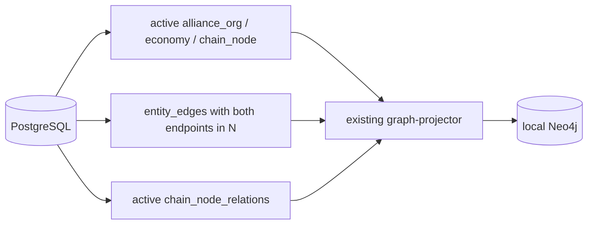
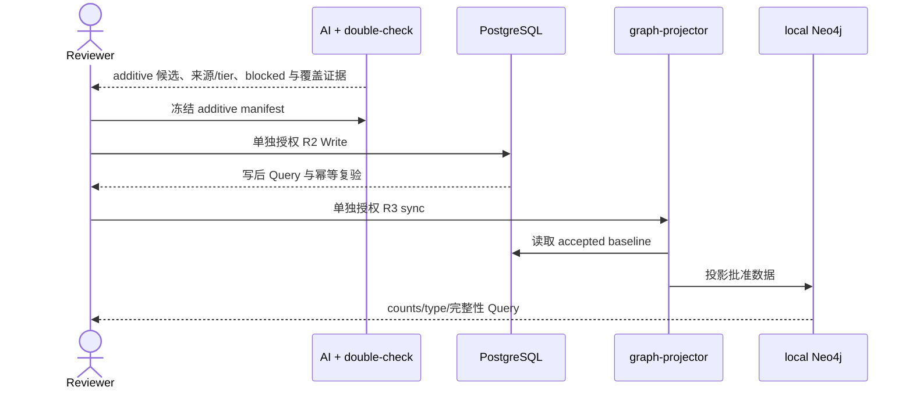

## Context

全部前置 change 已 Deliver。当前分支已无冲突合入 `origin/main=007f6efdaf5bbe5b880a9adfc5c502e0e39849f2` 并完成 Active Change Adoption，change 外无额外差异。最新 migration 已删除旧产业表并建立 `chain_node_relations`，但 graph projection repository 仍查询旧表，故当前 projector 在最终 schema 上不能完成读取。

本 change 保持两个业务 scope：从 PostgreSQL 重建当前基础图投影；完善当前 842 个 chain_node 的四类关系。PostgreSQL 是唯一事实源，Neo4j 是 local disposable projection。

## Goals / Non-Goals

**Goals:**

- 最小修复已有 projector 对当前 PG 模型的兼容性，并用 targeted tests 锁定查询、映射、端点过滤与重建契约。
- 独立授权清空和重建 local Neo4j，按实体类型、关系类型及完整性 Query 验收。
- 在本 change 内对 842 个既有节点完成 usable-map 候选发现与双遍检查；逐行保留既有 100 条 Tier 1 accepted baseline，以 additive manifest 先写 chain_node_relations，再同步 Neo4j。

**Non-Goals:**

- physical constraints、通用导入/审核平台、runner、policy engine、dry-run/report framework。
- 查询 API、图服务、推理引擎、派生关系。
- market/index/benchmark 扩投影、UAT/prod/shared。
- 前端、事件、观测、股票推荐。

## 系统能力差距矩阵

| 能力 | 最新代码证据 | 已有 | 最小改造 | Package | 用户 gate |
|---|---|---|---|---|---|
| graph-projector CLI | `backend/cmd/graph-projector/main.go` 已有 check/project-entities/rebuild-entities | 是 | 无；复用现有入口 | 1 | R3 操作前授权 |
| namespace cleanup/rebuild | `projector.go` rebuild 调用 `DeleteNamespace`；`neo4j_writer.go` 只删除指定 namespace | 是 | cleanup 可复用相同 Cypher 语义单独执行，rebuild 用 project-entities；不建新 runner | 1 | cleanup/rebuild 分别 R3 |
| 当前节点读取 | `graph_projection.go` 仍 LEFT JOIN 已由 migration 15 删除的 sector/industry_chain 表 | 否 | 查询只读 active alliance_org/economy/chain_node 的 entity_nodes | 1 | 无普通实现 gate |
| entity_edges 端点过滤 | 当前 SQL 只要求 active，未限制三类节点；projector mapper 会对未载入端点 skip | 部分 | SQL 限制两端类型并保留 mapper fail-safe | 1 | 无普通实现 gate |
| chain_node_relations 读取 | migration 17 已建表；repository 仍 UNION 旧 memberships/topology | 否 | UNION current active chain_node_relations，并标识来源 | 1 | 无普通实现 gate |
| 四类 Neo4j 映射 | `mapping.go` 仅已有 depends_on，缺其余三类 | 部分 | 增加 IS_SUBCATEGORY_OF、IS_COMPONENT_OF、INPUT_TO；保留 DEPENDS_ON | 1 | 无普通实现 gate |
| Neo4j upsert | `neo4j_writer.go` 已按类型分组 MERGE 节点/关系 | 是 | 无 | 1/2 | 对应 R3 |
| PG schema | migrations 15/17/18 已建立当前 entity/profile/relation 模型；physical constraint 表存在但本 change 不使用 | 是 | 无 migration | 1/2 | 无 |
| 新关系 dry-run/事务写 | `chain_node_relation_batch.go` 已有 repeatable-read dry-run、整批事务、端点/tuple/写后/幂等校验 | 是 | repository 无改造 | 2 | PG R2 |
| 新关系 CLI | 第一批 100 条 manifest 的固定 path/hash/count contract 与通用 transaction batch 已验收 | 是（对第一批） | additive manifest 冻结后只评估是否需最小更新固定 contract；不建通用入口 | 2 | R0 Review 后才允许条件式 R1 |
| R3 disposable recovery 表达 | 最新 workflow/lint 已允许满足显式 Scope 与 PG baseline 条件的 local Neo4j R3 | 是 | 三个 Scope 分别显式写 Neo4j cleanup/rebuild/sync | 1/2 | 每层执行前仍须独立 R3 授权 |

## Decisions

### 1. 三个顶层 package

Package 1 修复并验收基础投影闭环；Package 2 保留已执行的 100 条基线，完成 842 节点 usable-map additive 分析及后续 PG-first 流程；Package 3 完成 Apply-final、Sync、Archive、Deliver。普通 R1 工作不拆成人工 gate。

### 2. 基础投影边界

节点集合只含 active `alliance_org`、`economy`、`chain_node`。`entity_edges` 只在 from/to 均属于该集合时投影；`chain_node_relations` 只在两端为 active chain_node 时投影。分类、组成、投入、依赖分别保留 typed relationship；不生成派生边。

`graph_projection.go` 与 `mapping.go` 是确定需要修改的生产文件。`projector.go`、`neo4j_writer.go`、`graph-projector/main.go` 的现有行为足以复用；只更新必要 targeted tests。投影运行会写现有 `graph_projection_runs/items` 审计元数据，这不构成业务数据反写。

### 3. local Neo4j 两层授权且不备份

cleanup 只执行现有 namespace 删除语义并 Query 为零；rebuild 在第二次授权后使用 `project-entities` 从冻结 PG baseline 写入，避免一个命令把两个人工 R3 层合并。失败时不回滚 Neo4j，重新授权后从 PG 重建。

最新 workflow 已允许满足显式 Scope、PG/PostgreSQL baseline、local-only、R3 Human=yes 条件的 `approved-disposable-recovery`。这只解决 recovery schema 表达，不构成任何 cleanup/rebuild/sync 授权；三层仍须分别 Review 和授权。

### 4. 842/842 是候选发现覆盖边界，不是强制补边指标

“完善 842 个节点”只表示在这 842 个既有节点之间分析四类关系。每个基线节点都必须参加候选发现和两遍独立检查，但不要求每个 node×relation_type 形成边或三态记录；没有直接或间接事实时允许保持无边，也不得用新增或细分节点补足关系。

用户已确认本 change 必须保持开启，直至 842/842 节点完成候选发现与双遍检查、可进入 manifest 的候选全部处置且无未解决冲突。研究可分批，但任何单批都不是关闭边界。

既有 100 条关系作为 Tier 1 accepted baseline 原样保留。新增分析只排除重复 tuple，不排除这些端点继续产生其他类型或机制的关系；同一对节点可有不同机制/类型的有向边，但同一客观机制不得重复登记。

### 5. 数据分析不是产品能力

第一遍按关系语义和方向整理候选，第二遍在不可见第一遍结论的前提下使用 Serenity 方法检查机制、替代路线、反例、来源蕴含和全称边界；physical constraints 不进入本 change。两遍分别保存理由、类型、方向、机制、路径、条件、具体反例和 disposition，任一项不一致即阻断。Tier 1 的来源必须实际覆盖当前 relation type、方向和具体机制，同一资料可以支持一组边，但每条边仍须有 source-to-edge entailment；Tier 2 允许暂缺外部来源，但不得存在合理争议。这是工作方法，不新增 capability、字段、服务或审核平台。

`input_to` 定义为 A 的实际产出被消耗、转化、嵌入，或作为明确服务输出沿可解释产业链进入 B 的生产、产品、交付或运行过程，方向仍为上游 A → 下游 B。间接边必须写明已知或缺失中间环节；设备、工具、软件能力或基础设施仅因使 B 能生产或运行不得记为 `input_to`。只有在限定条件下构成硬前提且反例得到处置时，才另按 B → A 的 `depends_on` 审查，不能机械改型。名称邻近、市场相关、共同事件或宽泛行业相邻不能构成关系。

`is_subcategory_of` 采用全集包含标准；`is_component_of` 采用目标定义边界内全部实例包含该组件的标准。规格或供应商可替代不等于组件可缺失；存在完全不含该组件的合理架构反例即阻断，除非当前节点定义已经明确排除反例。

关系数据继续复用现有通用 repository batch。第一批 100 条所需的固定 manifest 解锁已完成；additive manifest 经独立 Review 冻结后，只有固定 path/hash/count contract 确实不匹配时才允许最小 R1 更新。Package 2 不新增节点、profile、external identifier、identity、migration、repository/service 或通用导入框架。

### 6. PG-first

旧 `all-chain-node-relations-neo4j-sync` Review 包只针对新增 4 条边，已被本次语义 Review supersede，不得执行。未来 Neo4j R3 必须以 additive PG 写后的最终 accepted baseline 重新冻结 Scope、入口、counts/hash 和审计副作用。下游多跳只作为验收 Cypher：`input_to` 顺向、`depends_on` 反向，分类/组成不计入上下游；不开发查询 API 或派生关系。

## Risks / Trade-offs

- [842 全量候选发现容易遗漏] → 冻结 842 节点输入指纹和逐节点 discovery/double-review ledger；无边是允许结果，不用 842×4 三态倒逼补边。
- [候选需要超出既有节点集合才能表达] → 记录不适用/证据不足，不新增节点解决。
- [entity_edges 扩张节点或形成孤儿边] → SQL 端点过滤加 mapper fail-safe。
- [Tier 2 被误当作外部证据] → provenance 明确 `stable_industrial_knowledge`、两遍 disposition 与外部来源 pending；有争议即阻断。
- [宽化 input_to 导致泛化补边] → 每条获批边必须有实际产出、可解释 path、消费/转化/嵌入/服务机制、条件和具体替代路线；工具型使能关系与两遍争议项进入 blocked ledger。

## Migration Plan

1. Apply 前复验最新 main、Stateful Layer Map 与数据基线未漂移。
2. 完成 Package 1 targeted tests 与最小 projector 修复；分别申请 cleanup、rebuild R3 授权并 Query。
3. 保留既有 100 条 accepted baseline；冻结 842 节点 candidate-discovery ledger，完成 usable-map additive 双遍分析与独立 Review。
4. 冻结 additive relation manifest；仅在固定 contract 确有不匹配时执行最小 R1 更新。
5. 分别申请 additive PG R2 Write/Query 和基于最终 accepted baseline 的 Neo4j R3 sync/Query；旧 4-edge R3 包不得执行。
6. Apply-final Review 通过后才 Sync、Archive、Deliver。
