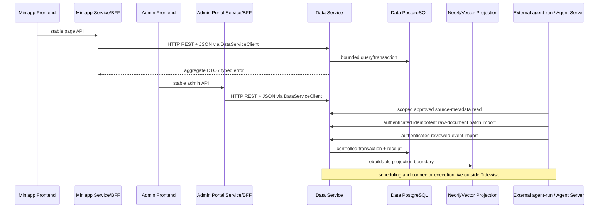
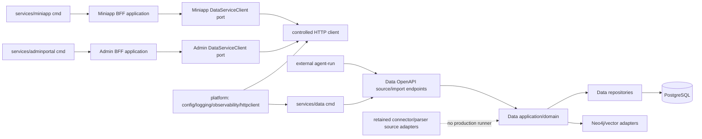

## Context

本次 Explore 以 2026-07-17 最新 `origin/main` `3f0f779d2c332a74f31fd398adb47adb306a60c3` 为基线。仓库是 monorepo，后端只有一个 `backend/go.mod`；active changes 为本 change 与 `migrate-uat-to-linux-amd64`，后者拥有 `.github/workflows/deploy-uat.yml`、`infra/uat/**` 等 UAT 交付范围，本 change 避让这些文件与真实环境。

当前代码事实：

- `backend/cmd/api` 启动小程序 HTTP server，执行 migration check、打开 PostgreSQL、构造 `repositories.NewPostgresRepository` 并注入 `miniappapi.ResearchService`。
- `backend/cmd/admin-api` 启动管理 HTTP server，同样直接打开 PostgreSQL 并把 repository 注入 `adminapi.NewRouter`；router 同时拥有 raw/event/source 查询与 scheduler config/run API。
- 当前只有两个 HTTP server；`backend/cmd/event-import` 是 Agent reviewed-outbox 的本地 CLI，不是第三个 HTTP 服务。目标第三入口是新的 Data Service。
- `backend/internal/domain`、`backend/internal/repositories`与21个历史migrations共同承载Entity、Chain Node、Source/Raw Document、Event/Event Tag、Research Theme/Anchor、Index/Benchmark、Scheduler、Graph Projection等Data Domain能力；当前21文件按路径排序的SHA-256 manifest聚合hash为`2ed0dd004ab3b0bad633af5f0107a9ddffa28b83422b643f821c2cd47fb02dfc`。
- `backend/cmd/ingestion-scheduler` 读取全局调度配置、循环或单轮触发 `internal/apps/ingestion/scheduler`，后者调用 `runtime.IngestionJob` 并写 scheduler run/source run 与 raw documents。
- `backend/cmd/source-ingest` 绕过 scheduler 但仍直连 Data DB并执行同一采集 runtime；`backend/cmd/ingest-smoke` 联网拉取公开 RSS并写本地 Data DB。它们都是“实际执行”，不能作为 Tidewise 手动后门保留。
- `backend/cmd/source-seed` 只加载版本化 source catalog 并幂等 seed，不运行 connector/parser；`event-import`、graph projector、entity seed、dbmigrate 也有各自独立 Data maintenance/import 语义。
- `internal/apps/ingestion/connectors`、`parsers` 与 `core` 既有受测 source adapter contract；其中 `core.SourceRegistry`、`RateLimiter`、`LocalRawObjectStore`、`RawDocumentWriter` 只有将被删除的 runtime/command 或自身旧测试使用，`Registry`、connector/parser contract 与 `EnvCredentialResolver` 仍被 connectors 使用。
- Admin frontend 有 `api/scheduler.ts`、`SchedulerSettings.tsx`、数据采集中心 scheduler tab、专属 CSS 与测试。仅删 backend command 会留下失效控制面。
- `backend/internal/config` 与三套 repo config templates 含仅被旧采集命令使用的 `IngestionConfig`；真实 scheduler 说明位于 `infra/local/README.md` 和 ingestion README。
- `.github/workflows/ci.yml` 只运行 `go test ./...` 与 Admin test/build；当前 Dockerfile、local/UAT compose、deploy workflow 没有 scheduler image/service/healthcheck，不能凭名称制造不存在的 infra 删除。
- 删除前静态测试基线为 114 个 Go `_test.go` 文件、541 个 `func Test`；frontend合计8个test files、44个`it/test` cases，其中Admin 7/26、Miniapp 1/18。仓库只有13个落盘testdata files：reviewed-outbox fixture 1个、task-design lint fixtures 12个，均有有效引用；scheduler/runtime测试使用inline/httptest/temp data，没有专属testdata。

目标运行时拓扑明确取消 Tidewise 内的采集 scheduler/runtime：



目标代码依赖：



## Goals / Non-Goals

**Goals:**

- 在当前 monorepo、单 Go module 中建立 Data、Miniapp BFF、Admin Portal BFF 三个可独立启动的服务边界。
- 让 Data Service 独占 Data Domain、PostgreSQL repository/migration 与 Neo4j/向量投影；BFF 只拥有 channel DTO、用户/权限上下文、页面聚合和领域服务编排。
- 以 HTTP REST + JSON + OpenAPI 建立唯一生产跨服务 contract，并用本地 `DataServiceClient` interface 隔离 HTTP transport 与 unit-test fake。
- 在 Tidewise 不再运行 scheduler、source-ingest、ingest-smoke 或采集 runtime；同步退役 scheduler Admin API/UI、配置、repository/domain 与直接部署/文档引用。
- 在删除 runtime 前先提供 Data Service 脱敏 source-metadata read与受控 raw-document/reviewed-event import，让外部 `agent-run`/Agent Server 永远不需要 Data DB 凭据。
- byte-for-byte保留当前21个历史migration、历史表/data、source seed、connectors/parsers、raw/event import repositories与所有仍覆盖受支持合同的测试；以新的第22个forward-only migration增加raw import durable receipt。
- 用 architecture tests 禁止 BFF 直接依赖 Data DB/repository、禁止旧目录和反向依赖复活，并以精确引用审计清理测试/testdata。
- 把 service-owned build/health/start assets 与根 infra 环境编排分开；数据库代码边界与实际 role/grant/credential 切换分为 R1/R2。

**Non-Goals:**

- 不修改 `agent-run` 或 Agent Server repo，不在 Tidewise 新建替代 scheduler、worker、queue 或定时任务。
- 不保证本 change 交付后 Tidewise 内仍能实际执行 connectors；从旧 runtime 删除到外部 `agent-run` 交付之间允许存在明确记录的采集停止窗口。
- 不把 connectors 擅自复制、发布或迁移到外部 repo，不为外部 repo建立共享 Go module。
- 不拆 Git repo，不创建多个 `go.mod`，不发布 `tidewise-go-platform`。
- 不新增 Identity、Membership、Billing、Subscription 服务或数据库；不引入 gRPC、Kitex、Kratos、服务注册中心、Service Mesh、Kafka 或分布式事务。
- 不drop/truncate scheduler表，不搬表、拆schema、改动当前21个历史migration或删除已有数据；除Package 5条件式授权的一次local `000022` apply外，不执行其他migration/seed/import/projection。
- 不创建平行 Event/Research/Entity 模型，不改变保留页面/管理 API 语义；唯一明确 breaking surface 是 scheduler 能力退役及其批准的兼容路径。
- 不修改`prototype/`、`doc/`、`.github/workflows/deploy-uat.yml`、`infra/uat/**`，不运行或改变真实UAT/prod/shared；Package 5不执行restore/retry/forward-fix，Package 10权限层保持独立。

## Decisions

### Decision: 保持单 module 的服务化单体，采用 ownership-first 渐进迁移

目标结构：

```text
frontend/
├── miniapp/
└── admin/
backend/
├── go.mod
├── services/
│   ├── data/          # cmd, api, application/domain/repository adapters, deploy assets
│   ├── miniapp/       # cmd, BFF application, page DTO, DataServiceClient port
│   └── adminportal/   # cmd, BFF application, auth/permission, DataServiceClient port
├── platform/          # config/logging/observability/httpclient 等无业务技术能力
├── migrations/       # Data Service拥有；21个历史SQL不变，新增forward-only 000022
└── data/              # Data Service seed/input assets，先原位保留
infra/
├── local/             # cross-service orchestration
├── uat/               # 本 change 不修改
└── prod/              # 本 change 不修改
```

Go `internal` 可见性不足以阻止同一 module 内误 import，所以目录移动必须与 `go list` import-graph architecture tests 配合。Package 2 先冻结 owner 和禁止依赖，Package 3 建 facade/entry；只有当前消费者已改走 contract 且测试覆盖后才移动触达的实现。禁止为了目录外观 bulk move 全部 domain、repositories、migrations 或 data。

只有出现独立版本/发布、团队、依赖/资源模型、稳定远程 contract 或单 module 构建冲突之一，才另开 multi-module/repo change。立即三 module 会把 contract 发布、CI cache、local replace、migration ownership 与 rollback 同时改变，不采用。

### Decision: Data Service 拥有 Data Domain；BFF 只拥有 channel/application glue

Data ownership包括Entity/External Identifier/Edge、Industry Chain Node/Relation、Source Catalog、Raw Document、独立raw document import receipt、Event/Event Source/Event Tag、Research Theme/Anchor、Index/Benchmark、event import receipt、historical scheduler tables、graph projection run，以及PostgreSQL/Neo4j/未来向量adapter。raw receipt与event receipt没有共享table、generic type或跨合同placeholder。

Miniapp BFF 拥有 `/api/v1/miniapp/*`、页面 DTO、cursor/用户上下文和 Data client orchestration。Admin BFF 拥有 `/admin/*`、admin auth/authorization、管理 DTO和操作编排。两者平行，不互调。

`platform` 只允许 config loader、logging、trace/metrics、HTTP server/client bootstrap和无业务 retry policy。Event/Research/Entity DTO、repository interface、Data client 业务方法、connector contract和领域规则不得进入 platform。

### Decision: 生产跨服务只用 HTTP REST + JSON + OpenAPI

Data Service 拥有 OpenAPI、版本 namespace 与 transport DTO。Miniapp/Admin 各自拥有本地 `DataServiceClient` port；本 change 的 production adapter 固定使用小型受控手写 typed client并以 OpenAPI drift test校验，unit test 使用 fake。最小 contract：

- 内部前缀固定为 `/internal/data/v1`；外部 BFF 路径不变。
- ID 是 UUID string，时间是 UTC RFC3339，枚举是显式字符串；分页使用稳定 cursor + `limit`，错误含 machine code、message、details、request id。
- server/client 都有 timeout budget；只有安全 GET 或带幂等键的 command可有限 retry，不跨服务持有 database transaction。
- service identity/授权由环境 secret 注入且日志脱敏；请求传播或生成 request id/trace id。
- Data 提供页面/管理 aggregate，contract tests固定有界调用次数，禁止 N+1/chatty loop。
- breaking contract 走新版本或 additive compatibility window；字段删除/改义另行 Review。

当前规模使用手写 typed client + OpenAPI schema drift test，不引入生成器；未来若已有稳定生成 toolchain，必须另开 contract/tooling change。gRPC/框架化 RPC 当前增加 toolchain/运维成本，不采用。

### Decision: Package 6 Research contract 以已发布 foundation 语义为权威

`openspec/specs/research-theme-anchor-foundation/spec.md`、`backend/migrations/000021_add_research_theme_anchor_foundation.sql`与Data-owned domain/repository对Research语义一致，因此Package 4新建的Data OpenAPI/typed client是待纠正层，不得反向改写领域语义：`impact_level`固定为`high|focus|watch`，`transmission_stage`固定为`upstream|midstream|downstream|infrastructure|service`，`anchor_type`固定为`policy|supply|demand|technology|cost|geopolitics|market_structure`，`importance`固定为`primary|secondary|contextual`，index `impact_direction`固定为`positive|negative|mixed|neutral`且无`uncertain`，`evidence_role`固定为`driver|supporting|contradicting|context`；`trading_direction`是trim后非空的自然语言string，不设enum。Data transport必须拆分`ResearchThemeChainNode`与`ResearchAnchorChainNode`两个DTO/schema：两者都保留id/name/relation_role，但Theme只使用`impact_summary`，Anchor只使用`relation_summary`，禁止共用字段造成丢失或做`focus→medium`等隐式映射。

恢复Apply后，Package 6先同步修正`backend/services/data/api/openapi.yaml`、`backend/services/miniapp/dataclient/port.go`、`backend/services/miniapp/dataclient/contract_drift_test.go`及HTTP client tests，并用`backend/services/data/internalapi/handler_test.go`的非空Data handler golden与`backend/internal/apps/miniappapi/{research_service_test.go,research_router_test.go}`的public BFF golden/fake-client call-count测试锁定端到端字段和值域。现有public Miniapp JSON字段、opaque cursor、`high > focus > watch`与`primary > secondary > contextual`排序、窗口/分页及400/404/500错误语义保持不变；这只是transport contract纠偏与BFF解耦，不修改`000021`、任何其他migration、PostgreSQL schema或数据。

### Decision: 删除 runtime 前先建立两类 Agent import contract

reviewed event import 与 raw-document import 是不同合同，不能互相冒充：

| Contract | Input/transaction | Preserved behavior | Caller boundary |
|---|---|---|---|
| raw-document batch import | bounded candidates；whole-batch validation-before-DML；一个PostgreSQL transaction整批atomic write或整批reject；归因、UUID/content hash幂等 | 复用`raw_documents`稳定性；独立immutable receipt保存caller/key/hash/raw IDs/original result/imported time | 外部`agent-run`使用scoped service identity；不调用connector、不直连DB |
| reviewed-event import | 既有 reviewed-outbox package；raw document + event + sources + tags + receipt 单 transaction | canonical payload hash、同 key 同 hash返回原 receipt、不同 hash 409、dry-run/machine JSON contract | Agent Server 生产走 Data HTTP；CLI 是有界 compatibility/maintenance adapter |

raw import API不接受repository model，也不将connector内部`RawDocumentCandidate`直接作为公共DTO。batch size/payload limit、整批拒绝非法item、认证、idempotency、request id与timeout必须由OpenAPI和tests固定。status contract固定在同一namespace并按认证caller+idempotency key查询：可见receipt即`completed`并返回首次commit的stored result，不可见即`unknown`/尚未commit。未通过两个import contract及Package 5 raw receipt schema/integration，不得进入runtime删除。

### Decision: raw document import receipt 使用独立 immutable append-only schema

用户于2026-07-17明确批准新增`backend/migrations/000022_add_raw_document_import_receipts.sql`，并授权amendment获批后在Package 5 order 1 evidence全部精确通过时自动执行一次local apply。本amendment本身不创建该文件、不恢复production Apply且不执行SQL。Package 4只创建migration artifact并运行无数据库的static/unit contract tests；Package 5独立执行schema apply/integration；Package 10仍是另一R2 role/credential层。

`000022`固定只创建下表专属对象，不修改或seed任何既有table，不创建event/source/tag/review placeholder、job/run或generic receipt abstraction：

| Column | PostgreSQL contract | Semantics |
|---|---|---|
| `id` | `UUID PRIMARY KEY` | receipt ID=`repositories.NormalizeUUID("raw_document_import_receipt", caller_identity, idempotency_key)`；即对三个UTF-8 parts以NUL连接后SHA-1取前16 bytes并设置RFC 4122 version-5/variant bits |
| `caller_identity` | `TEXT NOT NULL` | 从已认证service principal派生，request body不能声明或覆盖；1..200 characters |
| `idempotency_key` | `TEXT NOT NULL` | caller提供的bounded key；1..200 characters；与caller组成唯一键 |
| `payload_hash` | `CHAR(64) NOT NULL` | Data Service对versioned canonical whole-batch DTO计算的lowercase SHA-256 hex；不信任caller hash |
| `raw_document_ids` | `UUID[] NOT NULL` | 首次commit包含的一维、无NULL、非空、无重复且按canonical candidate order排列的raw document batch membership |
| `result_payload` | `JSONB NOT NULL` | 首次commit的完整、稳定business result object；required/cross-field checks使其可exact structured replay |
| `imported_at` | `TIMESTAMPTZ NOT NULL DEFAULT now()` | receipt与raw documents同transaction commit的导入时间 |

固定数据库对象是`raw_document_import_receipts_pkey`、`uq_raw_document_import_receipts_caller_key`、`chk_raw_document_import_receipts_caller`、`chk_raw_document_import_receipts_key`、`chk_raw_document_import_receipts_payload_hash`、`chk_raw_document_import_receipts_raw_ids`、`chk_raw_document_import_receipts_result`、`idx_raw_document_import_receipts_imported_at`、`prevent_raw_document_import_receipt_mutation()`和`trg_raw_document_import_receipts_immutable`。unique constraint精确覆盖`(caller_identity,idempotency_key)`；caller/key checks要求trim后非空且`char_length`不超过200，hash check要求64位lowercase hex，raw IDs check要求`array_ndims=1`、cardinality至少1且`array_position(...,NULL) IS NULL`；whole-batch validation另行拒绝重复identity/ID并以tests执法。result check要求object包含`receipt_id`、`payload_hash`、`raw_document_ids`、`items`、`imported_at`，并约束receipt ID/hash/raw IDs/可解析timestamp逐字段等于对应columns、`items`为与IDs等长的array。`prevent_raw_document_import_receipt_mutation()`固定为无参数`RETURNS trigger LANGUAGE plpgsql`并以SQLSTATE `55000`抛出稳定异常；单一`BEFORE UPDATE OR DELETE OR TRUNCATE FOR EACH STATEMENT` trigger调用它。production repository只暴露transactional insert与caller-scoped read，Package 10再转移table/function owner、收敛PUBLIC/function privilege并把runtime grant限制为必要`SELECT/INSERT`。

`000022`的Goose Up必须使用默认单transaction，文件不得包含`NO TRANSACTION`、`IF NOT EXISTS`、`OR REPLACE`或任何既有table DML，object collision必须失败而不能静默adopt/replace。`-- +goose Down`必须执行只含稳定forward-only说明的`RAISE EXCEPTION`并失败，不能成功`SELECT`/no-op、drop对象或降低ledger；static contract test必须覆盖transactional Up、failing Down、collision fail-closed和禁止destructive SQL。

`result_payload`固定形状为`receipt_id`、`payload_hash`、有序`raw_document_ids`、同序`items[{raw_document_id,disposition}]`和`imported_at`，其中disposition只能是`created`或`reused`。service在transaction中只生成一次timestamp并显式写入column与result snapshot，schema default仅是完整性fallback，二者必须相等。每次HTTP attempt自己的request id位于transport envelope，因此重放可以生成新的request id但business result字段和值必须来自stored snapshot且保持原结果。receipt row是completed结果的权威证据；status/replay不得因当前source状态或raw row后续非合同变化重新合成/改写结果，Data-owned repository和Package 10 grants不得提供删除receipt-member raw facts的普通路径。

canonicalization版本固定为`raw-document-import-v1`：hash输入是经过schema normalization的整个有序batch DTO，包含每个candidate的source attribution与所有持久化语义字段，排除authorization、request id和idempotency key等transport字段；Package 4必须提供跨handler/client/service共享的固定test vectors。任何持久化语义字段或candidate顺序变化都会改变hash。

transaction算法固定为：transaction外先完成auth/current scope、batch bounds、schema normalization和canonical hash，且不得DML；开启单一PostgreSQL transaction，先对无NUL、length-prefixed文本`raw-receipt:v1|<caller UTF-8 byte length>|<caller>|<idempotency key>`执行`pg_advisory_xact_lock(hashtextextended($1,0))`，再按caller+key读取receipt。已有row且hash相同则直接返回stored result，不重跑可能变化的source eligibility；hash不同则rollback并返回409且零mutation。只有receipt不存在时才完成所有item、current source attribution/eligibility、字段与batch duplicate validation，然后为每个identity生成无NUL、length-prefixed `raw-external:v1|<source>|<external ID byte length>|<external ID>`或`raw-hash:v1|<source>|<content hash>`lock text，去重后按UTF-8 lexical order取得同一advisory xact lock并做DML。

raw identity resolution必须分别查询external-ID与content-hash命中并按distinct row IDs判断：零命中才insert；所有命中收敛到同一row则reuse；两种identity命中不同rows时返回`RAW_DOCUMENT_IDENTITY_CONFLICT` 409且整批零mutation，禁止保留无序`OR ... LIMIT 1`。insert使用concurrency-safe `ON CONFLICT DO NOTHING`后重读同一resolution，不能让unique violation把transaction留在aborted state。该sorted raw-identity guard和winner re-read同时覆盖不同caller/key的overlapping-document batches；hash lock collision只允许额外串行化，不能改变结果。全部candidate resolution完成后、构造receipt前必须再次断言resolved raw ID count等于candidate count且IDs全部唯一；不同输入identity若折叠到同一existing row则返回`RAW_DOCUMENT_BATCH_COLLISION` 409并整批rollback，不得把duplicate IDs写入receipt。随后构造exact result、插入receipt并一次commit；任何item、raw write或receipt insert失败均整批rollback。不得partial item success、内存receipt、event placeholder、新job/run或跨transaction补写receipt。

同一Package 4还提供`/internal/data/v1`下的scoped source-metadata read contract：只返回批准的来源标识、adapter key、状态、限流提示、非敏感配置与`credential_ref`名称，不返回secret；Admin与`agent-run`使用不同identity/scope。它复用Data-owned source catalog，但不是connector runner。

### Decision: 三个 HTTP binary 渐进形成，compatibility entry 保持薄层

目标 binary 是 Data Service、Miniapp BFF、Admin Portal BFF。迁移期 `cmd/api` 可作为 Miniapp alias，`cmd/admin-api` 可作为 Admin alias；它们先改为只组装对应 BFF/Data HTTP client，构建/README/local consumers切换后才删除 alias。Data 新 binary拥有 Data API、repository wiring、migration readiness和 health。

现有 `/api/v1/miniapp/research/*` 与保留的 `/admin` raw/event/source APIs不变。rollback 只能让同一 `DataServiceClient` 切回已测进程内 adapter，不能恢复 BFF repository import。

### Decision: 精确现有代码迁移映射

| Current path/capability | Target owner | Minimal migration |
|---|---|---|
| `backend/cmd/api` | Miniapp Service/BFF | 去 migration/DB/repository wiring，注入 Data HTTP client；稳定后迁 `backend/services/miniapp/cmd`，旧入口短期 alias |
| `backend/cmd/admin-api` | Admin Portal Service/BFF | 去 DB/repository wiring，注入 Data HTTP client；scheduler endpoints变 410 tombstone；稳定后迁 `backend/services/adminportal/cmd` |
| 新第三 HTTP entry | Data Service | 新建 Data binary，拥有 Data API、service auth、request id/trace、repository wiring、migration readiness |
| `backend/internal/apps/miniappapi` | Miniapp BFF | 保留页面 DTO/handler/cursor；repository/model 调用换本地 Data client port/DTO |
| `backend/internal/apps/adminapi` | Admin BFF | 保留 auth、raw/event/source DTO/handler；改走 Data client；删除 scheduler业务 handler/DTO，仅留有界 410 transport tombstone |
| `backend/internal/domain` | Data Service | 标记 Data-owned并禁止 BFF import；不复制模型；删除无 consumer 的 scheduler/run 类型，保留其余 domain |
| `backend/internal/repositories` | Data Service | Data binary独占；删除 scheduler/run adapters但保留历史表；其余按触达渐迁，禁止 bulk move |
| `backend/migrations` | Data Service | 当前21个文件原位byte-for-byte保留；Package 4新增`000022_add_raw_document_import_receipts.sql`并冻结hash但不执行，Package 5仅local应用一次 |
| `backend/cmd/source-seed`、`internal/apps/ingestion/sourcecatalog` | Data Service maintenance | 保留版本化 source catalog load/validate/idempotent seed；真实 seed仍需单独 stateful授权 |
| `backend/cmd/event-import`、`internal/apps/ingestion/eventimport`、`internal/domain/eventimport` | Data Service import | 保留 CLI dry-run/machine JSON；生产 Agent 迁 Data HTTP，transaction/receipt/idempotency不变 |
| `backend/cmd/graph-projector`、`internal/apps/graphprojection`、graph adapter | Data Service projection | 保持 PostgreSQL事实源和 Neo4j可重建；不执行 cleanup/rebuild/project |
| `backend/cmd/entity-seed`、`cmd/dbmigrate`及对应 apps | Data Service maintenance | 保持独立显式命令；BFF不得携带执行凭据 |
| `frontend/miniapp` | Miniapp channel | 只调用 Miniapp BFF，不直连 Data；当前页面行为保持 |
| `frontend/admin` | Admin channel | 继续调用 Admin BFF；保留 raw/event/source，移除 scheduler UI/client |
| `backend/internal/platform/*`、`internal/config` | `backend/platform` / service config | 只抽无业务 bootstrap；删除旧 ingestion runtime config，Data API timeout另设最小服务配置 |
| `backend/Dockerfile` | transition asset | 逐服务建立 Dockerfile/health/start；local/CI切换后才移除旧 asset |
| `infra/local` | cross-service orchestration | 编排三服务与 Data stores；删除旧手动/调度运行说明，不承载业务启动实现 |
| `infra/uat`、deploy workflow | excluded | active UAT change完成后另行规划三服务 rollout，本 change不修改/运行 |
| future collection/reasoning | external `agent-run` / Agent Server | 外部系统拥有 schedule、execution、模型/Prompt/RAG；只经 scoped source-metadata read与Data import APIs交互，不获 Tidewise DB credential |

### Decision: scheduler/runtime 精确退役清单

| Path/symbol | Apply action | Reason / replacement |
|---|---|---|
| `backend/cmd/ingestion-scheduler/{main.go,main_test.go}` | delete directory | Tidewise不再提供 loop/once/dry-run scheduler；未来由外部 `agent-run` 调度 |
| `backend/cmd/source-ingest/{main.go,main_test.go}` | delete directory | 该命令仍实际运行 connector并直写 DB，不能作为手动后门；外部执行后走 Data import API |
| `backend/cmd/ingest-smoke/main.go` | delete directory | 联网采集并写 DB属于被退役 runtime；保留 connector unit/contract tests替代验证 |
| `backend/internal/apps/ingestion/scheduler/{doc.go,planner.go,service.go,*_test.go}` | delete package | 全部只服务调度决策、run report和 runtime orchestration |
| `backend/internal/apps/ingestion/runtime/{doc.go,ingestion_job.go,ingestion_smoke.go,*_test.go}` | delete package | source selection、connector→parser→writer、并发/失败隔离实际执行迁出 Tidewise |
| `backend/internal/apps/ingestion/health/doc.go` | delete package | 只有无实现/无 caller 的 scheduler placeholder |
| `backend/internal/repositories/scheduler.go`、`ingestion_run.go` | delete adapters | 只服务旧 scheduler/Admin scheduler API；表与历史 data 保留 |
| `backend/internal/repositories/memory.go` scheduler/run fields | remove fields/init | 无保留 consumer；其他 in-memory repository能力保留 |
| `domain.SchedulerConfig/Mode/Trigger/Run/RunSource`及 validate helpers | remove symbols | 无保留 application/API consumer；不删除其他 domain types |
| `core.SourceRegistry/RateLimiter/LocalRawObjectStore/RawDocumentWriter` | remove after final ref check | 只有旧 runtime/commands使用；raw import改由 Data application/repository，不复活 connector runner |
| `config.IngestionConfig`、validation、`config.{local,uat,prod}.yaml` ingestion block | remove dead schema keys | 只服务三个被删命令；Data API timeout使用自己的最小配置，repo templates更新不等于环境写入 |
| Admin scheduler DTO/handlers/repository interface | remove business behavior | 先以 410 tombstone保护 caller；raw/event/source handler保留并改 Data client |
| `frontend/admin/src/api/scheduler.ts`、`SchedulerSettings.tsx`、scheduler tab/styles | delete/update | 无 scheduler control plane；数据采集中心保留三类只读页面 |
| `infra/local/README.md`、ingestion README、`.agents/backend-boundaries.md`旧说明 | update | 删除不可运行命令/目录说明，写清 connector暂存与 agent-run边界 |
| architecture/cmd/config/mixed tests | replace precisely | 新依赖/退役 contract取代旧装配测试，不整文件粗删 |

`frontend/admin/package-lock.json` 中名为 `scheduler` 的 React transitive package与本系统调度器无关，必须保留。CI、Dockerfile、local/UAT compose当前没有 scheduler service，不做凭名称批量删除。

### Decision: 保留 tables、repositories、connectors 与 import 能力

| Category | Exact keep scope | Post-change status |
|---|---|---|
| historical scheduler state | migration `000005_add_ingestion_scheduler.sql`；`ingestion_scheduler_configs`、`ingestion_runs`、`ingestion_run_sources`、indexes与既有 rows | Data-owned historical data；本 change后无支持写入/控制 API；不 drop/truncate/rewrite |
| core Data tables | `source_catalogs`、`raw_documents`、`events`、`event_sources`、event tag/catalog/maps、`event_import_receipts`及当前21个历史migrations | Data Service事实源，持续受支持；历史SQL byte-for-byte不变 |
| raw import receipt | Package 4的`000022`创建`raw_document_import_receipts`、专属constraints/index/immutability trigger | Data Service事实源；caller-scoped审计/原result replay；不与event/source/tag/review表或receipt混用 |
| repositories | `raw_document.go`、`source_catalog.go`、`event_import.go`/`event_import_postgres.go`、`event.go`、`admin_query.go`、`research_read.go`及 Entity/Chain/Benchmark/Graph 等 Data repositories | Data Service内部；BFF只能经 API |
| connector/parser adapters | `backend/internal/apps/ingestion/connectors/**`、`backend/internal/apps/ingestion/parsers/**`；core Connector/Parser/Registry/EnvCredentialResolver和仍有 caller的 DTO/contracts | Data-owned受测代码，短期没有 Tidewise production runner/standalone command |
| versioned assets | `backend/data/source_catalogs/**`、`backend/data/prompts/ingestion/**` | 不是 testdata；source seed和connector contract继续使用 |
| source catalog maintenance | `cmd/source-seed`、`internal/apps/ingestion/sourcecatalog/**` | 保留；真实 seed仍需授权 |
| raw import | raw repository + 新Data HTTP batch import application/contract + 独立raw receipt repository | 外部`agent-run`的原始材料受控入口；raw documents与receipt单transaction |
| reviewed event import | `cmd/event-import`、eventimport app/domain/repositories、reviewed-outbox fixture | Data HTTP为生产入口，CLI为兼容/维护；幂等/transaction/receipt保留 |
| projections/maintenance | graph projector、entity seed、dbmigrate等非采集执行命令 | Data-owned并保留；本 change不执行 |

connectors位于 Go `internal`，外部 repo不能直接 import。本 change只提供脱敏、scoped source-metadata read和Data import contracts；未来迁往 `agent-run` 必须由后继跨 repo change复制/适配并定义provider credential/rate-limit/execution验收。本 change既不迁文件，也不发布共享 module。

### Decision: Admin scheduler API 采用 410 tombstone 兼容

直接删除三条 endpoint会把明确存在的 consumer行为变成不透明 404。本 change固定把 `GET/PUT /admin/scheduler/config`、`GET /admin/scheduler/runs` 变为认证后、无 DB读写、machine-readable `410 Gone`，error code明确能力已迁出 Tidewise并带 request id；前端立即移除 scheduler tab/client。410保留一个实际部署兼容窗口，只有日志/consumer审计为零并经后继交付 change确认后才删 route。

本 change不采用直接404或提前删除 route。410 tombstone不是 scheduler capability或替代 runtime，不访问 scheduler表、不触发 connector；任何不同策略都必须另行修改 artifacts并重新 Proposal Review。

### Decision: unit tests 与 testdata 按 production counterpart 分类

删除原则是“对应 production removal/replacement”，不是缩短测试时间。删除前数量与预期分类：

| Class | Files/cases | Planned action and production reason |
|---|---|---|
| Remove: command/package tests | `cmd/ingestion-scheduler/main_test.go` 3、`cmd/source-ingest/main_test.go` 3、scheduler tests 6、runtime tests 7、`repositories/scheduler_test.go` 2、`ingestion_run_test.go` 1、`ingestion_run_postgres_test.go` 1 | 共10个 Go files/23 tests；production command/package/repository全部删除 |
| Remove from mixed domain test | `internal/domain/models_test.go` scheduler/run 5 tests | 对应删除的 Scheduler/Run domain symbols；同文件其余 Entity/Raw/Event等测试保留 |
| Remove from mixed core test | `internal/apps/ingestion/core/core_test.go` SourceRegistry/RateLimiter/LocalRawObjectStore/RawDocumentWriter 4 tests | 仅在对应 runtime-only helpers删除后移除；Registry/EnvCredentialResolver tests保留 |
| Replace: Admin backend | `internal/apps/adminapi/router_test.go` scheduler 4 tests | 旧 config/run成功行为改为至少认证、410、无 repository write/request-id retirement contract；raw/event/source/auth tests保留 |
| Replace: architecture/config | `internal/architecture/architecture_test.go`、`cmd_imports_test.go`、`repository_organization_test.go`；`internal/config/config_test.go` | 旧tests目前要求scheduler/runtime/health packages、source-ingest/ingest-smoke commands、scheduler repository和ingestion config存在；改为三服务依赖、旧路径禁存、BFF无DB/repository、dead config移除断言，保留同文件其他架构/配置覆盖 |
| Remove: frontend scheduler-only | `api/scheduler.test.ts` 4、`SchedulerSettings.test.tsx` 6 | 对应删除 client/page，共2 files/10 cases |
| Replace: frontend mixed | `DataIngestionCenter.test.tsx` 2 mixed cases、`minimalDashboardConformance.test.ts` 1 scheduler layout case | 改为三 tabs、保留 source/raw/event和页面布局；不删除完整文件 |
| Keep with setup edit | `App.test.tsx` 2 login/logout tests、DataIngestionCenter raw/event filter case | 只移除 scheduler mocks；保留 Admin登录/查询业务覆盖 |
| Keep: protected backend | connector/parser/sourcecatalog/eventimport/raw-document/raw-receipt/domain/repository/API/idempotency/transaction/race/security suites；`internal/platform/dbmigration/migrations_test.go`含`000005`历史断言 | 覆盖仍受支持行为、21历史migration完整性与新`000022`合同；不得因目录迁移或耗时删除 |
| Keep: testdata | `backend/testdata/event-import/reviewed-outbox-v1.json`；`internal/architecture/testdata/task_design/**` 12 files | 前者由 event-import test读取，后者由 task-design fixture loader读取；当前 testdata删除计划=0 |

旧 backend scheduler/runtime行为共36个 `func Test`（23 direct + 5 domain + 4 core + 4 Admin old behavior）被删除或替换；frontend scheduler-only直接删除10个 cases，3个混合 cases改写。因为会新增 Data API/import/BFF/410/architecture tests，最终总数不能简单写成 baseline减法；Apply-final必须提供逐文件 manifest与 `after = before - removed + replacement/new` 计数，并解释每个 delta。覆盖下降、零引用判断失败或悬空 fixture均 fail-closed。

### Decision: Database ownership 与实际权限切换分离

PostgreSQL整体归 Data Service；Research Theme/Anchor和历史 scheduler表均属于 Data Domain。目标 roles：

- `data_service_migrate`: migration/DDL owner，仅 migration job使用。
- `data_service_rw`: Data Service runtime最小 DML。
- `data_service_ro`: 只读审计/受控诊断，非 BFF默认凭据。

Miniapp/Admin/Agent/`agent-run`不持有Data DB URL/password。Package 5只拥有一次`000022` local schema apply/integration的条件式R2授权，明确排除roles/credentials；因此新table/function暂由现有migration executor创建和拥有。Package 10才可在另一独立R2授权下变更local roles/grants/credentials，并必须把raw receipt table与`prevent_raw_document_import_receipt_mutation()` owner转给`data_service_migrate`、收敛PUBLIC/function privileges、向`data_service_rw`只授予必要SELECT/INSERT，同时复验database identity、所有表、grants/owner manifest、backup/recovery、counts/hash/schema、旧凭据回切和停止条件。Package 5授权不得推定Package 10授权，反之亦然；UAT/prod需后续独立change。

未来 Identity/Billing等领域采用独立数据库，跨领域仅保存 UUID并通过 API校验，不建立跨数据库 FK。Data aggregate command在一个 PostgreSQL transaction内完成；BFF不持有跨服务 transaction。

### Decision: Package 5 是两层、单写、fail-closed local schema package

Package 5的Human=yes来自用户已记录的条件式R2授权，但该授权只有在本amendment先通过Proposal Review、Package 4 checkpoint冻结exact `000022` hash且order 1没有任何漂移时才生效；满足后无需再次询问即可连续执行一次order 2，任何条件不满足都不能把“已批准”解释为容错或扩权。

Order 1 `local-raw-receipt-schema-preflight`完全只读：连接后先由server执行`BEGIN READ ONLY`并在同一read-only transaction记录`current_database()`、server identity、current user和local scope；直接查询`to_regclass('goose_db_version')`及ledger rows，ledger缺失即停止，不得调用会执行`goose.EnsureDBVersionContext`的`go run ./cmd/dbmigrate` check mode。只读ledger证据必须确认current applied version精确为21且无更高applied version；repo文件比较确认pending仅有`000022`。历史hash命令固定排除新文件：`find backend/migrations -maxdepth 1 -type f -name '*.sql' ! -name '000022_add_raw_document_import_receipts.sql' | sort | xargs shasum -a 256`，要求精确21行并对该输出再次执行SHA-256得到`2ed0dd004ab3b0bad633af5f0107a9ddffa28b83422b643f821c2cd47fb02dfc`；另用`shasum -a 256 backend/migrations/000022_add_raw_document_import_receipts.sql`确认Package 4 exact hash、transactional Up、failing Down和dry contract。只读catalog检查必须覆盖全部固定table/constraint/index/function/trigger名称均不存在，以及current user具有目标schema `USAGE/CREATE`和migration ledger所需权限；既有business schema/table/data counts匹配baseline。生成clean完整backup archive、记录SHA-256、以只读catalog/list证明可读取并附documented recovery procedure；Package 5禁止restore，因此证据不得声称restore-tested。所有local connection配置只由环境注入，命令和脱敏输出写入review evidence；禁止在artifact中记录credential/DSN。

Order 2 `local-raw-receipt-schema-apply`开始前再次复验同一identity、scope、count、hash、schema、privilege和backup。只有pending精确为`000022`时才从`backend/`执行一次`go run ./cmd/dbmigrate -apply -target-version 000022`，不得使用无target的apply。完成后只读查询migration ledger、`pg_attribute`、`pg_constraint`、`pg_indexes`、`pg_proc`和`pg_trigger`，断言版本/数量为22、七列/默认值/全部固定对象精确存在、receipt row count为0；允许的唯一既有对象delta是Goose ledger新增`000022`记录，允许的新schema对象只有冻结的table/constraints/index/function/trigger，其他pre-existing business schema/data counts/hash必须不变。

Package 5真实PostgreSQL tests只执行能够全部rollback且零残留的cases：raw documents+receipt同transaction失败回滚、valid insert/read/result cross-field、constraint rejection、savepoint内`UPDATE/DELETE/TRUNCATE`拒绝、两connection advisory-lock阻塞/释放及sorted overlapping raw-identity guard；两个connection最终都rollback。它不能把rollback测试宣称为“winner commit后loser replay”的真实commit-race，因为immutable winner row无法在本授权内清理。后者由Package 4的deterministic service/repository state-machine tests、SQL lock/key/order tests和winner re-read tests覆盖；若未来要求真实committed multi-transaction race，必须使用另行授权的可销毁isolated database，不得在本Package 5扩大scope。所有synthetic DML结束后再次断言receipt rows=0。

Package 5不执行seed、真实import、业务数据持久化、真实commit-race fixture、Neo4j、UAT/prod/shared、部署、role/grant/credential、restore、第二次apply、retry或forward-fix。migration apply或任一query/test失败、超时、partial state、identity/schema/count/hash/privilege漂移时立即停止，保留backup和现场证据并报告；任何restore、repair、retry、forward recovery或isolated race database都需要新的artifact amendment和明确授权。

### Decision: service assets 与 environment orchestration 分层

每个服务自己的 Dockerfile、binary CMD、health/readiness和启动配置跟随 `backend/services/<service>`；根 `infra/<env>`只负责跨服务 compose/network/database/observability。未来拆 repo时service assets随服务迁移，跨系统编排才考虑独立 infra repo。

本 change只运行 repo build与 `infra/local` dry config；不触碰 active UAT deploy/infra文件或真实环境。`backend/config/config.uat.yaml`、`config.prod.yaml` 是跟随强类型 schema版本化的模板，本 change只移除已经不存在的 ingestion死键，不连接环境、不写 secret、不部署。

### Decision: TDD、按包验证与恢复

| Package | TDD/verification boundary | Recovery / stop |
|---|---|---|
| 2 boundary inventory | 先冻结manifest/count/reference，再写依赖测试；legacy精确allowlist防新增越界 | inventory漂移先更新design；只回退test/manifest |
| 3 binaries | entry/health/import graph RED→facade/wiring GREEN；三个build+targeted suites | 回退facade/alias，不改外部行为/数据 |
| 4 Data/API/import + migration artifact | OpenAPI/handler/client/auth/canonical hash/receipt/status/transaction、same/cross-key winner/loser state-machine与SQL lock/order tests先行；新增`000022`static contract | 不连接DB、不执行SQL；历史hash或contract未通过禁止Package 5/8；回退未发布code/artifact |
| 5 local raw receipt schema | order 1只读preflight/backup；order 2一次apply→schema/zero-row/query assertions→可全rollback的PG atomicity/constraint/advisory-lock integration | 任一drift/failure/partial state立即停；禁止真实commit-race fixture，保留backup但不得restore/retry/forward-fix |
| 6 Miniapp | golden page API+fake client先行；Miniapp完整suite | 切回同interface进程内adapter，不恢复repo import |
| 7 Admin | 保留API contract和410 retirement先行；backend+frontend完整suite | 回退本package code/UI，不启动scheduler |
| 8 runtime retirement | 每组生产删除先以caller/reference/替代contract证明；保留能力targeted suites | code scoped revert；不做SQL恢复，不自动重启旧scheduler |
| 9 assets/CI/docs | build/health/compose/reference assertions | scoped revert；不触碰真实部署 |
| 10 DB roles/credential | 与Package 5分离，独立授权后逐层preflight→write→query/assert | backup+旧credential回切；任一drift立即停，不重跑migration |
| 11 final | 一次受影响交付边界完整验证和before/after清单 | 未通过不进入Sync/Archive/Deliver |

开发中只跑命中package的targeted suites。Package 5在已应用schema上的integration DML全部包在rollback transaction内，结束时receipt rows必须仍为0；它的两connection测试只证明lock阻塞/释放与排序，不宣称winner commit replay。因为本change最终删除共享runtime、改变跨服务合同/入口/构建边界，Apply-final运行一次`go test ./...`、Admin完整test/build、受影响Miniapp验证、三个binary/image build、OpenAPI drift、architecture/reference、local compose config和OpenSpec checks；不得为纯目录步骤反复跑无关全量测试。

Complexity Budget中的五个checkpoint固定为：Package 1 amendment Proposal Review、Package 4 import/migration-artifact contract evidence、Package 5条件式local schema apply evidence、Package 10独立role/credential R2 authorization、Package 11 Apply-final Review。

## Risks / Trade-offs

- [Tidewise runtime删除后采集暂时停止] → Proposal Review显式接受停止窗口；Data import contract先完成；外部 `agent-run`交接另开change，不能保留未授权手动后门。
- [reviewed event import不能替代raw document import] → Package 4分别定义两个DTO/事务/receipt合同和独立repositories，Package 5验证raw receipt schema；runtime删除以两者contract通过为硬停止条件。
- [无durable raw receipt导致unknown outcome无法审计] → `000022`独立append-only table保存caller/key/hash/raw IDs/original result/imported time；status只把已commit row解释为completed，缺行解释为unknown。
- [同caller/key并发或changed payload覆盖原结果] → caller-key advisory xact guard + caller-scoped unique constraint；Package 4 state-machine/winner-re-read tests固定winner commit后same hash重放/different hash 409，Package 5只验证可回滚lock mechanics。
- [不同caller/key竞争同一raw identity] → external/hash identity lock texts去重排序、separate lookup、conflict-safe insert/winner re-read；两identity命中不同rows时409整批回滚。
- [migration漂移或部分应用] → 21-file aggregate hash、`000022`exact hash、clean backup、only-pending断言与单次apply；失败停下且禁止restore/retry/forward-fix。
- [Admin scheduler API是breaking surface] → 固定先返回认证后的410 tombstone并移除前端；保留一个实际部署窗口，日志/consumer为零后由后继change删route。
- [误删历史scheduler数据] → 所有migration/表/row明确keep；architecture/migration tests验证000005历史；任何drop/truncate/migration diff立即停止。
- [按名称误删connector或React scheduler依赖] → 使用symbol/caller manifest而非路径关键词；connectors/parsers与package-lock transitive dependency列为keep。
- [删测试掩盖回归] → 每个删除项绑定production counterpart；before/after/delta、replacement tests、protected suites和最终全量回归，无法解释的下降fail-closed。
- [testdata悬空或误删业务asset] → fixture loader引用审计；当前删除0；`backend/data`不当testdata处理。
- [新增BFF→Data网络hop增加延迟/故障面] → aggregate endpoints、timeout budget、连接复用、有限retry、调用次数/性能baseline和typed errors。
- [BFF/Data DTO漂移] → Data独占OpenAPI，受控client与schema drift CI；transport DTO不复用repository model。
- [跨服务认证不足] → scoped service identity、secret注入/轮换、日志脱敏、request id/trace；Agent import独立scope。
- [网络错误破坏写操作幂等] → caller-scoped idempotency key+server canonical payload hash、durable receipt/status、original result replay、409与retryability；未知结果先查询receipt。
- [事务被错误跨服务扩展] → Data aggregate单transaction；BFF/Agent不持有DB transaction，不引入分布式事务。
- [三服务CI/CD与镜像增加] → service-owned assets与path-aware CI渐进引入；真实UAT rollout避让active change并后续规划。
- [database role切换锁死runtime] → Package 10与schema apply分离，使用独立R2、backup、manifest、旧credential回切和逐层断言；历史scheduler表与new receipt table grants也纳入断言。
- [platform演化成业务shared kernel] → architecture tests禁止DTO/repository/业务client/connector进入platform。
- [单Go module边界不够强] → go list import graph持续执法；只有真实长期冲突才评估multi-module。

## Migration Plan

1. Package 1 Proposal Review：确认服务/data ownership、raw receipt amendment、精确retirement/keep/test清单、四项既有冻结决策、采集停止窗口、两个import合同及两个R2的分离边界；本amendment checkpoint获批前不恢复Apply。
2. Package 2 Inventory/architecture已完成：保留frozen before manifest/count/testdata引用与依赖边界；amendment只同步新package编号和21-migration baseline，不重做已完成工作。
3. Package 3建立三个HTTP entry/facade和health；旧两个command只作薄alias，无bulk move。
4. Package 4建立Data OpenAPI/手写client、Research/Admin aggregates、scoped source metadata、raw/reviewed import代码及`000022`artifact；冻结历史/新migration hash但禁止SQL。
5. Package 5先做只读local identity/21 baseline/hash/backup/schema preflight，再在全部证据精确通过后用已记录授权自动执行一次`000022`，只读断言并运行全rollback integration；失败停下且不restore/retry/forward-fix。
6. Package 6独立迁Miniapp到DataServiceClient，保持页面API。
7. Package 7独立迁Admin保留查询，旧scheduler endpoints变410 tombstone，前端移除scheduler。
8. Package 8在两类import和raw receipt schema/integration全部通过后删除Tidewise scheduler/source-ingest/ingest-smoke/runtime/health及只服务它们的config/domain/repositories/tests；保留表、connectors与import。
9. Package 9建立service-owned assets/local orchestration/CI并清理文档引用；重建after inventory和testdata审计，排除真实环境。
10. Package 10仅经独立R2授权执行local DB roles/credentials，不得合并或重跑Package 5；若决定不在本change授权，必须在进入Package 11前通过artifact amendment与人工Review拆成后继R2 change，不能带未完成task宣称完成。
11. Package 11 Apply-final：验证完整affected boundary、21→22 migration manifest、前21聚合hash与`000022`exact SHA-256、两个R2证据、diff与风险；批准前不得Sync/Archive/Deliver。

## Frozen Proposal Review Decisions

- Data API namespace固定为`/internal/data/v1`，由网络边界和service identity共同限制。
- 本change固定使用小型受控手写typed client + OpenAPI schema drift test，不引入生成器。
- 三个Admin scheduler endpoints固定为认证后的`410 Gone` tombstone并保留一个实际部署窗口；本change不采用直接404。
- raw-document import固定为有界whole-batch validation + atomic write；任一item非法时整批在业务写入前拒绝，不提供逐item部分成功。

另外三项属于已确认scope而非替代四项冻结决策：外部`agent-run`未交付时允许明确采集停止窗口，Tidewise不得保留双路径；用户已批准独立`raw_document_import_receipts` forward migration及证据通过后的单次local apply；Package 10仍是与Package 5完全分离的R2 human gate，若要拆出必须先做artifact amendment并重新Review。

## Effort Estimate

| Package | Estimate | Primary evidence |
|---|---:|---|
| 1. Proposal Review | 0.5-1 day | artifacts、strict validate、决策记录 |
| 2. Boundary inventory/architecture | 2-3 days | manifest/counts、import/testdata contracts |
| 3. Three binaries/ownership | 2-3 days | three buildable entries、health、aliases |
| 4. Data API/import + migration artifact | 6-10 days | aggregates、source metadata、two import contracts、durable receipt/status/race、`000022`hash |
| 5. Local raw receipt schema apply/integration | 1-2 days plus recorded conditional authorization | identity/hash/backup、single apply、schema/zero-row/rollback assertions |
| 6. Miniapp decoupling | 2-4 days | compatible page suites、no forbidden imports |
| 7. Admin decoupling/scheduler surface | 2-4 days | 410 contracts、frontend retirement、Admin complete suites |
| 8. Runtime retirement/test cleanup | 3-5 days | exact deletion/ref audit、protected targeted suites |
| 9. Assets/local/CI/docs | 2-4 days | images/health/compose/CI、after inventory |
| 10. Local DB role cutover | 1-2 days plus separate authorization | backup、grants manifest、assertions |
| 11. Apply-final Review | 0.5-1 day | full affected-boundary evidence、review package |

总计约24-39 engineer-days；较旧plan增加durable raw receipt schema/transaction/race/status、migration evidence和独立local integration层。外部`agent-run`实现、真实UAT/prod rollout、multi-module/repo split不计入。
