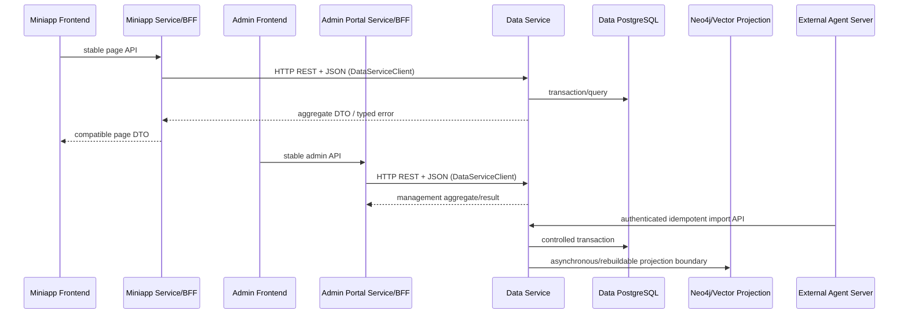
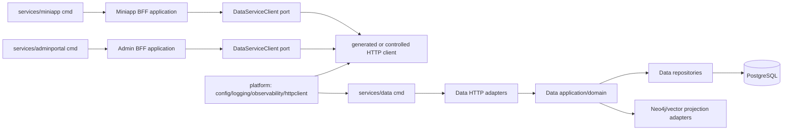

## Context

当前仓库是 monorepo，后端只有一个 `backend/go.mod`，但已经存在多个独立进程和前端入口。调查基线为最新 `origin/main` commit `3f0f779`：

- `backend/cmd/api` 启动小程序 HTTP server，直接执行 migration check、打开 PostgreSQL、构造 `repositories.NewPostgresRepository` 并注入 `miniappapi.ResearchService`。
- `backend/cmd/admin-api` 启动管理 HTTP server，同样直接执行 migration check、打开 PostgreSQL 并把 repository 注入 `adminapi.NewRouter`。
- `backend/internal/apps/miniappapi` 同时拥有页面 DTO/handler、cursor 语义和对 `repositories.ResearchReadRepository` 的直接调用；`backend/internal/apps/adminapi` 同时拥有管理 DTO/handler 和 source/scheduler/raw/event repository contract。
- 当前只有两个 HTTP server。`backend/cmd/event-import` 是 Agent reviewed-outbox 的本地 CLI，直接构造 event import repository 并写 PostgreSQL；目标架构中的第三个 HTTP 入口应是新的 Data Service，而不是把 CLI 误算为服务入口。
- `backend/internal/domain`、`backend/internal/repositories`、`backend/migrations` 共同覆盖 Entity、Chain Node、Source/Raw Document、Event/Event Tag、Research Theme/Anchor、Index/Benchmark、Scheduler、Graph Projection 等 Data Domain 能力。
- ingestion scheduler/source ingest/source seed/entity seed/event import/graph projector/dbmigrate 都直接使用 Data PostgreSQL 或其投影，应归 Data Service 的后台 command/job 边界；其中 connector/parser 执行仍属于 Data Domain 的输入适配，不迁往 BFF。
- `frontend/miniapp` 目前大多通过 mock-first services，只有 Research HTTP 契约已在后端出现；`frontend/admin` 通过 `/admin/*` 调用 admin API，Vite/nginx 代理到单一 backend upstream。
- `backend/Dockerfile` 当前只构建 `admin-api` 与 `dbmigrate`，`infra/uat/docker-compose.yaml` 也只有一个 `backend` 容器；`.github/workflows/ci.yml` 对整个 Go module 运行 `go test ./...`。active `migrate-uat-to-linux-amd64` 正在拥有 UAT workflow/infra 文件，本 change 不与其并行修改。
- 现有 21 个 migration 共同建立 Data PostgreSQL 事实模型。本 change 不搬表、不拆 schema、不重写历史 migration；Neo4j 继续是从 PostgreSQL 可重建的 Data Service 投影。

目标运行时拓扑：



代码依赖边界：



## Goals / Non-Goals

**Goals:**

- 在当前 monorepo、单 Go module 中建立 Data、Miniapp BFF、Admin Portal BFF 三个可独立启动/部署的服务边界。
- 让 Data Service 独占 Data Domain、PostgreSQL repository/migration 与 Neo4j/向量投影能力；BFF 只拥有 channel DTO、用户/权限上下文、页面聚合和领域服务编排。
- 以 HTTP REST + JSON + OpenAPI 建立唯一生产跨服务 contract，并用本地 `DataServiceClient` interface 隔离 HTTP transport 与单元测试 fake。
- 通过 architecture tests 禁止 BFF import Data Service 的 domain/application/repository 内部包，也禁止 BFF 或 Agent 持有 Data DB 凭据。
- 保持现有 miniapp/admin 外部 API 行为、分页和错误语义兼容，采用可回滚的逐包迁移，而不是目录大搬迁。
- 把 service-owned Dockerfile/health/startup assets 与根 `infra` 的跨服务环境编排区分开；本 change 只完成 repo/local 边界。
- 把数据库代码边界调整与实际 role/grant/credential 切换拆开，真实切换仅在独立 R2 授权后执行。

**Non-Goals:**

- 不拆 Git repo，不创建多个 `go.mod`，不发布 `tidewise-go-platform`。
- 不新增 Identity、Membership、Billing、Subscription 服务或数据库；未来领域服务跨库只保存 UUID，不建立跨数据库 FK。
- 不引入 gRPC、Kitex、Kratos、服务注册中心、Service Mesh、Kafka、共享事件总线或分布式事务。
- 不改变现有页面/管理 API 业务语义，不创建平行 Event/Research/Entity 模型。
- 不移动现有表、拆 PostgreSQL schema、修改或重写历史 migration。
- 不修改 Agent Server repo；只定义本 repo 的 Data Service 受控导入 contract 与兼容迁移路径。
- 不修改 `prototype/`、`doc/`，不触碰 UAT/prod/shared 或执行任何数据库、Neo4j、部署写操作。

## Decisions

### Decision: 保持单 module 的服务化单体，而非立即 multi-module/repo split

目标目录以服务 ownership 为第一原则，但迁移允许先建立窄边界再移动文件：

```text
frontend/
├── miniapp/
└── admin/
backend/
├── go.mod
├── services/
│   ├── data/          # cmd, api, application/domain/repository adapters, deploy assets
│   ├── miniapp/       # cmd, BFF application, page DTO, DataServiceClient port
│   └── adminportal/   # cmd, BFF application, permission context, DataServiceClient port
├── platform/          # config/logging/observability/httpclient 等无业务技术能力
├── migrations/       # Data Service 统一历史与增量 SQL，先保留原位
└── data/              # Data Service 版本化 seed/input assets，先保留原位
infra/
├── local/             # 跨服务 compose/network/database/observability orchestration
├── uat/               # 本 change 不修改
└── prod/              # 若未来存在，本 change 不修改
```

由于 Go `internal` 可见性只由父目录约束，直接移动到三个 service 目录仍不足以禁止误 import；必须结合明确 package ownership 与 `go list` architecture tests。为降低 churn，Package 2 可先创建 service-owned facade/ports 并保留旧路径薄适配，只有真实 owner 明确且测试已覆盖后才逐步移动实现。禁止为了目标树一次性迁移所有 `domain`、`repositories`、migrations 或 data assets。

只有出现独立版本/发布生命周期、独立团队、显著不同依赖/资源模型、稳定远程 contract 或单 module 构建测试冲突之一，才另开 OpenSpec change 评估 multi-module；本 change 不以目录美观作为拆分理由。

备选方案是立即创建三个 Go module 或三个 repo。它会迫使 contract/version/dependency 发布、CI cache、local replace、migration ownership与回滚同时变化，风险大于当前收益，不采用。

### Decision: Data Service 拥有 Data Domain；BFF 只拥有 channel/application glue

Data Service ownership 包括：Entity/External Identifier/Edge、Industry Chain Node/Relation、Source Catalog、Raw Document、Event/Event Source/Event Tag、Research Theme/Anchor、Index/Benchmark、ingestion/scheduler state、event import receipt、graph projection run，以及 PostgreSQL/Neo4j/未来向量投影 adapter。

Miniapp BFF ownership 包括：`/api/v1/miniapp/*` 外部契约、页面 DTO、cursor/用户上下文、页面聚合与 Data client orchestration。Admin BFF ownership 包括：`/admin/*` 外部契约、admin authentication/authorization、管理 DTO、操作编排。两个 BFF 平行，不互调。

`platform` 只允许无业务技术能力：config loader、logging、request id/trace、metrics、HTTP server/client bootstrap、transport-neutral retry policy、database driver/bootstrap。Event/Research/Entity DTO、repository interface、Data client 的业务方法与领域规则不得进入 platform。

备选方案是继续共享 `domain/repositories` 并仅拆 binary。它不形成数据所有权或故障边界，architecture tests 也无法阻止跨服务耦合，不采用。

### Decision: 生产跨服务只用 HTTP REST + JSON + OpenAPI

Data Service 拥有 OpenAPI 文档、版本 namespace 和 transport DTO。Miniapp/Admin 各自拥有本地 `DataServiceClient` port；生产 adapter 使用受控生成或手写且 contract-tested 的 HTTP client，单元测试使用 fake。生成代码若采用，输出必须归消费方 adapter 且由 CI 检查 drift，不能把生成 DTO 放入 platform。

最小 contract 规则：

- Data API 使用独立版本前缀（建议 `/data/v1` 或 `/internal/data/v1`，最终路径在 Package 3 contract test 固定），对外 BFF 路径保持不变。
- ID 使用 UUID string，时间使用 UTC RFC3339，枚举为显式字符串；分页采用稳定 cursor + `limit`，错误统一包含 machine code、message、details、request id。
- server 与 client 都配置 timeout budget；只对安全 GET 或具备幂等键的操作做有限重试，不跨服务维持数据库 transaction。
- service identity 与授权采用环境注入的服务凭据/可轮换 secret，日志不得输出；每个请求传播或生成 request id/trace id。
- Data Service 提供页面/管理场景所需聚合 API，禁止 BFF 为一页循环逐条请求造成 N+1/chatty calls。
- breaking contract 必须新版本或先 additive rollout；字段删除/改义必须经过独立 Review 和双读/兼容窗口。

备选 gRPC 或框架化 RPC 当前会增加 IDL/toolchain/运维负担，且前后端现有 HTTP/Gin 资产可复用，不采用。

### Decision: 三个 HTTP binary 渐进形成并保留兼容入口

目标 binary 是 Data Service、Miniapp BFF、Admin Portal BFF。迁移期 `cmd/api` 可保留为 `miniapp` compatibility entrypoint，`cmd/admin-api` 可保留为 `adminportal` compatibility entrypoint；先让它们通过新 app/port 组装，再在构建、README、local orchestration 全部切换后删除旧 alias。Data Service 新 binary 先承接 Data API，随后收敛 repository、migration readiness 和 health。

现有外部 `/api/v1/miniapp/research/*` 和 `/admin/*` 不变。Data API 是内部 contract，不复用 BFF 路径。rollback 可把 BFF 的 `DataServiceClient` adapter 切回进程内 compatibility adapter（仅迁移窗口、同一已测试 interface），而不是恢复 BFF 直接 import repository。

### Decision: 精确现有代码迁移映射

| Current path/capability | Target owner | Minimal migration |
|---|---|---|
| `backend/cmd/api` | Miniapp Service/BFF | 先改为只加载 BFF config、注入 HTTP `DataServiceClient`、启动兼容路由；稳定后迁至 `backend/services/miniapp/cmd`，旧入口短期 alias |
| `backend/cmd/admin-api` | Admin Portal Service/BFF | 去除 migration/database/repository 组装，注入 Data HTTP client；稳定后迁至 `backend/services/adminportal/cmd` |
| 新第三 HTTP entry | Data Service | 新建 Data HTTP binary，拥有 migration readiness、Data API、service auth、request id/trace 与 repository 组装 |
| `backend/internal/apps/miniappapi` | Miniapp BFF | 保留外部 DTO/handler/cursor/page composition；把 repository interface/model 调用替换为本地 Data client port/DTO，不 import Data 内部包 |
| `backend/internal/apps/adminapi` | Admin BFF | 保留 admin auth、管理 DTO/handler、permission/application orchestration；scheduler/raw/event 操作改走 Data client |
| `backend/internal/domain` | Data Service | 先标记为 Data-owned 并禁止 BFF import；按触达范围渐进迁到 Data service internal，不复制模型 |
| `backend/internal/repositories` | Data Service | 先增加 import 禁令并由 Data binary 独占组装；随后按 package 迁入 Data internal，避免 bulk move |
| `backend/migrations` | Data Service | 原位冻结 ownership；不拆目录、不改历史 migration，Data Service/migrator 独占执行 |
| `backend/cmd/ingestion-scheduler`, `source-ingest`, `ingest-smoke`, `source-seed` 与 `internal/apps/ingestion` | Data Service data jobs | 保持命令行为，先建立 Data owner/architecture rule，再按必要性移动；connector/parser 不迁 BFF 或 platform |
| `backend/cmd/event-import`, `internal/apps/ingestion/eventimport`, `internal/domain/eventimport` | Data Service + Agent import adapter | Data Service 拥有 import application/transaction/API；CLI 先改为 contract adapter/兼容工具，生产 Agent 只调用受控 HTTP API |
| `backend/cmd/graph-projector`, `internal/apps/graphprojection`, `platform/graphdb` | Data Service projection job | 保持 PostgreSQL 事实源与 Neo4j 可重建语义；不在本 change 执行 rebuild |
| `backend/cmd/entity-seed`, `internal/apps/entityfoundation/seed`, `cmd/dbmigrate` | Data Service maintenance | 保持独立运维命令与显式授权；BFF 镜像/凭据不得包含直接执行权限 |
| `frontend/miniapp` | Miniapp channel | 页面继续只调用 Miniapp BFF；mock-first 替换另按页面 contract，不直连 Data Service |
| `frontend/admin` | Admin channel | 继续调用 `/admin/*`；nginx/Vite upstream 指向 Admin BFF，不直连 Data Service |
| `backend/internal/platform/*` 与 `internal/config` | `backend/platform` | 只迁稳定无业务 bootstrap；禁止 Data DTO/repository/业务 client 方法进入 platform |
| `backend/Dockerfile` | 过渡构建资产 | 分阶段变为各服务自己的 Dockerfile/health/start config；旧 Dockerfile 在 local/CI 切换后移除 |
| `infra/local` | cross-service orchestration | 编排 Data、Miniapp、Admin 与 PostgreSQL/Neo4j 网络；不包含服务业务启动实现 |
| `infra/uat`, `.github/workflows/deploy-uat.yml` | 暂不修改 | 等 active UAT change Deliver 后，从最新 main 另行适配三服务镜像与 rollout |
| 未来 Agent-specific collection/reasoning | External Agent Server | Agent workflow、模型调用、Prompt/RAG 编排留外部；Data Service 只拥有受控 import/validation/persistence，connector 是否迁 Agent 需独立 change |

### Decision: Database ownership 与实际权限切换分离

代码完成边界后，PostgreSQL 仍整体归 Data Service；Research Theme/Anchor 继续属于 Data Domain。现有 migration/table/schema 均不机械移动。目标 roles：

- `data_service_migrate`: migration/DDL owner，仅 migration job 使用。
- `data_service_rw`: Data Service runtime 的最小 DML 权限。
- `data_service_ro`: 只读审计/受控诊断，非 BFF 默认凭据。

Miniapp/Admin/Agent 不持有 Data DB URL/password。Package 7 才允许 local role/grant 与 credential cutover，且必须重新展示数据库 identity、现有 grants、backup/recovery、manifest hash、before/after assertions、rollback credential 和停止条件。Proposal Review 或 R1 Apply 不授权任何 SQL、role、grant、secret 或连接切换。UAT/prod 需要后续独立 R2/R3 change。

未来 Identity/Billing 等领域若拆出，使用独立数据库，跨领域仅保存 UUID 与 API contract，不建立跨数据库 FK。跨服务业务一致性优先使用单一 Data transaction、幂等 command 和状态机；本 change 不引入分布式 transaction。

### Decision: service-owned deploy assets 与 environment orchestration 分层

每个服务自己的 Dockerfile、binary CMD、health/readiness contract 和启动配置跟随 `backend/services/<service>`。根 `infra/<env>` 只负责跨服务 compose/network/database/observability 与环境拓扑。未来拆 repo 时 service assets 随服务迁移；只有跨系统编排才可能进入独立 `tidewise-infra`。

本 change 只允许 repo build 与 `infra/local` dry config/test，不触碰真实环境。因为 UAT active change 目前拥有 `.github/workflows/deploy-uat.yml` 与 `infra/uat/**`，Package 6 必须排除这些文件；其 Deliver 后才可重基并规划 UAT 三镜像 rollout。

### Decision: TDD 与按包验证

- Package 2 先写 architecture/import tests（RED），再建立 service boundary/facade（GREEN）；验证 `go test ./internal/architecture ...` 与受影响 package。
- Package 3 先写 OpenAPI/handler/client contract tests、timeout/error/idempotency tests，再实现 Data API/client。
- Package 4 先以 fake `DataServiceClient` 固定 BFF 外部行为，再移除 repository imports；运行 miniapp/admin backend suites 与前端 contract tests。
- Package 5 对每个命令先保留 CLI output/exit code/transaction contract tests，再调整 owner；不得运行真实数据库或 Neo4j。
- Package 6 运行 Docker build/config、health contract、CI path assertions 与 local compose config，不运行 UAT/prod。
- Package 7 的数据库 preflight/write/assert 只在独立授权后执行，测试与 dry-run 不构成写入授权。
- Apply final 因为修改共享运行时 contract/目录/构建基础设施，运行一次 `go test ./...`、受影响前端 suites/build、architecture/contract tests、local compose config、OpenSpec strict validate、diff/scope/secret checks。开发中只跑 targeted tests，避免每个纯目录步骤重复全量测试。

## Risks / Trade-offs

- [新增网络 hop 增加延迟并扩大故障面] → Data API 提供页面/管理聚合端点，设置 timeout budget、连接复用、有限重试与指标；用性能基线/调用次数 contract 防止 N+1。
- [BFF 与 Data DTO 漂移] → Data Service 独占 OpenAPI，受控生成或 contract-tested client，CI 检查 schema/client drift；transport DTO 不复用 repository model。
- [迁移期双路径导致行为分叉] → 所有 compatibility adapter 实现同一 `DataServiceClient` contract，设置删除条件，不复制业务模型或 SQL。
- [跨服务认证不足导致内部 API 暴露] → service identity、最小 scope、secret 注入和日志脱敏；Agent import 使用独立 identity、幂等键与审计 receipt。
- [事务边界被错误跨服务扩展] → Data Service 聚合 command 在单一 PostgreSQL transaction 内完成；BFF 不持有 transaction，不引入分布式事务。
- [网络错误破坏管理写操作幂等] → Data write API 要求 idempotency key/command identity，明确 409/4xx/5xx 与 retryability；未知结果先查询 receipt/status。
- [三服务 CI/CD 和镜像数量增加] → service-owned Dockerfile 与 path-aware CI 渐进引入；UAT rollout 延后到 active change 完成，避免并行修改。
- [database role 切换锁死 migration/runtime] → R2 package 使用可恢复 backup、grants manifest、旧凭据回切和逐层断言；任一漂移 fail-closed。
- [platform 演化成业务 shared kernel] → architecture tests 禁止 Data DTO/repository/业务 client 方法进入 platform；只有稳定、重复明显后才另评估共享库。
- [单 Go module 的 `internal` 边界不够强] → 用 `go list` import graph architecture tests 强制禁止依赖；只有长期真实冲突才评估 multi-module。
- [现有主规格仍描述共享 domain/repository 模块化单体] → 本 change 以 delta specs 完整更新 service ownership 与兼容迁移要求，Apply 时 artifacts 与实现一起校验。

## Migration Plan

1. Proposal Review：确认 Data ownership、Data API namespace/identity、目标目录、兼容窗口、R2 排除范围；只授权后续 R1 Apply，不授权数据库或部署写入。
2. Package 2：先增加 architecture tests，建立三个 service owner、binary/facade 与禁止 import；旧路径保留薄兼容入口，rollback 为撤回 facade wiring，不改变数据。
3. Package 3：定义最小 OpenAPI 和 Data HTTP server/client；先覆盖 Research/Admin aggregate 与 Agent import contract，不一次性暴露全部 repository CRUD。rollback 为停止 Data HTTP entry 并保留 compatibility adapter。
4. Package 4：逐 BFF 替换 repository 依赖，先 Miniapp research，再 Admin query/scheduler；每一步以外部 API golden/contract test证明行为不变。rollback 切回已测试的进程内 client adapter，不允许重新引入 repository import。
5. Package 5：将 ingestion/event-import/graph/seed/migration 命令标记并逐步收敛到 Data owner；CLI contract 保持，Agent production path 改为 Data HTTP API。无真实导入、seed、migration 或 projection write。
6. Package 6：创建 service-owned build/health assets与 local orchestration；CI 先 build/test 三服务。排除 UAT files，等待 `migrate-uat-to-linux-amd64` Deliver 后另行 rollout。
7. Package 7（独立 R2 authorization）：执行 local role/grant manifest 与 credential cutover；逐层 `preflight -> write -> query/assert`，失败立即停止并回切。UAT/prod 不在本 change 授权范围。
8. Apply-final Review：提供 scoped diff、兼容/性能/安全证据、完整验证和未验证项；批准前不得 Sync/Archive/Deliver。

## Open Questions

- Data 内部 API namespace 采用 `/internal/data/v1` 还是 `/data/v1`？建议 `/internal/data/v1`，并由网络与 service identity 双重限制；Proposal Review 时固定。
- client 采用 OpenAPI 生成还是小型受控手写？建议先评估现有 toolchain；若生成器会引入重依赖或不稳定 diff，先用手写 typed client + schema contract test，后续另行切换。
- `cmd/api`/`cmd/admin-api` compatibility alias 保留一个 release window 还是直到 UAT 三服务 rollout？建议保留到 local 与后续 UAT 都完成新 binary 验收。
- Package 3 首批 Data aggregate 是否只覆盖现有 Research 与 Admin APIs，还是同时建立通用 Entity/Event read？建议只覆盖现有消费者与 Agent import，避免无消费者的 CRUD surface。
- Package 7 是否属于本 change 的最终 Apply，还是拆为后继 change？建议保留为本 change 内独立授权 package以保证目标完整，但若 local backup/credential owner 尚未就绪，应将其拆为后继 R2 change，且不阻塞 R1 service boundary code 的独立 Review。

## Effort Estimate

| Package | Estimate | Primary evidence |
|---|---:|---|
| 1. Proposal Review | 0.5 day | artifacts、strict validate、decision log |
| 2. Boundary/binaries | 2-3 days | architecture tests、three buildable entries |
| 3. Data API/OpenAPI/client | 4-6 days | contract、HTTP server/client、auth/trace/idempotency tests |
| 4. BFF decoupling | 4-6 days | compatible miniapp/admin suites、no forbidden imports |
| 5. Data jobs ownership | 3-5 days | command contract suites、Agent import transition |
| 6. Build assets/local orchestration | 2-4 days | three images、health、local compose、CI |
| 7. Local DB role cutover | 1-2 days plus authorization | backup、grants manifest、before/after assertions |
| 8. Apply-final Review | 0.5-1 day | full affected-boundary verification and review package |

总计约 17-27 engineer-days；若首批 Data API surface 严格限制为当前 Research/Admin/Agent consumers，预计靠近下限。UAT/prod rollout、multi-module/repo split 与未来领域服务不计入。
