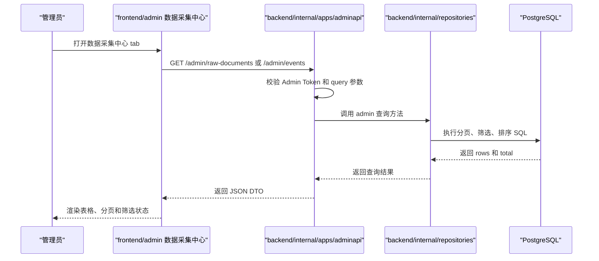
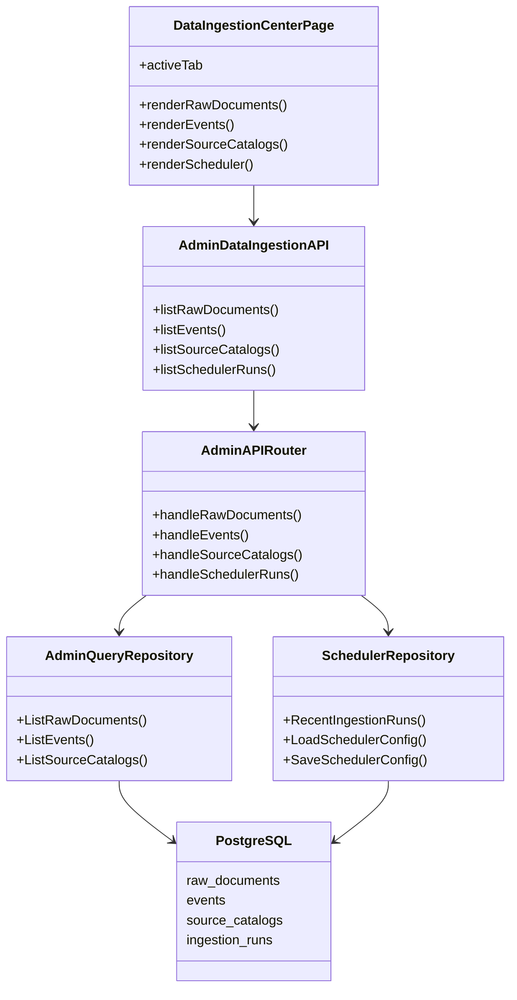

## Context

当前管理后台已经具备登录页、Admin Token 鉴权、Minimal Dashboard 风格 shell、自有 UI 基础组件和调度器配置页。后端已经具备 Admin API 进程、`source_catalogs`、`raw_documents`、`events`、`ingestion_runs` 等表，以及调度器配置和最近运行记录查询接口。

本 change 将现有 `调度器设置` 菜单升级为 `数据采集中心` 菜单，但不把整个 admin portal 定义成数据采集工作台。`数据采集中心` 只是管理后台的一个一级菜单，后续后台还会承载用户、订阅、报告、系统配置等非采集类菜单。

## Goals

- 让管理员在 Web 管理后台中查看采集链路的核心只读数据。
- 让 `raw_documents`、`events`、`source_catalogs` 和 `ingestion_runs` 都有可验证的后台查询入口。
- 保持调度器配置能力，同时把最近一次摘要升级为最近 50 条执行记录列表。
- 继续复用 Admin Token 鉴权、Minimal Dashboard 设计系统和现有 backend/adminapi 进程。

## Non-Goals

- 不实现原始数据、事件、搜索通道或调度记录的编辑、删除、审核、重跑、详情页。
- 不实现事件抽取、事件关系图谱、AI 分析或搜索通道 connector 调试。
- 不新增数据库表或修改现有数据库结构。
- 不修改 `prototype` 或 `doc`。
- 不改变采集器、调度器和 connector 的运行机制。

## Decisions

### Decision: 数据采集中心只读优先

本 change 所有新增后台能力均为只读查询。这样可以先解决采集链路可观察性问题，同时避免在还没有权限模型、审计日志和操作确认机制前引入高风险写操作。

### Decision: 复用现有 Admin API 和 repository 边界

前端只调用 `backend/internal/apps/adminapi` 暴露的管理 API。Admin API 负责鉴权、query 参数解析、分页参数校验和响应 DTO；repository 负责 SQL 查询、过滤、排序和总数统计。前端不得直接了解数据库结构。

### Decision: 分页只用于大列表

`raw_documents` 和 `events` 可能持续增长，必须分页且固定每页 50 条。`source_catalogs` 当前是源目录配置，数量有限，本 change 不分页。`ingestion_runs` 只取最近 50 条执行记录，不分页。

### Decision: 全球事件筛选项先固定为四类

`全球事件` 先支持 `event_status`、`fact_status`、`event_time` 时间范围、`first_seen_at` 时间范围四类筛选。其他筛选项如实体、标签、来源、区域、影响资产等，留到事件抽取和图谱关系稳定后再扩展。

### Decision: 搜索通道不展示 parser

`搜索通道` 面向运营和验收，只展示 source catalog 的可理解字段，如来源名称、provider、channel、source type、URL、状态等。本 change 不展示 `parser_key`，避免把后端内部解析实现暴露给管理用户。

### Decision: 调度器执行记录展示轮次结果

调度器页面的统计含义应是执行轮次结果，而不是 source 数量结果。记录列表展示每一轮 run 的状态、触发类型、开始时间、结束时间、总 source 数、成功 source 数、失败 source 数、跳过 source 数和错误摘要。

## Backend Design

### Admin API

新增或扩展以下 Admin API：

| Method | Path | Query | Purpose |
| --- | --- | --- | --- |
| `GET` | `/admin/raw-documents` | `page`、`page_size`、`title` | 查询原始数据列表 |
| `GET` | `/admin/events` | `page`、`page_size`、`title`、`event_status`、`fact_status`、`event_time_from`、`event_time_to`、`first_seen_from`、`first_seen_to` | 查询全球事件列表 |
| `GET` | `/admin/source-catalogs` | `status` | 查询搜索通道列表 |
| `GET` | `/admin/scheduler/runs` | `limit` | 复用现有接口，前端固定请求最近 50 条 |

分页响应统一使用：

```json
{
  "items": [],
  "total": 0,
  "page": 1,
  "page_size": 50
}
```

`/admin/scheduler/runs` 可以继续保持现有响应结构，但必须支持 `limit=50`。

### Repository

在 repository 层增加 admin 查询模型和方法：

- `ListRawDocuments(ctx, filter)`：按 `collected_at DESC` 排序，支持标题模糊搜索和分页总数。
- `ListEvents(ctx, filter)`：按 `first_seen_at DESC, event_time DESC` 排序，支持标题模糊搜索、状态筛选和时间范围筛选。
- `ListSourceCatalogs(ctx, filter)`：按 `provider_key, source_name` 排序，支持状态筛选。

如果当前 domain 中缺少事件模型，实现时可以新增最小 `Event` 或 admin 查询 DTO，但不得为了后台展示复制一套平行事件表结构。

### Sequence Diagram



### Component Diagram



## Frontend Design

### Page Structure

`frontend/admin` 将当前调度器页面重组为 `数据采集中心`：

- sidebar 菜单名称：`数据采集中心`
- tab：`原始数据`、`全球事件`、`搜索通道`、`调度器`
- `调度器` tab 左侧为配置表单，右侧为最近 50 条执行记录

### UI Components

继续使用自有 Minimal Dashboard UI 基础层。实现时可以补充：

- `Tabs`：用于数据采集中心四个 tab。
- `DataTable`：用于只读表格、空状态和紧凑行展示。
- `Pagination`：用于原始数据和全球事件分页。
- `StatusBadge` 扩展：用于 `active`、`inactive`、`disabled`、`succeeded`、`failed` 等状态。

表格应保持 Minimal Dashboard 的安静数据密度：中性边框、低阴影、蓝色只用于激活态和主要操作。

## Testing Strategy

### Backend TDD

后端实现前先补充自动化测试：

- Admin API router 测试：覆盖鉴权失败、分页默认值、标题模糊搜索参数、事件状态筛选、时间范围参数、source 状态筛选、scheduler runs `limit=50`。
- Repository 测试：覆盖 SQL 查询条件、分页总数、排序和空结果。若测试环境不适合真实 PostgreSQL，可先使用 in-memory/fake repository 覆盖 router 行为，并保留 PostgreSQL repository 的可编译和局部单测。
- 所有新增后端代码必须通过 `go test ./...`。

### Frontend Verification

前端实现后需要验证：

- 登录后 sidebar 显示 `数据采集中心`。
- 四个 tab 可切换，且刷新后不会破坏 Admin Token 请求。
- 原始数据和全球事件列表分页固定 50 条。
- 原始数据标题搜索、事件标题搜索和四个事件筛选项能正确调用 API。
- 搜索通道可以按状态筛选，且页面不展示 parser。
- 调度器 tab 能保存配置，并展示最近 50 条执行记录。

## Risks

- 如果 `events` 表在本地尚无数据，全球事件 tab 需要展示清晰空状态，而不是报错。
- 如果后端调度记录字段语义与前端文案不一致，必须以 `ingestion_runs` 的执行轮次为准，避免再次把 source 成功数误读为轮次成功数。
- 如果分页 API 响应结构与前端表格耦合过紧，后续其他后台列表会重复实现；因此本 change 应抽出可复用的分页响应和基础 UI 组件。
