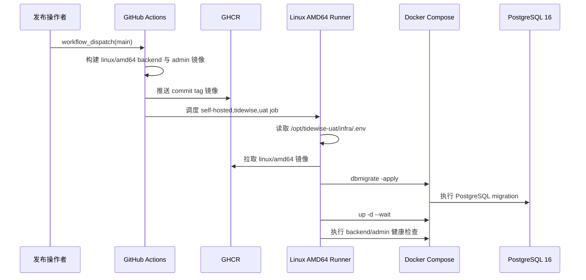

## Context

现有 UAT 运行在 ARM64 Mini Mac，发布工作流构建 `linux/arm64` 镜像，并从 `/Users/mac/tidewise-uat/infra/.env` 读取未提交的运行时环境文件。该主机已经不可用。

新的 UAT 主机是 Ubuntu 24.04 AMD64，已准备 Docker Compose、PostgreSQL 16、`tidewise` 运行账号和 `/opt/tidewise-uat/infra` 受限目录。GitHub-hosted runner 继续负责构建和推送 GHCR 镜像；新主机上的 self-hosted runner 负责在本机 Docker 环境中部署。

## Goals / Non-Goals

**Goals:**

- 让 GitHub Actions 构建可在 Ubuntu AMD64 UAT 主机运行的 backend 与 admin portal 镜像。
- 将持久运行时 `.env` 迁移到新主机的 `/opt/tidewise-uat/infra/.env`，并维持其不进入仓库和仅运行账号可读的边界。
- 将 Linux AMD64 runner 的安装、labels、Docker 与 PostgreSQL 前提写入可重复执行的 UAT 运维说明。
- 保留手动触发、GitHub-hosted 构建、GHCR 发布、容器内健康检查和镜像 tag 回滚机制。

**Non-Goals:**

- 不支持同时向 ARM64 与 AMD64 主机发布；多架构镜像留给后续独立 change。
- 不改变 backend/admin 业务代码、API、数据库 schema 或 migration 内容。
- 不将数据库备份、业务数据、GitHub token、数据库密码或 Admin Token 提交到仓库。
- 不在本 change 中开放 PostgreSQL 公网访问或配置域名、TLS、反向代理和生产环境。

## Decisions

### 使用 `linux/amd64` 作为当前 UAT 唯一镜像平台

新的 UAT Docker host 是 AMD64，工作流只构建 `linux/amd64` 可减少 QEMU 构建耗时和镜像发布成本，并避免发布 manifest 与双平台排错复杂度。

备选方案是一次性发布 `linux/amd64,linux/arm64` 多架构镜像。该方案可保留未来 ARM 运行能力，但当前没有可用 ARM UAT 主机，收益不足以抵消发布时间和维护复杂度。

### 使用 `/opt/tidewise-uat/infra/.env` 作为 Linux 持久环境文件

该目录由 `tidewise` 账号拥有，目录权限为 `0750`，真实 `.env` 将以 `0600` 保存。部署 job 在每次 checkout 中复制受限文件供 Compose 使用，镜像地址仍由工作流临时写入 `.env.images`。

使用 runner checkout、仓库文件或 GitHub Actions 日志保存真实环境变量会破坏 secret 隔离；继续使用原 Mini Mac 路径则无法在 Linux 主机运行。

### Runner 与 Docker host 同机、使用固定 labels

GitHub Actions self-hosted runner 由 `tidewise` 账号运行，并继续使用 `self-hosted`、`tidewise`、`uat` labels。该账号仅通过 docker group 操作容器，不需要把业务 secret 写入 GitHub-hosted runner。

## Risks / Trade-offs

- [AMD64-only 镜像无法被未来 ARM 主机运行] → 以当前唯一可用 UAT 主机为发布目标；重启 ARM UAT 需求时新增多架构 change。
- [部署路径写死为 Linux 路径] → 路径只属于当前 UAT 主机，并在 workflow 与 README 中同步；更换运行主机时必须通过新的部署 change 调整。
- [PostgreSQL 数据迁移可能覆盖新库] → 在导入前做源库和目标库备份，并在独立的受控运维步骤中执行 restore，不由 workflow 自动恢复数据。
- [Docker 对外映射端口可能绕过 UFW] → 在首次部署前核对云安全组与 Docker `DOCKER-USER` 规则，只开放管理员实际需要的 HTTP 端口，PostgreSQL 保持本机监听。

## Migration Plan

1. 完成并合并 workflow、UAT README 与主规格更新。
2. 在新主机以 `tidewise` 账号安装并注册带固定 labels 的 self-hosted runner。
3. 从模板创建 `/opt/tidewise-uat/infra/.env`，仅在主机写入真实运行时 secret。
4. 创建 UAT PostgreSQL 用户和数据库；在确认数据来源后，先备份再导入所需数据。
5. 从 `main` 手动触发 Deploy UAT，确认镜像拉取、migration、容器启动和健康检查成功。
6. 记录首个成功的镜像 tag；若服务失败，使用上一组已知镜像 tag 恢复 Compose 服务，不自动 downgrade migration。

## Open Questions

- 新 UAT 数据应从本地 PostgreSQL 还是仍可恢复的旧 UAT 备份导入，将在数据库初始化前确认。
- admin portal 和 backend 的对外访问策略应由云安全组、Docker `DOCKER-USER` 规则或后续反向代理承担，将在服务首次暴露前确认。
