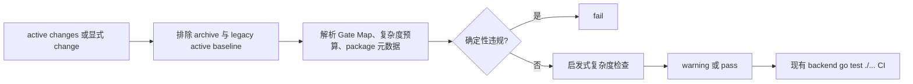

## Context

`optimize-risk-tiered-development-workflow` 已建立风险等级、阶段 Review package、条件式执行包和 active adoption，但这些规则主要约束执行阶段，没有在 Propose 时强制 Agent 交付一个低停顿、可静态审计的 tasks 结构。`refactor-industry-chain-node-foundation` 暴露出的主要问题不是工作范围过大，而是普通 checkbox、测试、dry-run、commit/push 被包装成独立 checkpoint 与人工停顿。

仓库已有可复用模式是 `backend/internal/architecture/workflow_rules_test.go`：用 Go 标准库读取规则文件，并由现有 CI 的 backend `go test ./...` 自动执行。当前没有独立 OpenSpec lint 工具或 repo-level scripts，因此应在现有架构测试边界扩展最小实现，不引入新依赖。

本 change 只设计未来规则。当前 Proposal artifacts 只写入自己的 change 目录；`refactor-industry-chain-node-foundation` 与其他 active change 不 adoption、不改写、不追认，也不触碰其数据库状态。

## Goals / Non-Goals

**Goals:**

- 让一级 task 表达内聚交付 package，并在 Proposal/tasks 开头提供可机器读取的 Gate Map 与复杂度预算。
- 把人工 gate 限定为真实语义、安全、环境、漂移恢复、Apply-final 和 Git 完成边界。
- 让普通实现、测试、修复、dry-run、validate、diff/secret check、commit/push 留在 package 内连续执行。
- 为 local-only R2 条件式执行包定义多层顺序执行、recovery baseline 复用与 fail-closed 语义。
- 用无新依赖的 lint 对确定性违规 fail，对任务拆分复杂度只 warning。
- 让 lint 只处理 active changes 或显式传入的 change，永不扫描或改写 archive。

**Non-Goals:**

- 不重写或扩展 OpenSpec CLI。
- 不修改 archive 历史、active change artifacts/tasks 或既有授权。
- 不削弱 R3、Neo4j、UAT/prod/shared、部署、secret、权限、漂移/失败恢复、Apply-final、PR merge/cleanup 门禁。
- 不修改业务功能、API、前端、migration、seed、数据库或部署状态。
- 不要求通过自然语言关键词准确判断所有任务质量。

## Decisions

### 1. 一级 task 是 package，操作步骤是包内子项

`tasks.md` 的一级编号只表达阶段 package。每个 package 记录 scope、风险、执行连续性、证据和停止条件；测试、修复、dry-run、validate、diff/secret check、commit/push 只能作为包内子项。人工 gate 是 package 边界，不是 checkbox 的默认属性。

本 change 自身只使用三个一级 package：Proposal Review、一个 R0/R1 Apply package、Apply-final Review。这样 artifacts 直接示范目标结构，而不是用过度拆分的 tasks 描述“减少过度拆分”。

**替代方案：**保留任意一级任务，只在文案中建议合并。该方案无法静态判断 package 边界，也无法阻止微型 checkpoint 回归，因此不采用。

### 2. Gate Map 使用固定字段和合法原因码

Proposal 与 tasks 开头必须包含 Gate Map，字段固定为 gate、risk、human、reason、allowed scope。人工 gate 的 reason 使用以下稳定原因码，正文可追加中文解释：

| 原因码 | 合法边界 |
|---|---|
| `SPEC_SEMANTICS` | Spec 或业务语义人工决策，包括 Proposal Review |
| `R3_OPERATION` | 生产、不可逆 cleanup 等 R3 操作 |
| `NEO4J` | Neo4j 写入或 rebuild |
| `SHARED_ENV` | UAT、prod 或 shared 环境 |
| `DEPLOYMENT_SECURITY` | 部署、secret、权限 |
| `DRIFT_RECOVERY` | scope/count/hash/schema 漂移或失败恢复 |
| `APPLY_FINAL` | Apply-final 人工 Review |
| `GIT_COMPLETION` | PR merge 或 cleanup |

普通源码实现、测试/修复、dry-run、validate、diff/secret check、commit/push 不属于合法人工 gate 原因。使用原因码而不是模糊关键词，使 lint 能可靠 fail；复杂度启发式仍只 warning。

**替代方案：**对任意中文理由做关键词匹配。该方案容易因措辞变化误报或漏报，不采用。

### 3. 复杂度预算是 Proposal 契约

Proposal 与 tasks 必须声明预计人工 gate 数、stateful layers 数、checkpoint 数、完整测试次数和可连续自动执行范围。lint 校验字段存在、值可解析且与 Gate Map 的人工 gate 数一致；超出建议阈值只 warning，因为某些高风险 change 合理地需要更多 gate。

建议阈值不是硬上限：R0/R1 通常为 2 个生命周期人工 gate、1 个 Apply package、Apply-final 1 次完整验证；R2/R3 可因命名环境与独立授权增加。warning 要求作者复核，但不以任意数量阻断合理风险设计。

### 4. local-only R2 允许一个条件式执行包内顺序多层

仅在 Spec 已批准、环境精确为 local 且范围精确匹配时，一个独立获批的 R2 条件式执行包可以逐名列出多个 layer。每层必须具有：

1. 环境、范围与排除范围；
2. 只读 preflight 与 expected counts/hash/schema；
3. recovery evidence 或可复用 recovery baseline 引用；
4. `Write(layer N)`；
5. `Query/assert(layer N)`；
6. 漂移、失败、超时、冲突与人工中止条件。

执行严格为 `preflight -> Write -> Query/assert`。当前层全部断言通过后，才自动进入同一授权包内已经逐名列出的下一层；任何漂移或失败立即停止，未执行层剩余授权失效。

同一环境、同一维护窗口且基础状态的 identity、scope、count/hash/schema 未变化时，后续层可复验并引用同一 recovery baseline，而不是重新生成完整 backup package。复用前必须验证 baseline 指纹与当前 preflight 一致；不一致时停止并重新建立 recovery evidence。shared local、UAT、prod、Neo4j 或 R3 不适用此简化。

### 5. 验证以 package 为单位递增

- 开发中：只运行与当前失败或实现直接相关的 targeted tests。
- package checkpoint：运行一次与整个 package 匹配的验证，包含 OpenSpec/lint、diff、scope、secret 和 targeted suite。
- Apply-final：运行一次受影响交付边界完整验证与共享 architecture/contract tests；共享规则变更触发 repo-wide full validation。

测试失败与修复留在同一 package 内循环，不创建新人工 gate。旧日志不能替代 checkpoint 或 Apply-final 的新鲜证据。

### 6. 候选审阅先全量机器校验，再人工聚焦例外

候选 package 必须先对全量数据运行可重复机器校验与总体断言，再生成异常、冲突、宽边界、低置信度和用户明确指定项清单供人工逐项审阅。普通正常项不再依赖机械逐条人工确认；已批准 Spec 明确要求逐项确认的 final manifest 仍保持人工决策。

### 7. lint 复用 Go 架构测试并最小接入 CI

未来 Apply 优先在 `backend/internal/architecture/` 增加 task-design lint 与测试，沿用现有标准库文件读取模式；fixture 放在该包的 `testdata/task_design/`，至少覆盖合规 tasks、缺 Gate Map、缺复杂度预算、非法人工 gate、微型 Review/checkpoint 重复、缺字段 stateful package。

lint 提供两种作用域：

- active 模式：只枚举 `openspec/changes/*/tasks.md`，显式排除 `openspec/changes/archive/`，并跳过规则 Deliver 前已登记的 active change baseline；
- explicit 模式：只检查调用方传入的 change name，仍拒绝 archive 路径。

确定性 fail：缺 Gate Map/复杂度预算、人工 gate 原因码不合法、Gate Map 与人工 gate 数不一致、标记为 stateful 的 package 缺环境/范围/断言/停止条件、显式扫描 archive。启发式 warning：一级 package 数过多、相邻/重复微型 Review 或 checkpoint、把测试/dry-run/commit/push 疑似提升为一级 package。warning 只输出复核依据，不使测试失败。

接入点保持最小：现有 `backend` CI 已运行 `go test ./...`，因此 active lint 作为架构测试自动进入 CI，不新增 job 或依赖；显式 change 验证命令用于 Proposal/package checkpoint。若 Apply 发现现有测试入口无法同时支持明确传入 change，才增加一个薄 wrapper，不复制解析逻辑。

**替代方案：**新建独立 Node/Python lint 工具。它会增加运行时、依赖和 CI 安装面；现有 Go 架构测试已经覆盖同类规则，因此不采用。

### 8. TDD 与验证边界

Apply 若获批，先添加 fixture 和失败测试，证明缺失结构与非法 gate 会 RED，再实现解析/校验使其 GREEN。关键测试边界是 Markdown 结构解析、合法原因码、stateful 字段、archive 排除、explicit scope 和 warning 不失败；不访问网络、数据库或 secret。

targeted 命令预计为 `go test ./internal/architecture -run TaskDesign -count=1`。由于本 change 修改共享工作流规则与架构测试，Apply-final 运行 backend `go test ./...`、OpenSpec strict validation、规则链接/重复检查、diff/scope/secret 检查；不需要前端测试，因为无前端影响。

## Risks / Trade-offs

- [Markdown 格式演进导致解析脆弱] → 只硬校验稳定标题、表格字段、原因码与 stateful 元数据；自然语言复杂度只 warning。
- [旧 active change 被新 lint 阻断] → 在规则 Deliver 时记录 active baseline，active 模式跳过；只有显式 adoption 后才移除跳过项。
- [固定原因码看似增加写作负担] → 原因码只用于 Gate Map，中文解释仍自由；换取可靠 lint 和清晰授权边界。
- [warning 被忽略] → checkpoint self-review 必须记录 warning disposition，但 warning 本身不升级成人工 gate。
- [recovery baseline 被错误复用] → 仅限同环境、同维护窗口且基础指纹复验一致；任何漂移立即 fail-closed。

## Migration Plan

1. Proposal Review 通过后，在一个 R0/R1 Apply package 内测试先行实现规则与 lint。
2. 用合规/违规 fixture 和当前 change 显式验证 lint；登记 Deliver 时仍 active 的 legacy baseline，确认不修改其 artifacts。
3. 运行一次 package checkpoint 验证并提交 scoped checkpoint。
4. Apply-final 运行受影响边界完整验证，提交人工 Review；批准前不 Sync、Archive 或 Deliver。
5. 新规则 Deliver 后只默认应用于新创建 change；active change 必须按既有 adoption 流程单独批准。

回退方式为 revert 本 change 的规则/lint/CI 接入 commit；没有数据库或部署状态需要恢复。

## Open Questions

无。若 Apply 时发现现有 Go 测试入口无法可靠支持 explicit mode，应在同一 package 内选择薄 wrapper，并在 Apply-final Review 中说明差异，不扩大到独立工具链。
