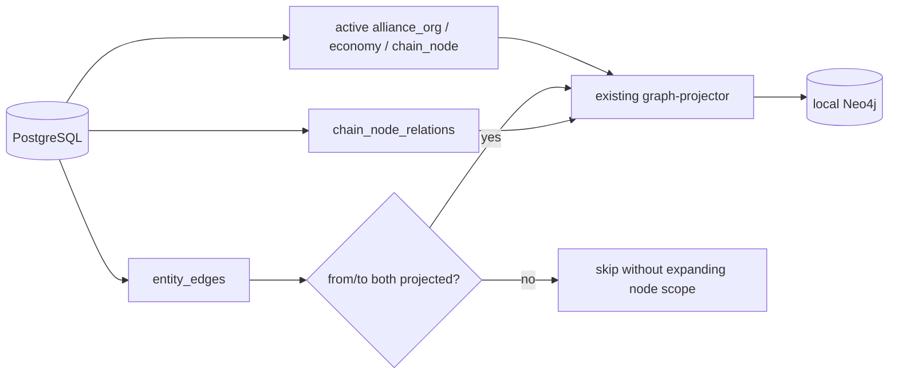
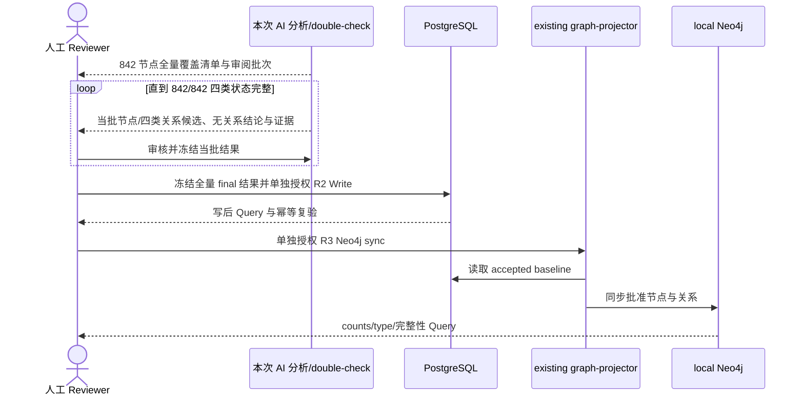

## Context

现有 graph projector 仍依赖已删除的旧产业表和旧关系类型，尚未完整读取当前 `entity_nodes`、`entity_edges`、`chain_node_relations`。`reinitialize-alliance-economy-foundation` 仍未 Deliver，因此本 Proposal 不把其当前分支、候选或数据库状态视为最终基线。

本 change 只保留两个 scope：从 PostgreSQL 重建当前基础图投影，以及完成当前 842 个 chain_node 的四类关系审计与数据完善。PostgreSQL 是唯一事实源，Neo4j 只是可重建投影。

## Goals / Non-Goals

**Goals:**

- 等前置 change 完整 Deliver 后审计最终基线，只做当前 graph projector 必需的最小 R1 适配与 targeted tests。
- 以两个独立 R3 授权层清空并重建 disposable local Neo4j，按节点类型、关系类型和完整性断言验收。
- 全量审计当前 842 个 chain_node 的 `is_subcategory_of`、`is_component_of`、`input_to`、`depends_on`，必要时向下研究细分节点。
- 保持分批候选 Review、全量 final 候选冻结、PG R2 Write/Query 与 Neo4j R3 sync/Query 的独立授权。

**Non-Goals:**

- physical constraints。
- 通用导入/候选/审核平台、policy engine、runner 或 dry-run/report framework。
- 查询 API、图服务、推理引擎或派生关系。
- 因 `has_market` 等边扩投影 market/index/benchmark。
- UAT/prod/shared、前端、事件、观测、股票推荐。
- Proposal 阶段的源码、PostgreSQL 或 Neo4j 访问/写入。

## Decisions

### 1. 三个顶层 package

Package 1 交付基础投影闭环，Package 2 交付当前 842 个 chain_node 的全量四类关系完善，Package 3 交付 Apply-final、Sync、Archive、Deliver。普通实现、测试、只读审计、commit 和 push 不拆成人工 gate。

### 2. 基础投影的节点与边界

前置 dependency Deliver 后，baseline/overlap audit 只读确认最终 schema、active entity counts、`entity_edges`、`chain_node_relations` 与 projector query。最小适配只复用现有 repository、mapper、projector、CLI 与 namespace 删除能力。

投影节点集合只包含 active `alliance_org`、`economy`、`chain_node`。对 `entity_edges`，先判定 from/to 端点是否都在该集合内，只投影两端都命中的关系；任一端为 market/index/benchmark 或其他范围外实体时跳过，不为了保留边而扩大节点集合。`chain_node_relations` 仅在两端 chain_node 都存在且 active 时投影。

targeted tests 只覆盖当前 query、端点过滤、mapper、projector cleanup/rebuild 和 CLI counts/失败处理，不扩大为通用 graph framework。

### 3. local Neo4j 不做 backup

cleanup 与 rebuild 是两个独立 R3 授权层。cleanup 只清 Tidewise namespace；rebuild 只从已冻结并验收的 PostgreSQL projection baseline 投影当前节点和符合端点边界的关系。Neo4j 不创建 backup/rollback；失败后保持 empty/partial/stale，待重新授权后从 PG 重建。

现行 workflow/lint 将 `approved-disposable-recovery` 限定为 local R2，无法表达上述 R3 语义。不得用 `backup` 伪装证据，也不在本 change 修改 workflow/lint。因此这是 Apply 前硬 blocker。

### 4. Package 2 覆盖当前 842 个 chain_node

用户已明确批准当前 842 个 chain_node 作为本 change 的全量完成范围。前置 change Deliver 后必须重新冻结 identity/count/hash；若数量或 identity 集合不再与 842 节点基线一致，必须回到 Review。

为每个基线节点的四类关系维度记录审计状态：待研究、有批准关系、不适用或证据不足。“完整”不表示强制每个节点必须拥有四类边；它表示 842/842 节点均完成四类语义审计，任何无关系结论都有可审阅理由。有强证据时提出 `is_subcategory_of`、`is_component_of`、`input_to`、`depends_on`，必要时从已有节点向下研究细分 chain_node。

为保持可审阅性，研究与候选 Review 可按节点群分批进行，但任一批次完成都不代表 Package 2 完成。只有覆盖率达到 842/842、四类状态无未研究项、候选与异常/冲突全部处置后，才能冻结全量 final 数据。

### 5. AI 生成与 double-check 只是本次方法

每个审阅批次的第一遍 AI 生成节点/关系候选、来源、证据、反例、置信度与 disposition；主对话第二遍 double-check 复核 identity、端点、方向和证据。这些是本次数据分析活动，不新增任何产品能力、长期系统契约或审核平台。用户需逐批审核，最终冻结 842/842 节点的全量结果。

Package 2 默认为纯数据任务，复用现有 schema、写入能力与 projector，不预设源码、migration、repository/service、runner、dry-run/report framework 或新测试。只读 capability audit 若证明存在硬缺口，必须停止并带证据回到 Review。

### 6. PG-first 数据流程

PG Write 必须在已有事务边界内原子化，并以写后 Query 与重复执行证明幂等。PG 验收后才可单独申请 Neo4j R3 sync。不开发查询 API、service、推理 engine、派生 relationship 或新测试框架。

## Risks / Trade-offs

- [workflow schema 无法表达 Neo4j R3 disposable recovery] → 诚实记录 blocker，explicit lint 预期失败，本 change 停在 Proposal Review。
- [前置 change 改变最终基线] → Apply 前从最新 `origin/main` 重做 audit，差异回到 Review。
- [entity_edges 导致节点扩张或孤儿边] → 两端都在已投影节点集合时才投影，否则跳过。
- [842 节点研究量大且分批容易遗漏] → 冻结基线 identity/count/hash，以 842×4 覆盖清单跟踪审计状态，不以单批完成替代全量完成。
- [为达到覆盖率而伪造关系] → 完整性按“有批准关系/不适用/证据不足”可审核状态衡量，不强制每节点拥有每种边。
- [现有写入能力有硬缺口] → 只读 audit 提供证据后回到 Review，不预授权新结构。

## Migration Plan

1. 先解决 workflow schema blocker；本 change 不修改 workflow/lint。
2. 等待前置 change 完整 Deliver，从最新 `origin/main` 重做 baseline/overlap audit。
3. 在后续 Apply 明确授权后，完成 Package 1 R1 targeted tests/最小适配，再分别请求 cleanup 与 rebuild R3 授权并 Query。
4. 冻结当前 842 个 chain_node 基线，建立 842×4 覆盖清单，分批研究、double-check 与用户 Review，直到全量状态完整且无未处置候选。
5. 冻结全量 final 节点/关系结果，单独请求 R2 PG Write，执行原子写入、Query 与幂等；PG 验收后再单独请求 R3 Neo4j sync 并 Query。
6. 运行 Apply-final 验证并等待人工 Review；通过后才按顺序 Sync、Archive、Deliver。

## Open Questions

- 项目 workflow schema 将如何在不伪造 backup 证据的前提下，合法表达 local Neo4j R3 disposable recovery？
