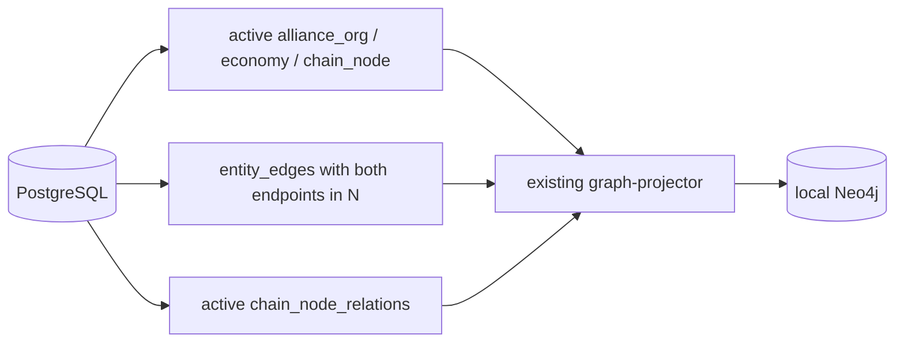
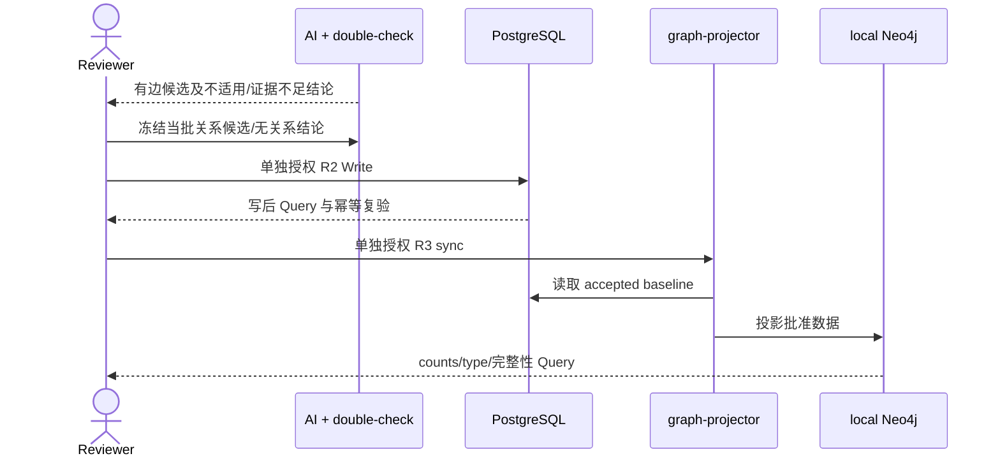

## Context

三个前置 change 已全部 Deliver。当前分支已无冲突合入 `origin/main=1733b8ba5fe85c17ed06f50412273ca5711b0d02`，change 外无额外差异。最新 migration 已删除旧产业表并建立 `chain_node_relations`，但 graph projection repository 仍查询旧表，故当前 projector 在最终 schema 上不能完成读取。

本 change 保持两个业务 scope：从 PostgreSQL 重建当前基础图投影；完善当前 842 个 chain_node 的四类关系。PostgreSQL 是唯一事实源，Neo4j 是 local disposable projection。

## Goals / Non-Goals

**Goals:**

- 最小修复已有 projector 对当前 PG 模型的兼容性，并用 targeted tests 锁定查询、映射、端点过滤与重建契约。
- 独立授权清空和重建 local Neo4j，按实体类型、关系类型及完整性 Query 验收。
- 在本 change 内完成 842 个既有节点之间的四类关系审核状态；以有证据的批次研究和 Review，全部冻结后仅写 chain_node_relations，再同步 Neo4j。

**Non-Goals:**

- physical constraints、通用导入/审核平台、runner、policy engine、dry-run/report framework。
- 查询 API、图服务、推理引擎、派生关系。
- market/index/benchmark 扩投影、UAT/prod/shared。
- 前端、事件、观测、股票推荐。

## 系统能力差距矩阵

| 能力 | 最新代码证据 | 已有 | 最小改造 | Package | 用户 gate |
|---|---|---|---|---|---|
| graph-projector CLI | `backend/cmd/graph-projector/main.go` 已有 check/project-entities/rebuild-entities | 是 | 无；复用现有入口 | 1 | R3 操作前授权 |
| namespace cleanup/rebuild | `projector.go` rebuild 调用 `DeleteNamespace`；`neo4j_writer.go` 只删除指定 namespace | 是 | cleanup 可复用相同 Cypher 语义单独执行，rebuild 用 project-entities；不建新 runner | 1 | cleanup/rebuild 分别 R3 |
| 当前节点读取 | `graph_projection.go` 仍 LEFT JOIN 已由 migration 15 删除的 sector/industry_chain 表 | 否 | 查询只读 active alliance_org/economy/chain_node 的 entity_nodes | 1 | 无普通实现 gate |
| entity_edges 端点过滤 | 当前 SQL 只要求 active，未限制三类节点；projector mapper 会对未载入端点 skip | 部分 | SQL 限制两端类型并保留 mapper fail-safe | 1 | 无普通实现 gate |
| chain_node_relations 读取 | migration 17 已建表；repository 仍 UNION 旧 memberships/topology | 否 | UNION current active chain_node_relations，并标识来源 | 1 | 无普通实现 gate |
| 四类 Neo4j 映射 | `mapping.go` 仅已有 depends_on，缺其余三类 | 部分 | 增加 IS_SUBCATEGORY_OF、IS_COMPONENT_OF、INPUT_TO；保留 DEPENDS_ON | 1 | 无普通实现 gate |
| Neo4j upsert | `neo4j_writer.go` 已按类型分组 MERGE 节点/关系 | 是 | 无 | 1/2 | 对应 R3 |
| PG schema | migrations 15/17/18 已建立当前 entity/profile/relation 模型；physical constraint 表存在但本 change 不使用 | 是 | 无 migration | 1/2 | 无 |
| 新关系 dry-run/事务写 | `chain_node_relation_batch.go` 已有 repeatable-read dry-run、整批事务、端点/tuple/写后/幂等校验 | 是 | repository 无改造 | 2 | PG R2 |
| 新关系 CLI | `cmd/entity-seed/main.go` 强制历史 96 条 SHA/count，并调用 FrozenFirstBatch 方法 | 否 | 最小解锁 change-specific approved manifest，直接复用通用 batch 方法 | 2 | Proposal Review 后才允许 R1 |
| R3 disposable recovery 表达 | 最新 workflow/lint 仍只允许 local R2 使用 approved-disposable-recovery | 否 | 本 change 不改规则；作为 Apply blocker | 1/2 | 独立 workflow change |

## Decisions

### 1. 三个顶层 package

Package 1 修复并验收基础投影闭环；Package 2 执行获批的数据批次并持续服务 842 全量目标；Package 3 完成 Apply-final、Sync、Archive、Deliver。普通 R1 工作不拆成人工 gate。

### 2. 基础投影边界

节点集合只含 active `alliance_org`、`economy`、`chain_node`。`entity_edges` 只在 from/to 均属于该集合时投影；`chain_node_relations` 只在两端为 active chain_node 时投影。分类、组成、投入、依赖分别保留 typed relationship；不生成派生边。

`graph_projection.go` 与 `mapping.go` 是确定需要修改的生产文件。`projector.go`、`neo4j_writer.go`、`graph-projector/main.go` 的现有行为足以复用；只更新必要 targeted tests。投影运行会写现有 `graph_projection_runs/items` 审计元数据，这不构成业务数据反写。

### 3. local Neo4j 两层授权且不备份

cleanup 只执行现有 namespace 删除语义并 Query 为零；rebuild 在第二次授权后使用 `project-entities` 从冻结 PG baseline 写入，避免一个命令把两个人工 R3 层合并。失败时不回滚 Neo4j，重新授权后从 PG 重建。

当前 workflow schema 仍不能为 R3 表达 `approved-disposable-recovery`。本 change 不伪造 `backup`，也不修改 workflow；必须等待 `allow-local-neo4j-disposable-r3-recovery` 完整 Deliver。

### 4. 842/842 是本 change 的关闭边界

“完善 842 个节点”只表示在这 842 个既有节点之间分析四类关系。每个基线节点对每类关系都必须有已审核结论：批准关系、不适用或证据不足；不要求伪造边，也不得用新增或细分节点补足关系。

用户已确认本 change 必须保持开启，直至 842/842 节点的四类审核状态全部冻结且无待研究、未处置候选、异常或冲突。研究和 Review 可以按节点群分批，但任何单批都不是 Package 2 或 change 的关闭边界；不得把剩余节点拆到后续 data-only changes。

### 5. 数据分析不是产品能力

每批先由 AI 整理候选、来源、证据、反例、置信度与 disposition，再由主对话 double-check identity、端点、方向和证据，最后用户冻结 final manifest。这是工作方法，不新增 capability、服务或审核平台。

关系数据可直接复用现有通用 repository batch。唯一确定的入口缺口是 CLI 仍绑定历史 96 条冻结 manifest；只允许最小解锁 change-specific relation manifest。Package 2 不新增节点、profile、external identifier、identity、migration、repository/service 或通用导入框架，因此不存在 entity+relation 原子事务适配。

### 6. PG-first

Neo4j 下游多跳只作为验收 Cypher：`input_to` 顺向、`depends_on` 反向，分类/组成不计入上下游。不开发查询 API 或派生关系。

## Risks / Trade-offs

- [R3 disposable recovery lint 不可表达] → 独立修订 workflow 前不 Apply。
- [842 全量研究周期长且容易遗漏] → 冻结 842×4 覆盖账本，分批研究和 Review，但只以 842/842 完整状态关闭 Package 2。
- [候选需要超出既有节点集合才能表达] → 记录不适用/证据不足，不新增节点解决。
- [entity_edges 扩张节点或形成孤儿边] → SQL 端点过滤加 mapper fail-safe。
- [为了覆盖率伪造关系] → 允许可审核的不适用/证据不足结论。

## Migration Plan

1. Apply 前复验最新 main 未漂移，并等待 workflow schema blocker 独立解除。
2. 完成 Package 1 targeted tests 与最小 projector 修复；分别申请 cleanup、rebuild R3 授权并 Query。
3. 冻结 842×4 覆盖账本并分批完成数据分析/double-check/Review，直至 842/842 状态完整。
4. 冻结全量 relation final manifest，并执行最小 CLI manifest 解锁；不新增其他数据写入能力。
5. 分别申请 PG R2 Write/Query 和 Neo4j R3 sync/Query。
6. Apply-final Review 通过后才 Sync、Archive、Deliver。

## Open Questions

- 最新 workflow 将通过哪个独立 change 合法支持 local Neo4j R3 disposable recovery？
