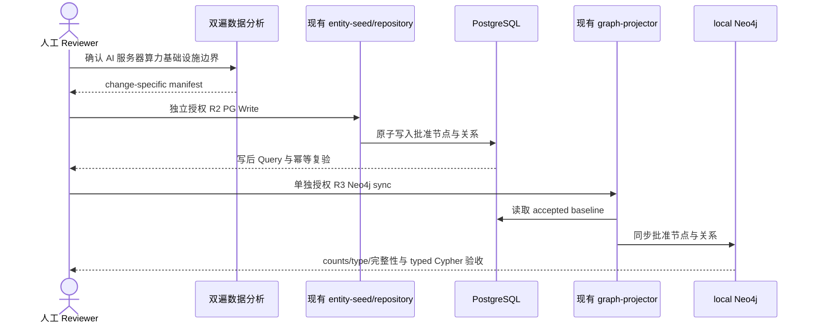

## Context

当前主分支已具备 842 个 chain_node、95 条 `is_subcategory_of` 与 1 条 `is_component_of`；`input_to`、`depends_on` 为 0。现有 graph projector 仍依赖已删除的旧产业表和旧关系类型，尚未读取 `chain_node_relations`。`reinitialize-alliance-economy-foundation` 仍未 Deliver，因此本 Proposal 不把其当前分支、候选或数据库状态视为最终基线。

本 change 只解决两个闭环：先修复当前实体模型的 PG→Neo4j 投影，再用一个审核通过的有限产业链数据批次验证 PG-first 流程。它不是通用产业数据治理平台。

## Goals / Non-Goals

**Goals:**

- 在前置 change 完整 Deliver 后审计最终基线，只做现有 graph projector 所需的最小 R1 适配。
- 以两个独立 R3 层清理和重建 disposable local Neo4j，并按实体类型、关系类型和完整性断言验收。
- 用唯一推荐的 AI 服务器算力基础设施批次验证 change-specific manifest → PG Write/Query → Neo4j sync/Query。
- 保持 PG R2 与 Neo4j R3 独立授权，PG 始终是唯一事实源。

**Non-Goals:**

- physical constraints。
- 通用导入/候选/审核平台、policy engine、runner 或 dry-run/report framework。
- 查询 API、图服务、推理引擎或派生关系。
- 842 节点全量治理、UAT/prod/shared、前端、事件提取/推理、观测数据、股票推荐。
- Proposal 阶段的源码、PostgreSQL 或 Neo4j 访问/写入。

## Decisions

### 1. 三个顶层 package，七个真实人工 gate

Package 1 交付基础投影闭环，Package 2 交付一个纯数据批次，Package 3 交付 Apply-final、Sync、Archive、Deliver。顶层 package 不按每个授权拆碎；Human Decision Register 单独记录 Proposal 业务 Review、四个 stateful layer、Apply-final 和 Git completion 共七个决策点。

已批准 scope 内的普通 R1 测试、实现、dry read、修复、commit 与 push连续推进。checkbox 记录交付进度，不自动制造人工停顿。

### 2. Package 1 只适配当前 projector 契约

前置 dependency Deliver 后，baseline/overlap audit 只读确认最终 schema、active entity counts、`entity_edges`、`chain_node_relations` 与 projector query。若发现超出已知旧表/新关系 source 的硬差异，先回到 Review。

最小适配边界：

- node source：active `entity_nodes`；
- generic relation source：active `entity_edges`；
- industry relation source：active `chain_node_relations`；
- mapper：固定映射四类产业关系并移除旧 `member_of_chain`、`supplies_to`、`substitutes_for` 等依赖；
- projector/CLI：复用现有 rebuild、run report 和 namespace 删除能力。

targeted tests 仅覆盖 repository query、mapper、projector 和 CLI 的上述必要契约，不扩大为通用 graph framework。

### 3. local Neo4j 使用 PG baseline 恢复，不做 Neo4j backup

`local-neo4j-foundation-cleanup` 与 `local-neo4j-foundation-rebuild` 是两个独立 R3 授权层。Recovery Evidence 明确为用户批准的 disposable recovery；Recovery Baseline 是已冻结并验收的 PG projection baseline，不得在表中写成 Neo4j backup。

cleanup 只清 Tidewise namespace。rebuild 只从 PG 投影 active `alliance_org`、`economy`、`chain_node` 与已批准关系。验收报告必须分别给出三类节点 counts、各 relation type/count，并断言 missing endpoint、duplicate identity/edge、orphan 和 legacy type 均为 0。失败时保持空/partial/stale，重新授权后从 PG 重建，不回填旧图。

### 4. 唯一推荐首批：AI 服务器算力基础设施

entry node 是“AI服务器”。该批次用于在有限硬件链中同时验证分类/组成关系与投入/依赖关系，且能够形成至少一条可审阅的多跳下游路径。

**包含：**

- AI 加速芯片与加速卡；
- HBM；
- 高速互连、数据中心交换与光模块；
- 服务器电源与液冷系统；
- AI服务器；
- AI算力集群这一直接部署节点。

**边界：**

- 最多两跳直接上游硬件和一跳直接部署节点；
- 建议上限 18 个 chain_node、28 条静态关系；
- 只允许 `is_subcategory_of`、`is_component_of`、`input_to`、`depends_on`；
- 排除完整半导体制造设备/材料链、矿产与商品、通用云/IDC 运营、模型/软件/应用、公司/证券和 physical constraints。

该范围是本轮 Proposal Review 唯一待确认业务项。未获用户确认不得进入候选生成；发现边界需外扩或超过上限时停止并另开后续数据批次。

### 5. 双遍 AI Review 是分析方法，不是产品能力

第一遍根据批准边界生成节点/关系候选、来源、证据、反例、置信度与 disposition；第二遍独立复核 identity、关系方向、端点、证据和范围。输出只形成 change-specific manifest 与 Review 清单，不新增 service、schema、policy engine 或审核框架。

Package 2 复用现有 schema、entity-seed/repository 和 graph-projector。Apply 先做只读 capability audit；如果现有入口无法满足 manifest 原子写入或必要验收，必须提交硬缺口证据回到 Review，不在 tasks 中预授权 migration、新 repository/service 或 runner framework。

### 6. 最小 PG-first 数据流程

数据 artifact 仅为本 change manifest。最小 preflight 校验 manifest hash/scope、identity、端点、tuple 与范围外保护。PG Write 必须原子化；写后 Query 与重复执行证明幂等。任何漂移、冲突或范围外变化都停止。

### 7. 多跳只做验收 Cypher

Neo4j 保存 PG 原始 typed 关系方向。验收 Cypher 把 `input_to` 按顺向、`depends_on` 按反向组合；`is_subcategory_of` 和 `is_component_of` 只做分类/组成，不计入上下游路径。输出 depth、node path、relation path 和 evidence，用于证明首批端到端数据可查询。

本 change 不实现查询 API、service、推理 engine、APOC framework 或派生 relationship。

### 8. 测试与验证

Package 1 targeted tests 只覆盖当前 query、mapper、projector、CLI。Package 2 tests 只覆盖 change-specific manifest scope/identity、端点、现有事务写入、幂等、范围外保护和 typed Cypher 规则。Apply-final 对实际受影响 backend 边界运行一次完整验证；不因 Proposal 预设 migration 或新框架测试矩阵。

## Risks / Trade-offs

- [前置 change 改变最终基线] → Apply 前从最新 `origin/main` 重做 audit，差异回到 Review。
- [首批范围扩张] → 固定 entry node、hop 边界和数量上限，超出即停止。
- [现有写入入口有硬缺口] → 只读 audit 给出证据后回到 Review，不预授权新增结构。
- [Neo4j cleanup 后 rebuild 失败] → 接受 disposable local projection，保持 stale 并从 PG 重新授权重建。
- [双遍分析被误建成平台] → 只产生 change-specific manifest，不创建复用框架。

## Migration Plan

1. 用户确认或修订唯一推荐首批业务边界。
2. 等待前置 change 完整 Deliver；从最新 `origin/main` 重做 baseline/overlap audit。
3. 在批准 scope 内连续完成 Package 1 R1 tests/适配/dry read；分别请求 cleanup 与 rebuild R3 授权并逐层 Query。
4. 生成并 Review change-specific manifest；只读确认现有能力足够，若有硬缺口返回 Review。
5. 单独请求 R2 PG Write，执行最小 preflight、原子写入、Query 与幂等。
6. PG 验收后单独请求 R3 Neo4j sync，执行 counts/type/完整性及 typed Cypher 验收。
7. 运行 Apply-final 验证并等待人工 Review；通过后按顺序 Sync、Archive、Deliver。

## Open Questions

- 用户是否确认“AI 服务器算力基础设施”作为唯一首批方向，并接受“AI服务器”entry node、两跳上游/一跳部署、最多 18 节点/28 关系及排除范围？
