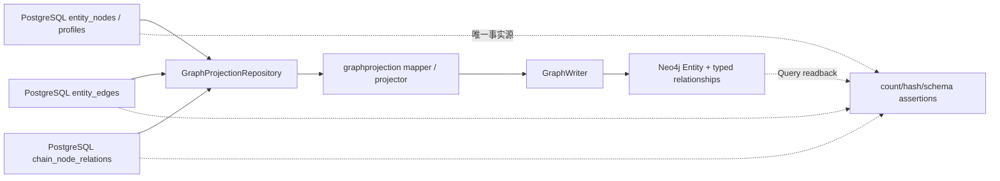
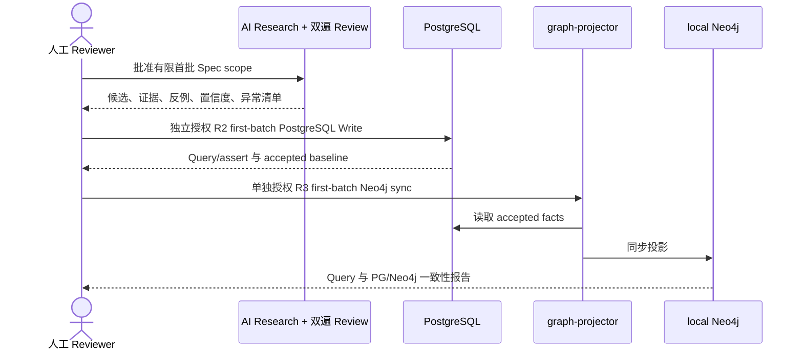

## Context

`origin/main@b882c0a` 已包含 `refactor-industry-chain-node-foundation` 的归档结果：PostgreSQL 当前模型以 `entity_nodes`、最小 `chain_node_profiles`、`chain_node_relations` 和 `chain_node_physical_constraints` 表达产业节点、四类静态关系和物理约束；已验收基线为 842 个节点、95 条 `is_subcategory_of`、1 条 `is_component_of`，`input_to`、`depends_on` 和 constraint 均为 0。现状只能形成分类骨架，不能生成完整产业全景或下游穿透。当前 graph projector 却仍在 `graphEntityNodesQuery` / `graphEntityEdgesQuery` 中读取已删除的 `sector_profiles`、`industry_chain_profiles`、`industry_chain_memberships`、`industry_chain_topology_edges`，关系映射仍包含已废止类型，并未读取新的 `chain_node_relations`。

`reinitialize-alliance-economy-foundation` 尚未进入 `origin/main` 的归档历史。用户只批准本 change 先并行完成 Proposal；它的本地候选、分支快照或当前数据库状态都不是本 change 的最终基线。Apply 的第一项硬依赖是等待该 change 完整完成 Apply-final、Sync、Archive、Deliver、PR merge 与 cleanup，再从最新 `origin/main` 重做 baseline/overlap audit；若 alliance/economy schema、类型或数据范围变化，以最终 Deliver 结果为准。

本 change 的最高风险为 R3，但不同操作必须按实际风险独立授权。PostgreSQL 是唯一事实源；Neo4j 只保存可由 PostgreSQL 确定性重建的查询投影。用户明确接受产品 1.0 探索期的 local Neo4j 为 disposable projection，不要求 Neo4j backup/rollback；恢复证据来自冻结并验收的 PostgreSQL 投影输入，而不是 Neo4j 副本。该例外不得推广到 UAT、prod、shared 或其他 namespace。

## Goals / Non-Goals

**Goals:**

- 在前置依赖 Deliver 后，确认 PostgreSQL 最终 baseline 与 projector gap，只做恢复最新模型投影闭环所需的最小 R1 适配。
- 通过逐层 R3 授权清理 local Tidewise Neo4j 投影，并从 PostgreSQL 全量重建 active alliance、economy、chain_node 及已批准关系，完成可重复 Query 验收。
- 用人工 Spec gate 确定有限、代表性、可关闭的首批产业链范围，并对细分节点、四类静态关系和强证据 physical constraints 形成可审阅候选。
- 先通过独立 R2 授权把批准候选写入 PostgreSQL 并 Query，再通过单独 R3 授权同步 Neo4j 并 Query；禁止跨层推定授权。
- 后端按 TDD 完成 projector 与候选写入边界，保留 fake writer、sqlmock/fixture、静态 migration 校验和显式真实环境 smoke 分层。

**Non-Goals:**

- 不在 Proposal 阶段修改源码、数据库或 Neo4j，也不把未 Deliver change 的状态当最终基线。
- 不遍历、补全或逐项 Review 全部 842 节点，不建立无限期产业数据治理任务。
- 不把 Neo4j 作为事实源，不从 Neo4j 反写 PostgreSQL，不手工维护图事实。
- 不做事件提取/推理、动态传导、观测数据、价格或市场表现、股票推荐、前端、UAT/prod/shared。
- 不修改 `prototype/` 或项目外 `doc/`，不创建完成态 PR。

## Decisions

### 1. 一个 change、三个顶层 package

采用用户确认的单 change 方案：Package 1 恢复基础投影闭环，Package 2 完成有限首批数据闭环，Package 3 承担 Apply-final、Sync、Archive、Deliver。这样可以用同一组 PostgreSQL/Neo4j 一致性断言闭合交付，同时顶层 package 不超过三个。

备选一是拆成“projector 修复”和“首批数据完善”两个 change，优点是单次 diff 更小，但会把 local 图谱可用性与首批数据端到端验收拆开，并增加两套生命周期与共享代码重叠。备选二是直接清空并维护 Neo4j，速度快但违反 PostgreSQL 唯一事实源与可重建投影约束。两者均不采用。

### 2. Apply 前置依赖与 baseline/overlap audit fail-closed

Package 1 开始前必须证明：

- `reinitialize-alliance-economy-foundation` 的 archive commit 已进入最新 `origin/main`，远端 branch 与 Desktop worktree 已完成 cleanup；
- 当前 branch 已更新到该最新基线，工作区 clean，未混入另一个 change artifacts 或源码；
- 对 PostgreSQL schema、active entity 类型/count/hash、`entity_edges`、`chain_node_relations`、physical constraints、graph projection run schema 和 projector 查询进行只读 audit；
- 对最终 alliance/economy 输出与本 Proposal 假设做 overlap audit，任何 schema、关系类型、文件所有权或数据范围差异先回到 artifacts Review。

不满足任一项不得开始 R1 实现，更不得请求 PostgreSQL/Neo4j Write。

### 3. projector 使用两个 PostgreSQL 关系源并统一写图

通用客观关系继续来自 active `entity_edges`；产业静态关系来自 active `chain_node_relations`。repository 将两者转成显式来源类型，projector 统一映射为 Neo4j relationship，但保留 source table、stable relation ID、original relation type、evidence/provenance、verified_at、status 和 namespace。`is_subcategory_of`、`is_component_of`、`input_to`、`depends_on` 分别映射为安全固定类型；旧 `member_of_chain`、`supplies_to`、`substitutes_for` 不再作为产业投影来源。

节点 source 只读取 active `entity_nodes` 与当前仍存在且确需投影的 profile；不得 join 已删除旧表。Apply 时先根据最终 alliance/economy Deliver 结果确定是否需要额外 profile 属性，默认不为 chain_node 建平行节点或复制 PostgreSQL 之外的属性。

physical constraint 是否进入 Neo4j 不是默认推定。人工 Spec gate 必须先确认查询价值和最小表达：若纳入，优先把已批准 constraint 作为 subject node/relation 的属性或明确的 projection-only 结构，并可完全从 `chain_node_physical_constraints` 重建；不得创造 PG 不存在的事实。若未确认，constraint 只写 PG 并从本 change 的图同步范围排除。

### 4. local Neo4j cleanup 与 rebuild 分层授权

`rebuild-entities` 的现有 namespace 删除能力可复用，但 Apply 必须证明删除范围只覆盖 local `projection_namespace=tidewise`。根据 R3 不跨层批量执行规则，cleanup 与 rebuild 分为两个命名层：

1. `local-neo4j-foundation-cleanup`：独立 R3 授权，只把 Tidewise 投影清到零并 Query；
2. `local-neo4j-foundation-rebuild`：复验冻结 PG baseline 后取得下一层独立 R3 授权，全量投影并 Query。

不创建 Neo4j backup/rollback。cleanup 之后若 rebuild 失败，保持 Neo4j 空或不完整并标记 failed/stale，修复后仍须基于同一或重新批准的 PostgreSQL baseline 取得新授权重建，不得回填旧图。

### 5. 首批范围是人工 Spec gate，不在 Proposal 定稿

候选范围必须同时满足：事件研究价值高、上下游边界可在有限节点内表达、能覆盖四类关系中的至少三类、存在权威来源支持投入/依赖或物理约束、可在一个 Apply 周期关闭。建议对比以下候选：

| 候选 | 代表性 | 主要风险 |
|---|---|---|
| AI 算力基础设施 | 可覆盖芯片/服务器/数据中心组成，以及电力、散热、先进制造设备约束 | 边界容易扩张到全部半导体与云服务 |
| 动力电池 | 可覆盖矿产、材料、电芯、系统组成与直接投入 | 商品、材料和电池技术同义/粒度冲突较多 |
| 光伏制造 | 可覆盖材料投入、设备依赖、产能/纯度/扩产周期约束 | 与既有粗节点重叠并可能产生过多工艺节点 |

推荐从前两项中选择一项或两项，并在 Review 中冻结 entry nodes、包含/排除定义、节点上限、关系上限、constraint 上限、来源时效和停止条件。未冻结前不得生成 final manifest；无论选择结果如何，都不得把其余 842 节点纳入本 change。

### 6. 双遍候选研究与证据合同

第一遍 AI researcher 只能产生候选，记录输入指纹、来源、source URL、retrieved/verified time、节点 identity/definition/boundary、关系方向与 mechanism/condition、constraint subject/type/description、支持证据、反例和置信度。第二遍独立 reviewer 必须逐项给出 approve/reject/blocked/merge disposition，并输出冲突、宽边界、低置信度和缺证据清单。

`is_subcategory_of` / `is_component_of` 可以沿用主规格允许的 approved internal artifact + SHA + derivation rule + 双遍 Review；`input_to` / `depends_on` / physical constraint 必须使用强外部证据、成立条件和反例。价格、政策倾向、情绪、市场表现和投资判断不得进入 physical constraint。

候选 Review 不是 Write 授权。只有用户批准的 final manifest 才能进入 R2 package；未批准项不进入 seed、PostgreSQL 或 Neo4j。

### 7. PG-first 状态流与独立授权

R2 PostgreSQL Write 和 R3 Neo4j sync 是两个独立授权对象。PG Query 未验收、manifest/hash 漂移或任何未批准候选出现时，不得进入 Neo4j。Neo4j 同步只读 PG，不暴露反向 repository 或写回路径。

### 8. typed 关系多跳下游查询

Neo4j 原始关系始终保持 PostgreSQL 方向：`A input_to B` 表示 A 的输出投入 B，下游从 A 到 B 顺向遍历；`A depends_on B` 表示 A 依赖 B，下游影响从 B 到 A，需要反向遍历。`is_subcategory_of` 与 `is_component_of` 只能用于分类/组成导航，不得计入上下游路径。

下游查询使用明确的查询规则组合 `input_to` outgoing 与 `depends_on` incoming，返回 depth、node path、relation path 与 evidence。该能力不新增派生 relationship、API、展示模型或数据表，也不改变 PostgreSQL 原始边方向。

### 9. TDD 与验证边界

Package 1 先写失败测试，再最小实现：repository query contract 覆盖不引用删除表、只读取 active nodes/edges/chain relations；mapper table-driven tests 覆盖四类新关系和旧类型排除；projector 使用 fake writer 验证 cleanup/rebuild 顺序、run counts、failed/skipped fail-closed；CLI tests 覆盖显式模式与非敏感报告。真实 PostgreSQL/Neo4j 仅通过明确标记的 integration/smoke 边界执行，普通测试不需要真实凭据。

Package 2 对 candidate schema、manifest loader、identity/tuple conflict、证据合同、事务原子性、dry-run/report 和 write-after-query 先写 fixture/sqlmock/静态 migration 测试，再实现最小生产路径。Apply final 运行受影响 backend module 完整 `go test -count=1 ./...` 与共享 architecture/contract tests；若最终修改共享规则或公共基础设施，扩大为 repo-wide full validation。每个有状态层另运行 fresh preflight、post-write Query 和一致性断言。

## Risks / Trade-offs

- [未 Deliver 的 alliance/economy change 改变最终输入] → Apply 前硬阻断并从最新 `origin/main` 重做 baseline/overlap audit，必要时先修订 artifacts 再 Review。
- [旧 projector 查询在新 schema 上运行失败] → 先用静态 query tests 和可重复 repository tests 固化不得引用删除表，再做最小适配。
- [local Neo4j cleanup 后重建失败] → 接受 disposable projection 风险，保持 failed/stale，不回滚旧图；只从冻结 PG baseline 重新授权重建。
- [首批范围膨胀] → 人工冻结 entry nodes、包含/排除、数量上限和停止条件；禁止全量遍历 842 节点。
- [AI 候选把弱推断当事实] → 双遍 Review、强外部证据合同、反例和置信度；未满足项 blocked/rejected。
- [PG 与 Neo4j 授权混淆] → 两个命名执行层、两套 before/after assertions；任一旧批准不得推定后续层。
- [physical constraint 图表达过早固化] → 先由 Spec gate 决定查询价值；默认保留在 PG，不自动进入 Neo4j。

## Migration Plan

1. 等待 `reinitialize-alliance-economy-foundation` 完整 Deliver 和 cleanup；更新到最新 `origin/main`，执行 read-only baseline/overlap audit，差异先回到 Review。
2. Package 1 按 TDD 完成 projector 最小 R1 适配、targeted tests、只读 dry-run 与 Review evidence。
3. 逐层请求并执行 `local-neo4j-foundation-cleanup` 与 `local-neo4j-foundation-rebuild` 的独立 R3 授权；每层完成 Query/assert 后才进入下一层。
4. 人工确认首批 Spec scope；生成并双遍 Review 候选，冻结 final manifest/hash/counts。
5. 单独请求 R2 `first-batch-postgres-write`，执行 preflight、单事务 Write、Query/assert；失败 rollback，提交后修正只能走新的 forward-fix 与授权。
6. PG accepted baseline 验收后，单独请求 R3 `first-batch-neo4j-sync`，只读 PG 并同步/Query；不允许 Neo4j 反写。
7. 运行 Apply-final 完整验证并等待人工 Review；通过后按顺序 Sync、Archive、Deliver。

## Open Questions

- 首批选择 AI 算力基础设施、动力电池、光伏制造中的哪一项或两项？对应 entry nodes、包含/排除范围和节点/关系/constraint 上限须在 Apply 前人工定稿。
- physical constraints 是否需要在 Neo4j 提供查询表达？若需要，采用 subject 属性还是 projection-only 结构，必须在首批 Spec gate 中确认；默认不投影。
- `reinitialize-alliance-economy-foundation` 最终是否新增或调整 projector 需要读取的 alliance/economy profile/关系类型？以其 Deliver 后 audit 为准。
