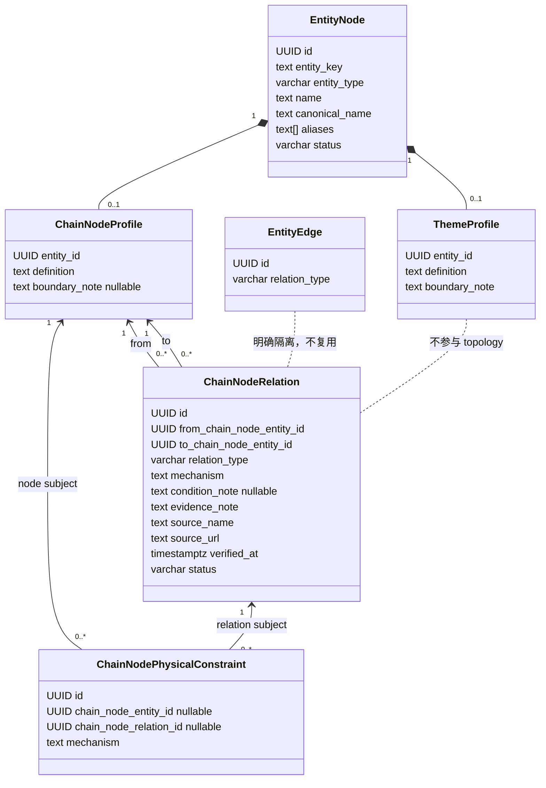
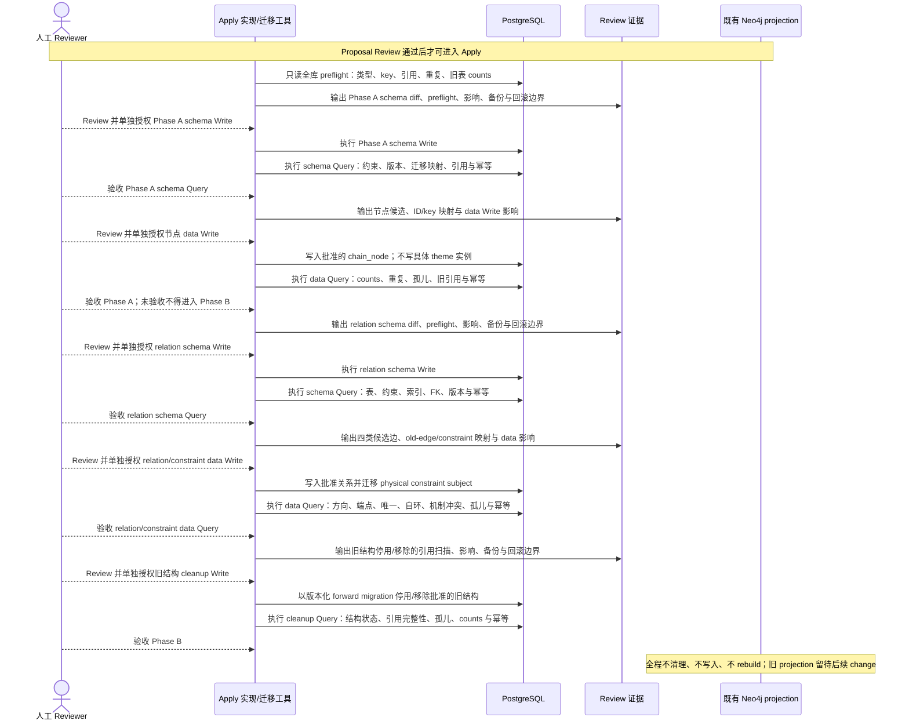

## Context

前序 change 已在 PostgreSQL 落地 `sector_profiles`、`sector_source_mappings`、`industry_chain_profiles`、扩展后的 `chain_node_profiles`、`industry_chain_memberships`、`industry_chain_topology_edges` 与 `industry_chain_physical_constraints`，并已生成对应 Neo4j 投影。当前模型同时用 sector、industry_chain 与 chain_node 表达产业概念，membership 又承担容器归属，topology 再表达节点关系，导致同一事实存在多个入口。

本 change 是该已交付 change 的 sequential successor。PostgreSQL 是事实源；所有既有 rows、stable ID/key、引用关系与旧投影都必须被审计并作为 forward migration 输入，禁止通过回滚历史、手工清库或 Neo4j rebuild 达成目标。字段与关系语义已完成人工 Review，本 design 只固化已批准结论；具体 chain_node/theme 实例和关系边仍须在 Apply 中分阶段 Review。

## Goals / Non-Goals

**Goals:**

- 用 `entity_nodes` + 最小 `chain_node_profiles` 统一粗细产业概念，不保存固定 L1/L2/L3、父节点、产业链容器、市场归属或观测值。
- 新增最小 `theme` 主数据模型，明确其是 Tidewise 自有投研视角，并与产业分类、指数和证券集合隔离。
- 用独立且唯一的 `chain_node_relations` 保存四类可判定静态关系，不复用 `entity_edges`。
- 将旧 sector、industry_chain、membership、topology 与 physical constraint 引用按审批结果前向迁移，并保持可审计、幂等和可停止。
- 将有状态操作拆成 Phase A 与 Phase B，每层坚持 `Review -> Write -> Query`，Write 前展示 preflight、影响、备份和回滚边界并取得单独授权。
- 后端 Apply 使用 TDD：先写 migration 静态测试、领域 table-driven tests、repository fake/sqlmock 或可重复集成测试，再写生产实现，最后运行相关包测试与 `go test ./...`。

**Non-Goals:**

- 不构建、清理或重建 Neo4j，不在本 change 解决旧 projection 与新 PostgreSQL 模型的最终同步。
- 不设计观测数据、事件提取、事件推理、传导强度/方向/时滞、股票推荐或证券成分。
- 不调整 alliance、economy/country、market、benchmark/index。
- 不确定具体 theme 实例，不实现 theme-node link/scope 表或写入。
- 不建立 chain_node 来源映射表；同花顺、东方财富只作为候选 Review 参考。
- 不修改 `prototype/` 或项目外 `doc/`。

## Decisions

### 1. 身份与 profile 分层

`entity_nodes` 继续是所有实体身份与名称的唯一事实源。chain_node 和 theme 均复用其 `id`、`entity_key`、`entity_type`、`layer_code`、`name`、`canonical_name`、`aliases`、`status`、`created_at`、`updated_at`；profile 不重复中文名、英文名或 aliases。

目标 profile 如下：

| 表.字段 | PostgreSQL 类型 | Null / 默认 | 约束 | 业务含义 |
|---|---|---|---|---|
| `chain_node_profiles.entity_id` | `UUID` | `NOT NULL` | PK；FK `entity_nodes(id)` | chain_node 身份 |
| `chain_node_profiles.definition` | `TEXT` | `NOT NULL` | `btrim(definition) <> ''` | 节点“是什么”，用于同名消歧、事件实体链接与推理语义 |
| `chain_node_profiles.boundary_note` | `TEXT` | `NULL`，无默认值 | 非 NULL 时 `btrim(boundary_note) <> ''` | 仅歧义节点填写“包含/排除什么” |
| `theme_profiles.entity_id` | `UUID` | `NOT NULL` | PK；FK `entity_nodes(id)` | theme 身份 |
| `theme_profiles.definition` | `TEXT` | `NOT NULL` | `btrim(definition) <> ''` | 投研主题的分析定义 |
| `theme_profiles.boundary_note` | `TEXT` | `NOT NULL` | `btrim(boundary_note) <> ''` | 明确主题包含与排除边界，避免退化为 sector 或证券集合 |

Go 类型只使用 `Theme` / `ThemeProfile`，数据库只使用 `entity_type='theme'` / `theme_profiles`；不引入 `research_theme` 枚举、别名或兼容结构。`chain_node_profiles` 删除/停用 `chain_position`、`node_category`、`unit_of_analysis`、`granularity_note`，并禁止恢复 level、parent、market、source、observation 等字段。

选择最小强类型列而不是 JSONB，是为了让必填语义、非空边界与迁移验证可由数据库和测试直接执行。节点层级或产业链入口属于视角相关关系，不是 profile 固有属性。

### 2. theme 与 chain_node 的去重判断

- 若概念描述可观察的产业、技术、材料、设备、工艺、产品或服务类别，无论粗细，建模为 chain_node。
- 若概念是 Tidewise 为研究问题组织多个产业节点的自有分析视角，且定义不等同于指数、市场板块、产业链容器或证券名单，才可建模为 theme。
- 外部平台“概念板块”名称不能直接决定实体类型；涨停、融资融券、高股息等交易状态、机制或风格标签必须过滤。
- 同名候选先比较 definition 与 boundary，再决定复用、合并或拒绝；不得同时建立同义 sector、粗 chain_node 与 theme。
- theme 与 chain_node 的未来关联不是产业 topology，不进入 `chain_node_relations`。本 change 不创建任何 theme 实例或 theme-node 映射。

### 3. 独立的 chain_node 关系事实

`chain_node_relations` 是产业节点静态关系的唯一生产表，不复用 `entity_edges`，不含 `industry_chain_entity_id`，也不与 membership/topology 双写。

| 字段 | PostgreSQL 类型 | Null / 默认 | 约束与含义 |
|---|---|---|---|
| `id` | `UUID` | `NOT NULL` | PK；可一对一迁移时复用旧 topology edge ID |
| `from_chain_node_entity_id` | `UUID` | `NOT NULL` | FK `chain_node_profiles(entity_id)`；有向起点 |
| `to_chain_node_entity_id` | `UUID` | `NOT NULL` | FK `chain_node_profiles(entity_id)`；有向终点 |
| `relation_type` | `VARCHAR(32)` | `NOT NULL` | CHECK 仅四类 MVP 枚举 |
| `mechanism` | `TEXT` | `NOT NULL` | `btrim(mechanism) <> ''`；说明关系成立的客观机制 |
| `condition_note` | `TEXT` | `NULL`，无默认值 | 非 NULL 时非空；适用条件或边界 |
| `evidence_note` | `TEXT` | `NOT NULL` | 非空；支持该关系的证据摘要 |
| `source_name` | `TEXT` | `NOT NULL` | 非空；证据来源名称 |
| `source_url` | `TEXT` | `NOT NULL` | 非空；证据定位地址 |
| `verified_at` | `TIMESTAMPTZ` | `NOT NULL` | 人工核验时间 |
| `status` | `VARCHAR(32)` | `NOT NULL DEFAULT 'active'` | CHECK `active` / `inactive` |
| `created_at` / `updated_at` | `TIMESTAMPTZ` | `NOT NULL DEFAULT now()` | 审计时间 |

数据库约束包括：禁止自环；唯一 `(from_chain_node_entity_id, relation_type, to_chain_node_entity_id)`；两个 endpoint 必须因 FK 而具有 chain_node profile；方向不得在 repository 中自动对调。针对 `input_to` 与 `depends_on`，额外使用 `(from, to, lower(btrim(mechanism)))` 的条件唯一索引，并在领域校验中拒绝同一机制的双重登记；语义同一性无法仅靠字符串判断时由候选 Review 裁决。

四类语义固定为：

- `is_subcategory_of`：A 的全部实例属于 B，方向 A→B。
- `is_component_of`：A 是 B 的可识别物理或系统组成，方向 A→B。
- `input_to`：A 的输出被 B 作为可识别输入消耗，方向 A→B。
- `depends_on`：A 的目标功能或产出在 B 缺失或受限时会受约束，方向 A→B；不得用于分类、组成或直接投入。

不提供 `contains`、`supplies_to`、`substitutes_for`、`transmits_to`。替代关系通常依赖资格、成本、产能与时间，不适合作为 MVP 静态二元边；事件传导则由事件沿 `input_to` / `depends_on` 等路径动态推导。

### 4. 来源参考不进入生产主数据

不创建 `chain_node_source_mappings`，也不把 source/provider/code 放进 `chain_node_profiles`。同花顺、东方财富候选仅在候选清单、OpenSpec Review 证据或 seed 评审材料中记录其参考链接、筛选理由与快照时间；批准后的生产节点只保留自身定义和边界。旧 `sector_source_mappings` 先作为迁移候选输入读取，在 Review 证据生成并完成备份后，通过受控版本化迁移停用并移除，不做手工清空。

### 5. stable ID、stable key 与合并

- 语义保持不变的旧 sector、industry_chain 或 chain_node 优先复用 `entity_nodes.id`，更新为 `entity_type='chain_node'` 并建立目标 profile，避免事件引用断裂。
- 旧 coarse industry_chain 可成为某一视角的入口 chain_node，但不保留容器身份、chain code、全局层级或 membership。
- 多个旧实体收敛为一个节点时，必须先给出 legacy→target 映射，复用现有 convergence/audit 机制迁移引用；不得静默删除任一 ID。
- `entity_key` 被视为稳定外部键。若语义身份不变，默认保留历史 key，即使其前缀体现旧类型；如必须改 key，须先审计所有引用并在候选 Review 中逐项批准。
- 在全库检查空值、重复值、合并中实体与所有写路径前，不得给 `entity_key` 增加全局唯一约束。只有 preflight 零冲突且 Write 门禁单独批准时才实施；否则本 change 保留普通索引并输出阻断报告。

### 6. 旧关系与 physical constraints 的前向迁移

旧 membership 不直接转成关系，只作为候选范围证据。旧 topology edge 也不得按枚举机械改名：

- 旧 `supplies_to` 仅在证据证明“A 输出被 B 作为可识别输入消耗”时，经 Review 转为 `input_to`。
- 旧 `depends_on` 仅在符合新的窄定义时保留为 `depends_on`。
- 旧 `substitutes_for` 没有 MVP 目标，必须停用并记录未迁移原因。
- `is_subcategory_of` / `is_component_of` 可参考旧 membership、定义和边界提出新候选，但必须独立 Review。

一对一且语义获批的 edge 优先复用旧 `industry_chain_topology_edges.id` 作为 `chain_node_relations.id`；合并或拆分时使用显式 old-edge→new-relation 映射表作为迁移执行证据。

physical constraints 保持独立，目标表命名为 `chain_node_physical_constraints`，移除 `industry_chain_entity_id`，subject 在 `chain_node_entity_id` 与 `chain_node_relation_id` 之间严格二选一。节点约束在节点 ID 保持时原样迁移；旧 `topology_edge_id` 只有在上述映射已批准且新 relation 已写入后，才可改指向 `chain_node_relations.id`。无法唯一映射或指向已删除关系类型的 constraint 不得猜测重定向，必须保持未迁移状态并阻断 Phase B 验收。

### 7. 组件边界

领域层定义 `ChainNodeProfile`、`Theme` / `ThemeProfile`、`ChainNodeRelation` 及四个强类型 relation constants；repository 负责事务、FK/唯一冲突与幂等 upsert；seed service 负责候选 manifest 校验、dry-run、scoped write 和结果报告。禁止恢复平行的 industry-chain container service 或 source-mapping repository。

## Migration Plan

### 前向迁移顺序

### Phase A：统一节点模型与节点初始化

1. 先以测试固定目标 DDL、Go 枚举/profile 校验、候选 manifest 与 dry-run 报告，再实现代码；不得 apply migration。
2. 对全库做只读 preflight：旧类型与 profile counts、空/重复 `entity_key`、所有引用表、合并状态、profile 缺失、非产业 sector 标签、候选 ID/key 变换。
3. 输出 schema/migration diff、legacy→target 实体映射、chain_node 候选与“拒绝/合并/停用”理由。theme 只输出空数据边界，不自行提出实例。
4. 单独提交 schema diff、最新 preflight、影响范围、备份验证、事务边界和 forward-fix 回滚策略供 Review；取得 schema Write 授权后执行 migration，立即 Query schema、约束、版本、引用与幂等结果并等待验收。
5. schema Query 验收后，单独提交节点候选与 data 影响供 Review；取得节点 data Write 授权后写入批准节点，立即 Query counts、profile 完整性、stable references、重复、孤儿和幂等性并等待验收。
6. Phase A 完整验收前，禁止生成最终关系写入 manifest、执行 Phase B migration 或关系 Write。

### Phase B：节点关系建立

1. 先以测试固定 `chain_node_relations` DDL、四类领域校验、旧 edge 转换规则、constraint XOR 与 repository 幂等行为，不 apply migration。
2. 输出四类关系契约、候选边、每条 evidence/provenance、旧 edge→新 relation 与旧 constraint→新 subject 映射；人工逐层 Review。
3. 先单独提交 relation schema diff、最新 preflight、影响、备份和回滚边界供 Review；取得 schema Write 授权后执行 migration，立即 Query 表、约束、索引、FK、版本与幂等结果并等待验收。
4. schema Query 验收后，再单独提交候选边、constraint subject 映射与 data 影响供 Review；取得 relation/constraint data Write 授权后写入，立即 Query relation tuple、方向、自环、端点类型、机制互斥、evidence、constraint subject、未迁移阻断项及幂等结果并等待验收。
5. relation/constraint data Query 验收后，才可单独提交旧 sector、industry_chain、membership、topology 与 source-mapping 结构停用/移除的引用扫描、影响、备份和回滚边界供 Review；取得 cleanup Write 授权后只以版本化 forward migration 执行，并立即 Query 旧结构状态、引用完整性、孤儿、counts 与重复执行幂等结果。cleanup Query 验收前不得完成 Phase B；Neo4j 不参与。

### 幂等与回滚

- migration 使用版本化 SQL、事务和显式检查；seed 使用稳定 UUID/受审 entity key 与 scoped upsert，重复执行必须返回 unchanged，而不是生成新 rows。
- 每次 Write 前保存 schema/version、目标表 counts、legacy→target 映射和可恢复备份证据；每次 Write 后立即 Query。
- 事务内失败直接 rollback。事务提交后的纠错只允许新的 forward migration/forward fix；不执行历史 down migration、不手工清库。
- 若 key 冲突、引用不完整、候选未批、constraint 无唯一目标或备份不可验证，则停止在当前门禁，不进入下一层。

## Risks / Trade-offs

- [旧 sector 并非都是真正产业概念] → 候选逐条分类为复用、合并、停用或拒绝，过滤交易机制与风格标签，不做批量改 type。
- [旧 topology 枚举与新语义不等价] → 禁止机械 rename；逐边 Review，未满足窄定义的边保持未迁移并阻断相关 constraint。
- [`entity_key` 历史前缀与新类型不一致] → 身份稳定优先；未经引用审计不改 key，也不添加全局唯一约束。
- [旧 Neo4j projection 暂时落后于 PostgreSQL] → 明确记录为预期技术债；本 change 不写图，后续独立 change 设计 projection 迁移与 rebuild。
- [移除旧表影响仍读取它们的代码] → Apply 中先用测试和引用扫描证明所有生产读写路径已切换，再申请最终结构清理 Write。
- [关系 mechanism 文本可能规避互斥索引] → 数据库索引处理完全相同文本，领域规范化与人工 Review 处理语义同义问题。

## Open Questions

- 具体 chain_node 候选、legacy→target 映射、拒绝清单与关系候选边尚未批准，必须分别在 Phase A、Phase B Review 解决。
- 具体 theme 实例与 theme-node link/scope 契约明确留给后续 change，本 change 不作推定。
- `entity_key` 全局唯一是否可实施，等待 Apply 时全库 preflight 结果；默认不实施。
