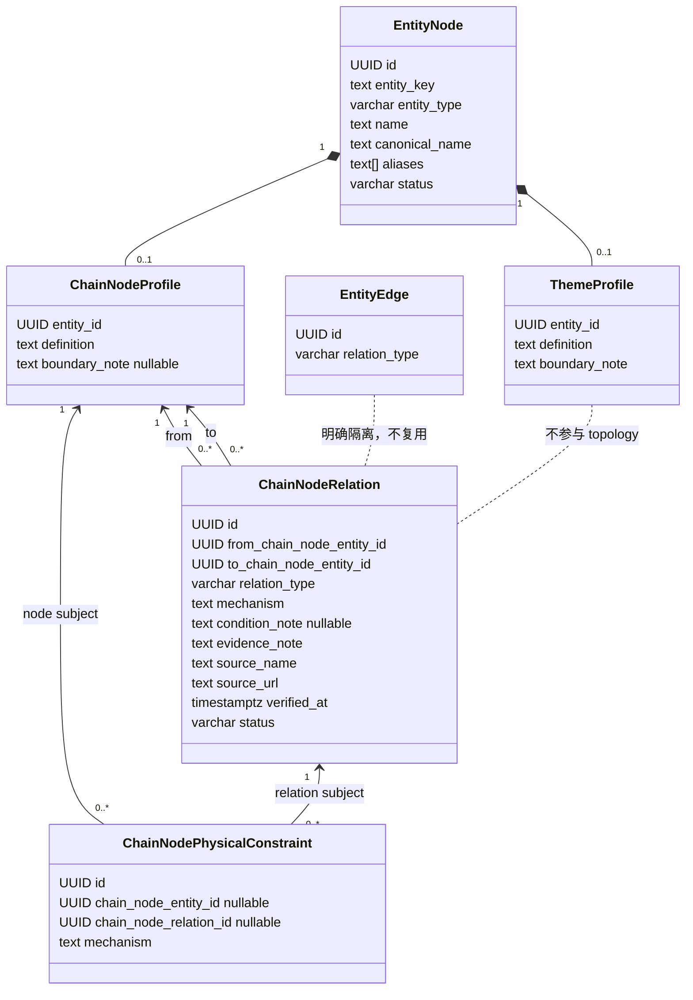
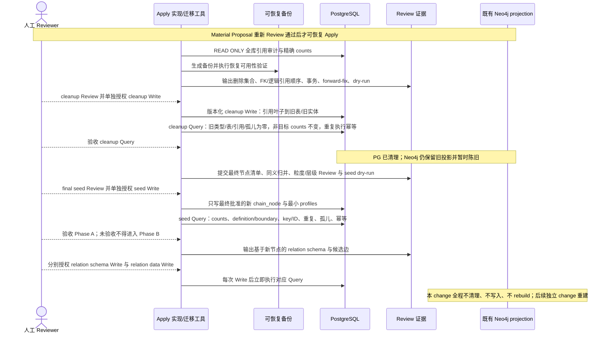

## Context

前序 change 已在 PostgreSQL 落地 `sector_profiles`、`sector_source_mappings`、`industry_chain_profiles`、扩展后的 `chain_node_profiles`、`industry_chain_memberships`、`industry_chain_topology_edges` 与 `industry_chain_physical_constraints`，并已生成对应 Neo4j 投影。当前模型同时用 sector、industry_chain 与 chain_node 表达产业概念，membership 又承担容器归属，topology 再表达节点关系，导致同一事实存在多个入口。

本 change 是该已交付 change 的 sequential successor。PostgreSQL 是事实源；旧产业 rows 不再作为目标节点的迁移输入，而是作为 cleanup 范围与引用审计对象。必须先取得可恢复备份、列全 FK/逻辑引用并生成精确删除计划，再以版本化 migration/受控命令清除；禁止历史回滚或手工清库。字段与关系语义已完成人工 Review，但 2026-07-13 的 Material Proposal Change 已覆盖“复用旧 UUID/key”的旧策略；具体 chain_node/theme 实例和关系边仍须重新分阶段 Review。

## Goals / Non-Goals

**Goals:**

- 用 `entity_nodes` + 最小 `chain_node_profiles` 统一粗细产业概念，不保存固定 L1/L2/L3、父节点、产业链容器、市场归属或观测值。
- 新增最小 `theme` 主数据模型，明确其是 Tidewise 自有投研视角，并与产业分类、指数和证券集合隔离。
- 用独立且唯一的 `chain_node_relations` 保存四类可判定静态关系，不复用 `entity_edges`。
- 完整清除 PostgreSQL 中旧 sector、industry_chain、旧 chain_node、membership、topology、physical constraint 及相关关系/审计引用，再从最终批准清单全新导入 chain_node，不复用旧 ID/key。
- 将有状态操作拆成 Phase A 与 Phase B，每层坚持 `Review -> Write -> Query`，Write 前展示 preflight、影响、备份和回滚边界并取得单独授权。
- 后端 Apply 使用 TDD：先写 migration 静态测试、领域 table-driven tests、repository fake/sqlmock 或可重复集成测试，再写生产实现，最后运行相关包测试与 `go test ./...`。

**Non-Goals:**

- 不构建、清理或重建 Neo4j，不在本 change 解决旧 projection 与新 PostgreSQL 模型的最终同步。
- 不设计观测数据、事件提取、事件推理、传导强度/方向/时滞、股票推荐或证券成分。
- 不调整 alliance、economy/country、market、benchmark/index。
- 不确定具体 theme 实例，不实现 theme-node link/scope 表或写入。
- 不建立 chain_node 来源映射表；同花顺、东方财富只作为候选 Review 参考。
- 不修改 `prototype/` 或项目外 `doc/`。

## Decisions

### 1. 身份与 profile 分层

`entity_nodes` 继续是所有实体身份与名称的唯一事实源。chain_node 和 theme 均复用其 `id`、`entity_key`、`entity_type`、`layer_code`、`name`、`canonical_name`、`aliases`、`status`、`created_at`、`updated_at`；profile 不重复中文名、英文名或 aliases。

目标 profile 如下：

| 表.字段 | PostgreSQL 类型 | Null / 默认 | 约束 | 业务含义 |
|---|---|---|---|---|
| `chain_node_profiles.entity_id` | `UUID` | `NOT NULL` | PK；FK `entity_nodes(id)` | chain_node 身份 |
| `chain_node_profiles.definition` | `TEXT` | `NOT NULL` | `btrim(definition) <> ''` | 节点“是什么”，用于同名消歧、事件实体链接与推理语义 |
| `chain_node_profiles.boundary_note` | `TEXT` | `NULL`，无默认值 | 非 NULL 时 `btrim(boundary_note) <> ''` | 仅歧义节点填写“包含/排除什么” |
| `theme_profiles.entity_id` | `UUID` | `NOT NULL` | PK；FK `entity_nodes(id)` | theme 身份 |
| `theme_profiles.definition` | `TEXT` | `NOT NULL` | `btrim(definition) <> ''` | 投研主题的分析定义 |
| `theme_profiles.boundary_note` | `TEXT` | `NOT NULL` | `btrim(boundary_note) <> ''` | 明确主题包含与排除边界，避免退化为 sector 或证券集合 |

Go 类型只使用 `Theme` / `ThemeProfile`，数据库只使用 `entity_type='theme'` / `theme_profiles`；不引入 `research_theme` 枚举、别名或兼容结构。`chain_node_profiles` 删除/停用 `chain_position`、`node_category`、`unit_of_analysis`、`granularity_note`，并禁止恢复 level、parent、market、source、observation 等字段。

选择最小强类型列而不是 JSONB，是为了让必填语义、非空边界与迁移验证可由数据库和测试直接执行。节点层级或产业链入口属于视角相关关系，不是 profile 固有属性。

### 2. theme 与 chain_node 的去重判断

- 若概念描述可观察的产业、技术、材料、设备、工艺、产品或服务类别，无论粗细，建模为 chain_node。
- 若概念是 Tidewise 为研究问题组织多个产业节点的自有分析视角，且定义不等同于指数、市场板块、产业链容器或证券名单，才可建模为 theme。
- 外部平台“概念板块”名称不能直接决定实体类型；涨停、融资融券、高股息等交易状态、机制或风格标签必须过滤。
- 同名候选先比较 definition 与 boundary，再决定复用、合并或拒绝；不得同时建立同义 sector、粗 chain_node 与 theme。
- theme 与 chain_node 的未来关联不是产业 topology，不进入 `chain_node_relations`。本 change 不创建任何 theme 实例或 theme-node 映射。

### 3. 独立的 chain_node 关系事实

`chain_node_relations` 是产业节点静态关系的唯一生产表，不复用 `entity_edges`，不含 `industry_chain_entity_id`，也不与 membership/topology 双写。

| 字段 | PostgreSQL 类型 | Null / 默认 | 约束与含义 |
|---|---|---|---|
| `id` | `UUID` | `NOT NULL` | PK；基于最终新关系 key/tuple 生成，不复用旧 topology edge ID |
| `from_chain_node_entity_id` | `UUID` | `NOT NULL` | FK `chain_node_profiles(entity_id)`；有向起点 |
| `to_chain_node_entity_id` | `UUID` | `NOT NULL` | FK `chain_node_profiles(entity_id)`；有向终点 |
| `relation_type` | `VARCHAR(32)` | `NOT NULL` | CHECK 仅四类 MVP 枚举 |
| `mechanism` | `TEXT` | `NOT NULL` | `btrim(mechanism) <> ''`；说明关系成立的客观机制 |
| `condition_note` | `TEXT` | `NULL`，无默认值 | 非 NULL 时非空；适用条件或边界 |
| `evidence_note` | `TEXT` | `NOT NULL` | 非空；支持该关系的证据摘要 |
| `source_name` | `TEXT` | `NOT NULL` | 非空；证据来源名称 |
| `source_url` | `TEXT` | `NOT NULL` | 非空；证据定位地址 |
| `verified_at` | `TIMESTAMPTZ` | `NOT NULL` | 人工核验时间 |
| `status` | `VARCHAR(32)` | `NOT NULL DEFAULT 'active'` | CHECK `active` / `inactive` |
| `created_at` / `updated_at` | `TIMESTAMPTZ` | `NOT NULL DEFAULT now()` | 审计时间 |

数据库约束包括：禁止自环；唯一 `(from_chain_node_entity_id, relation_type, to_chain_node_entity_id)`；两个 endpoint 必须因 FK 而具有 chain_node profile；方向不得在 repository 中自动对调。针对 `input_to` 与 `depends_on`，额外使用 `(from, to, lower(btrim(mechanism)))` 的条件唯一索引，并在领域校验中拒绝同一机制的双重登记；语义同一性无法仅靠字符串判断时由候选 Review 裁决。

四类语义固定为：

- `is_subcategory_of`：A 的全部实例属于 B，方向 A→B。
- `is_component_of`：A 是 B 的可识别物理或系统组成，方向 A→B。
- `input_to`：A 的输出被 B 作为可识别输入消耗，方向 A→B。
- `depends_on`：A 的目标功能或产出在 B 缺失或受限时会受约束，方向 A→B；不得用于分类、组成或直接投入。

不提供 `contains`、`supplies_to`、`substitutes_for`、`transmits_to`。替代关系通常依赖资格、成本、产能与时间，不适合作为 MVP 静态二元边；事件传导则由事件沿 `input_to` / `depends_on` 等路径动态推导。

### 4. 来源参考不进入生产主数据

不创建 `chain_node_source_mappings`，也不把 source/provider/code 放进 `chain_node_profiles`。同花顺、东方财富候选仅在候选清单、OpenSpec Review 证据或 seed 评审材料中记录其参考链接、筛选理由与快照时间；批准后的生产节点只保留自身定义和边界。旧 `sector_source_mappings` 先作为迁移候选输入读取，在 Review 证据生成并完成备份后，通过受控版本化迁移停用并移除，不做手工清空。

### 5. 旧身份清理与新身份生成

- cleanup 目标集合由执行时快照确定：`entity_type IN ('sector','industry_chain','chain_node')` 的旧 `entity_nodes` 全部删除；新节点不做 legacy→target 映射，也不复用其 UUID 或 `entity_key`。
- 删除旧实体前必须先处理所有物理 FK 与逻辑引用，包括 profile、source mapping、membership、topology、physical constraint、`entity_edges` 两端、`event_entity_links.entity_id`、sector convergence manifest/audit/reference/alias moves，以及代码审计发现的其他引用。
- alliance、economy/country、policy body、market、index、benchmark、company、security、instrument、metric、commodity、person 及不指向旧产业实体的关系不在删除范围；cleanup Query 必须以类型 counts 与反连接证明未误删。
- 新 chain_node key/UUID 只依据最终批准 seed 生成。候选 Review 完成同义归并后为每个最终概念确定唯一 `chain_node:<english_slug>`；UUID 使用项目 deterministic seed 算法从新 key 生成，不接受旧 ID 覆盖。
- `entity_key` 全局唯一仍是条件性 schema 选择；cleanup/new seed preflight 证明全库安全且单独获批前不添加约束。

### 6. 旧关系、约束与审计的清理

- `industry_chain_physical_constraints`、`industry_chain_topology_edges`、`industry_chain_memberships` 按 FK 依赖从叶到根删除，随后删除 `industry_chain_profiles`；不转换旧 edge，不迁移旧 constraint subject。
- 删除 `entity_edges` 中任一端指向旧 sector/industry_chain/chain_node 的 rows；其余通用关系保持不变。事件链接指向旧实体时删除对应 `event_entity_links`，不猜测重定向到新节点。
- convergence/audit 表的 append-only trigger 必须在同一版本化 migration 中受控处理：备份审计快照后删除 trigger/function，再按依赖顺序删除 alias moves、reference moves、convergences、manifests，最终移除仅服务旧 sector convergence 的表。若引用扫描发现这些表仍服务非 sector 生产流程，必须停止并提交保留理由供 Review。
- 删除 `sector_source_mappings`、`sector_profiles` 与旧 `chain_node_profiles`；随后删除旧产业 `entity_nodes`。所有表删除前必须证明生产代码已切换，且 cleanup Query 验证表不存在、旧类型 counts 为 0、引用/孤儿为 0。
- 新 `chain_node_relations` 与未来 constraint 数据只基于新节点和新的候选 Review 创建；不得复用旧 topology/constraint ID 或把旧枚举机械改名。

### 7. 组件边界

领域层定义 `ChainNodeProfile`、`Theme` / `ThemeProfile`、`ChainNodeRelation` 及四个强类型 relation constants；repository 负责事务、FK/唯一冲突与幂等 upsert；seed service 负责候选 manifest 校验、dry-run、scoped write 和结果报告。禁止恢复平行的 industry-chain container service 或 source-mapping repository。

## Migration Plan

### 受控清理与全新导入顺序

### Phase A：cleanup 后全新节点初始化

1. Material Proposal 重新 Review 前暂停 Apply；当前实现 diff 仅作为未验收审计对象。
2. 测试先行覆盖 cleanup dry-run、目标集合快照、FK/逻辑引用发现、删除顺序、非目标保护、备份门禁、事务回滚、forward-fix 与重复执行幂等；只生成代码，不执行。
3. 只读 preflight 必须列出旧三类实体及 profiles、source mappings、membership/topology/constraints、`entity_edges`、`event_entity_links`、convergence/audit 全表 counts 和任意其他引用。缺少任一引用类即阻断 cleanup Review。
4. cleanup Review 展示可恢复备份证据、精确 ID 集合或可重算谓词、每表预计删除 counts、FK 顺序、锁与事务影响、非目标保护断言及提交后 forward-fix；单独获批后才执行 cleanup Write，并立即 Query。
5. cleanup Query 必须证明旧专属表已删除、旧 sector/industry_chain/chain_node rows 为 0、旧关系/事件链接/审计引用为 0、无孤儿，且 alliance/economy/country/market/benchmark/index 等非目标 counts 与校验和保持不变；重复执行只返回 already-clean/unchanged。
6. 最新工作簿仅记录第一轮语义过滤：1191 个原始名称中 955 初步保留、202 明确排除、34 待复核。它不是 final seed；主对话完成 34 项复核、同义归并、definition/boundary、粒度及层级关系 Review 前不得生成可执行 seed。
7. final seed Review 与 cleanup 完全独立。仅在 cleanup Query 验收后展示最终清单、全新 key/UUID、dry-run counts 和幂等报告，单独取得 seed Write 授权；Write 后立即 Query。不得创建具体 theme 实例。
8. Phase A 完整验收前禁止进入 Phase B；PG cleanup 后 Neo4j 陈旧属于已知且明确记录的临时状态。

### Phase B：基于新节点建立关系

1. 不读取或转换旧 membership/topology/constraint ID；关系与任何新 physical constraint 均从新节点和新证据重新提出。
2. 四类关系契约、候选边及 evidence/provenance 独立 Review；relation schema 与 relation data 仍分别执行 `Review -> Write -> Query`。
3. 本 change 不执行 Neo4j rebuild；最终 PostgreSQL 关系通过后仍由后续独立 change 负责投影。

### 幂等与回滚

- cleanup migration/命令以执行前冻结的目标集合为输入，在单事务中按引用叶子到根删除；SQL 必须限定旧产业实体集合，禁止无谓词 DELETE/TRUNCATE。
- cleanup 重复执行不得扩大删除范围，只报告 already-clean/unchanged；seed 使用最终新 key 的 deterministic UUID 和 scoped upsert，重复执行不得新增重复 rows。
- Write 前必须验证可恢复备份；仅有 `archive_mode` 或文件存在不算恢复验证。事务内失败直接 rollback，提交后纠错只允许新的 forward-fix migration/命令。
- 任一未知引用、预计/实际 counts 不符、非目标保护断言变化、备份不可恢复、候选未最终批准时立即停止。

## Risks / Trade-offs

- [cleanup 误删非目标事实] → 先冻结旧产业 ID 集合，所有删除通过 FK/显式 ID 集合限定，并用非目标 counts/校验和在事务提交前后断言。
- [未知逻辑引用绕过 FK] → 代码与 information_schema 双向扫描，显式覆盖 `entity_edges`、event links、convergence/audit；发现未知引用即阻断。
- [候选工作簿被误当 final seed] → artifacts 明确 955/34 仅为第一轮分类，未完成同义归并、definition/boundary 和粒度 Review 前不生成 seed。
- [旧 Neo4j projection 暂时落后于 PostgreSQL] → 明确记录为预期技术债；本 change 不写图，后续独立 change 设计 projection 迁移与 rebuild。
- [移除旧表影响仍读取它们的代码] → Apply 中先用测试和引用扫描证明所有生产读写路径已切换，再申请最终结构清理 Write。
- [关系 mechanism 文本可能规避互斥索引] → 数据库索引处理完全相同文本，领域规范化与人工 Review 处理语义同义问题。

## Open Questions

- 34 个待复核项、955 个初步保留项的同义归并、最终 definition/boundary、粒度及层级关系尚未批准，必须由主对话完成后才能生成 final seed。
- convergence/audit 表若扫描发现仍服务非 sector 生产流程，是否暂留必须给出逐表理由并单独 Review；默认目标是删除。
- 具体 theme 实例与 theme-node link/scope 契约明确留给后续 change，本 change 不作推定。
- `entity_key` 全局唯一是否可实施，等待 Apply 时全库 preflight 结果；默认不实施。
