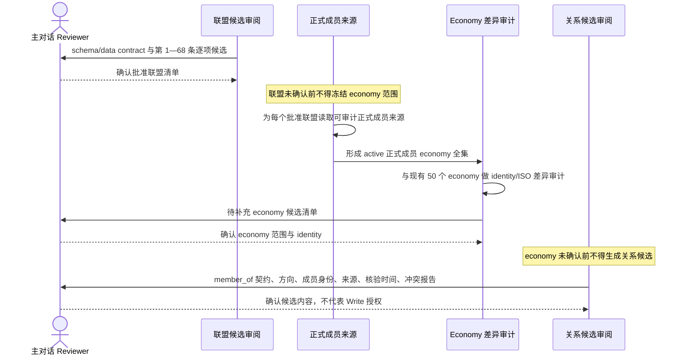
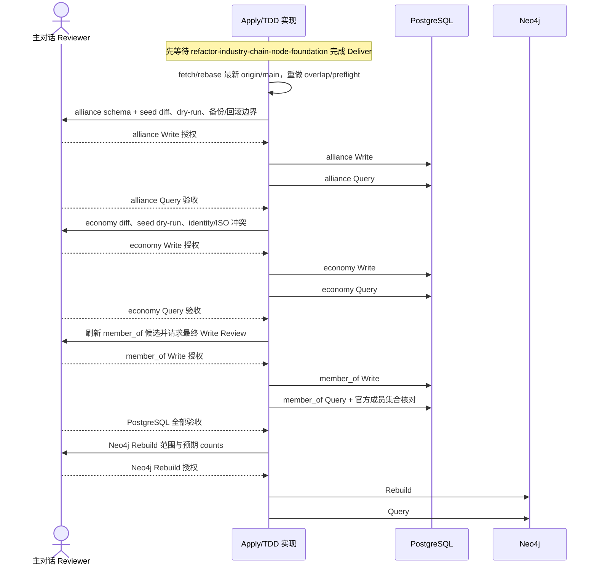

## Context

当前 `origin/main` 包含 10 个 `alliance_org`、50 个 economy 与 223 条 active `member_of`。`alliance_org_profiles` 仍是 `org_code/org_type/primary_domain/scope_region/official_url`，`economy_profiles` 只有 `country_code/currency_code/region`；现有关系 validator 只允许 `economy -> alliance_org` 的 `member_of`，graph mapper 尚无 `led_by` 与 `part_of` 映射。Neo4j 已采用单一 `Entity` label，PostgreSQL 是事实源。

参考 CSV 有 85 条编号记录：第 1—68 条是组织/机制候选，第 69—85 条是战略矿产与农产品，不是联盟组织。CSV 的成员数、全球占比、约束力和影响力是快照或分析性字段，不能替代官方成员来源或进入基础主数据。

本 change 与 active 的 `refactor-industry-chain-node-foundation` 在 `backend/internal/apps/entityfoundation/seed/`、repository、migration 测试与 PostgreSQL 写状态上重叠。两者只允许并行设计；本 change 的 Apply 必须等待产业链 change 完成 Deliver，再从最新 `origin/main` 重新审计 migration 序号、数据结构、测试和写入顺序。

## Goals / Non-Goals

**Goals:**

- 保持 `entity_nodes` 为联盟和 economy identity、名称、aliases、状态的唯一事实源，建立最小联盟 profile。
- 明确 economy 的主权国家、地区经济体、超国家聚合和全球聚合边界，并复用合格的稳定 identity。
- 建立“联盟确认 → 官方成员全集 → 补齐 economy → 建立成员关系”的不可跳过依赖链。
- 只将 active 正式成员建模为 `member_of`，并以官方来源和关系计算闭环验证成员数。
- 将 `led_by`、`part_of` 作为独立候选层，保留其价值但不阻塞核心 MVP。
- 未来 Apply 全程 TDD，所有 PostgreSQL/Neo4j 有状态操作逐层人工 Review。

**Non-Goals:**

- 不实现产业链、市场、benchmark/index、事件抽取或推理、观测数据、实体标签机制、股票推荐。
- 不把 CSV 第 69—85 条建成联盟；只记录其未来可能属于 `chain_node`、`commodity` 或 observation，不创建后续 change。
- 不保存子类、成员数、全球占比、约束力级别或影响力评级。
- 不把观察员、伙伴国、申请国、暂停成员或退出成员自动扩展为新 relation type。
- 不修改 `prototype/` 或项目外 `doc/`；当前不修改源码、migration、seed 或数据库。

## Decisions

### 1. 复用通用实体与关系基础，而不是建立联盟平行模型

推荐方案是继续使用 `entity_nodes`、`economy_profiles`、`alliance_org_profiles`、`entity_edges` 和现有 graph projector，只增量调整 profile、identity validation 与关系 allowlist。

考虑过的替代方案：

- 新建联盟专属 node/edge 表：可局部强类型，但会复制通用 identity、provenance、幂等写入和图投影，拒绝。
- 使用 JSONB 或实体标签承载联盟属性：迁移快，但无法稳定约束 categories、ISO 与关系端点，并与“不新增实体标签机制”冲突，拒绝。
- 将 CSV 直接转换为 seed：速度快，但会把评级、快照和混合类别误当事实，也跳过联盟/economy/关系三次 Review，拒绝。

### 2. 联盟 profile 只保留已批准最小字段

| 字段 | 目标契约 |
|---|---|
| `entity_id` | `UUID` PK/FK，指向 `entity_type=alliance_org` 的 `entity_nodes` |
| `abbreviation` | `TEXT NOT NULL DEFAULT ''`；无正式简称用空串，不保存 `—`；非空时必须同时存在于 aliases |
| `categories` | `TEXT[] NOT NULL` 且至少一项；去重、仅允许受控原子值，不允许 `/` 拼接值 |
| `leadership_summary` | `TEXT NOT NULL DEFAULT ''`；只写可审计的治理/主导方式摘要，“多边”“轮值”保留为文本 |
| `influence_scope_summary` | `TEXT NOT NULL DEFAULT ''`；描述客观影响范围，不保存评级或投资判断 |

首版 category allowlist 在 schema/data contract Review 中逐项批准，候选集合为 `political`、`security`、`military`、`intelligence`、`economic`、`trade`、`energy`、`commodity`、`agriculture`、`mineral`、`technology`、`finance`、`development`、`governance`、`religion`、`health`、`culture_education`、`environment`、`nuclear`、`legal_dispute_resolution`、`food_humanitarian`、`cross_domain`。CSV 的“政治 / 军事”等必须拆成多个 code；“子类”不映射为 category。

现有 `org_code/org_type/primary_domain/scope_region/official_url` 不属于目标 profile。未来 migration 必须以增量 forward migration 和 reviewed seed 完成转换，不清空 `entity_nodes`，不复用 profile 字段保存新语义；旧列何时移除需在 alliance Write Review 展示兼容性与回滚边界。

### 3. economy identity 与 ISO 契约显式区分聚合身份

`entity_nodes.entity_key` 继续是内部稳定 identity；`economy_profiles.country_code` 是受控代码，不被笼统声明为全部都是 ISO 国家代码。目标 profile 增加 `identity_kind`：

| `identity_kind` | `country_code` 规则 | 示例边界 |
|---|---|---|
| `sovereign_state` | 必须是 ISO 3166-1 alpha-2 | 普通主权国家 |
| `territory_economy` | 必须是适用的 ISO 3166-1 alpha-2 | 中国香港、中国台湾等独立统计经济体，中文命名服从主规格 |
| `supranational_aggregate` | 使用明确保留的内部 code，不宣称为主权国家 ISO | `economy:eu` / `EU` |
| `global_aggregate` | 使用明确保留的内部 code | `economy:global` / `GLOBAL` |

`currency_code` 与 `region` 继续是 economy profile 必要字段。候选清单必须同时展示规范中文名、英文名/aliases、identity kind、ISO 3166 代码或“不适用”、currency、region、官方来源、现有 entity key/UUID 或拟新增 identity。`economy:eu` 不替代欧盟成员国，`economy:global` 不参与 `member_of`。

### 4. 候选生成必须服从单向依赖链

联盟候选 Review 必须逐项标注 `approve/reject/merge/defer`、目标 entity key、canonical name、aliases、profile、来源与冲突。CSV 只用于候选对照；成员全集必须来自各联盟可审计的正式来源。

### 5. 三类关系分层，`member_of` 先闭环

| 关系 | 方向 | 端点 | 准入 |
|---|---|---|---|
| `member_of` | member → organization | `economy -> alliance_org` | 仅 active 正式成员；官方来源、核验时间、状态边界和冲突报告齐全 |
| `led_by` | organization → leader | `alliance_org -> economy/alliance_org` | 仅明确、可解析且有证据的核心主导方；多边/轮值不建边 |
| `part_of` | subordinate → parent | `alliance_org -> alliance_org` | 仅正式下属机构或机制，不能用主题相关或合作关系替代 |

`member_of` 候选必须区分 formal member、observer、partner、applicant、suspended、former。只有 formal active 进入 MVP；其他身份只留在 Review 报告。若未来需要表达，先人工批准关系/状态契约，不得自行扩展 `relation_type`。

每条 `member_of` 的两端必须存在且 active。写入后按批准联盟分组计算 active edge 数，并与同一官方来源的正式成员清单逐项集合比对；CSV“成员数”只显示为非权威对照。`led_by` 与 `part_of` 分别维护候选和 Review，不阻塞核心三层。

### 6. PostgreSQL 与 Neo4j 有状态执行顺序

上一层 Query 未验收不得进入下一层。`led_by`、`part_of` 未来各自重复 `Review -> Write -> Query`；Neo4j 只在全部目标 PostgreSQL 关系验收后单独 Review，不允许直接写图。

### 7. 实现边界与 TDD

未来 Apply 复用 entityfoundation loader/service/repository 和 graphprojection mapper/writer。测试顺序为：

1. migration 静态测试先覆盖 profile 字段、`identity_kind`、约束、索引和非破坏性 forward migration；
2. loader/validator table-driven tests 先覆盖 categories 原子值、简称 aliases、economy identity/ISO、CSV 排除项和三类关系端点；
3. repository fake/sqlmock 或明确标记的 PostgreSQL integration tests 先覆盖 dry-run、稳定 identity 复用、幂等 upsert、冲突与分层 report；
4. graph mapper/writer fake tests 先覆盖 `MEMBER_OF`、`LED_BY`、`PART_OF` 与单一 `Entity` label；
5. 再实现生产代码，运行相关包测试和 `go test ./...`。普通测试不得访问真实网络、真实 PostgreSQL 或 Neo4j；官方来源采集和真实数据库/图谱验证是显式、人工授权的 review/smoke 边界。

## Risks / Trade-offs

- [产业链 change 改写共享文件或 migration 基线] → Apply 前硬性等待其 Deliver，重新 fetch/rebase 并输出 overlap audit；不移植本 proposal 时点的代码假设。
- [CSV 候选被误当正式事实] → 只保留 Review 引用和逐项决策，不复制为 seed；正式成员必须另取官方来源。
- [聚合 economy 被当成国家成员] → `identity_kind` 与 code 规则 fail-closed，禁止 `global_aggregate` 建 `member_of`，EU 聚合不替代成员国。
- [成员身份混淆] → MVP 只允许 formal active；其他状态留在冲突报告，关系类型扩展必须另行 Review。
- [profile 旧列移除影响现有查询] → Apply 前全仓引用审计，增量 forward migration，旧列移除与兼容窗口在 alliance Write Review 单独展示。
- [联盟成员随时间变化] → 每条 edge 保留来源与核验时间，成员集合按执行时官方来源核对；历史成员建模不在本 change。
- [`led_by` 产生主观或虚假实体] → 仅解析明确有证据的实体；多边、轮值、共同协调保留文本。
- [Neo4j 与 PostgreSQL 短暂不一致] → PG 全部 Query 验收前不 rebuild；获批 rebuild 后以 PG active facts 和计数查询闭环。

## Migration Plan

1. 当前只提交 proposal artifacts 并停在人工 Review，不执行 Apply。
2. 依次完成人工 Review：联盟 schema/data contract、联盟候选、官方成员范围、economy 差异候选、关系 contract/candidates。
3. 等待 `refactor-industry-chain-node-foundation` 完成 Deliver；从最新 `origin/main` 重新建立 Apply 基线并复核本设计。
4. TDD 实现 migration、validator、repository、seed dry-run/report 和 graph mapping，但先只提交 scoped diff 供 Apply Review。
5. 获得每层独立授权后严格执行 alliance Write/Query、economy Write/Query、`member_of` Review/Write/Query；`led_by`、`part_of` 独立排队。
6. PostgreSQL 全部验收后，如范围包含 Neo4j，再执行单独 Review/Rebuild/Query。

Write 前必须提供可恢复备份证据、预计影响、事务边界和 forward-fix 策略。任一候选未确认、source 不可审计、identity 冲突、预计/实际 counts 不一致或 Query 失败时立即停止；不得使用手工修表、直接图写入或未审阅替代路径。

## Open Questions

- 68 条组织候选的逐项 `approve/reject/merge/defer` 结果尚待主对话 Review，当前不得推定最终联盟数量。
- category allowlist 与每个候选的多值映射尚待 schema/data contract Review；当前列出的是可审阅初稿。
- 现有 50 个 economy 对批准联盟正式成员的覆盖差异，必须等联盟清单确认和官方成员全集形成后才能冻结。
- observer/partner/applicant/suspended/former 是否需要未来结构化表达，只有关系契约 Review 可以决定；MVP 不扩展。
- `led_by`、`part_of` 的具体候选边和执行批次尚待独立 Review，不阻塞核心 MVP。
