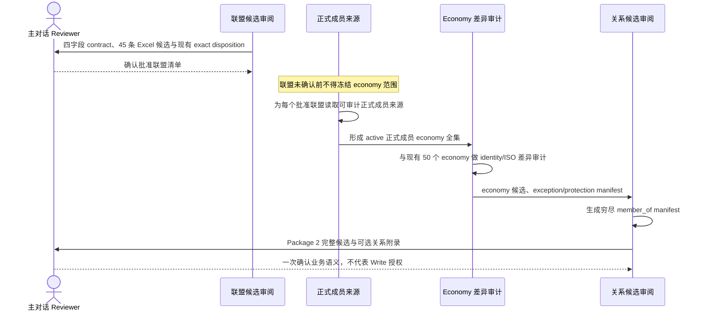
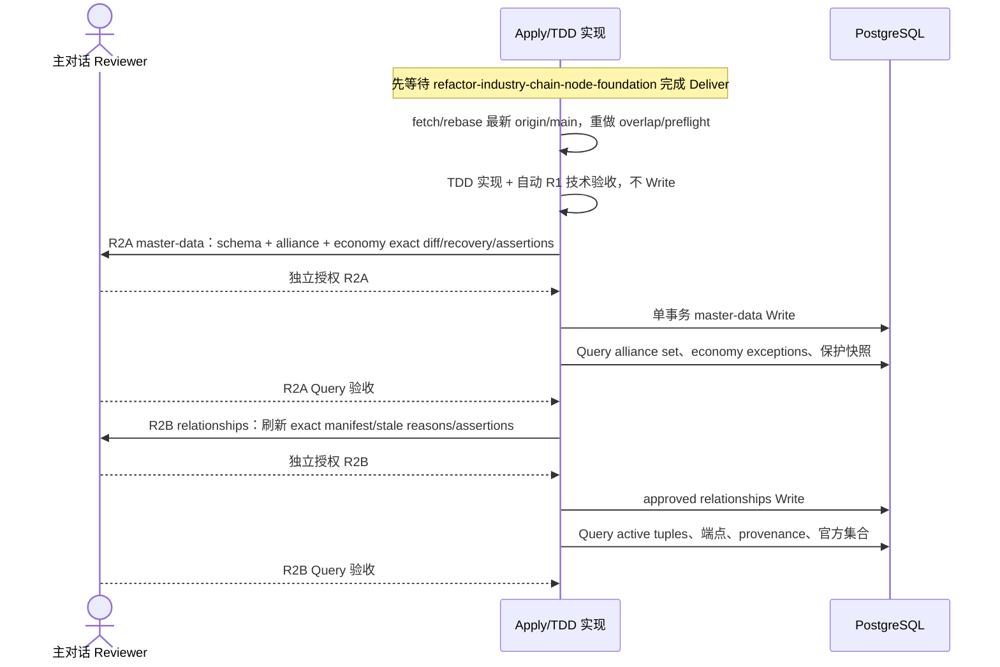

## Context

当前 `origin/main` 包含 10 个 `alliance_org`、50 个 economy 与 223 条 active `member_of`。`alliance_org_profiles` 仍是 `org_code/org_type/primary_domain/scope_region/official_url`，`economy_profiles` 只有 `country_code/currency_code/region`；现有关系 validator 只允许 `economy -> alliance_org` 的 `member_of`，graph mapper 尚无 `led_by` 与 `part_of` 映射。Neo4j 已采用单一 `Entity` label，PostgreSQL 是事实源。

当前唯一候选真值源是 `联盟组织列表1.0.xlsx` SHA-256 `ac0d953c0cd93596fe6bf8a70541bbe658620e75d38a9b3178980071b2cdc102` 的首个 sheet `联盟组织`、范围 `A1:K51`。其中 45 条数据行进入候选 Review，5 条分组标题行不是实体。旧 `表格_20260713.csv` 的 68 条候选、推荐结论和网页核验结果整体 superseded，只保留为 Git 历史，不能继续参与当前 manifest。

本 change 与 active 的 `refactor-industry-chain-node-foundation` 在 `backend/internal/apps/entityfoundation/seed/`、repository、migration 测试与 PostgreSQL 写状态上重叠。两者只允许并行设计；本 change 的 Apply 必须等待产业链 change 完成 Deliver，再从最新 `origin/main` 重新审计 migration 序号、数据结构、测试和写入顺序。

## Goals / Non-Goals

**Goals:**

- 保持 `entity_nodes` 为联盟和 economy identity、名称、aliases、状态的唯一事实源，建立最小联盟 profile。
- 明确 economy 的主权国家、地区经济体、超国家聚合和全球聚合边界，并复用合格的稳定 identity。
- 建立“联盟确认 → 官方成员全集 → 补齐 economy → 建立成员关系”的不可跳过依赖链。
- 只将 active 正式成员建模为 `member_of`，并以官方来源和关系计算闭环验证成员数。
- 将 `led_by`、`part_of` 作为 Package 2 的非阻塞可选附录，保留其价值但不阻塞核心 MVP。
- 未来 Apply 全程 TDD，以两个 local PostgreSQL R2 完成事实源收敛并减少重复人工门禁。

**Non-Goals:**

- 不实现产业链、市场、benchmark/index、事件抽取或推理、观测数据、实体标签机制、股票推荐。
- 不保存工作簿大类、子类、成员数、全球占比、约束力级别、影响力评级或其他 sheet 内容。
- 不把观察员、伙伴国、申请国、暂停成员或退出成员自动扩展为新 relation type。
- 不实现或执行 Neo4j graph mapping、Review、Rebuild 或 Query；图投影由后续独立 change 处理。
- 不修改 `prototype/` 或项目外 `doc/`；当前不修改源码、migration、seed 或数据库。

## Decisions

### 1. 复用通用实体与关系基础，而不是建立联盟平行模型

推荐方案是继续使用 `entity_nodes`、`economy_profiles`、`alliance_org_profiles` 和 `entity_edges`，只增量调整 profile、identity validation 与关系 allowlist；graph projector 不在本 change 修改范围。

考虑过的替代方案：

- 新建联盟专属 node/edge 表：可局部强类型，但会复制通用 identity、provenance、幂等写入和图投影，拒绝。
- 使用 JSONB 或实体标签承载联盟属性：迁移快，但会复制 profile 语义并与“不新增实体标签机制”冲突，拒绝。
- 将 Excel 直接转换为 seed：速度快，但会跳过联盟 exact disposition、economy 与关系 Review，拒绝。

### 2. 联盟 profile 只保留已批准最小字段

| 字段 | 目标契约 |
|---|---|
| `entity_id` | `UUID` PK/FK，指向 `entity_type=alliance_org` 的 `entity_nodes` |
| `abbreviation` | `TEXT NOT NULL DEFAULT ''`，`btrim` 后最长 32 字符；无正式简称用空串，不保存 `—`；非空时必须同时存在于 aliases；不做全局唯一，冲突进入 Review |
| `leadership_summary` | `TEXT NOT NULL`、无 default，`btrim` 后非空且最长 500 字符；只写可审计的治理/主导方式摘要，“多边”“轮值”保留为文本 |
| `influence_scope_summary` | `TEXT NOT NULL`、无 default，`btrim` 后非空且最长 1000 字符；描述客观影响范围，不保存评级或投资判断 |

工作簿四个业务输入字段按一对一规则映射：名称同时进入 `name/canonical_name`，缩写进入 `abbreviation`，核心主导方进入 `leadership_summary`，核心影响范围说明进入 `influence_scope_summary`。aliases 只按既有识别惯例从非空缩写派生，不是额外业务输入；既有合法 aliases 可在 identity convergence 中保留。候选只对 `UJR`、`CCAS` 的源缩写删除末尾 U+200C，其他源文本不做语义纠正。工作簿“大类”“子类”不生成 profile 字段、标签或关系。

现有 `org_code/org_type/primary_domain/scope_region/official_url` 不属于目标 profile。未来 migration 必须以增量 forward migration 和 reviewed seed 完成转换，不清空 `entity_nodes`，不复用 profile 字段保存新语义；旧列何时移除需在 R2A `master-data` Review 展示兼容性与 forward-fix 边界。

### 3. economy identity 与 ISO 契约显式区分聚合身份

`entity_nodes.entity_key` 继续是内部稳定 identity；`economy_profiles.country_code` 是受控代码，不被笼统声明为全部都是 ISO 国家代码。目标 profile 增加 `identity_kind`：

| `identity_kind` | `country_code` 规则 | 示例边界 |
|---|---|---|
| `sovereign_state` | 必须是 ISO 3166-1 alpha-2 | 普通主权国家 |
| `territory_economy` | 必须是适用的 ISO 3166-1 alpha-2 | 中国香港、中国台湾等独立统计经济体，中文命名服从主规格 |
| `supranational_aggregate` | 使用明确保留的内部 code，不宣称为主权国家 ISO | `economy:eu` / `EU` |
| `global_aggregate` | 使用明确保留的内部 code | `economy:global` / `GLOBAL` |

`currency_code` 与 `region` 继续是 economy profile 必要字段。`MULTI` 只允许 `global_aggregate`、经批准的 `supranational_aggregate`，或主权/地区 economy 的逐项批准多法定货币例外；其他情况 fail-closed。`country_code` 不建立无条件全表唯一约束，改由 validator、manifest 和 Query 保证同一 code 只有一个 approved active economy；`entity_key` 在 preflight 清理空值/重复后建立全局唯一约束，merged source 保留自身不同 stable key。现有 `africa`、`asia`、`central_asia`、`europe`、`europe_asia`、`global`、`middle_east`、`north_america`、`oceania`、`south_america` 仅作为首轮兼容 allowlist，Package 2 逐项报告歧义，不在已批准 A contract 中另建区域体系。候选清单必须同时展示规范中文名、英文名/aliases、identity kind、ISO 3166 代码或“不适用”、currency、region、官方来源、现有 entity key/UUID 或拟新增 identity。`economy:eu` 不替代欧盟成员国，`economy:global` 不参与 `member_of`。

### 4. 候选生成必须服从单向依赖链



联盟候选 Review 已逐项展示源 sheet row、四个源字段、规范化结果、目标 entity key 与 `create/keep` exact diff，并于 2026-07-14 获得 45/45 approve、9 keep + 36 create、现有 9 keep + OECD forward inactivate 的人工批准。该 Excel 不是可执行 seed；Package 2 只从各联盟正式来源形成成员候选。

Package 2 先把 45 个联盟分类为 `formal_member_set`、`rotating_or_term_bound` 或 `participant/signatory/framework/no_formal_membership`。只有 formal set 且官方批量来源、active 身份与 economy endpoint identity 均可穷尽时才生成 `member_of`；任期制缺少有效期契约、聚合组织端点不兼容、成员状态冲突或 ISO identity 例外均标为 blocked，禁止生成部分集合冒充完整 manifest。

### 5. Approved manifests 是现有状态收敛的唯一权威输入

重新初始化不是“在现有数据上继续 upsert”。未来 Apply 必须生成两个版本化、带 checksum 和 Review 元数据的穷尽式 manifest，并在 Write 前对真实 PostgreSQL 做 exact diff：

- **Alliance manifest**：列出最终允许 active 的 alliance entity keys；对每个执行时现有 active `alliance_org` 必须给出 `keep`、`merge` 或 `inactivate`。候选 `approve` 通常映射为 keep/create，`merge` 必须指定稳定 active target，`reject` 与 `defer` 不进入最终 active set并形成待 Review 的 inactivate proposal；任何未列出现有 active entity 都使 manifest 不完整并阻断 Write，不能被静默当作 stale。
- **Member manifest**：列出 10 个 resolved target alliance scope 内批准的 133 个 `(economy_key, member_of, alliance_key)` formal-active tuples；对每条执行时现有 active `member_of` 给出 keep、preserve_unresolved、preserve_pending_retype 或 proposed_inactivate disposition。只有 scoped candidate 与 OECD proposed inactivate 可进入本 change 的未来 R2B mutation set；preserve tuples 是保护集，不因未解析语义阻断局部 MVP。
- **Economy exception manifest**：只列出逐项获批的 `merge` 或 `inactivate` 异常。economy 不因未出现在当前联盟成员全集而 stale；未列入 exception manifest 的合法 economy 必须原样保留 entity key、UUID 和 status。

每个 stale/inactivate/merge diff 必须展示 reason、旧/新 identity、aliases/profile 影响、受影响 `member_of`/其他关系、预计 created/updated/inactivated/unchanged counts 和非目标保护断言。未经对应 R2A 或 R2B package 的明确授权，不得应用任何处置；不再为 schema、alliance、economy 的同层技术步骤重复设置 gate。

Alliance merge 采用 forward convergence：保留获批 target 的稳定 identity，source UUID/key 保留但变为 inactive；aliases 是否并入 target、profile 如何收敛及每条关系如何 rebind/inactivate 都必须由 manifest 逐项决定。系统必须在事务提交前证明不存在两个 active identity 指向同一批准联盟。不得删除 source entity、复用 source UUID 或按名称自动合并。

Member convergence 不改变 `relation_type` 表达历史状态；22 条 OECD proposed inactivate 获未来 R2B 授权后保留原 edge identity/provenance 并转 inactive，133 条 resolved candidates 幂等 keep/create。160 preserve_unresolved 与 10 preserve_pending_retype 不修改、不停用；R2B Query 必须证明其 tuple identity/status/provenance 与 pre-write 快照一致。economy identity merge 的关系影响必须在 Package 2 manifest 和 R2A Query 中显式输出，并在 R2B 授权前以真实 target identity 刷新 exact diff。

实现只允许版本化 forward migration/convergence command 与单事务幂等写入，禁止 `TRUNCATE`、无谓词 DELETE、清空关系后重灌或历史 migration rollback。执行时数据库基线与 manifest preflight checksum 不一致必须停止并重新 Review。

最终集合断言固定为：

```text
active alliance entity keys == approved alliance manifest active keys
active member_of tuples where target in resolved_target_alliances
  minus approved preserve_pending_retype tuples
  == 133 approved formal-active candidate tuples
preserve_unresolved tuples after == preserve_unresolved pre-write snapshot
preserve_pending_retype tuples after == preserve_pending_retype pre-write snapshot
unrelated legal economy keys/UUID/status after == protected pre-write snapshot
```

允许变化的 economy 只能来自 approved economy exception manifest；Query 必须逐项证明其处置及关系影响与 Review 一致。

### 6. 三类关系分层，`member_of` 先闭环

| 关系 | 方向 | 端点 | 准入 |
|---|---|---|---|
| `member_of` | member → organization | `economy -> alliance_org` | 仅 active 正式成员；官方来源、核验时间、状态边界和冲突报告齐全 |
| `led_by` | organization → leader | `alliance_org -> economy/alliance_org` | 仅明确、可解析且有证据的核心主导方；多边/轮值不建边 |
| `part_of` | subordinate → parent | `alliance_org -> alliance_org` | 仅正式下属机构或机制，不能用主题相关或合作关系替代 |

`member_of` 候选必须区分 formal member、observer、partner、applicant、suspended、former。只有 formal active 进入 MVP；其他身份只留在 Review 报告。若未来需要表达，先人工批准关系/状态契约，不得自行扩展 `relation_type`。

21 个 `participant/signatory/framework/no_formal_membership` 不生成 `member_of`。未来如需 `participates_in`、`signatory_to` 或其他替代关系，必须新建独立 relation-semantics change 重新 Review relation policy、端点、来源和 migration；不得在本 change 的 R1/R2B 顺带扩展。

每条 `member_of` 的两端必须存在且 active。写入后按批准联盟分组计算 active edge 数，并与同一官方来源的正式成员清单逐项集合比对；Excel“成员数”不进入本 change 输入。`leadership_summary` 源文本不能自动生成 `led_by`；`led_by` 与 `part_of` 只有另有充分证据且在 Package 2 同一 Review 获批才可进入 R2B，否则明确排除出本次 MVP。

### 7. 两个 Local PostgreSQL R2



R2A 与 R2B 各自只有一个人工授权点和一条 `Review → Write → Query`。R2A Query 未验收不得进入 R2B；R2B 只对 resolved target scope 与 OECD approved disposition 有 mutation authority，且必须保护 170 条 preserve tuples。任一失败使未执行授权失效。Neo4j 不在本 change 中执行，未来独立 graph projection change 只能读取本 change 已验收的 PostgreSQL facts。

### 8. 实现边界与 TDD

未来 Apply 复用 entityfoundation loader/service/repository，在一个 R1 package 内完成：

1. migration 静态测试先覆盖 profile 字段、`identity_kind`、约束、索引和非破坏性 forward migration；
2. loader/validator table-driven tests 先覆盖四字段映射、U+200C 规范化、简称 aliases、economy identity/ISO、Excel 非目标列排除、manifest 穷尽性、disposition enum 和三类关系端点；
3. repository fake/sqlmock 或明确标记的 PostgreSQL integration tests 先覆盖 exact diff、稳定 identity 复用、forward convergence、幂等 upsert/inactivate、merge 冲突、非目标 economy 保护与分层 report；
4. mapping-only seed、dry-run/report 与关系 policy tests 覆盖 approved manifests、`member_of` 及同包获批可选关系，不实现图映射；
5. 再实现生产代码，运行 targeted tests、受影响交付边界完整 suite 与共享 architecture/contract tests。repo-wide full test 不作为默认要求，只在项目规则触发或边界不清时运行。普通测试不得访问真实网络、真实 PostgreSQL 或 Neo4j。

## Risks / Trade-offs

- [产业链 change 改写共享文件或 migration 基线] → Apply 前硬性等待其 Deliver，重新 fetch/rebase 并输出 overlap audit；不移植本 proposal 时点的代码假设。
- [Excel 候选被误当正式事实] → 只保留 Review 映射和逐项决策，不复制为 seed；正式成员必须另取官方来源。
- [旧 68 条与新 45 条并存] → 旧 CSV 范围、推荐结论和网页核验全部标记 superseded；当前 manifest 只接受新 Excel 指纹。
- [聚合 economy 被当成国家成员] → `identity_kind` 与 code 规则 fail-closed，禁止 `global_aggregate` 建 `member_of`，EU 聚合不替代成员国。
- [成员身份混淆] → MVP 只允许 formal active；其他状态留在冲突报告，关系类型扩展必须另行 Review。
- [profile 旧列移除影响现有查询] → Apply 前全仓引用审计，增量 forward migration，旧列移除与兼容窗口在 R2A master-data Review 展示。
- [局部 MVP 被误执行成全库关系重置] → 223 条现有 edge 全部分类；resolved target scope 做精确集合收敛，OECD 22 条单独 proposed inactivate，170 条 preserve 以 pre/post 快照证明原样不变。
- [merge 产生两个 active 重复 identity] → manifest 指定唯一 target，source 只做 forward inactivate，事务内唯一性断言失败则整体回滚。
- [联盟成员范围误伤 economy 基础库] → economy 使用独立 exception manifest 和 pre-write 保护快照，未列入异常的合法 economy key/UUID/status 必须逐项不变。
- [联盟成员随时间变化] → 每条 edge 保留来源与核验时间，成员集合按执行时官方来源核对；历史成员建模不在本 change。
- [`led_by` 产生主观或虚假实体] → 仅解析明确有证据且 Package 2 已批准的实体；多边、轮值、共同协调保留文本，未决即排除。
- [图投影扩大本 change 风险和门禁] → Neo4j 全部移出；后续独立 change 以 PostgreSQL approved facts 为输入重新 Review。

## Migration Plan

1. Package 1 已完成联盟范围与逐项 manifest 人工 Review，并冻结 v1 checksum。
2. Package 2 已获人工批准：79 个 economy、133 条 resolved candidates，以及现有 223 条 edge 的 31 keep、160 preserve_unresolved、10 preserve_pending_retype、22 OECD proposed_inactivate；未决可选关系直接排除。
3. 等待 `refactor-industry-chain-node-foundation` 完成 Deliver 且结果进入 `origin/main`；更新基线、自动 overlap audit 后执行 Package 3 TDD 实现与自动技术验收，禁止 Write。
4. 分别明确授权并执行 R2A `master-data` Review/Write/Query 与 R2B `relationships` Review/Write/Query。
5. 汇总证据完成 Apply-final 人工 Review，之后才依次 Sync、Archive、PR/merge 和 cleanup。

每个 R2 Write 前必须提供可恢复备份证据、approved manifest/version/checksum、完整 exact diff、预计影响、事务边界和 forward-fix 策略。任一候选未确认、manifest 不穷尽、source 不可审计、identity 冲突、预计/实际集合不一致、无关 economy 保护断言变化或 Query 失败时立即停止；不得使用 truncate、无谓词 delete、手工修表、直接图写入或未审阅替代路径。

## Open Questions

- Package 1 已批准，不再是 open question；任何改动必须新版本、新 checksum 并重新 Review。
- 13 个 formal set 与 1 个 term-bound set 的 resolution gap，以及 21 个非正式机制的替代关系语义，不阻断本次 approved resolved MVP；它们不进入本 change mutation scope，后续必须独立 Review。
- observer/partner/applicant/suspended/former 是否需要未来结构化表达，只有关系契约 Review 可以决定；MVP 不扩展。
- `led_by`、`part_of` 的具体候选若无法在 Package 2 同一 Review 中获批，将排除出本次 MVP，不阻塞核心流程。
