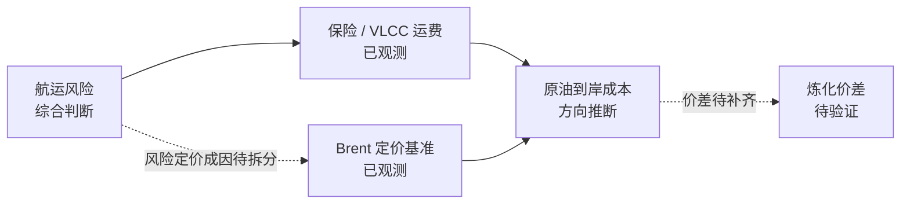

# 模拟投研推理报告：海湾航运风险如何进入石化产业链

> **模拟声明**：本报告中的事件、来源、时间、数值、Evidence 和结论全部为模拟内容，仅用于验证 Tidewise 报告的组织方式，不构成现实市场事实、投资建议或证券收益判断。

## 1. 地缘政治面

### 1.1 一句话结论

**[CONCLUSION C-GEO-01] 模拟风险通告、保险报价和样本航线运价共同指向短期通道压力上升，但尚无过峡流量、装船量或出口量 Evidence，不能确认原油实物供应中断。**

### 1.2 受影响锚点

| Anchor ID | 锚点 | 当前状态 | 结果 | 时间窗口 | 置信度 | 依据 |
|---|---|---|---|---|---|---|
| GEO-A01 | 霍尔木兹海峡 | 风险等级上调 | 升温 | 即时–1周 | 中 | EV-01 |
| GEO-A02 | 波斯湾—东亚航线 | 保险与运价上升 | 升温 | 1–3周 | 中 | EV-02、EV-03 |
| GEO-A03 | 能源出口连续性 | 风险指标上行，但尚未出现可确认中断 | 分化 | 即时 | 中 | EV-01、EV-05 |
| GEO-A04 | 区域护航行动 | 是否缓解风险待验证 | 待验证 | 1–3周 | 低 | Evidence Gap G-01 |

### 1.3 推导逻辑

| Step | 输入 | 传导机制 | 输出 | 类型 | 置信度 | Evidence |
|---|---|---|---|---|---|---|
| GEO-S01 | 航道风险等级上调 | 风险识别改变保险与航运定价 | 航运摩擦上升 | Event → Inference | 中 | EV-01、EV-02 |
| GEO-S02 | 保险报价与 VLCC 运价同步上升 | 波斯湾—东亚线路运输成本抬升 | 通道压力进入贸易成本 | Observation → Inference | 中 | EV-02、EV-03 |
| GEO-S03 | 炼厂库存仍高于近期中位数 | 库存缓冲削弱即时断供判断 | 不发布“供应已经中断”结论 | Counterevidence gate | 中 | EV-05 |

### 1.4 反证、缺口与检查点

- **反证**：当前炼厂库存尚未显示即时实物短缺，不能把风险等级上调等同于断供。
- **Evidence Gap G-01**：缺少连续船舶通行量、港口装卸量和护航措施的可验证变化。
- **反转条件**：若模拟保险报价连续三日回落且船舶通行量恢复，本层“通道压力上升”结论降级。

## 2. 宏观经济面

### 2.1 一句话结论

**[CONCLUSION C-MAC-01] 模拟油价和航运费用可能先于实物短缺抬高进口能源成本，并形成 PPI 上行压力假设；炼厂库存观察仍对即时短缺构成缓冲性反证。**

### 2.2 受影响锚点

| Anchor ID | 锚点 | 当前状态 | 结果 | 时间窗口 | 置信度 | 依据 |
|---|---|---|---|---|---|---|
| MAC-A01 | Brent 价格与期限结构 | 五日价格上涨、近月价差扩大；成因未拆分 | 升温 | 即时–2周 | 中 | EV-04 |
| MAC-A02 | VLCC 即期运价 | 波斯湾—东亚航线报价上升 | 升温 | 即时–3周 | 中 | EV-03 |
| MAC-A03 | 原油到岸成本 | 存在上行压力，尚无实际到岸成本指标 | 升温 | 0–3周 | 中 | EV-03、EV-04 |
| MAC-A04 | PPI 压力 | 能源与化工输入成本可能抬升 | 待验证 | 2–6周 | 低–中 | EV-03、EV-04、G-02 |
| MAC-A05 | 沿海炼厂库存 | 24.6 天，高于过去 30 日库存天数中位数；中位数值未提供 | 降温 | 0–3周 | 中 | EV-05 |

### 2.3 推导逻辑

| Step | 输入 | 传导机制 | 输出 | 类型 | 置信度 | Evidence |
|---|---|---|---|---|---|---|
| MAC-S01 | VLCC 运价上涨 14% | 海运费用进入进口原油成本 | 运输成本上行 | Observation → Inference | 中 | EV-03 |
| MAC-S02 | Brent 上涨且近月价差扩大 | 价格变化可能包含地缘、需求与仓位因素，成因尚未拆分 | 原油采购价格存在上行压力 | Observation → Inference | 中 | EV-04 |
| MAC-S03 | 运费与采购价格同时上行 | 两类成本共同构成到岸成本 | 进口原油到岸成本上行 | Synthesis | 中 | EV-03、EV-04 |
| MAC-S04 | 炼厂库存 24.6 天 | 库存可能提供短期缓冲 | 即时实物短缺判断被弱化或延后（推断） | Counterevidence gate | 中 | EV-05 |
| MAC-S05 | 到岸成本可能上行 | 能源和化工成本进入生产资料价格 | PPI 存在上行压力 | Inference | 低–中 | EV-03、EV-04、G-02 |

### 2.4 反证、缺口与检查点

- **反证**：库存缓冲意味着成本上行不必然立即转化为实物短缺或全面通胀。
- **Evidence Gap G-02**：缺少实际进口结算价、汇率变化、税费和正式 PPI 分项数据。
- **反转条件**：若 Brent 价格、近月价差与运价快速回落，或汇率升值抵消成本，则下调 PPI 压力判断。

## 3. 产业链面

本次识别出 **3 条主产业链和 1 条潜在缓冲分支**。以下按产业链组织内容：每条链先给独立结论和路径，再展示该链包含的受影响节点；同一节点可以作为上一条链的结果和下一条链的输入。

### 3.1 CHN-01 原油进口与炼化成本链

**一句话结论（C-CHN-01）**：保险报价和 VLCC 样本运价支持运输摩擦成本上升，但实际原油到岸成本与炼化价差仍未被观察，只能发布方向性成本压力结论。

- **链状态**：方向受支持、结果待验证
- **链结果**：分化
- **时间窗口 / 置信度**：即时–3周 / 中
- **路径**：`航运风险 → 保险与 VLCC 运费 → 原油到岸成本 → 炼化价差`

#### 链路图

#### 受影响节点

| Node ID | 受影响节点 | 本次影响 | 结果 | 时间窗口 | 置信度 | 影响原因（Summary Why） | Evidence 列表（ID） |
|---|---|---|---|---|---|---|---|
| N-01 | 波斯湾—东亚航运风险 | 重点航道风险等级上调，但尚无断供事实 | 升温 | 短期 | 中 | 风险通告与保险报价同步变化，说明通道风险已经进入运输定价。 | [EV-01, EV-02] |
| N-02 | 保险与 VLCC 即期运费 | 保险报价一周上升 32%，样本航线运价上升 14% | 升温 | 短期 | 中 | 两项运输成本代理指标同步上行，显示航运摩擦成本正在增强。 | [EV-02, EV-03] |
| N-03 | Brent 定价基准 | Brent 五日上涨 5.6%，近月价差扩大 | 升温 | 短期 | 中 | 原油定价基准走强，但地缘、需求和仓位的贡献尚未拆分。 | [EV-04] |
| N-04 | 原油到岸成本 | 存在上行压力，实际进口结算价尚未取得 | 升温 | 短期 | 中 | 运费与 Brent 同时上行会共同进入进口成本，但缺少实际到岸数据验证。 | [EV-03, EV-04] |
| N-05 | 炼化价差 | 存在收窄假设，实际炼化价差尚未观测 | 待判定 | 短期 | 低 | 只有原油成本上涨快于成品价格时炼化利润才会承压，当前缺少产品端价差。 | [] |

- **直接 Evidence**：EV-01、EV-02、EV-03、EV-04。
- **反证与 Gap**：EV-05 提供库存缓冲；缺实际到岸成本、汇率、税费、炼厂采购价和产品价差。
- **停止条件**：若保险报价、Brent 与运价同步回落，或实际进口结算价未上升，则关闭或降级该链；若炼化价差稳定或扩大，则停止“炼化利润承压”外推。

### 3.2 CHN-02 石脑油—乙烯裂解链

**一句话结论（C-CHN-02）**：石脑油报价上涨已经观察到，但其上游成因与乙烯裂解利润变化尚未闭合，本链只能发布“部分观测、条件性传导”结论。

- **链状态**：前端报价已观测，因果端与利润端未闭合
- **链结果**：分化
- **时间窗口 / 置信度**：1–3周 / 低–中
- **路径**：`原油到岸成本 → 石脑油报价 → 乙烯价格 → 乙烯—石脑油裂解价差`

#### 链路图

#### 受影响节点

| Node ID | 受影响节点 | 本次影响 | 结果 | 时间窗口 | 置信度 | 影响原因（Summary Why） | Evidence 列表（ID） |
|---|---|---|---|---|---|---|---|
| N-04 | 原油到岸成本 | 作为本链上游输入，当前存在上行压力 | 升温 | 短期 | 中 | 运费与 Brent 同时上行会共同进入进口成本，但缺少实际到岸数据验证。 | [EV-03, EV-04] |
| N-06 | 石脑油 | 报价上涨 3.1%，上涨成因尚未闭合 | 升温 | 短期 | 中 | 现货价格已经上行，但尚不能确认完全由原油到岸成本推动。 | [EV-06] |
| N-07 | 乙烯产品价格 | 尚无乙烯售价观察 | 待判定 | 短期 | 低 | 缺少乙烯价格，无法判断其是否跟随石脑油上涨并覆盖原料成本。 | [] |
| N-08 | 乙烯—石脑油裂解价差 | 存在收窄与利润承压假设，实际价差尚未取得 | 待判定 | 短期 | 低 | 石脑油已经上涨；只有乙烯售价未同步上升时，裂解价差才会收窄。 | [] |

- **直接 Evidence**：EV-06 只直接支持石脑油报价变化；EV-03、EV-04 仅提供上游方向背景。
- **反证与 Gap**：EV-05 显示库存缓冲；缺石脑油价格周期与地区口径、乙烯售价、裂解价差、开工率和库存。
- **停止条件**：若未来两周石脑油未持续跟随原油和运费方向，或实际乙烯—石脑油价差稳定或扩大，则停止从上游成本向乙烯利润外推。

### 3.3 CHN-03 乙烯—PE—包装材料传价链

**一句话结论（C-CHN-03）**：当前只观察到 PE 价格小幅上涨，无法确认其由乙烯成本驱动，也无法确认成本已经传递至包装材料或下游毛利，因此本链尚未闭合。

- **链状态**：单节点观测、整链未闭合
- **链结果**：待验证
- **时间窗口 / 置信度**：2–6周 / 低
- **路径**：`乙烯产品价格 → PE → 包装材料采购成本、售价与毛利`

#### 链路图

#### 受影响节点

| Node ID | 受影响节点 | 本次影响 | 结果 | 时间窗口 | 置信度 | 影响原因（Summary Why） | Evidence 列表（ID） |
|---|---|---|---|---|---|---|---|
| N-07 | 乙烯产品价格 | 作为 PE 原料成本输入，当前尚无价格观察 | 待判定 | 短期 | 低 | 缺少乙烯价格与裂解价差，无法确认 PE 上涨的成本成因。 | [] |
| N-09 | PE | 现货上涨 0.6%，但成交、库存与传价成因未验证 | 升温 | 中期 | 中 | PE 报价已经小幅上行，但涨幅明显弱于石脑油，显示传导可能不完整。 | [EV-06] |
| N-10 | 包装材料 | 尚无采购成本、产品提价、订单和毛利观察 | 待判定 | 中期 | 低 | 缺少合同与经营数据，无法判断 PE 成本是否已经传递到包装材料。 | [] |

- **直接 Evidence**：EV-06 只支持 PE 报价变化。
- **反证与 Gap**：PE 涨幅明显小于石脑油涨幅；缺 PE 库存与成交、订单、包装企业采购合同和提价数据。
- **停止条件**：若需求走弱、社会库存上升，或 PE 提价不足以覆盖成本，则传导在 PE 节点停止。

### 3.4 G-PP-01 丙烯—PP 并行路径缺口

该路径不是本次已发布产业链，不生成链级结论；保留它是为了明确 PP 不能从乙烯—PE 路径类推。

| Node ID | 受影响节点 | 本次影响 | 结果 | 时间窗口 | 置信度 | 影响原因（Summary Why） | Evidence 列表（ID） |
|---|---|---|---|---|---|---|---|
| N-11 | 丙烯 | 尚无价格、库存、成交和装置开工观察 | 待判定 | 中期 | 低 | 丙烯是 PP 的正确上游输入，但当前没有任何节点状态可用于判断。 | [] |
| N-12 | PP | 尚无价格、库存、成交和需求观察，路径未建立 | 待判定 | 中期 | 低 | 缺少丙烯与 PP 两端数据，不能从 PE 的变化类推 PP 结果。 | [] |
| N-10 | 包装材料 | PP 侧影响尚未验证 | 待判定 | 中期 | 低 | 缺少 PP 采购占比、合同传价、订单和毛利，无法判断下游汇合影响。 | [] |

### 3.5 BUF-01 炼厂库存潜在缓冲分支

**一句话结论（C-BUF-01）**：沿海炼厂库存高于近期中位数，对“即时短缺、成本快速贯穿全链”构成反证，但单点库存不能证明库存已经实际吸收扰动或形成持续缓冲。

- **分支状态**：反证性观察存在、缓冲机制待验证
- **分支结果**：降温
- **时间窗口 / 置信度**：即时–3周 / 低–中
- **路径假设**：`炼厂库存 → 采购与补库节奏 → 原料保障 → 可能延后到岸成本与石脑油影响显现`

#### 分支链路图

#### 受影响节点

| Node ID | 受影响节点 | 本次影响 | 结果 | 时间窗口 | 置信度 | 影响原因（Summary Why） | Evidence 列表（ID） |
|---|---|---|---|---|---|---|---|
| N-13 | 沿海炼厂库存 | 库存为 24.6 天，高于过去 30 日库存天数中位数 | 降温 | 短期 | 中 | 较高库存对“即时原料短缺”构成反证，但具体中位数和覆盖范围仍待补齐。 | [EV-05] |
| N-14 | 炼厂采购与补库节奏 | 较高库存可能延后即时补库需求，但没有连续采购观察 | 待判定 | 短期 | 低 | 库存可能提供采购时间缓冲，但当前没有连续采购与补库数据验证。 | [] |
| N-15 | 炼厂原料保障与开工 | 可能维持短期原料保障，实际开工和消耗速度未知 | 待判定 | 短期 | 低 | 库存可能暂时支持生产，但缺少开工率与日耗数据，持续性无法判断。 | [] |
| N-04 | 原油到岸成本 | 成本方向承压，但影响显现时点可能被库存延后 | 分化 | 短期 | 低 | 运费和 Brent 推动成本升温，库存只可能延后影响时点，不能降低单位到岸成本。 | [EV-03, EV-04, EV-05] |
| N-06 | 石脑油 | 报价已经上涨，但库存缓冲可能延后新增成本进入采购价 | 分化 | 短期 | 低 | 现货价格呈升温信号，而库存对新增采购形成潜在降温作用，两种力量尚未闭合。 | [EV-05, EV-06] |

- **直接 Evidence**：EV-05。
- **Evidence Gap**：缺中位数具体值、炼厂覆盖范围、连续库存序列、补库节奏、开工率和可验证失效阈值。
- **失效条件**：若库存持续下降并跌破有 Evidence 支持的阈值，或运输扰动持续超过库存可覆盖周期，则该分支失效，并重新评估 CHN-01 与 CHN-02 的时滞和置信度。

## 附录 A. Evidence 清单

| Evidence ID | 发布时间 | 摘要 | Keywords | 类型 | 来源 | 本报告中的关系 | 证据边界 |
|---|---|---|---|---|---|---|---|
| EV-01 | 08-31 07:10 | 重点航道风险等级上调 | 重点航道、风险等级 | Event Evidence | 模拟海事安全通告 | 支持 C-GEO-01 | 只支持通道风险升高，不支持供应已经中断 |
| EV-02 | 08-31 07:20 | 油轮保险报价一周上升 32% | 油轮保险、报价 | Metric Observation | 模拟航运经纪样本 | 支持 C-GEO-01 | 样本报价不代表全市场实际成交价 |
| EV-03 | 08-31 07:25 | 波斯湾—东亚 VLCC 即期运价上升 14% | 波斯湾—东亚、VLCC、即期运价 | Metric Observation | 模拟航运数据样本 | 支持 C-GEO-01、C-MAC-01 | 不直接证明实际到岸成本或炼厂利润变化；比较周期未提供 |
| EV-04 | 08-31 07:30 | Brent 五日上涨 5.6%，近月价差扩大 | Brent、近月价差 | Metric Observation | 模拟市场行情快照 | 支持 C-MAC-01 | 可能同时包含需求与仓位因素，不能全部归因为地缘风险溢价 |
| EV-05 | 08-30 18:00 | 炼厂库存 24.6 天，高于过去 30 日库存天数中位数；中位数值未提供 | 炼厂库存、库存天数 | Counterevidence | 模拟沿海炼厂库存样本 | 支持 C-BUF-01；反证即时短缺 Claim | 不代表所有炼厂库存充足，也不能排除后续库存下降 |
| EV-06 | 08-31 07:40 | 石脑油上涨 3.1%，PE 上涨 0.6% | 石脑油、PE、现货价格 | Metric Observation | 模拟化工现货样本 | 支持 C-CHN-02、C-CHN-03 的部分节点观察 | 只支持阶段性相对变化；周期、地区、品级、PP、乙烯、订单和开工率待补 |

## 附录 B. Claim Ledger（结论—Evidence 映射）

| 结论 ID | 结论 | 直接支持 | 反证 | Evidence Gap |
|---|---|---|---|---|
| C-GEO-01 | 航运通道压力上升 | EV-01、EV-02、EV-03 | EV-05 | 船舶通行量、港口装卸量 |
| C-MAC-01 | 原油到岸成本存在上行压力 | EV-03、EV-04 | EV-05 | 实际结算价、汇率与税费 |
| C-CHN-01 | 原油进口与炼化成本链存在方向性成本压力 | EV-01、EV-02、EV-03、EV-04 | EV-05 | 实际到岸成本、汇率、税费与炼化价差 |
| C-CHN-02 | 石脑油—乙烯裂解链存在条件性传导 | EV-06；EV-03、EV-04 为上游背景 | EV-05 | 石脑油口径、乙烯售价、裂解价差、开工率与库存 |
| C-CHN-03 | 乙烯—PE—包装材料链尚未闭合 | EV-06 仅支持 PE 观察 | PE 涨幅有限；乙烯成因未证实 | PE 订单、库存、合同传价与包装材料价格 |
| G-PP-01 | 丙烯—PP 并行路径缺失 | 无 | — | 丙烯与 PP 的价格、库存、成交和需求 |
| C-BUF-01 | 炼厂库存存在潜在缓冲假设 | EV-05 | 单点库存不能证明已实际吸收扰动 | 连续库存序列、覆盖范围与失效阈值 |

## 附录 C. 后续更新规则

下一次报告更新只处理新增或发生状态变化的对象：

1. 新 Event 或新 Evidence 是否改变现有 Observation；
2. Observation 是否触发某个 Anchor 状态变化；
3. 既有 Inference Step 的成立条件是否仍满足；
4. Counterevidence 是否足以降级或关闭结论；
5. Evidence Gap 是否被补齐，从而允许进入下一分析层；
6. 若产业层也没有可发布结论，则本次不生成投研报告。

---

**报告结束。**
